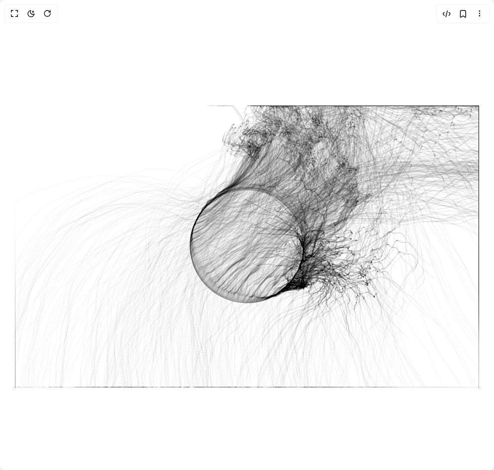

# Build Generative Art in BuilderStudio

> Build this component in our Agentic IDE: [BuilderStudio](https://builderstudio.dev).
>
> Join the BuilderStudio community on [Discord](https://discord.gg/QdWeSGCqfe) and [Reddit](https://reddit.com/r/builderstudio).



## Component

- Author group: `h0bb5`
- Component: `generative-art`
- Variant: `default`
- Rendered HTML snapshot: [`rendered.html`](rendered.html)

## BuilderStudio prompt

You are implementing a React component based on a component reference.

## Component identity

- Author: h0bb5
- Component slug: generative-art
- Demo slug: default
- Title: generative-art
- Description: 

## Goal

Recreate this component in a React + TypeScript + Tailwind CSS project. Preserve the visual layout, spacing, colors, border radius, shadows, interaction behavior, animation behavior, responsive behavior, and dark mode behavior shown in the rendered demo.

## Implementation requirements

- Use React and TypeScript.
- Use Tailwind CSS classes whenever possible.
- Keep the component self-contained unless the source files require helper components.
- If the source uses CSS variables, custom CSS, animations, or keyframes, include them.
- If the source uses external packages, list and use the required packages.
- Preserve accessibility attributes, button semantics, links, keyboard behavior, and ARIA attributes when visible in the source.
- Do not replace the component with a simplified placeholder.
- Return complete production-ready code.

## Dependencies

No reference metadata available.

## Rendered DOM snapshot

This is the rendered demo HTML extracted from the live preview. Use it to verify structure, class names, visible content, and layout.

```html
<div id="root"><div class="w-screen min-h-screen flex justify-center items-center"><div class="w-screen min-h-screen flex justify-center items-center"><section><div class="canvas-container" id="container-introduction"><canvas width="932" height="566.4" class="drawing" id="canvas-introduction"></canvas></div><div class="canvas-container" id="container-multiple"><canvas width="932" height="566.4" class="drawing" id="canvas-multiple"></canvas></div><div class="canvas-container" id="container-memory"><canvas width="932" height="566.4" class="drawing" id="canvas-memory"></canvas></div><div class="canvas-container" id="container-velocity"><canvas width="932" height="566.4" class="drawing" id="canvas-velocity"></canvas></div><div class="canvas-container" id="container-sums-of-velocities"><canvas width="932" height="566.4" class="drawing" id="canvas-sums-of-velocities"></canvas></div><div class="canvas-container" id="container-more-nodes-again"><canvas width="932" height="566.4" class="drawing" id="canvas-more-nodes-again"></canvas></div><div class="canvas-container" id="container-history"><canvas width="932" height="566.4" class="drawing" id="canvas-history"></canvas></div><div class="canvas-container" id="container-different-dimensions"><canvas width="932" height="566.4" class="drawing" id="canvas-different-dimensions"></canvas></div><div class="canvas-container" id="container-new-beginnings"><canvas width="932" height="566.4" class="drawing" id="canvas-new-beginnings"></canvas></div><div class="canvas-container" id="container-more-random"><canvas width="932" height="566.4" class="drawing" id="canvas-more-random"></canvas></div></section></div></div></div>
```

## Reference source files

No reference source files were available.
