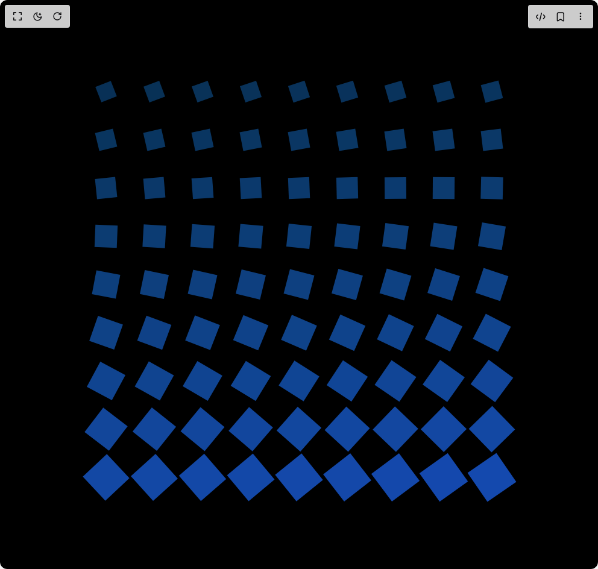

# Build Zima Blue in BuilderStudio

> Build this component in our Agentic IDE: [BuilderStudio](https://builderstudio.dev).
>
> Join the BuilderStudio community on [Discord](https://discord.gg/QdWeSGCqfe) and [Reddit](https://reddit.com/r/builderstudio).



## Component

- Author group: `h0bb5`
- Component: `zima-blue`
- Variant: `default`
- Rendered HTML snapshot: [`rendered.html`](rendered.html)

## BuilderStudio prompt

You are implementing a React component based on a component reference.

## Component identity

- Author: h0bb5
- Component slug: zima-blue
- Demo slug: default
- Title: zima-blue
- Description: 

## Goal

Recreate this component in a React + TypeScript + Tailwind CSS project. Preserve the visual layout, spacing, colors, border radius, shadows, interaction behavior, animation behavior, responsive behavior, and dark mode behavior shown in the rendered demo.

## Implementation requirements

- Use React and TypeScript.
- Use Tailwind CSS classes whenever possible.
- Keep the component self-contained unless the source files require helper components.
- If the source uses CSS variables, custom CSS, animations, or keyframes, include them.
- If the source uses external packages, list and use the required packages.
- Preserve accessibility attributes, button semantics, links, keyboard behavior, and ARIA attributes when visible in the source.
- Do not replace the component with a simplified placeholder.
- Return complete production-ready code.

## Dependencies

No reference metadata available.

## Rendered DOM snapshot

This is the rendered demo HTML extracted from the live preview. Use it to verify structure, class names, visible content, and layout.

```html
<div id="root"><div class="w-screen min-h-screen flex justify-center items-center"><div class="w-screen min-h-screen flex justify-center items-center"><div class="flex h-screen justify-center items-center bg-black w-full"><div class="box-grid"><div class="animated-box aspect-square bg-[#5BC2E7]" style="animation-delay: 0s;"></div><div class="animated-box aspect-square bg-[#5BC2E7]" style="animation-delay: 0.01s;"></div><div class="animated-box aspect-square bg-[#5BC2E7]" style="animation-delay: 0.02s;"></div><div class="animated-box aspect-square bg-[#5BC2E7]" style="animation-delay: 0.03s;"></div><div class="animated-box aspect-square bg-[#5BC2E7]" style="animation-delay: 0.04s;"></div><div class="animated-box aspect-square bg-[#5BC2E7]" style="animation-delay: 0.05s;"></div><div class="animated-box aspect-square bg-[#5BC2E7]" style="animation-delay: 0.06s;"></div><div class="animated-box aspect-square bg-[#5BC2E7]" style="animation-delay: 0.07s;"></div><div class="animated-box aspect-square bg-[#5BC2E7]" style="animation-delay: 0.08s;"></div><div class="animated-box aspect-square bg-[#5BC2E7]" style="animation-delay: 0.09s;"></div><div class="animated-box aspect-square bg-[#5BC2E7]" style="animation-delay: 0.1s;"></div><div class="animated-box aspect-square bg-[#5BC2E7]" style="animation-delay: 0.11s;"></div><div class="animated-box aspect-square bg-[#5BC2E7]" style="animation-delay: 0.12s;"></div><div class="animated-box aspect-square bg-[#5BC2E7]" style="animation-delay: 0.13s;"></div><div class="animated-box aspect-square bg-[#5BC2E7]" style="animation-delay: 0.14s;"></div><div class="animated-box aspect-square bg-[#5BC2E7]" style="animation-delay: 0.15s;"></div><div class="animated-box aspect-square bg-[#5BC2E7]" style="animation-delay: 0.16s;"></div><div class="animated-box aspect-square bg-[#5BC2E7]" style="animation-delay: 0.17s;"></div><div class="animated-box aspect-square bg-[#5BC2E7]" style="animation-delay: 0.18s;"></div><div class="animated-box aspect-square bg-[#5BC2E7]" style="animation-delay: 0.19s;"></div><div class="animated-box aspect-square bg-[#5BC2E7]" style="animation-delay: 0.2s;"></div><div class="animated-box aspect-square bg-[#5BC2E7]" style="animation-delay: 0.21s;"></div><div class="animated-box aspect-square bg-[#5BC2E7]" style="animation-delay: 0.22s;"></div><div class="animated-box aspect-square bg-[#5BC2E7]" style="animation-delay: 0.23s;"></div><div class="animated-box aspect-square bg-[#5BC2E7]" style="animation-delay: 0.24s;"></div><div class="animated-box aspect-square bg-[#5BC2E7]" style="animation-delay: 0.25s;"></div><div class="animated-box aspect-square bg-[#5BC2E7]" style="animation-delay: 0.26s;"></div><div class="animated-box aspect-square bg-[#5BC2E7]" style="animation-delay: 0.27s;"></div><div class="animated-box aspect-square bg-[#5BC2E7]" style="animation-delay: 0.28s;"></div><div class="animated-box aspect-square bg-[#5BC2E7]" style="animation-delay: 0.29s;"></div><div class="animated-box aspect-square bg-[#5BC2E7]" style="animation-delay: 0.3s;"></div><div class="animated-box aspect-square bg-[#5BC2E7]" style="animation-delay: 0.31s;"></div><div class="animated-box aspect-square bg-[#5BC2E7]" style="animation-delay: 0.32s;"></div><div class="animated-box aspect-square bg-[#5BC2E7]" style="animation-delay: 0.33s;"></div><div class="animated-box aspect-square bg-[#5BC2E7]" style="animation-delay: 0.34s;"></div><div class="animated-box aspect-square bg-[#5BC2E7]" style="animation-delay: 0.35s;"></div><div class="animated-box aspect-square bg-[#5BC2E7]" style="animation-delay: 0.36s;"></div><div class="animated-box aspect-square bg-[#5BC2E7]" style="animation-delay: 0.37s;"></div><div class="animated-box aspect-square bg-[#5BC2E7]" style="animation-delay: 0.38s;"></div><div class="animated-box aspect-square bg-[#5BC2E7]" style="animation-delay: 0.39s;"></div><div class="animated-box aspect-square bg-[#5BC2E7]" style="animation-delay: 0.4s;"></div><div class="animated-box aspect-square bg-[#5BC2E7]" style="animation-delay: 0.41s;"></div><div class="animated-box aspect-square bg-[#5BC2E7]" style="animation-delay: 0.42s;"></div><div class="animated-box aspect-square bg-[#5BC2E7]" style="animation-delay: 0.43s;"></div><div class="animated-box aspect-square bg-[#5BC2E7]" style="animation-delay: 0.44s;"></div><div class="animated-box aspect-square bg-[#5BC2E7]" style="animation-delay: 0.45s;"></div><div class="animated-box aspect-square bg-[#5BC2E7]" style="animation-delay: 0.46s;"></div><div class="animated-box aspect-square bg-[#5BC2E7]" style="animation-delay: 0.47s;"></div><div class="animated-box aspect-square bg-[#5BC2E7]" style="animation-delay: 0.48s;"></div><div class="animated-box aspect-square bg-[#5BC2E7]" style="animation-delay: 0.49s;"></div><div class="animated-box aspect-square bg-[#5BC2E7]" style="animation-delay: 0.5s;"></div><div class="animated-box aspect-square bg-[#5BC2E7]" style="animation-delay: 0.51s;"></div><div class="animated-box aspect-square bg-[#5BC2E7]" style="animation-delay: 0.52s;"></div><div class="animated-box aspect-square bg-[#5BC2E7]" style="animation-delay: 0.53s;"></div><div class="animated-box aspect-square bg-[#5BC2E7]" style="animation-delay: 0.54s;"></div><div class="animated-box aspect-square bg-[#5BC2E7]" style="animation-delay: 0.55s;"></div><div class="animated-box aspect-square bg-[#5BC2E7]" style="animation-delay: 0.56s;"></div><div class="animated-box aspect-square bg-[#5BC2E7]" style="animation-delay: 0.57s;"></div><div class="animated-box aspect-square bg-[#5BC2E7]" style="animation-delay: 0.58s;"></div><div class="animated-box aspect-square bg-[#5BC2E7]" style="animation-delay: 0.59s;"></div><div class="animated-box aspect-square bg-[#5BC2E7]" style="animation-delay: 0.6s;"></div><div class="animated-box aspect-square bg-[#5BC2E7]" style="animation-delay: 0.61s;"></div><div class="animated-box aspect-square bg-[#5BC2E7]" style="animation-delay: 0.62s;"></div><div class="animated-box aspect-square bg-[#5BC2E7]" style="animation-delay: 0.63s;"></div><div class="animated-box aspect-square bg-[#5BC2E7]" style="animation-delay: 0.64s;"></div><div class="animated-box aspect-square bg-[#5BC2E7]" style="animation-delay: 0.65s;"></div><div class="animated-box aspect-square bg-[#5BC2E7]" style="animation-delay: 0.66s;"></div><div class="animated-box aspect-square bg-[#5BC2E7]" style="animation-delay: 0.67s;"></div><div class="animated-box aspect-square bg-[#5BC2E7]" style="animation-delay: 0.68s;"></div><div class="animated-box aspect-square bg-[#5BC2E7]" style="animation-delay: 0.69s;"></div><div class="animated-box aspect-square bg-[#5BC2E7]" style="animation-delay: 0.7s;"></div><div class="animated-box aspect-square bg-[#5BC2E7]" style="animation-delay: 0.71s;"></div><div class="animated-box aspect-square bg-[#5BC2E7]" style="animation-delay: 0.72s;"></div><div class="animated-box aspect-square bg-[#5BC2E7]" style="animation-delay: 0.73s;"></div><div class="animated-box aspect-square bg-[#5BC2E7]" style="animation-delay: 0.74s;"></div><div class="animated-box aspect-square bg-[#5BC2E7]" style="animation-delay: 0.75s;"></div><div class="animated-box aspect-square bg-[#5BC2E7]" style="animation-delay: 0.76s;"></div><div class="animated-box aspect-square bg-[#5BC2E7]" style="animation-delay: 0.77s;"></div><div class="animated-box aspect-square bg-[#5BC2E7]" style="animation-delay: 0.78s;"></div><div class="animated-box aspect-square bg-[#5BC2E7]" style="animation-delay: 0.79s;"></div><div class="animated-box aspect-square bg-[#5BC2E7]" style="animation-delay: 0.8s;"></div></div></div></div></div></div>
```

## Reference source files

No reference source files were available.
