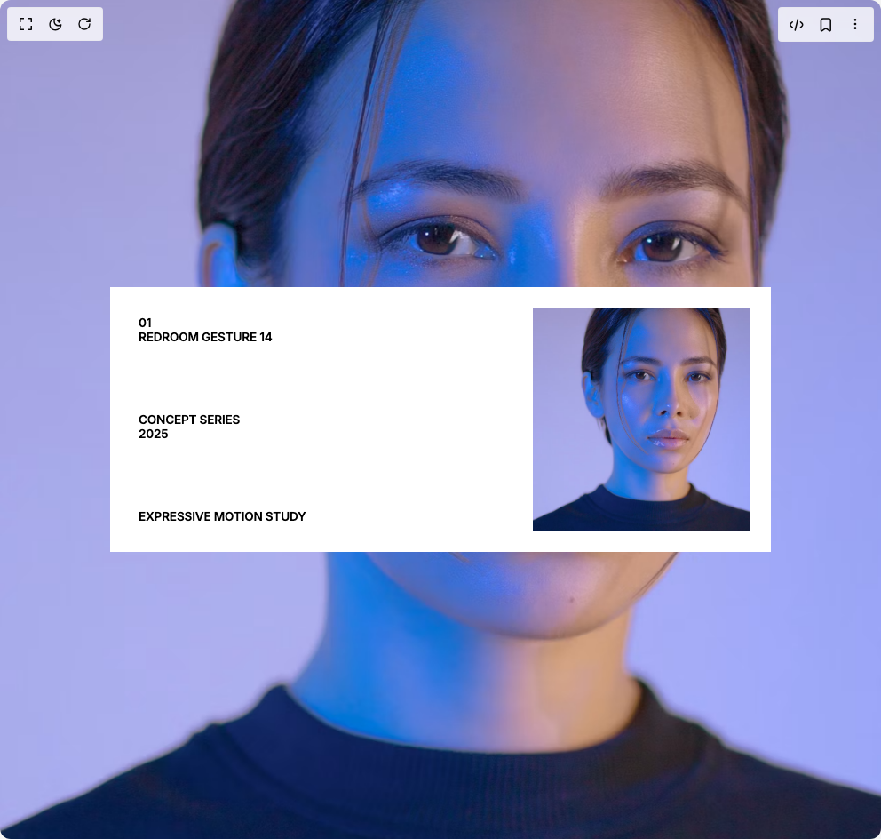
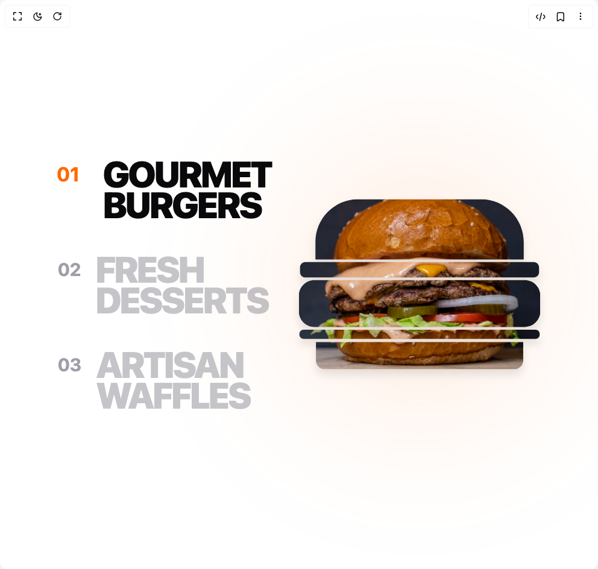
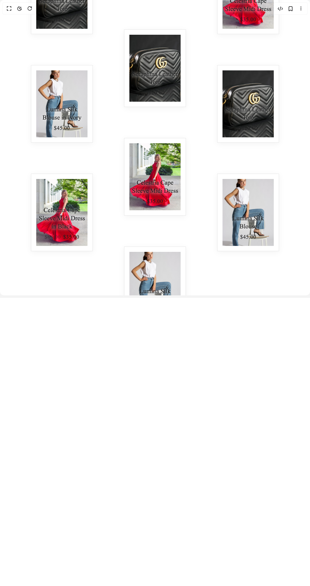
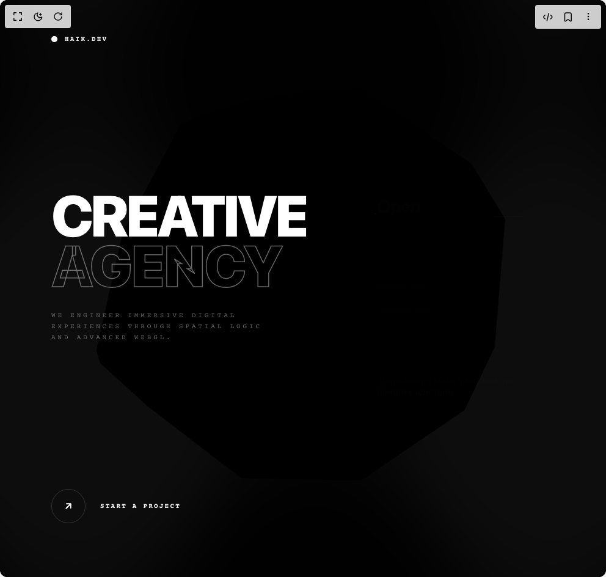
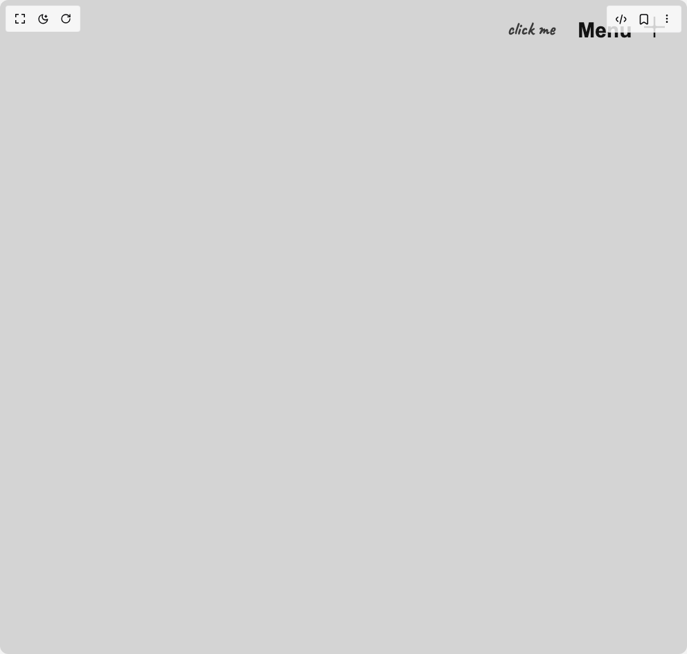

# Haik Kashiyani Components

7 components are available in this author group.

> Build any component in [BuilderStudio](https://builderstudio.dev), then share improvements with the community on [Discord](https://discord.gg/QdWeSGCqfe) or [Reddit](https://reddit.com/r/builderstudio).

| Preview | Component | Variant |
| --- | --- | --- |
|  | [Argent Loop Infinite Slider](argent-loop-infinite-slider/default/README.md) | `default` |
|  | [Connoisseur Stack Interactor](connoisseur-stack-interactor/default/README.md) | `default` |
|  | [Executive Impact Carousel](executive-impact-carousel/default/README.md) | `default` |
|  | [Experience Hero](experience-hero/default/README.md) | `default` |
|  | [Flow Gradient Hero Section](flow-gradient-hero-section/default/README.md) | `default` |
|  | [Lumina Interactive List](lumina-interactive-list/default/README.md) | `default` |
|  | [Sterling Gate Kinetic Navigation](sterling-gate-kinetic-navigation/default/README.md) | `default` |
