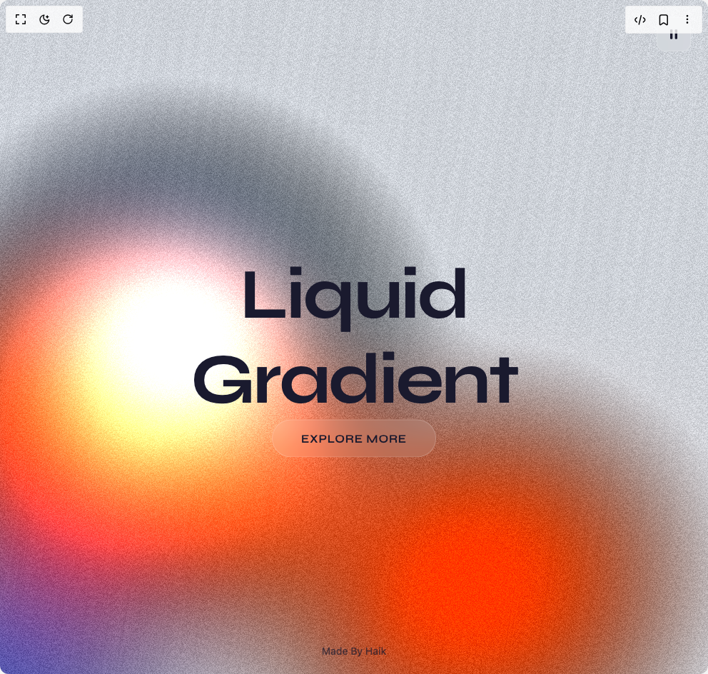

# Build Flow Gradient Hero Section in BuilderStudio

> Build this component in our Agentic IDE: [BuilderStudio](https://builderstudio.dev).
>
> Join the BuilderStudio community on [Discord](https://discord.gg/QdWeSGCqfe) and [Reddit](https://reddit.com/r/builderstudio).



## Component

- Author group: `haik-kashiyani`
- Component: `flow-gradient-hero-section`
- Variant: `default`
- Rendered HTML snapshot: [`rendered.html`](rendered.html)

## BuilderStudio prompt

You are implementing a React component based on a component reference.

## Component identity

- Author: haik-kashiyani
- Component slug: flow-gradient-hero-section
- Demo slug: default
- Title: flow-gradient-hero-section
- Description: 

## Goal

Recreate this component in a React + TypeScript + Tailwind CSS project. Preserve the visual layout, spacing, colors, border radius, shadows, interaction behavior, animation behavior, responsive behavior, and dark mode behavior shown in the rendered demo.

## Implementation requirements

- Use React and TypeScript.
- Use Tailwind CSS classes whenever possible.
- Keep the component self-contained unless the source files require helper components.
- If the source uses CSS variables, custom CSS, animations, or keyframes, include them.
- If the source uses external packages, list and use the required packages.
- Preserve accessibility attributes, button semantics, links, keyboard behavior, and ARIA attributes when visible in the source.
- Do not replace the component with a simplified placeholder.
- Return complete production-ready code.

## Dependencies

No reference metadata available.

## Rendered DOM snapshot

This is the rendered demo HTML extracted from the live preview. Use it to verify structure, class names, visible content, and layout.

```html
<div id="root"><div class="w-screen min-h-screen flex justify-center items-center"><div class="w-screen min-h-screen flex justify-center items-center"><div class="liquid-container"><div class="liquid-canvas-wrapper"><canvas data-engine="three.js r160" width="992" height="944" style="display: block; width: 992px; height: 944px;"></canvas></div><div class="cursor-ring " style="opacity: 0; transform: translate(-20px, -20px);"></div><div class="cursor-dot-element " style="opacity: 0; transform: translate(-4px, -4px);"></div><h1 class="title-main ">Liquid Gradient</h1><button class="cta-btn ">Explore More</button><button class="pause-btn " aria-label="Pause animation"><svg width="20" height="20" viewBox="0 0 24 24" fill="currentColor"><rect x="6" y="4" width="4" height="16" rx="1"></rect><rect x="14" y="4" width="4" height="16" rx="1"></rect></svg></button><footer class="footer-main "><a href="https://haikkashiyani.kesug.com/?i=1" target="_blank" rel="noopener noreferrer">Made By Haik</a></footer></div></div></div></div>
```

## Reference source files

No reference source files were available.
