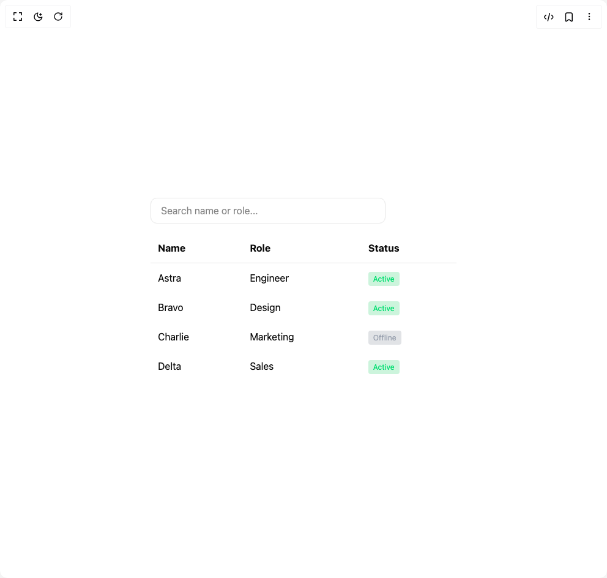

# Build Spotlight Table in BuilderStudio

> Build this component in our Agentic IDE: [BuilderStudio](https://builderstudio.dev).
>
> Join the BuilderStudio community on [Discord](https://discord.gg/QdWeSGCqfe) and [Reddit](https://reddit.com/r/builderstudio).



## Component

- Author group: `hamiddos`
- Component: `spotlight-table`
- Variant: `default`
- Rendered HTML snapshot: [`rendered.html`](rendered.html)

## BuilderStudio prompt

You are implementing a React component based on a component reference.

## Component identity

- Author: hamiddos
- Component slug: spotlight-table
- Demo slug: default
- Title: spotlight-table
- Description: 

## Goal

Recreate this component in a React + TypeScript + Tailwind CSS project. Preserve the visual layout, spacing, colors, border radius, shadows, interaction behavior, animation behavior, responsive behavior, and dark mode behavior shown in the rendered demo.

## Implementation requirements

- Use React and TypeScript.
- Use Tailwind CSS classes whenever possible.
- Keep the component self-contained unless the source files require helper components.
- If the source uses CSS variables, custom CSS, animations, or keyframes, include them.
- If the source uses external packages, list and use the required packages.
- Preserve accessibility attributes, button semantics, links, keyboard behavior, and ARIA attributes when visible in the source.
- Do not replace the component with a simplified placeholder.
- Return complete production-ready code.

## Dependencies

No reference metadata available.

## Rendered DOM snapshot

This is the rendered demo HTML extracted from the live preview. Use it to verify structure, class names, visible content, and layout.

```html
<div id="root"><div class="w-screen min-h-screen flex justify-center items-center"><div class="w-screen min-h-screen flex justify-center items-center"><div class="h-screen grid place-content-center bg-background text-foreground p-8"><input placeholder="Search name or role..." class="mb-4 px-4 py-2 rounded-lg border border-input bg-background max-w-sm" value=""><table class="min-w-[500px] border-collapse"><thead><tr class="border-b border-border"><th class="p-3 text-left">Name</th><th class="p-3 text-left">Role</th><th class="p-3 text-left">Status</th></tr></thead><tbody><tr class="transition opacity-100"><td class="p-3">Astra</td><td class="p-3">Engineer</td><td class="p-3"><span class="px-2 py-1 rounded text-xs bg-green-500/20 text-green-400">Active</span></td></tr><tr class="transition opacity-100"><td class="p-3">Bravo</td><td class="p-3">Design</td><td class="p-3"><span class="px-2 py-1 rounded text-xs bg-green-500/20 text-green-400">Active</span></td></tr><tr class="transition opacity-100"><td class="p-3">Charlie</td><td class="p-3">Marketing</td><td class="p-3"><span class="px-2 py-1 rounded text-xs bg-gray-500/20 text-gray-400">Offline</span></td></tr><tr class="transition opacity-100"><td class="p-3">Delta</td><td class="p-3">Sales</td><td class="p-3"><span class="px-2 py-1 rounded text-xs bg-green-500/20 text-green-400">Active</span></td></tr></tbody></table></div></div></div></div>
```

## Reference source files

No reference source files were available.
