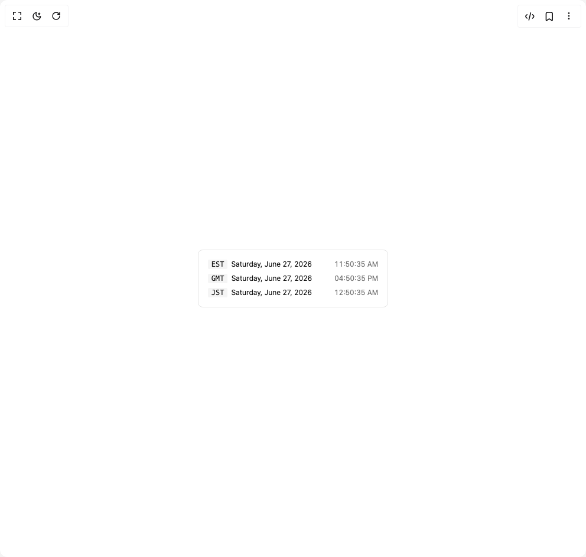

# Build Relative Time in BuilderStudio

> Build this component in our Agentic IDE: [BuilderStudio](https://builderstudio.dev).
>
> Join the BuilderStudio community on [Discord](https://discord.gg/QdWeSGCqfe) and [Reddit](https://reddit.com/r/builderstudio).



## Component

- Author group: `haydenbleasel`
- Component: `relative-time`
- Variant: `custom-date-format`
- Rendered HTML snapshot: [`rendered.html`](rendered.html)

## BuilderStudio prompt

You are implementing a React component based on a component reference.

## Component identity

- Author: haydenbleasel
- Component slug: relative-time
- Demo slug: custom-date-format
- Title: relative-time
- Description: 

## Goal

Recreate this component in a React + TypeScript + Tailwind CSS project. Preserve the visual layout, spacing, colors, border radius, shadows, interaction behavior, animation behavior, responsive behavior, and dark mode behavior shown in the rendered demo.

## Implementation requirements

- Use React and TypeScript.
- Use Tailwind CSS classes whenever possible.
- Keep the component self-contained unless the source files require helper components.
- If the source uses CSS variables, custom CSS, animations, or keyframes, include them.
- If the source uses external packages, list and use the required packages.
- Preserve accessibility attributes, button semantics, links, keyboard behavior, and ARIA attributes when visible in the source.
- Do not replace the component with a simplified placeholder.
- Return complete production-ready code.

## Dependencies

No reference metadata available.

## Rendered DOM snapshot

This is the rendered demo HTML extracted from the live preview. Use it to verify structure, class names, visible content, and layout.

```html
<div id="root"><div class="w-screen min-h-screen flex justify-center items-center"><div class="w-screen min-h-screen flex justify-center items-center"><div class="rounded-md border bg-background p-4"><div class="grid gap-2"><div class="flex items-center justify-between gap-1.5 text-xs"><div class="flex h-4 items-center justify-center rounded-xs bg-secondary px-1.5 font-mono">EST</div><div>Saturday, June 27, 2026</div><div class="pl-8 text-muted-foreground tabular-nums">11:50:35 AM</div></div><div class="flex items-center justify-between gap-1.5 text-xs"><div class="flex h-4 items-center justify-center rounded-xs bg-secondary px-1.5 font-mono">GMT</div><div>Saturday, June 27, 2026</div><div class="pl-8 text-muted-foreground tabular-nums">04:50:35 PM</div></div><div class="flex items-center justify-between gap-1.5 text-xs"><div class="flex h-4 items-center justify-center rounded-xs bg-secondary px-1.5 font-mono">JST</div><div>Saturday, June 27, 2026</div><div class="pl-8 text-muted-foreground tabular-nums">12:50:35 AM</div></div></div></div></div></div></div>
```

## Reference source files

No reference source files were available.
