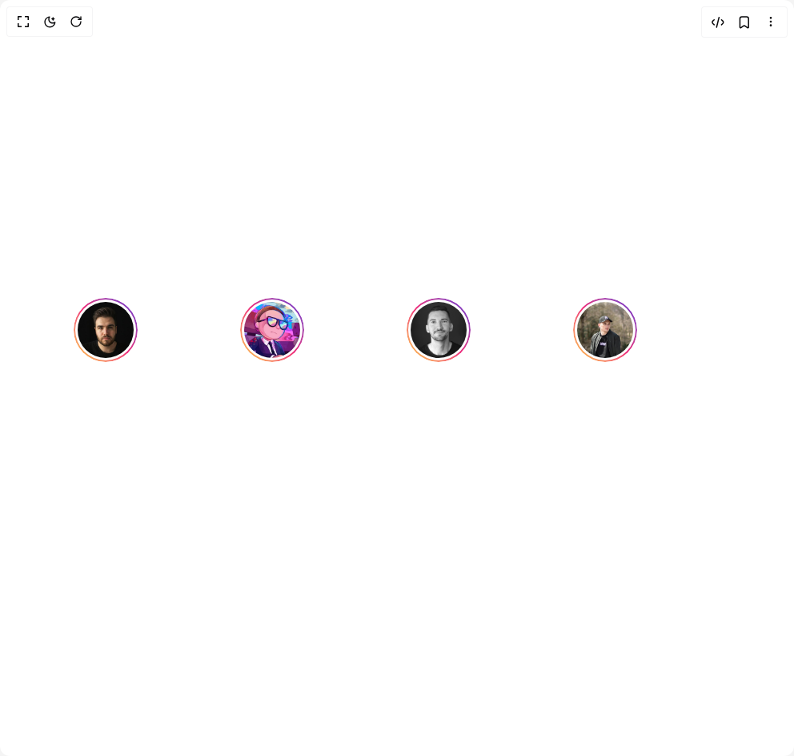

# Build Stories Carousel in BuilderStudio

> Build this component in our Agentic IDE: [BuilderStudio](https://builderstudio.dev).
>
> Join the BuilderStudio community on [Discord](https://discord.gg/QdWeSGCqfe) and [Reddit](https://reddit.com/r/builderstudio).



## Component

- Author group: `haydenbleasel`
- Component: `stories-carousel`
- Variant: `story-avatar`
- Rendered HTML snapshot: [`rendered.html`](rendered.html)

## BuilderStudio prompt

You are implementing a React component based on a component reference.

## Component identity

- Author: haydenbleasel
- Component slug: stories-carousel
- Demo slug: story-avatar
- Title: stories-carousel
- Description: 

## Goal

Recreate this component in a React + TypeScript + Tailwind CSS project. Preserve the visual layout, spacing, colors, border radius, shadows, interaction behavior, animation behavior, responsive behavior, and dark mode behavior shown in the rendered demo.

## Implementation requirements

- Use React and TypeScript.
- Use Tailwind CSS classes whenever possible.
- Keep the component self-contained unless the source files require helper components.
- If the source uses CSS variables, custom CSS, animations, or keyframes, include them.
- If the source uses external packages, list and use the required packages.
- Preserve accessibility attributes, button semantics, links, keyboard behavior, and ARIA attributes when visible in the source.
- Do not replace the component with a simplified placeholder.
- Return complete production-ready code.

## Dependencies

No reference metadata available.

## Rendered DOM snapshot

This is the rendered demo HTML extracted from the live preview. Use it to verify structure, class names, visible content, and layout.

```html
<div id="root"><div class="w-screen min-h-screen flex justify-center items-center"><div class="w-screen min-h-screen flex justify-center items-center"><div class="w-full max-w-4xl"><div class="relative w-full" role="region" aria-roledescription="carousel" data-slot="carousel"><div class="overflow-hidden" data-slot="carousel-content"><div class="flex -ml-4 gap-2 justify-center" style="transform: translate3d(0px, 0px, 0px);"><div role="group" aria-roledescription="slide" data-slot="carousel-item" class="min-w-0 shrink-0 grow-0 basis-auto !w-[200px] md:pl-4 aspect-square w-20 rounded-full p-0"><div class="group relative overflow-hidden bg-muted/40 cursor-pointer transition-all duration-200 hover:scale-[1.02] hover:shadow-lg focus-visible:outline-none focus-visible:ring-2 focus-visible:ring-ring focus-visible:ring-offset-2 aspect-square w-20 rounded-full p-0" role="button" tabindex="0"><div class="absolute right-0 bottom-0 left-0 z-10 text-white p-0"><div class="flex items-center gap-2"><span aria-hidden="true" class="inline-flex size-full rounded-full bg-gradient-to-tr from-[#f9ce34] via-[#ee2a7b] to-[#6228d7] p-0.5"><span class="inline-flex size-full rounded-full bg-white p-0.5"><span class="relative flex shrink-0 overflow-hidden rounded-full border border-white/20 size-full"></span></span></span></div></div></div></div><div role="group" aria-roledescription="slide" data-slot="carousel-item" class="min-w-0 shrink-0 grow-0 basis-auto !w-[200px] md:pl-4 aspect-square w-20 rounded-full p-0"><div class="group relative overflow-hidden bg-muted/40 cursor-pointer transition-all duration-200 hover:scale-[1.02] hover:shadow-lg focus-visible:outline-none focus-visible:ring-2 focus-visible:ring-ring focus-visible:ring-offset-2 aspect-square w-20 rounded-full p-0" role="button" tabindex="0"><div class="absolute right-0 bottom-0 left-0 z-10 text-white p-0"><div class="flex items-center gap-2"><span aria-hidden="true" class="inline-flex size-full rounded-full bg-gradient-to-tr from-[#f9ce34] via-[#ee2a7b] to-[#6228d7] p-0.5"><span class="inline-flex size-full rounded-full bg-white p-0.5"><span class="relative flex shrink-0 overflow-hidden rounded-full border border-white/20 size-full"></span></span></span></div></div></div></div><div role="group" aria-roledescription="slide" data-slot="carousel-item" class="min-w-0 shrink-0 grow-0 basis-auto !w-[200px] md:pl-4 aspect-square w-20 rounded-full p-0"><div class="group relative overflow-hidden bg-muted/40 cursor-pointer transition-all duration-200 hover:scale-[1.02] hover:shadow-lg focus-visible:outline-none focus-visible:ring-2 focus-visible:ring-ring focus-visible:ring-offset-2 aspect-square w-20 rounded-full p-0" role="button" tabindex="0"><div class="absolute right-0 bottom-0 left-0 z-10 text-white p-0"><div class="flex items-center gap-2"><span aria-hidden="true" class="inline-flex size-full rounded-full bg-gradient-to-tr from-[#f9ce34] via-[#ee2a7b] to-[#6228d7] p-0.5"><span class="inline-flex size-full rounded-full bg-white p-0.5"><span class="relative flex shrink-0 overflow-hidden rounded-full border border-white/20 size-full"></span></span></span></div></div></div></div><div role="group" aria-roledescription="slide" data-slot="carousel-item" class="min-w-0 shrink-0 grow-0 basis-auto !w-[200px] md:pl-4 aspect-square w-20 rounded-full p-0"><div class="group relative overflow-hidden bg-muted/40 cursor-pointer transition-all duration-200 hover:scale-[1.02] hover:shadow-lg focus-visible:outline-none focus-visible:ring-2 focus-visible:ring-ring focus-visible:ring-offset-2 aspect-square w-20 rounded-full p-0" role="button" tabindex="0"><div class="absolute right-0 bottom-0 left-0 z-10 text-white p-0"><div class="flex items-center gap-2"><span aria-hidden="true" class="inline-flex size-full rounded-full bg-gradient-to-tr from-[#f9ce34] via-[#ee2a7b] to-[#6228d7] p-0.5"><span class="inline-flex size-full rounded-full bg-white p-0.5"><span class="relative flex shrink-0 overflow-hidden rounded-full border border-white/20 size-full"></span></span></span></div></div></div></div></div></div></div></div></div></div></div>
```

## Reference source files

No reference source files were available.
