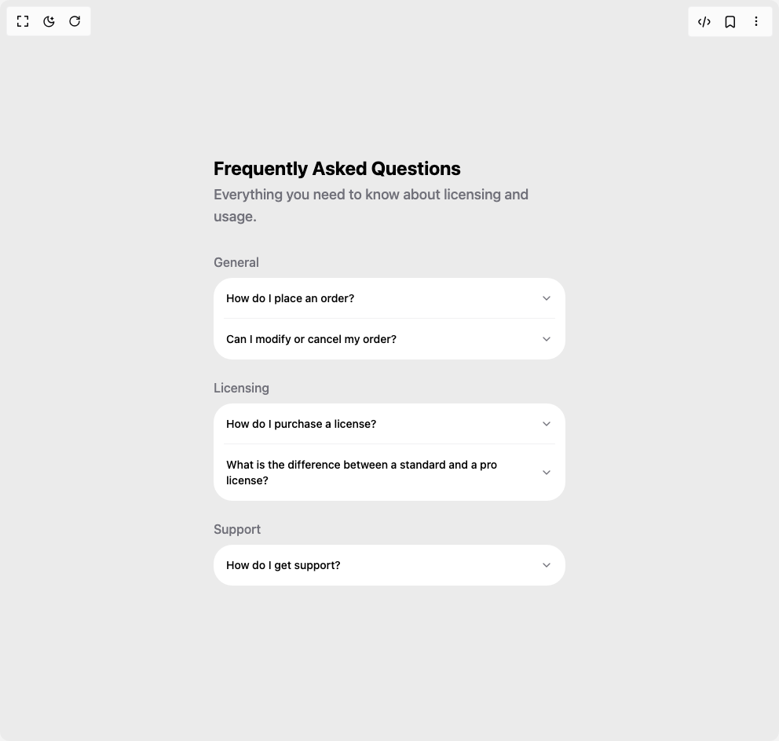

# Build Heroui Accordion in BuilderStudio

> Build this component in our Agentic IDE: [BuilderStudio](https://builderstudio.dev).
>
> Join the BuilderStudio community on [Discord](https://discord.gg/QdWeSGCqfe) and [Reddit](https://reddit.com/r/builderstudio).



## Component

- Author group: `hero_ui`
- Component: `heroui-accordion`
- Variant: `faq-layout`
- Rendered HTML snapshot: [`rendered.html`](rendered.html)

## BuilderStudio prompt

You are implementing a React component based on a component reference.

## Component identity

- Author: hero_ui
- Component slug: heroui-accordion
- Demo slug: faq-layout
- Title: heroui-accordion
- Description: 

## Goal

Recreate this component in a React + TypeScript + Tailwind CSS project. Preserve the visual layout, spacing, colors, border radius, shadows, interaction behavior, animation behavior, responsive behavior, and dark mode behavior shown in the rendered demo.

## Implementation requirements

- Use React and TypeScript.
- Use Tailwind CSS classes whenever possible.
- Keep the component self-contained unless the source files require helper components.
- If the source uses CSS variables, custom CSS, animations, or keyframes, include them.
- If the source uses external packages, list and use the required packages.
- Preserve accessibility attributes, button semantics, links, keyboard behavior, and ARIA attributes when visible in the source.
- Do not replace the component with a simplified placeholder.
- Return complete production-ready code.

## Dependencies

No reference metadata available.

## Rendered DOM snapshot

This is the rendered demo HTML extracted from the live preview. Use it to verify structure, class names, visible content, and layout.

```html
<div id="root"><div class="w-screen min-h-screen flex justify-center items-center"><div class="w-screen min-h-screen flex justify-center items-center"><div class="flex min-h-screen w-full items-center justify-center p-8"><div class="flex w-full max-w-md flex-col gap-6"><div class="flex flex-col gap-1"><h2 class="text-2xl font-bold">Frequently Asked Questions</h2><p class="mb-2 text-lg font-medium text-muted">Everything you need to know about licensing and usage.</p></div><div><p class="mb-2 font-medium text-muted">General</p><div data-slot="accordion" class="accordion accordion--surface w-full" data-rac=""><div data-slot="accordion-item" class="accordion__item" data-rac=""><h3 data-slot="accordion-heading" class="accordion__heading"><button id="react-aria7970921288-«r1»" data-slot="accordion-trigger" class="accordion__trigger" data-rac="" type="button" tabindex="0" data-react-aria-pressable="true" aria-expanded="false" aria-controls="react-aria7970921288-«r2»" slot="trigger">How do I place an order?<svg xmlns="http://www.w3.org/2000/svg" width="24" height="24" viewBox="0 0 24 24" fill="none" stroke="currentColor" stroke-width="2" stroke-linecap="round" stroke-linejoin="round" class="lucide lucide-chevron-down accordion__indicator" aria-hidden="true" data-slot="accordion-indicator"><path d="m6 9 6 6 6-6"></path></svg></button></h3><div data-slot="accordion-panel" class="accordion__panel" data-rac="" id="react-aria7970921288-«r2»" role="group" aria-labelledby="react-aria7970921288-«r1»" aria-hidden="true" hidden="until-found" style="--disclosure-panel-width: 0px; --disclosure-panel-height: 0px;"><div class="accordion__body" data-slot="accordion-body"><div class="accordion__body-inner">Browse our products, add items to your cart, and proceed to checkout. You'll need to provide shipping and payment information to complete your purchase.</div></div></div></div><div data-slot="accordion-item" class="accordion__item" data-rac=""><h3 data-slot="accordion-heading" class="accordion__heading"><button id="react-aria7970921288-«r6»" data-slot="accordion-trigger" class="accordion__trigger" data-rac="" type="button" tabindex="0" data-react-aria-pressable="true" aria-expanded="false" aria-controls="react-aria7970921288-«r7»" slot="trigger">Can I modify or cancel my order?<svg xmlns="http://www.w3.org/2000/svg" width="24" height="24" viewBox="0 0 24 24" fill="none" stroke="currentColor" stroke-width="2" stroke-linecap="round" stroke-linejoin="round" class="lucide lucide-chevron-down accordion__indicator" aria-hidden="true" data-slot="accordion-indicator"><path d="m6 9 6 6 6-6"></path></svg></button></h3><div data-slot="accordion-panel" class="accordion__panel" data-rac="" id="react-aria7970921288-«r7»" role="group" aria-labelledby="react-aria7970921288-«r6»" aria-hidden="true" hidden="until-found" style="--disclosure-panel-width: 0px; --disclosure-panel-height: 0px;"><div class="accordion__body" data-slot="accordion-body"><div class="accordion__body-inner">Yes, you can modify or cancel your order before it's shipped. Once your order is processed, you can't make changes.</div></div></div></div></div></div><div><p class="mb-2 font-medium text-muted">Licensing</p><div data-slot="accordion" class="accordion accordion--surface w-full" data-rac=""><div data-slot="accordion-item" class="accordion__item" data-rac=""><h3 data-slot="accordion-heading" class="accordion__heading"><button id="react-aria7970921288-«rb»" data-slot="accordion-trigger" class="accordion__trigger" data-rac="" type="button" tabindex="0" data-react-aria-pressable="true" aria-expanded="false" aria-controls="react-aria7970921288-«rc»" slot="trigger">How do I purchase a license?<svg xmlns="http://www.w3.org/2000/svg" width="24" height="24" viewBox="0 0 24 24" fill="none" stroke="currentColor" stroke-width="2" stroke-linecap="round" stroke-linejoin="round" class="lucide lucide-chevron-down accordion__indicator" aria-hidden="true" data-slot="accordion-indicator"><path d="m6 9 6 6 6-6"></path></svg></button></h3><div data-slot="accordion-panel" class="accordion__panel" data-rac="" id="react-aria7970921288-«rc»" role="group" aria-labelledby="react-aria7970921288-«rb»" aria-hidden="true" hidden="until-found" style="--disclosure-panel-width: 0px; --disclosure-panel-height: 0px;"><div class="accordion__body" data-slot="accordion-body"><div class="accordion__body-inner">You can purchase a license directly from our website. Select the license type that fits your needs and proceed to checkout.</div></div></div></div><div data-slot="accordion-item" class="accordion__item" data-rac=""><h3 data-slot="accordion-heading" class="accordion__heading"><button id="react-aria7970921288-«rg»" data-slot="accordion-trigger" class="accordion__trigger" data-rac="" type="button" tabindex="0" data-react-aria-pressable="true" aria-expanded="false" aria-controls="react-aria7970921288-«rh»" slot="trigger">What is the difference between a standard and a pro license?<svg xmlns="http://www.w3.org/2000/svg" width="24" height="24" viewBox="0 0 24 24" fill="none" stroke="currentColor" stroke-width="2" stroke-linecap="round" stroke-linejoin="round" class="lucide lucide-chevron-down accordion__indicator" aria-hidden="true" data-slot="accordion-indicator"><path d="m6 9 6 6 6-6"></path></svg></button></h3><div data-slot="accordion-panel" class="accordion__panel" data-rac="" id="react-aria7970921288-«rh»" role="group" aria-labelledby="react-aria7970921288-«rg»" aria-hidden="true" hidden="until-found" style="--disclosure-panel-width: 0px; --disclosure-panel-height: 0px;"><div class="accordion__body" data-slot="accordion-body"><div class="accordion__body-inner">A standard license is for personal use or small projects, while a pro license includes commercial use rights and priority support.</div></div></div></div></div></div><div><p class="mb-2 font-medium text-muted">Support</p><div data-slot="accordion" class="accordion accordion--surface w-full" data-rac=""><div data-slot="accordion-item" class="accordion__item" data-rac=""><h3 data-slot="accordion-heading" class="accordion__heading"><button id="react-aria7970921288-«rl»" data-slot="accordion-trigger" class="accordion__trigger" data-rac="" type="button" tabindex="0" data-react-aria-pressable="true" aria-expanded="false" aria-controls="react-aria7970921288-«rm»" slot="trigger">How do I get support?<svg xmlns="http://www.w3.org/2000/svg" width="24" height="24" viewBox="0 0 24 24" fill="none" stroke="currentColor" stroke-width="2" stroke-linecap="round" stroke-linejoin="round" class="lucide lucide-chevron-down accordion__indicator" aria-hidden="true" data-slot="accordion-indicator"><path d="m6 9 6 6 6-6"></path></svg></button></h3><div data-slot="accordion-panel" class="accordion__panel" data-rac="" id="react-aria7970921288-«rm»" role="group" aria-labelledby="react-aria7970921288-«rl»" aria-hidden="true" hidden="until-found" style="--disclosure-panel-width: 0px; --disclosure-panel-height: 0px;"><div class="accordion__body" data-slot="accordion-body"><div class="accordion__body-inner">You can reach our support team through the contact form on our website, or email us directly at support@example.com.</div></div></div></div></div></div></div></div></div></div></div>
```

## Reference source files

No reference source files were available.
