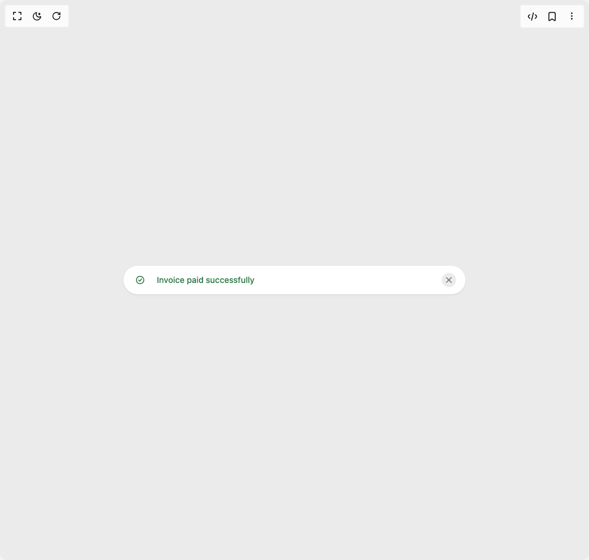

# Build Heroui Alert in BuilderStudio

> Build this component in our Agentic IDE: [BuilderStudio](https://builderstudio.dev).
>
> Join the BuilderStudio community on [Discord](https://discord.gg/QdWeSGCqfe) and [Reddit](https://reddit.com/r/builderstudio).



## Component

- Author group: `hero_ui`
- Component: `heroui-alert`
- Variant: `compact`
- Rendered HTML snapshot: [`rendered.html`](rendered.html)

## BuilderStudio prompt

You are implementing a React component based on a component reference.

## Component identity

- Author: hero_ui
- Component slug: heroui-alert
- Demo slug: compact
- Title: heroui-alert
- Description: 

## Goal

Recreate this component in a React + TypeScript + Tailwind CSS project. Preserve the visual layout, spacing, colors, border radius, shadows, interaction behavior, animation behavior, responsive behavior, and dark mode behavior shown in the rendered demo.

## Implementation requirements

- Use React and TypeScript.
- Use Tailwind CSS classes whenever possible.
- Keep the component self-contained unless the source files require helper components.
- If the source uses CSS variables, custom CSS, animations, or keyframes, include them.
- If the source uses external packages, list and use the required packages.
- Preserve accessibility attributes, button semantics, links, keyboard behavior, and ARIA attributes when visible in the source.
- Do not replace the component with a simplified placeholder.
- Return complete production-ready code.

## Dependencies

No reference metadata available.

## Rendered DOM snapshot

This is the rendered demo HTML extracted from the live preview. Use it to verify structure, class names, visible content, and layout.

```html
<div id="root"><div class="w-screen min-h-screen flex justify-center items-center"><div class="w-screen min-h-screen flex justify-center items-center"><div class="w-full max-w-xl"><div class="alert alert--success py-3" data-slot="alert-root"><div class="alert__indicator" data-slot="alert-indicator"><svg aria-hidden="true" aria-label="Success icon" fill="none" height="16" role="presentation" viewBox="0 0 16 16" width="16" xmlns="http://www.w3.org/2000/svg" data-slot="alert-default-icon"><path clip-rule="evenodd" d="M13.5 8a5.5 5.5 0 1 1-11 0a5.5 5.5 0 0 1 11 0M15 8A7 7 0 1 1 1 8a7 7 0 0 1 14 0m-3.9-1.55a.75.75 0 1 0-1.2-.9L7.419 8.858L6.03 7.47a.75.75 0 0 0-1.06 1.06l2 2a.75.75 0 0 0 1.13-.08z" fill="currentColor" fill-rule="evenodd"></path></svg></div><div class="alert__content" data-slot="alert-content"><p class="alert__title" data-slot="alert-title">Invoice paid successfully</p></div><button data-slot="close-button" class="close-button close-button--default" data-rac="" type="button" tabindex="0" data-react-aria-pressable="true" aria-label="Dismiss invoice message" id="react-aria2500308801-«r0»"><svg aria-hidden="true" aria-label="Close icon" fill="none" height="16" role="presentation" viewBox="0 0 16 16" width="16" xmlns="http://www.w3.org/2000/svg" data-slot="close-button-icon"><path clip-rule="evenodd" d="M3.47 3.47a.75.75 0 0 1 1.06 0L8 6.94l3.47-3.47a.75.75 0 1 1 1.06 1.06L9.06 8l3.47 3.47a.75.75 0 1 1-1.06 1.06L8 9.06l-3.47 3.47a.75.75 0 0 1-1.06-1.06L6.94 8 3.47 4.53a.75.75 0 0 1 0-1.06Z" fill="currentColor" fill-rule="evenodd"></path></svg></button></div></div></div></div></div>
```

## Reference source files

No reference source files were available.
