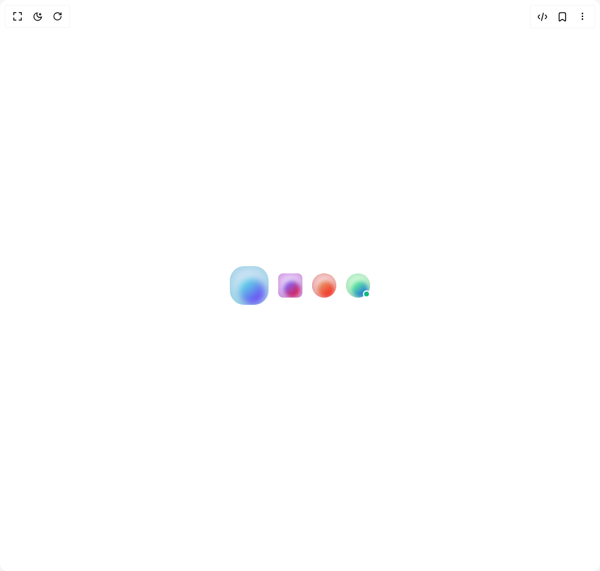

# Build Heroui Avatar in BuilderStudio

> Build this component in our Agentic IDE: [BuilderStudio](https://builderstudio.dev).
>
> Join the BuilderStudio community on [Discord](https://discord.gg/QdWeSGCqfe) and [Reddit](https://reddit.com/r/builderstudio).



## Component

- Author group: `hero_ui`
- Component: `heroui-avatar`
- Variant: `custom-styles`
- Rendered HTML snapshot: [`rendered.html`](rendered.html)

## BuilderStudio prompt

You are implementing a React component based on a component reference.

## Component identity

- Author: hero_ui
- Component slug: heroui-avatar
- Demo slug: custom-styles
- Title: heroui-avatar
- Description: 

## Goal

Recreate this component in a React + TypeScript + Tailwind CSS project. Preserve the visual layout, spacing, colors, border radius, shadows, interaction behavior, animation behavior, responsive behavior, and dark mode behavior shown in the rendered demo.

## Implementation requirements

- Use React and TypeScript.
- Use Tailwind CSS classes whenever possible.
- Keep the component self-contained unless the source files require helper components.
- If the source uses CSS variables, custom CSS, animations, or keyframes, include them.
- If the source uses external packages, list and use the required packages.
- Preserve accessibility attributes, button semantics, links, keyboard behavior, and ARIA attributes when visible in the source.
- Do not replace the component with a simplified placeholder.
- Return complete production-ready code.

## Dependencies

No reference metadata available.

## Rendered DOM snapshot

This is the rendered demo HTML extracted from the live preview. Use it to verify structure, class names, visible content, and layout.

```html
<div id="root"><div class="flex min-h-screen w-full items-center justify-center overflow-hidden bg-background p-8"><div class="flex items-center gap-4"><span class="relative flex shrink-0 items-center justify-center overflow-hidden bg-zinc-100 dark:bg-zinc-800 size-10 rounded-3xl size-16"></span><span class="relative flex shrink-0 items-center justify-center overflow-hidden bg-zinc-100 dark:bg-zinc-800 size-10 rounded-3xl rounded-lg"></span><span class="relative flex shrink-0 items-center justify-center overflow-hidden bg-zinc-100 dark:bg-zinc-800 size-10 rounded-3xl bg-gradient-to-tr from-pink-500 to-yellow-500 p-0.5"><div class="size-full rounded-full bg-background p-0.5"></div></span><div class="relative"><span class="relative flex shrink-0 items-center justify-center overflow-hidden bg-zinc-100 dark:bg-zinc-800 size-10 rounded-3xl"></span><span class="absolute right-0 bottom-0 size-3 rounded-full border-2 border-background bg-emerald-500"></span></div></div></div></div>
```

## Reference source files

No reference source files were available.
