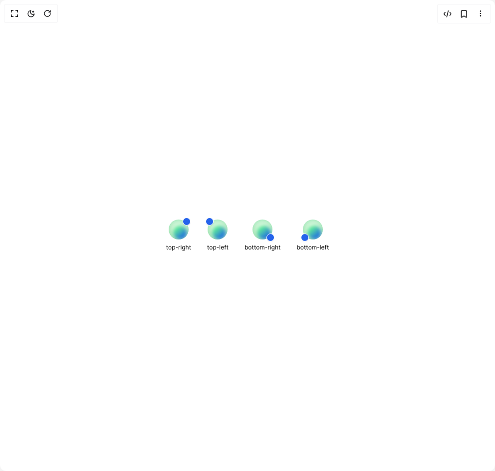

# Build Heroui Badge in BuilderStudio

> Build this component in our Agentic IDE: [BuilderStudio](https://builderstudio.dev).
>
> Join the BuilderStudio community on [Discord](https://discord.gg/QdWeSGCqfe) and [Reddit](https://reddit.com/r/builderstudio).



## Component

- Author group: `hero_ui`
- Component: `heroui-badge`
- Variant: `placements`
- Rendered HTML snapshot: [`rendered.html`](rendered.html)

## BuilderStudio prompt

You are implementing a React component based on a component reference.

## Component identity

- Author: hero_ui
- Component slug: heroui-badge
- Demo slug: placements
- Title: heroui-badge
- Description: 

## Goal

Recreate this component in a React + TypeScript + Tailwind CSS project. Preserve the visual layout, spacing, colors, border radius, shadows, interaction behavior, animation behavior, responsive behavior, and dark mode behavior shown in the rendered demo.

## Implementation requirements

- Use React and TypeScript.
- Use Tailwind CSS classes whenever possible.
- Keep the component self-contained unless the source files require helper components.
- If the source uses CSS variables, custom CSS, animations, or keyframes, include them.
- If the source uses external packages, list and use the required packages.
- Preserve accessibility attributes, button semantics, links, keyboard behavior, and ARIA attributes when visible in the source.
- Do not replace the component with a simplified placeholder.
- Return complete production-ready code.

## Dependencies

No reference metadata available.

## Rendered DOM snapshot

This is the rendered demo HTML extracted from the live preview. Use it to verify structure, class names, visible content, and layout.

```html
<div id="root"><div class="flex min-h-screen w-full items-center justify-center overflow-hidden bg-background p-8"><div class="flex items-center gap-8"><div class="flex flex-col items-center gap-2"><span class="relative inline-flex shrink-0" data-slot="badge-anchor"><span class="inline-flex size-10 shrink-0 overflow-hidden rounded-3xl bg-zinc-100 dark:bg-zinc-800"></span><span class="inline-flex shrink-0 items-center justify-center gap-0.5 border border-background font-medium shadow-sm transition-colors absolute right-0 top-0 translate-x-1/4 -translate-y-1/4 min-h-4 min-w-4 rounded-xl text-[10px] leading-[1.34] bg-blue-600 text-white size-3 min-h-3 min-w-3 rounded-full p-0" data-slot="badge"></span></span><span class="text-xs text-muted-foreground">top-right</span></div><div class="flex flex-col items-center gap-2"><span class="relative inline-flex shrink-0" data-slot="badge-anchor"><span class="inline-flex size-10 shrink-0 overflow-hidden rounded-3xl bg-zinc-100 dark:bg-zinc-800"></span><span class="inline-flex shrink-0 items-center justify-center gap-0.5 border border-background font-medium shadow-sm transition-colors absolute left-0 top-0 -translate-x-1/4 -translate-y-1/4 min-h-4 min-w-4 rounded-xl text-[10px] leading-[1.34] bg-blue-600 text-white size-3 min-h-3 min-w-3 rounded-full p-0" data-slot="badge"></span></span><span class="text-xs text-muted-foreground">top-left</span></div><div class="flex flex-col items-center gap-2"><span class="relative inline-flex shrink-0" data-slot="badge-anchor"><span class="inline-flex size-10 shrink-0 overflow-hidden rounded-3xl bg-zinc-100 dark:bg-zinc-800"></span><span class="inline-flex shrink-0 items-center justify-center gap-0.5 border border-background font-medium shadow-sm transition-colors absolute bottom-0 right-0 translate-x-1/4 translate-y-1/4 min-h-4 min-w-4 rounded-xl text-[10px] leading-[1.34] bg-blue-600 text-white size-3 min-h-3 min-w-3 rounded-full p-0" data-slot="badge"></span></span><span class="text-xs text-muted-foreground">bottom-right</span></div><div class="flex flex-col items-center gap-2"><span class="relative inline-flex shrink-0" data-slot="badge-anchor"><span class="inline-flex size-10 shrink-0 overflow-hidden rounded-3xl bg-zinc-100 dark:bg-zinc-800"></span><span class="inline-flex shrink-0 items-center justify-center gap-0.5 border border-background font-medium shadow-sm transition-colors absolute bottom-0 left-0 -translate-x-1/4 translate-y-1/4 min-h-4 min-w-4 rounded-xl text-[10px] leading-[1.34] bg-blue-600 text-white size-3 min-h-3 min-w-3 rounded-full p-0" data-slot="badge"></span></span><span class="text-xs text-muted-foreground">bottom-left</span></div></div></div></div>
```

## Reference source files

No reference source files were available.
