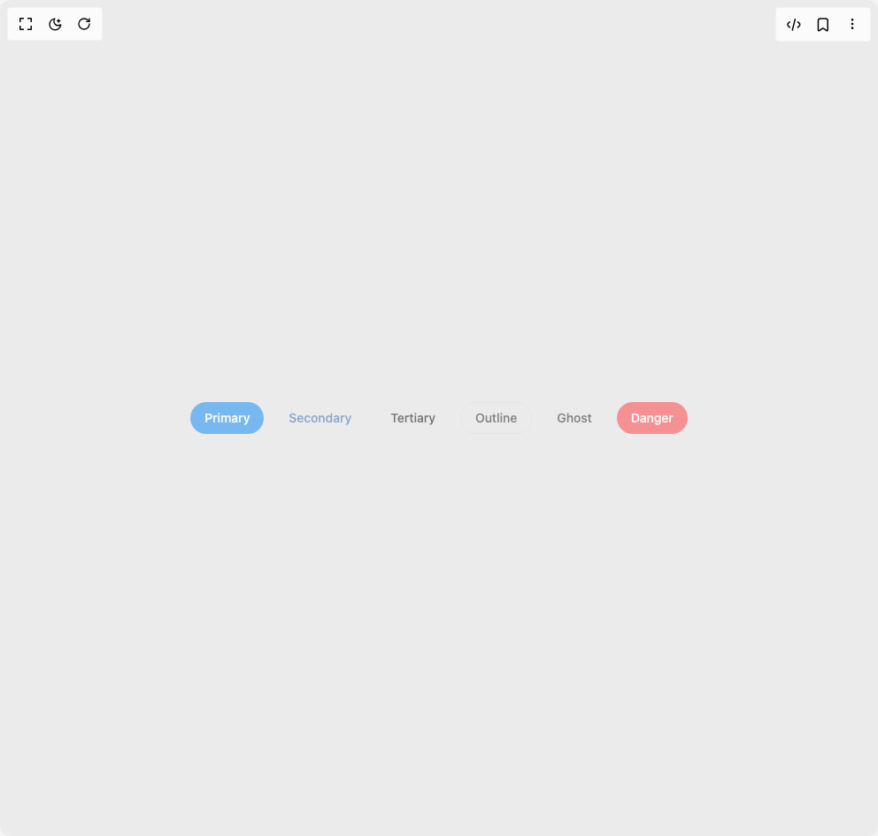

# Build Heroui Button in BuilderStudio

> Build this component in our Agentic IDE: [BuilderStudio](https://builderstudio.dev).
>
> Join the BuilderStudio community on [Discord](https://discord.gg/QdWeSGCqfe) and [Reddit](https://reddit.com/r/builderstudio).



## Component

- Author group: `hero_ui`
- Component: `heroui-button`
- Variant: `disabled`
- Rendered HTML snapshot: [`rendered.html`](rendered.html)

## BuilderStudio prompt

You are implementing a React component based on a component reference.

## Component identity

- Author: hero_ui
- Component slug: heroui-button
- Demo slug: disabled
- Title: heroui-button
- Description: 

## Goal

Recreate this component in a React + TypeScript + Tailwind CSS project. Preserve the visual layout, spacing, colors, border radius, shadows, interaction behavior, animation behavior, responsive behavior, and dark mode behavior shown in the rendered demo.

## Implementation requirements

- Use React and TypeScript.
- Use Tailwind CSS classes whenever possible.
- Keep the component self-contained unless the source files require helper components.
- If the source uses CSS variables, custom CSS, animations, or keyframes, include them.
- If the source uses external packages, list and use the required packages.
- Preserve accessibility attributes, button semantics, links, keyboard behavior, and ARIA attributes when visible in the source.
- Do not replace the component with a simplified placeholder.
- Return complete production-ready code.

## Dependencies

No reference metadata available.

## Rendered DOM snapshot

This is the rendered demo HTML extracted from the live preview. Use it to verify structure, class names, visible content, and layout.

```html
<div id="root"><div class="w-screen min-h-screen flex justify-center items-center"><div class="w-screen min-h-screen flex justify-center items-center"><div class="flex min-h-screen w-full flex-wrap items-center justify-center gap-3 p-8"><button data-slot="button" class="button button--md button--primary" data-rac="" type="button" disabled="" data-react-aria-pressable="true" id="react-aria3798693973-«r0»" data-disabled="true">Primary</button><button data-slot="button" class="button button--md button--secondary" data-rac="" type="button" disabled="" data-react-aria-pressable="true" id="react-aria3798693973-«r2»" data-disabled="true">Secondary</button><button data-slot="button" class="button button--md button--tertiary" data-rac="" type="button" disabled="" data-react-aria-pressable="true" id="react-aria3798693973-«r4»" data-disabled="true">Tertiary</button><button data-slot="button" class="button button--md button--outline" data-rac="" type="button" disabled="" data-react-aria-pressable="true" id="react-aria3798693973-«r6»" data-disabled="true">Outline</button><button data-slot="button" class="button button--md button--ghost" data-rac="" type="button" disabled="" data-react-aria-pressable="true" id="react-aria3798693973-«r8»" data-disabled="true">Ghost</button><button data-slot="button" class="button button--md button--danger" data-rac="" type="button" disabled="" data-react-aria-pressable="true" id="react-aria3798693973-«ra»" data-disabled="true">Danger</button></div></div></div></div>
```

## Reference source files

No reference source files were available.
