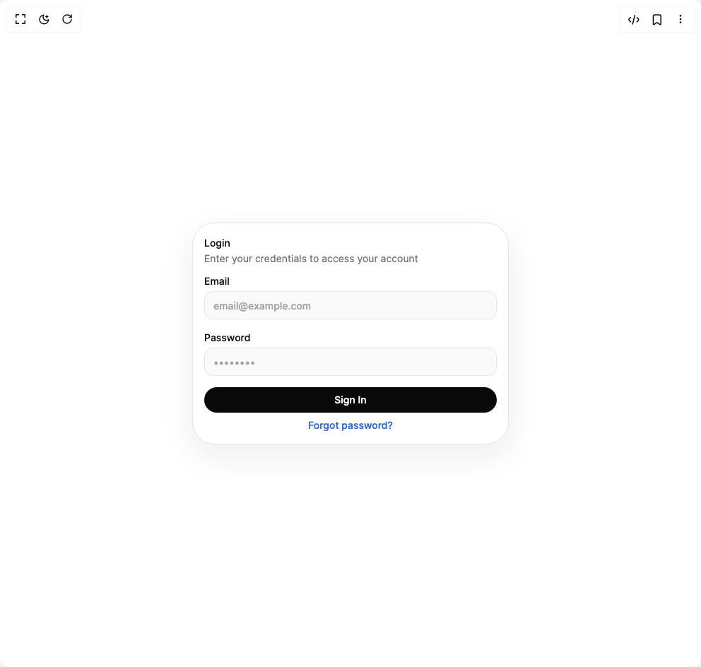

# Build Heroui Card in BuilderStudio

> Build this component in our Agentic IDE: [BuilderStudio](https://builderstudio.dev).
>
> Join the BuilderStudio community on [Discord](https://discord.gg/QdWeSGCqfe) and [Reddit](https://reddit.com/r/builderstudio).



## Component

- Author group: `hero_ui`
- Component: `heroui-card`
- Variant: `with-form`
- Rendered HTML snapshot: [`rendered.html`](rendered.html)

## BuilderStudio prompt

You are implementing a React component based on a component reference.

## Component identity

- Author: hero_ui
- Component slug: heroui-card
- Demo slug: with-form
- Title: heroui-card
- Description: 

## Goal

Recreate this component in a React + TypeScript + Tailwind CSS project. Preserve the visual layout, spacing, colors, border radius, shadows, interaction behavior, animation behavior, responsive behavior, and dark mode behavior shown in the rendered demo.

## Implementation requirements

- Use React and TypeScript.
- Use Tailwind CSS classes whenever possible.
- Keep the component self-contained unless the source files require helper components.
- If the source uses CSS variables, custom CSS, animations, or keyframes, include them.
- If the source uses external packages, list and use the required packages.
- Preserve accessibility attributes, button semantics, links, keyboard behavior, and ARIA attributes when visible in the source.
- Do not replace the component with a simplified placeholder.
- Return complete production-ready code.

## Dependencies

No reference metadata available.

## Rendered DOM snapshot

This is the rendered demo HTML extracted from the live preview. Use it to verify structure, class names, visible content, and layout.

```html
<div id="root"><div class="flex min-h-screen w-full items-center justify-center overflow-hidden bg-background p-8"><div class="relative flex flex-col gap-3 overflow-visible p-4 text-zinc-950 dark:text-zinc-50 rounded-[min(32px,var(--radius-3xl,32px))] border border-zinc-200 bg-white shadow-[0_16px_48px_rgba(15,23,42,0.08)] dark:border-white/10 dark:bg-zinc-900 dark:shadow-[0_20px_60px_rgba(0,0,0,0.28)] w-full max-w-md" data-slot="card"><div class="flex flex-col" data-slot="card-header"><h3 class="text-sm font-medium leading-6 text-zinc-950 dark:text-zinc-50" data-slot="card-title">Login</h3><p class="text-sm leading-5 text-zinc-500 dark:text-zinc-400" data-slot="card-description">Enter your credentials to access your account</p></div><form><div class="flex flex-1 flex-col gap-1 text-sm" data-slot="card-content"><div class="flex flex-col gap-4"><label class="flex flex-col gap-1 text-sm font-medium text-zinc-950 dark:text-zinc-50">Email<input class="h-10 rounded-xl border border-zinc-200 bg-zinc-50 px-3 text-sm outline-none transition-colors placeholder:text-zinc-400 focus:border-blue-500 dark:border-white/10 dark:bg-white/5 dark:placeholder:text-zinc-500" placeholder="email@example.com" type="email"></label><label class="flex flex-col gap-1 text-sm font-medium text-zinc-950 dark:text-zinc-50">Password<input class="h-10 rounded-xl border border-zinc-200 bg-zinc-50 px-3 text-sm outline-none transition-colors placeholder:text-zinc-400 focus:border-blue-500 dark:border-white/10 dark:bg-white/5 dark:placeholder:text-zinc-500" placeholder="••••••••" type="password"></label></div></div><div class="flex flex-row items-center mt-4 flex flex-col gap-2" data-slot="card-footer"><button class="w-full rounded-full bg-zinc-950 px-4 py-2 text-sm font-medium text-white dark:bg-white dark:text-zinc-950" type="submit">Sign In</button><a class="text-center text-sm font-medium text-blue-600 dark:text-blue-400" href="#">Forgot password?</a></div></form></div></div></div>
```

## Reference source files

No reference source files were available.
