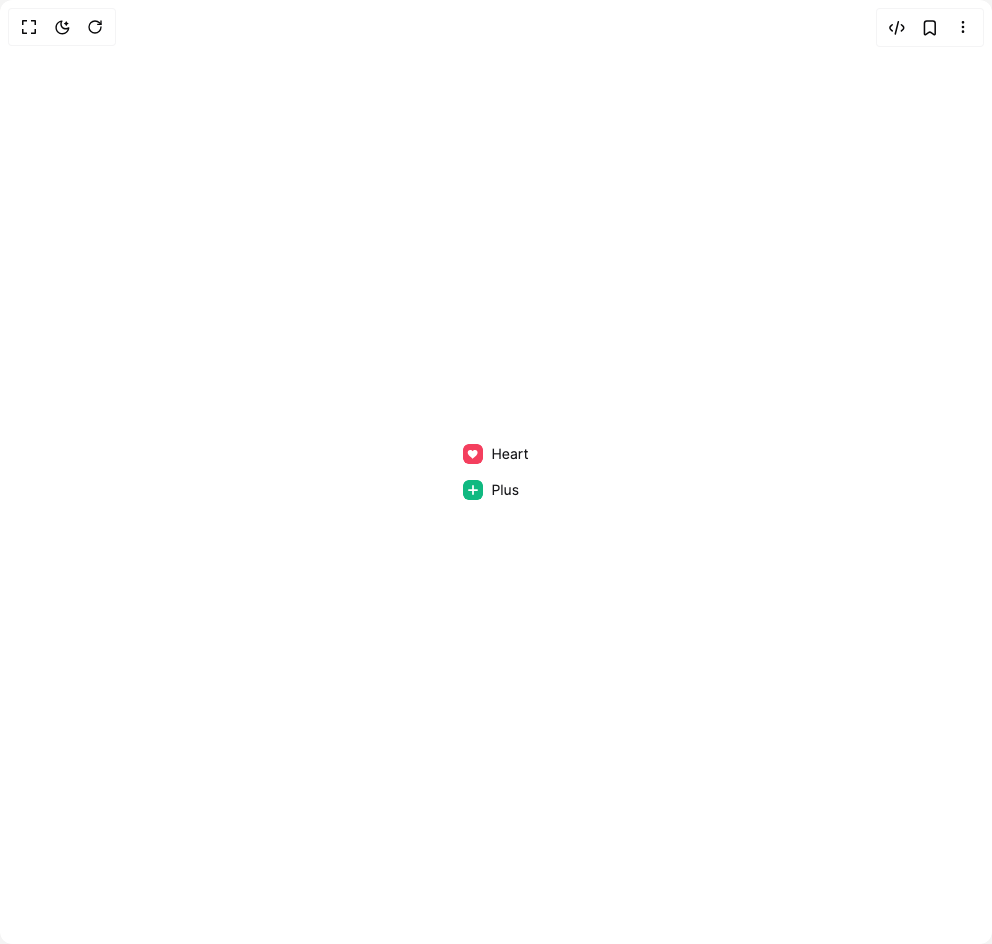

# Build Heroui Checkbox in BuilderStudio

> Build this component in our Agentic IDE: [BuilderStudio](https://builderstudio.dev).
>
> Join the BuilderStudio community on [Discord](https://discord.gg/QdWeSGCqfe) and [Reddit](https://reddit.com/r/builderstudio).



## Component

- Author group: `hero_ui`
- Component: `heroui-checkbox`
- Variant: `custom-indicator`
- Rendered HTML snapshot: [`rendered.html`](rendered.html)

## BuilderStudio prompt

You are implementing a React component based on a component reference.

## Component identity

- Author: hero_ui
- Component slug: heroui-checkbox
- Demo slug: custom-indicator
- Title: heroui-checkbox
- Description: 

## Goal

Recreate this component in a React + TypeScript + Tailwind CSS project. Preserve the visual layout, spacing, colors, border radius, shadows, interaction behavior, animation behavior, responsive behavior, and dark mode behavior shown in the rendered demo.

## Implementation requirements

- Use React and TypeScript.
- Use Tailwind CSS classes whenever possible.
- Keep the component self-contained unless the source files require helper components.
- If the source uses CSS variables, custom CSS, animations, or keyframes, include them.
- If the source uses external packages, list and use the required packages.
- Preserve accessibility attributes, button semantics, links, keyboard behavior, and ARIA attributes when visible in the source.
- Do not replace the component with a simplified placeholder.
- Return complete production-ready code.

## Dependencies

No reference metadata available.

## Rendered DOM snapshot

This is the rendered demo HTML extracted from the live preview. Use it to verify structure, class names, visible content, and layout.

```html
<div id="root"><div class="flex min-h-screen w-full items-center justify-center overflow-hidden bg-background p-8"><div class="flex flex-col gap-4"><style>
      [data-slot="checkbox-control"] [data-slot="checkbox-border"] {
        position: absolute;
        inset: 0;
        z-index: 1;
        border: 2px solid #d4d4d8;
        border-radius: inherit;
        pointer-events: none;
        transition: border-color 200ms linear, background-color 200ms linear;
      }
      .dark [data-slot="checkbox-control"] [data-slot="checkbox-border"] { border-color: #52525b; }
      [data-slot="checkbox-control"][data-selected="true"] [data-slot="checkbox-border"] {
        border-color: var(--checkbox-selected-bg);
      }
      [data-slot="checkbox-control"] [data-slot="checkbox-fill"] {
        position: absolute;
        inset: 0;
        z-index: 0;
        border-radius: inherit;
        background: var(--checkbox-selected-bg);
        opacity: 0;
        transform: scale(.5);
        transform-origin: center;
        transition: transform 200ms linear, opacity 200ms linear;
      }
      [data-slot="checkbox-control"][data-selected="true"] [data-slot="checkbox-fill"] {
        opacity: 1;
        transform: scale(1);
      }
      [data-slot="checkbox-indicator"] {
        opacity: 0;
        transform: scale(.72);
        transition: transform 200ms ease, opacity 200ms ease;
      }
      [data-slot="checkbox-indicator"][data-visible="true"] {
        opacity: 1;
        transform: scale(1);
      }
      [data-slot="checkbox-control"]:active,
      .group:active [data-slot="checkbox-control"] {
        transform: scale(.95);
      }
      @media (prefers-reduced-motion: reduce) {
        [data-slot="checkbox-control"],
        [data-slot="checkbox-control"] [data-slot="checkbox-fill"],
        [data-slot="checkbox-indicator"] { transition: none; }
      }
    </style><label data-selected="true" data-disabled="false" data-invalid="false" class="group relative inline-flex max-w-fit cursor-pointer select-none items-center justify-start gap-2 p-2 -m-2 text-foreground"><input aria-checked="true" class="sr-only" type="checkbox" checked=""><span data-slot="checkbox-control" data-selected="true" data-disabled="false" data-invalid="false" class="relative inline-flex size-5 shrink-0 items-center justify-center overflow-hidden rounded-md text-white transition-transform duration-200 active:scale-95 before:absolute before:inset-0 before:z-0 before:bg-zinc-100/70 before:opacity-0 before:transition-colors hover:before:opacity-100 focus-visible:outline-none focus-visible:ring-2 focus-visible:ring-violet-500 focus-visible:ring-offset-2 dark:before:bg-white/10 data-[invalid=true]:border-rose-500 data-[disabled=true]:opacity-50 size-5 rounded-md data-[selected=true]:border-rose-500 data-[selected=true]:text-white data-[selected=true]:after:bg-rose-500" style="--checkbox-selected-bg: #f43f5e;"><span aria-hidden="true" data-slot="checkbox-fill"></span><span aria-hidden="true" data-slot="checkbox-border"></span><span data-slot="checkbox-indicator" data-visible="true" class="relative z-10 inline-flex items-center justify-center"><svg aria-hidden="true" viewBox="0 0 24 24" class="size-3.5"><path d="M12 20.4s-7.2-4.7-8.8-9.1C2.1 8 4.2 5.2 7.3 5.2c1.8 0 3.2.9 4.1 2.2.9-1.3 2.3-2.2 4.1-2.2 3.1 0 5.2 2.8 4.1 6.1-1.5 4.4-8.6 9.1-8.6 9.1Z" fill="currentColor"></path></svg></span></span><span class="relative inline-flex flex-col justify-center gap-1 leading-none text-zinc-900 transition-colors dark:text-zinc-100 text-sm">Heart</span></label><style>
      [data-slot="checkbox-control"] [data-slot="checkbox-border"] {
        position: absolute;
        inset: 0;
        z-index: 1;
        border: 2px solid #d4d4d8;
        border-radius: inherit;
        pointer-events: none;
        transition: border-color 200ms linear, background-color 200ms linear;
      }
      .dark [data-slot="checkbox-control"] [data-slot="checkbox-border"] { border-color: #52525b; }
      [data-slot="checkbox-control"][data-selected="true"] [data-slot="checkbox-border"] {
        border-color: var(--checkbox-selected-bg);
      }
      [data-slot="checkbox-control"] [data-slot="checkbox-fill"] {
        position: absolute;
        inset: 0;
        z-index: 0;
        border-radius: inherit;
        background: var(--checkbox-selected-bg);
        opacity: 0;
        transform: scale(.5);
        transform-origin: center;
        transition: transform 200ms linear, opacity 200ms linear;
      }
      [data-slot="checkbox-control"][data-selected="true"] [data-slot="checkbox-fill"] {
        opacity: 1;
        transform: scale(1);
      }
      [data-slot="checkbox-indicator"] {
        opacity: 0;
        transform: scale(.72);
        transition: transform 200ms ease, opacity 200ms ease;
      }
      [data-slot="checkbox-indicator"][data-visible="true"] {
        opacity: 1;
        transform: scale(1);
      }
      [data-slot="checkbox-control"]:active,
      .group:active [data-slot="checkbox-control"] {
        transform: scale(.95);
      }
      @media (prefers-reduced-motion: reduce) {
        [data-slot="checkbox-control"],
        [data-slot="checkbox-control"] [data-slot="checkbox-fill"],
        [data-slot="checkbox-indicator"] { transition: none; }
      }
    </style><label data-selected="true" data-disabled="false" data-invalid="false" class="group relative inline-flex max-w-fit cursor-pointer select-none items-center justify-start gap-2 p-2 -m-2 text-foreground"><input aria-checked="true" class="sr-only" type="checkbox" checked=""><span data-slot="checkbox-control" data-selected="true" data-disabled="false" data-invalid="false" class="relative inline-flex size-5 shrink-0 items-center justify-center overflow-hidden rounded-md text-white transition-transform duration-200 active:scale-95 before:absolute before:inset-0 before:z-0 before:bg-zinc-100/70 before:opacity-0 before:transition-colors hover:before:opacity-100 focus-visible:outline-none focus-visible:ring-2 focus-visible:ring-violet-500 focus-visible:ring-offset-2 dark:before:bg-white/10 data-[invalid=true]:border-rose-500 data-[disabled=true]:opacity-50 size-5 rounded-md data-[selected=true]:border-emerald-500 data-[selected=true]:text-white data-[selected=true]:after:bg-emerald-500" style="--checkbox-selected-bg: #10b981;"><span aria-hidden="true" data-slot="checkbox-fill"></span><span aria-hidden="true" data-slot="checkbox-border"></span><span data-slot="checkbox-indicator" data-visible="true" class="relative z-10 inline-flex items-center justify-center"><svg aria-hidden="true" viewBox="0 0 24 24" class="size-3.5"><path d="M12 5v14M5 12h14" fill="none" stroke="currentColor" stroke-linecap="round" stroke-width="3"></path></svg></span></span><span class="relative inline-flex flex-col justify-center gap-1 leading-none text-zinc-900 transition-colors dark:text-zinc-100 text-sm">Plus</span></label></div></div></div>
```

## Reference source files

No reference source files were available.
