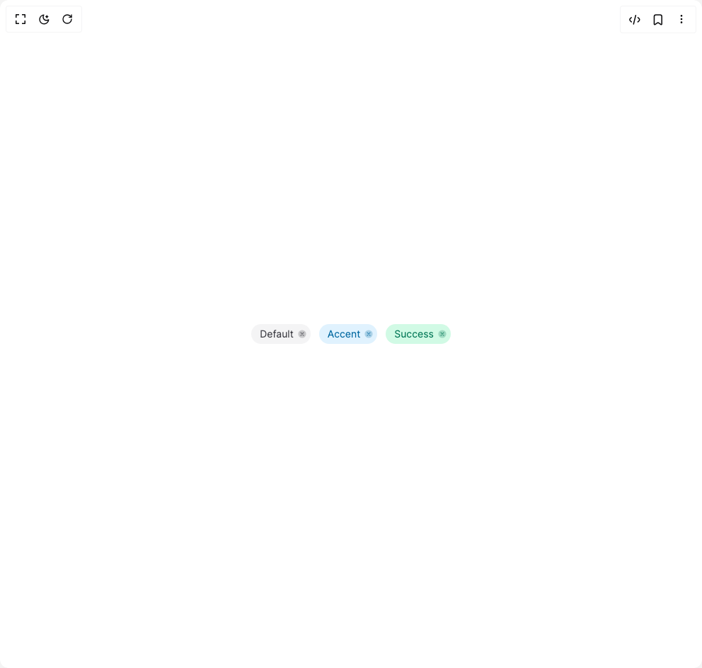

# Build Heroui Chip in BuilderStudio

> Build this component in our Agentic IDE: [BuilderStudio](https://builderstudio.dev).
>
> Join the BuilderStudio community on [Discord](https://discord.gg/QdWeSGCqfe) and [Reddit](https://reddit.com/r/builderstudio).



## Component

- Author group: `hero_ui`
- Component: `heroui-chip`
- Variant: `closeable`
- Rendered HTML snapshot: [`rendered.html`](rendered.html)

## BuilderStudio prompt

You are implementing a React component based on a component reference.

## Component identity

- Author: hero_ui
- Component slug: heroui-chip
- Demo slug: closeable
- Title: heroui-chip
- Description: 

## Goal

Recreate this component in a React + TypeScript + Tailwind CSS project. Preserve the visual layout, spacing, colors, border radius, shadows, interaction behavior, animation behavior, responsive behavior, and dark mode behavior shown in the rendered demo.

## Implementation requirements

- Use React and TypeScript.
- Use Tailwind CSS classes whenever possible.
- Keep the component self-contained unless the source files require helper components.
- If the source uses CSS variables, custom CSS, animations, or keyframes, include them.
- If the source uses external packages, list and use the required packages.
- Preserve accessibility attributes, button semantics, links, keyboard behavior, and ARIA attributes when visible in the source.
- Do not replace the component with a simplified placeholder.
- Return complete production-ready code.

## Dependencies

No reference metadata available.

## Rendered DOM snapshot

This is the rendered demo HTML extracted from the live preview. Use it to verify structure, class names, visible content, and layout.

```html
<div id="root"><div class="flex min-h-screen w-full items-center justify-center overflow-hidden bg-background p-8"><div class="flex flex-wrap items-center justify-center gap-3"><div class="relative box-border inline-flex min-w-min max-w-fit items-center justify-between whitespace-nowrap rounded-full font-normal transition-colors h-7 px-1 text-sm bg-zinc-100 text-zinc-700 dark:bg-zinc-800 dark:text-zinc-200" data-slot="chip"><span class="flex-1 text-inherit px-2 pr-1" data-slot="chip-label">Default</span><button aria-label="close chip" class="z-10 inline-flex appearance-none items-center justify-center rounded-full outline-none opacity-70 transition-opacity hover:opacity-100 active:opacity-40 focus-visible:ring-2 focus-visible:ring-current focus-visible:ring-offset-1 h-4 w-4" data-slot="chip-close-button" type="button"><svg aria-hidden="true" class="h-3.5 w-3.5" fill="none" viewBox="0 0 20 20"><circle cx="10" cy="10" r="8" fill="currentColor" opacity="0.35"></circle><path d="m7.2 7.2 5.6 5.6M12.8 7.2l-5.6 5.6" stroke="currentColor" stroke-linecap="round" stroke-width="1.8"></path></svg></button></div><div class="relative box-border inline-flex min-w-min max-w-fit items-center justify-between whitespace-nowrap rounded-full font-normal transition-colors h-7 px-1 text-sm bg-sky-100 text-sky-700 dark:bg-sky-950 dark:text-sky-200" data-slot="chip"><span class="flex-1 text-inherit px-2 pr-1" data-slot="chip-label">Accent</span><button aria-label="close chip" class="z-10 inline-flex appearance-none items-center justify-center rounded-full outline-none opacity-70 transition-opacity hover:opacity-100 active:opacity-40 focus-visible:ring-2 focus-visible:ring-current focus-visible:ring-offset-1 h-4 w-4" data-slot="chip-close-button" type="button"><svg aria-hidden="true" class="h-3.5 w-3.5" fill="none" viewBox="0 0 20 20"><circle cx="10" cy="10" r="8" fill="currentColor" opacity="0.35"></circle><path d="m7.2 7.2 5.6 5.6M12.8 7.2l-5.6 5.6" stroke="currentColor" stroke-linecap="round" stroke-width="1.8"></path></svg></button></div><div class="relative box-border inline-flex min-w-min max-w-fit items-center justify-between whitespace-nowrap rounded-full font-normal transition-colors h-7 px-1 text-sm bg-emerald-100 text-emerald-700 dark:bg-emerald-950 dark:text-emerald-200" data-slot="chip"><span class="flex-1 text-inherit px-2 pr-1" data-slot="chip-label">Success</span><button aria-label="close chip" class="z-10 inline-flex appearance-none items-center justify-center rounded-full outline-none opacity-70 transition-opacity hover:opacity-100 active:opacity-40 focus-visible:ring-2 focus-visible:ring-current focus-visible:ring-offset-1 h-4 w-4" data-slot="chip-close-button" type="button"><svg aria-hidden="true" class="h-3.5 w-3.5" fill="none" viewBox="0 0 20 20"><circle cx="10" cy="10" r="8" fill="currentColor" opacity="0.35"></circle><path d="m7.2 7.2 5.6 5.6M12.8 7.2l-5.6 5.6" stroke="currentColor" stroke-linecap="round" stroke-width="1.8"></path></svg></button></div></div></div></div>
```

## Reference source files

No reference source files were available.
