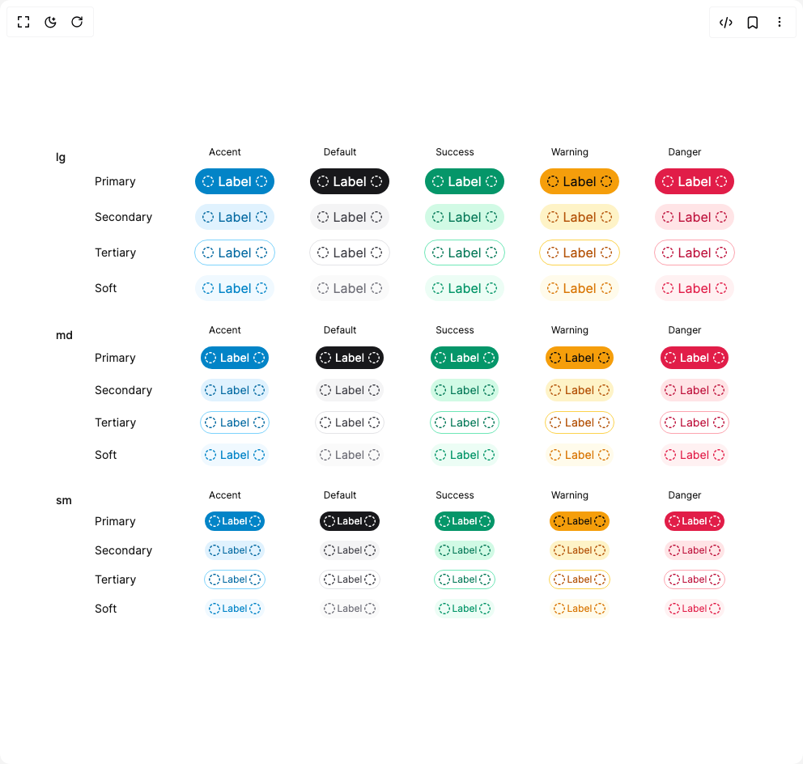

# Build Heroui Chip in BuilderStudio

> Build this component in our Agentic IDE: [BuilderStudio](https://builderstudio.dev).
>
> Join the BuilderStudio community on [Discord](https://discord.gg/QdWeSGCqfe) and [Reddit](https://reddit.com/r/builderstudio).



## Component

- Author group: `hero_ui`
- Component: `heroui-chip`
- Variant: `variants`
- Rendered HTML snapshot: [`rendered.html`](rendered.html)

## BuilderStudio prompt

You are implementing a React component based on a component reference.

## Component identity

- Author: hero_ui
- Component slug: heroui-chip
- Demo slug: variants
- Title: heroui-chip
- Description: 

## Goal

Recreate this component in a React + TypeScript + Tailwind CSS project. Preserve the visual layout, spacing, colors, border radius, shadows, interaction behavior, animation behavior, responsive behavior, and dark mode behavior shown in the rendered demo.

## Implementation requirements

- Use React and TypeScript.
- Use Tailwind CSS classes whenever possible.
- Keep the component self-contained unless the source files require helper components.
- If the source uses CSS variables, custom CSS, animations, or keyframes, include them.
- If the source uses external packages, list and use the required packages.
- Preserve accessibility attributes, button semantics, links, keyboard behavior, and ARIA attributes when visible in the source.
- Do not replace the component with a simplified placeholder.
- Return complete production-ready code.

## Dependencies

No reference metadata available.

## Rendered DOM snapshot

This is the rendered demo HTML extracted from the live preview. Use it to verify structure, class names, visible content, and layout.

```html
<div id="root"><div class="flex min-h-screen w-full items-center justify-center overflow-hidden bg-background p-8"><div class="flex flex-col gap-7"><div class="flex items-start gap-5"><h3 class="w-7 shrink-0 pt-1 text-sm font-medium text-muted-foreground">lg</h3><div class="flex flex-col gap-3"><div class="flex items-center gap-3 pl-24"><span class="flex w-[130px] justify-center text-xs capitalize text-muted-foreground">accent</span><span class="flex w-[130px] justify-center text-xs capitalize text-muted-foreground">default</span><span class="flex w-[130px] justify-center text-xs capitalize text-muted-foreground">success</span><span class="flex w-[130px] justify-center text-xs capitalize text-muted-foreground">warning</span><span class="flex w-[130px] justify-center text-xs capitalize text-muted-foreground">danger</span></div><div class="flex items-center gap-3"><div class="w-24 shrink-0 text-sm capitalize text-muted-foreground">primary</div><div class="flex w-[130px] shrink-0 items-center justify-center"><div class="relative box-border inline-flex min-w-min max-w-fit items-center justify-between whitespace-nowrap rounded-full font-normal transition-colors h-8 px-2 text-base bg-sky-600 text-white" data-slot="chip"><svg aria-hidden="true" class="shrink-0" fill="none" height="16" viewBox="0 0 16 16" width="16" xmlns="http://www.w3.org/2000/svg"><path clip-rule="evenodd" d="M6.906 1.085a7 7 0 0 1 2.188 0 .75.75 0 0 1-.232 1.482 5.6 5.6 0 0 0-1.724 0 .75.75 0 0 1-.232-1.482M4.933 2.502a.75.75 0 0 1-.166 1.048c-.466.34-.878.75-1.217 1.217a.75.75 0 0 1-1.213-.882 7 7 0 0 1 1.548-1.548.75.75 0 0 1 1.048.165m6.135 0a.75.75 0 0 1 1.047-.165 7 7 0 0 1 1.548 1.548.75.75 0 0 1-1.213.882 5.5 5.5 0 0 0-1.217-1.217.75.75 0 0 1-.165-1.048M1.943 6.28a.75.75 0 0 1 .624.857 5.6 5.6 0 0 0 0 1.724.75.75 0 0 1-1.482.232 7 7 0 0 1 0-2.188.75.75 0 0 1 .858-.625m12.115 0a.75.75 0 0 1 .857.625 7 7 0 0 1 0 2.188.75.75 0 1 1-1.482-.232 5.5 5.5 0 0 0 0-1.724.75.75 0 0 1 .624-.857M2.502 11.068a.75.75 0 0 1 1.048.165c.34.466.75.878 1.217 1.217a.75.75 0 0 1-.882 1.213 7 7 0 0 1-1.548-1.548.75.75 0 0 1 .165-1.047m10.996 0a.75.75 0 0 1 .165 1.047 7 7 0 0 1-1.548 1.548.75.75 0 0 1-.883-1.213 5.5 5.5 0 0 0 1.218-1.217.75.75 0 0 1 1.048-.165m-7.217 2.99a.75.75 0 0 1 .857-.625 5.5 5.5 0 0 0 1.724 0 .75.75 0 0 1 .232 1.482 7 7 0 0 1-2.188 0 .75.75 0 0 1-.625-.857" fill="currentColor" fill-rule="evenodd"></path></svg><span class="flex-1 text-inherit px-2 pl-1 pr-1" data-slot="chip-label">Label</span><svg aria-hidden="true" class="shrink-0" fill="none" height="16" viewBox="0 0 16 16" width="16" xmlns="http://www.w3.org/2000/svg"><path clip-rule="evenodd" d="M6.906 1.085a7 7 0 0 1 2.188 0 .75.75 0 0 1-.232 1.482 5.6 5.6 0 0 0-1.724 0 .75.75 0 0 1-.232-1.482M4.933 2.502a.75.75 0 0 1-.166 1.048c-.466.34-.878.75-1.217 1.217a.75.75 0 0 1-1.213-.882 7 7 0 0 1 1.548-1.548.75.75 0 0 1 1.048.165m6.135 0a.75.75 0 0 1 1.047-.165 7 7 0 0 1 1.548 1.548.75.75 0 0 1-1.213.882 5.5 5.5 0 0 0-1.217-1.217.75.75 0 0 1-.165-1.048M1.943 6.28a.75.75 0 0 1 .624.857 5.6 5.6 0 0 0 0 1.724.75.75 0 0 1-1.482.232 7 7 0 0 1 0-2.188.75.75 0 0 1 .858-.625m12.115 0a.75.75 0 0 1 .857.625 7 7 0 0 1 0 2.188.75.75 0 1 1-1.482-.232 5.5 5.5 0 0 0 0-1.724.75.75 0 0 1 .624-.857M2.502 11.068a.75.75 0 0 1 1.048.165c.34.466.75.878 1.217 1.217a.75.75 0 0 1-.882 1.213 7 7 0 0 1-1.548-1.548.75.75 0 0 1 .165-1.047m10.996 0a.75.75 0 0 1 .165 1.047 7 7 0 0 1-1.548 1.548.75.75 0 0 1-.883-1.213 5.5 5.5 0 0 0 1.218-1.217.75.75 0 0 1 1.048-.165m-7.217 2.99a.75.75 0 0 1 .857-.625 5.5 5.5 0 0 0 1.724 0 .75.75 0 0 1 .232 1.482 7 7 0 0 1-2.188 0 .75.75 0 0 1-.625-.857" fill="currentColor" fill-rule="evenodd"></path></svg></div></div><div class="flex w-[130px] shrink-0 items-center justify-center"><div class="relative box-border inline-flex min-w-min max-w-fit items-center justify-between whitespace-nowrap rounded-full font-normal transition-colors h-8 px-2 text-base bg-zinc-900 text-white dark:bg-zinc-100 dark:text-zinc-950" data-slot="chip"><svg aria-hidden="true" class="shrink-0" fill="none" height="16" viewBox="0 0 16 16" width="16" xmlns="http://www.w3.org/2000/svg"><path clip-rule="evenodd" d="M6.906 1.085a7 7 0 0 1 2.188 0 .75.75 0 0 1-.232 1.482 5.6 5.6 0 0 0-1.724 0 .75.75 0 0 1-.232-1.482M4.933 2.502a.75.75 0 0 1-.166 1.048c-.466.34-.878.75-1.217 1.217a.75.75 0 0 1-1.213-.882 7 7 0 0 1 1.548-1.548.75.75 0 0 1 1.048.165m6.135 0a.75.75 0 0 1 1.047-.165 7 7 0 0 1 1.548 1.548.75.75 0 0 1-1.213.882 5.5 5.5 0 0 0-1.217-1.217.75.75 0 0 1-.165-1.048M1.943 6.28a.75.75 0 0 1 .624.857 5.6 5.6 0 0 0 0 1.724.75.75 0 0 1-1.482.232 7 7 0 0 1 0-2.188.75.75 0 0 1 .858-.625m12.115 0a.75.75 0 0 1 .857.625 7 7 0 0 1 0 2.188.75.75 0 1 1-1.482-.232 5.5 5.5 0 0 0 0-1.724.75.75 0 0 1 .624-.857M2.502 11.068a.75.75 0 0 1 1.048.165c.34.466.75.878 1.217 1.217a.75.75 0 0 1-.882 1.213 7 7 0 0 1-1.548-1.548.75.75 0 0 1 .165-1.047m10.996 0a.75.75 0 0 1 .165 1.047 7 7 0 0 1-1.548 1.548.75.75 0 0 1-.883-1.213 5.5 5.5 0 0 0 1.218-1.217.75.75 0 0 1 1.048-.165m-7.217 2.99a.75.75 0 0 1 .857-.625 5.5 5.5 0 0 0 1.724 0 .75.75 0 0 1 .232 1.482 7 7 0 0 1-2.188 0 .75.75 0 0 1-.625-.857" fill="currentColor" fill-rule="evenodd"></path></svg><span class="flex-1 text-inherit px-2 pl-1 pr-1" data-slot="chip-label">Label</span><svg aria-hidden="true" class="shrink-0" fill="none" height="16" viewBox="0 0 16 16" width="16" xmlns="http://www.w3.org/2000/svg"><path clip-rule="evenodd" d="M6.906 1.085a7 7 0 0 1 2.188 0 .75.75 0 0 1-.232 1.482 5.6 5.6 0 0 0-1.724 0 .75.75 0 0 1-.232-1.482M4.933 2.502a.75.75 0 0 1-.166 1.048c-.466.34-.878.75-1.217 1.217a.75.75 0 0 1-1.213-.882 7 7 0 0 1 1.548-1.548.75.75 0 0 1 1.048.165m6.135 0a.75.75 0 0 1 1.047-.165 7 7 0 0 1 1.548 1.548.75.75 0 0 1-1.213.882 5.5 5.5 0 0 0-1.217-1.217.75.75 0 0 1-.165-1.048M1.943 6.28a.75.75 0 0 1 .624.857 5.6 5.6 0 0 0 0 1.724.75.75 0 0 1-1.482.232 7 7 0 0 1 0-2.188.75.75 0 0 1 .858-.625m12.115 0a.75.75 0 0 1 .857.625 7 7 0 0 1 0 2.188.75.75 0 1 1-1.482-.232 5.5 5.5 0 0 0 0-1.724.75.75 0 0 1 .624-.857M2.502 11.068a.75.75 0 0 1 1.048.165c.34.466.75.878 1.217 1.217a.75.75 0 0 1-.882 1.213 7 7 0 0 1-1.548-1.548.75.75 0 0 1 .165-1.047m10.996 0a.75.75 0 0 1 .165 1.047 7 7 0 0 1-1.548 1.548.75.75 0 0 1-.883-1.213 5.5 5.5 0 0 0 1.218-1.217.75.75 0 0 1 1.048-.165m-7.217 2.99a.75.75 0 0 1 .857-.625 5.5 5.5 0 0 0 1.724 0 .75.75 0 0 1 .232 1.482 7 7 0 0 1-2.188 0 .75.75 0 0 1-.625-.857" fill="currentColor" fill-rule="evenodd"></path></svg></div></div><div class="flex w-[130px] shrink-0 items-center justify-center"><div class="relative box-border inline-flex min-w-min max-w-fit items-center justify-between whitespace-nowrap rounded-full font-normal transition-colors h-8 px-2 text-base bg-emerald-600 text-white" data-slot="chip"><svg aria-hidden="true" class="shrink-0" fill="none" height="16" viewBox="0 0 16 16" width="16" xmlns="http://www.w3.org/2000/svg"><path clip-rule="evenodd" d="M6.906 1.085a7 7 0 0 1 2.188 0 .75.75 0 0 1-.232 1.482 5.6 5.6 0 0 0-1.724 0 .75.75 0 0 1-.232-1.482M4.933 2.502a.75.75 0 0 1-.166 1.048c-.466.34-.878.75-1.217 1.217a.75.75 0 0 1-1.213-.882 7 7 0 0 1 1.548-1.548.75.75 0 0 1 1.048.165m6.135 0a.75.75 0 0 1 1.047-.165 7 7 0 0 1 1.548 1.548.75.75 0 0 1-1.213.882 5.5 5.5 0 0 0-1.217-1.217.75.75 0 0 1-.165-1.048M1.943 6.28a.75.75 0 0 1 .624.857 5.6 5.6 0 0 0 0 1.724.75.75 0 0 1-1.482.232 7 7 0 0 1 0-2.188.75.75 0 0 1 .858-.625m12.115 0a.75.75 0 0 1 .857.625 7 7 0 0 1 0 2.188.75.75 0 1 1-1.482-.232 5.5 5.5 0 0 0 0-1.724.75.75 0 0 1 .624-.857M2.502 11.068a.75.75 0 0 1 1.048.165c.34.466.75.878 1.217 1.217a.75.75 0 0 1-.882 1.213 7 7 0 0 1-1.548-1.548.75.75 0 0 1 .165-1.047m10.996 0a.75.75 0 0 1 .165 1.047 7 7 0 0 1-1.548 1.548.75.75 0 0 1-.883-1.213 5.5 5.5 0 0 0 1.218-1.217.75.75 0 0 1 1.048-.165m-7.217 2.99a.75.75 0 0 1 .857-.625 5.5 5.5 0 0 0 1.724 0 .75.75 0 0 1 .232 1.482 7 7 0 0 1-2.188 0 .75.75 0 0 1-.625-.857" fill="currentColor" fill-rule="evenodd"></path></svg><span class="flex-1 text-inherit px-2 pl-1 pr-1" data-slot="chip-label">Label</span><svg aria-hidden="true" class="shrink-0" fill="none" height="16" viewBox="0 0 16 16" width="16" xmlns="http://www.w3.org/2000/svg"><path clip-rule="evenodd" d="M6.906 1.085a7 7 0 0 1 2.188 0 .75.75 0 0 1-.232 1.482 5.6 5.6 0 0 0-1.724 0 .75.75 0 0 1-.232-1.482M4.933 2.502a.75.75 0 0 1-.166 1.048c-.466.34-.878.75-1.217 1.217a.75.75 0 0 1-1.213-.882 7 7 0 0 1 1.548-1.548.75.75 0 0 1 1.048.165m6.135 0a.75.75 0 0 1 1.047-.165 7 7 0 0 1 1.548 1.548.75.75 0 0 1-1.213.882 5.5 5.5 0 0 0-1.217-1.217.75.75 0 0 1-.165-1.048M1.943 6.28a.75.75 0 0 1 .624.857 5.6 5.6 0 0 0 0 1.724.75.75 0 0 1-1.482.232 7 7 0 0 1 0-2.188.75.75 0 0 1 .858-.625m12.115 0a.75.75 0 0 1 .857.625 7 7 0 0 1 0 2.188.75.75 0 1 1-1.482-.232 5.5 5.5 0 0 0 0-1.724.75.75 0 0 1 .624-.857M2.502 11.068a.75.75 0 0 1 1.048.165c.34.466.75.878 1.217 1.217a.75.75 0 0 1-.882 1.213 7 7 0 0 1-1.548-1.548.75.75 0 0 1 .165-1.047m10.996 0a.75.75 0 0 1 .165 1.047 7 7 0 0 1-1.548 1.548.75.75 0 0 1-.883-1.213 5.5 5.5 0 0 0 1.218-1.217.75.75 0 0 1 1.048-.165m-7.217 2.99a.75.75 0 0 1 .857-.625 5.5 5.5 0 0 0 1.724 0 .75.75 0 0 1 .232 1.482 7 7 0 0 1-2.188 0 .75.75 0 0 1-.625-.857" fill="currentColor" fill-rule="evenodd"></path></svg></div></div><div class="flex w-[130px] shrink-0 items-center justify-center"><div class="relative box-border inline-flex min-w-min max-w-fit items-center justify-between whitespace-nowrap rounded-full font-normal transition-colors h-8 px-2 text-base bg-amber-500 text-zinc-950" data-slot="chip"><svg aria-hidden="true" class="shrink-0" fill="none" height="16" viewBox="0 0 16 16" width="16" xmlns="http://www.w3.org/2000/svg"><path clip-rule="evenodd" d="M6.906 1.085a7 7 0 0 1 2.188 0 .75.75 0 0 1-.232 1.482 5.6 5.6 0 0 0-1.724 0 .75.75 0 0 1-.232-1.482M4.933 2.502a.75.75 0 0 1-.166 1.048c-.466.34-.878.75-1.217 1.217a.75.75 0 0 1-1.213-.882 7 7 0 0 1 1.548-1.548.75.75 0 0 1 1.048.165m6.135 0a.75.75 0 0 1 1.047-.165 7 7 0 0 1 1.548 1.548.75.75 0 0 1-1.213.882 5.5 5.5 0 0 0-1.217-1.217.75.75 0 0 1-.165-1.048M1.943 6.28a.75.75 0 0 1 .624.857 5.6 5.6 0 0 0 0 1.724.75.75 0 0 1-1.482.232 7 7 0 0 1 0-2.188.75.75 0 0 1 .858-.625m12.115 0a.75.75 0 0 1 .857.625 7 7 0 0 1 0 2.188.75.75 0 1 1-1.482-.232 5.5 5.5 0 0 0 0-1.724.75.75 0 0 1 .624-.857M2.502 11.068a.75.75 0 0 1 1.048.165c.34.466.75.878 1.217 1.217a.75.75 0 0 1-.882 1.213 7 7 0 0 1-1.548-1.548.75.75 0 0 1 .165-1.047m10.996 0a.75.75 0 0 1 .165 1.047 7 7 0 0 1-1.548 1.548.75.75 0 0 1-.883-1.213 5.5 5.5 0 0 0 1.218-1.217.75.75 0 0 1 1.048-.165m-7.217 2.99a.75.75 0 0 1 .857-.625 5.5 5.5 0 0 0 1.724 0 .75.75 0 0 1 .232 1.482 7 7 0 0 1-2.188 0 .75.75 0 0 1-.625-.857" fill="currentColor" fill-rule="evenodd"></path></svg><span class="flex-1 text-inherit px-2 pl-1 pr-1" data-slot="chip-label">Label</span><svg aria-hidden="true" class="shrink-0" fill="none" height="16" viewBox="0 0 16 16" width="16" xmlns="http://www.w3.org/2000/svg"><path clip-rule="evenodd" d="M6.906 1.085a7 7 0 0 1 2.188 0 .75.75 0 0 1-.232 1.482 5.6 5.6 0 0 0-1.724 0 .75.75 0 0 1-.232-1.482M4.933 2.502a.75.75 0 0 1-.166 1.048c-.466.34-.878.75-1.217 1.217a.75.75 0 0 1-1.213-.882 7 7 0 0 1 1.548-1.548.75.75 0 0 1 1.048.165m6.135 0a.75.75 0 0 1 1.047-.165 7 7 0 0 1 1.548 1.548.75.75 0 0 1-1.213.882 5.5 5.5 0 0 0-1.217-1.217.75.75 0 0 1-.165-1.048M1.943 6.28a.75.75 0 0 1 .624.857 5.6 5.6 0 0 0 0 1.724.75.75 0 0 1-1.482.232 7 7 0 0 1 0-2.188.75.75 0 0 1 .858-.625m12.115 0a.75.75 0 0 1 .857.625 7 7 0 0 1 0 2.188.75.75 0 1 1-1.482-.232 5.5 5.5 0 0 0 0-1.724.75.75 0 0 1 .624-.857M2.502 11.068a.75.75 0 0 1 1.048.165c.34.466.75.878 1.217 1.217a.75.75 0 0 1-.882 1.213 7 7 0 0 1-1.548-1.548.75.75 0 0 1 .165-1.047m10.996 0a.75.75 0 0 1 .165 1.047 7 7 0 0 1-1.548 1.548.75.75 0 0 1-.883-1.213 5.5 5.5 0 0 0 1.218-1.217.75.75 0 0 1 1.048-.165m-7.217 2.99a.75.75 0 0 1 .857-.625 5.5 5.5 0 0 0 1.724 0 .75.75 0 0 1 .232 1.482 7 7 0 0 1-2.188 0 .75.75 0 0 1-.625-.857" fill="currentColor" fill-rule="evenodd"></path></svg></div></div><div class="flex w-[130px] shrink-0 items-center justify-center"><div class="relative box-border inline-flex min-w-min max-w-fit items-center justify-between whitespace-nowrap rounded-full font-normal transition-colors h-8 px-2 text-base bg-rose-600 text-white" data-slot="chip"><svg aria-hidden="true" class="shrink-0" fill="none" height="16" viewBox="0 0 16 16" width="16" xmlns="http://www.w3.org/2000/svg"><path clip-rule="evenodd" d="M6.906 1.085a7 7 0 0 1 2.188 0 .75.75 0 0 1-.232 1.482 5.6 5.6 0 0 0-1.724 0 .75.75 0 0 1-.232-1.482M4.933 2.502a.75.75 0 0 1-.166 1.048c-.466.34-.878.75-1.217 1.217a.75.75 0 0 1-1.213-.882 7 7 0 0 1 1.548-1.548.75.75 0 0 1 1.048.165m6.135 0a.75.75 0 0 1 1.047-.165 7 7 0 0 1 1.548 1.548.75.75 0 0 1-1.213.882 5.5 5.5 0 0 0-1.217-1.217.75.75 0 0 1-.165-1.048M1.943 6.28a.75.75 0 0 1 .624.857 5.6 5.6 0 0 0 0 1.724.75.75 0 0 1-1.482.232 7 7 0 0 1 0-2.188.75.75 0 0 1 .858-.625m12.115 0a.75.75 0 0 1 .857.625 7 7 0 0 1 0 2.188.75.75 0 1 1-1.482-.232 5.5 5.5 0 0 0 0-1.724.75.75 0 0 1 .624-.857M2.502 11.068a.75.75 0 0 1 1.048.165c.34.466.75.878 1.217 1.217a.75.75 0 0 1-.882 1.213 7 7 0 0 1-1.548-1.548.75.75 0 0 1 .165-1.047m10.996 0a.75.75 0 0 1 .165 1.047 7 7 0 0 1-1.548 1.548.75.75 0 0 1-.883-1.213 5.5 5.5 0 0 0 1.218-1.217.75.75 0 0 1 1.048-.165m-7.217 2.99a.75.75 0 0 1 .857-.625 5.5 5.5 0 0 0 1.724 0 .75.75 0 0 1 .232 1.482 7 7 0 0 1-2.188 0 .75.75 0 0 1-.625-.857" fill="currentColor" fill-rule="evenodd"></path></svg><span class="flex-1 text-inherit px-2 pl-1 pr-1" data-slot="chip-label">Label</span><svg aria-hidden="true" class="shrink-0" fill="none" height="16" viewBox="0 0 16 16" width="16" xmlns="http://www.w3.org/2000/svg"><path clip-rule="evenodd" d="M6.906 1.085a7 7 0 0 1 2.188 0 .75.75 0 0 1-.232 1.482 5.6 5.6 0 0 0-1.724 0 .75.75 0 0 1-.232-1.482M4.933 2.502a.75.75 0 0 1-.166 1.048c-.466.34-.878.75-1.217 1.217a.75.75 0 0 1-1.213-.882 7 7 0 0 1 1.548-1.548.75.75 0 0 1 1.048.165m6.135 0a.75.75 0 0 1 1.047-.165 7 7 0 0 1 1.548 1.548.75.75 0 0 1-1.213.882 5.5 5.5 0 0 0-1.217-1.217.75.75 0 0 1-.165-1.048M1.943 6.28a.75.75 0 0 1 .624.857 5.6 5.6 0 0 0 0 1.724.75.75 0 0 1-1.482.232 7 7 0 0 1 0-2.188.75.75 0 0 1 .858-.625m12.115 0a.75.75 0 0 1 .857.625 7 7 0 0 1 0 2.188.75.75 0 1 1-1.482-.232 5.5 5.5 0 0 0 0-1.724.75.75 0 0 1 .624-.857M2.502 11.068a.75.75 0 0 1 1.048.165c.34.466.75.878 1.217 1.217a.75.75 0 0 1-.882 1.213 7 7 0 0 1-1.548-1.548.75.75 0 0 1 .165-1.047m10.996 0a.75.75 0 0 1 .165 1.047 7 7 0 0 1-1.548 1.548.75.75 0 0 1-.883-1.213 5.5 5.5 0 0 0 1.218-1.217.75.75 0 0 1 1.048-.165m-7.217 2.99a.75.75 0 0 1 .857-.625 5.5 5.5 0 0 0 1.724 0 .75.75 0 0 1 .232 1.482 7 7 0 0 1-2.188 0 .75.75 0 0 1-.625-.857" fill="currentColor" fill-rule="evenodd"></path></svg></div></div></div><div class="flex items-center gap-3"><div class="w-24 shrink-0 text-sm capitalize text-muted-foreground">secondary</div><div class="flex w-[130px] shrink-0 items-center justify-center"><div class="relative box-border inline-flex min-w-min max-w-fit items-center justify-between whitespace-nowrap rounded-full font-normal transition-colors h-8 px-2 text-base bg-sky-100 text-sky-700 dark:bg-sky-950 dark:text-sky-200" data-slot="chip"><svg aria-hidden="true" class="shrink-0" fill="none" height="16" viewBox="0 0 16 16" width="16" xmlns="http://www.w3.org/2000/svg"><path clip-rule="evenodd" d="M6.906 1.085a7 7 0 0 1 2.188 0 .75.75 0 0 1-.232 1.482 5.6 5.6 0 0 0-1.724 0 .75.75 0 0 1-.232-1.482M4.933 2.502a.75.75 0 0 1-.166 1.048c-.466.34-.878.75-1.217 1.217a.75.75 0 0 1-1.213-.882 7 7 0 0 1 1.548-1.548.75.75 0 0 1 1.048.165m6.135 0a.75.75 0 0 1 1.047-.165 7 7 0 0 1 1.548 1.548.75.75 0 0 1-1.213.882 5.5 5.5 0 0 0-1.217-1.217.75.75 0 0 1-.165-1.048M1.943 6.28a.75.75 0 0 1 .624.857 5.6 5.6 0 0 0 0 1.724.75.75 0 0 1-1.482.232 7 7 0 0 1 0-2.188.75.75 0 0 1 .858-.625m12.115 0a.75.75 0 0 1 .857.625 7 7 0 0 1 0 2.188.75.75 0 1 1-1.482-.232 5.5 5.5 0 0 0 0-1.724.75.75 0 0 1 .624-.857M2.502 11.068a.75.75 0 0 1 1.048.165c.34.466.75.878 1.217 1.217a.75.75 0 0 1-.882 1.213 7 7 0 0 1-1.548-1.548.75.75 0 0 1 .165-1.047m10.996 0a.75.75 0 0 1 .165 1.047 7 7 0 0 1-1.548 1.548.75.75 0 0 1-.883-1.213 5.5 5.5 0 0 0 1.218-1.217.75.75 0 0 1 1.048-.165m-7.217 2.99a.75.75 0 0 1 .857-.625 5.5 5.5 0 0 0 1.724 0 .75.75 0 0 1 .232 1.482 7 7 0 0 1-2.188 0 .75.75 0 0 1-.625-.857" fill="currentColor" fill-rule="evenodd"></path></svg><span class="flex-1 text-inherit px-2 pl-1 pr-1" data-slot="chip-label">Label</span><svg aria-hidden="true" class="shrink-0" fill="none" height="16" viewBox="0 0 16 16" width="16" xmlns="http://www.w3.org/2000/svg"><path clip-rule="evenodd" d="M6.906 1.085a7 7 0 0 1 2.188 0 .75.75 0 0 1-.232 1.482 5.6 5.6 0 0 0-1.724 0 .75.75 0 0 1-.232-1.482M4.933 2.502a.75.75 0 0 1-.166 1.048c-.466.34-.878.75-1.217 1.217a.75.75 0 0 1-1.213-.882 7 7 0 0 1 1.548-1.548.75.75 0 0 1 1.048.165m6.135 0a.75.75 0 0 1 1.047-.165 7 7 0 0 1 1.548 1.548.75.75 0 0 1-1.213.882 5.5 5.5 0 0 0-1.217-1.217.75.75 0 0 1-.165-1.048M1.943 6.28a.75.75 0 0 1 .624.857 5.6 5.6 0 0 0 0 1.724.75.75 0 0 1-1.482.232 7 7 0 0 1 0-2.188.75.75 0 0 1 .858-.625m12.115 0a.75.75 0 0 1 .857.625 7 7 0 0 1 0 2.188.75.75 0 1 1-1.482-.232 5.5 5.5 0 0 0 0-1.724.75.75 0 0 1 .624-.857M2.502 11.068a.75.75 0 0 1 1.048.165c.34.466.75.878 1.217 1.217a.75.75 0 0 1-.882 1.213 7 7 0 0 1-1.548-1.548.75.75 0 0 1 .165-1.047m10.996 0a.75.75 0 0 1 .165 1.047 7 7 0 0 1-1.548 1.548.75.75 0 0 1-.883-1.213 5.5 5.5 0 0 0 1.218-1.217.75.75 0 0 1 1.048-.165m-7.217 2.99a.75.75 0 0 1 .857-.625 5.5 5.5 0 0 0 1.724 0 .75.75 0 0 1 .232 1.482 7 7 0 0 1-2.188 0 .75.75 0 0 1-.625-.857" fill="currentColor" fill-rule="evenodd"></path></svg></div></div><div class="flex w-[130px] shrink-0 items-center justify-center"><div class="relative box-border inline-flex min-w-min max-w-fit items-center justify-between whitespace-nowrap rounded-full font-normal transition-colors h-8 px-2 text-base bg-zinc-100 text-zinc-700 dark:bg-zinc-800 dark:text-zinc-200" data-slot="chip"><svg aria-hidden="true" class="shrink-0" fill="none" height="16" viewBox="0 0 16 16" width="16" xmlns="http://www.w3.org/2000/svg"><path clip-rule="evenodd" d="M6.906 1.085a7 7 0 0 1 2.188 0 .75.75 0 0 1-.232 1.482 5.6 5.6 0 0 0-1.724 0 .75.75 0 0 1-.232-1.482M4.933 2.502a.75.75 0 0 1-.166 1.048c-.466.34-.878.75-1.217 1.217a.75.75 0 0 1-1.213-.882 7 7 0 0 1 1.548-1.548.75.75 0 0 1 1.048.165m6.135 0a.75.75 0 0 1 1.047-.165 7 7 0 0 1 1.548 1.548.75.75 0 0 1-1.213.882 5.5 5.5 0 0 0-1.217-1.217.75.75 0 0 1-.165-1.048M1.943 6.28a.75.75 0 0 1 .624.857 5.6 5.6 0 0 0 0 1.724.75.75 0 0 1-1.482.232 7 7 0 0 1 0-2.188.75.75 0 0 1 .858-.625m12.115 0a.75.75 0 0 1 .857.625 7 7 0 0 1 0 2.188.75.75 0 1 1-1.482-.232 5.5 5.5 0 0 0 0-1.724.75.75 0 0 1 .624-.857M2.502 11.068a.75.75 0 0 1 1.048.165c.34.466.75.878 1.217 1.217a.75.75 0 0 1-.882 1.213 7 7 0 0 1-1.548-1.548.75.75 0 0 1 .165-1.047m10.996 0a.75.75 0 0 1 .165 1.047 7 7 0 0 1-1.548 1.548.75.75 0 0 1-.883-1.213 5.5 5.5 0 0 0 1.218-1.217.75.75 0 0 1 1.048-.165m-7.217 2.99a.75.75 0 0 1 .857-.625 5.5 5.5 0 0 0 1.724 0 .75.75 0 0 1 .232 1.482 7 7 0 0 1-2.188 0 .75.75 0 0 1-.625-.857" fill="currentColor" fill-rule="evenodd"></path></svg><span class="flex-1 text-inherit px-2 pl-1 pr-1" data-slot="chip-label">Label</span><svg aria-hidden="true" class="shrink-0" fill="none" height="16" viewBox="0 0 16 16" width="16" xmlns="http://www.w3.org/2000/svg"><path clip-rule="evenodd" d="M6.906 1.085a7 7 0 0 1 2.188 0 .75.75 0 0 1-.232 1.482 5.6 5.6 0 0 0-1.724 0 .75.75 0 0 1-.232-1.482M4.933 2.502a.75.75 0 0 1-.166 1.048c-.466.34-.878.75-1.217 1.217a.75.75 0 0 1-1.213-.882 7 7 0 0 1 1.548-1.548.75.75 0 0 1 1.048.165m6.135 0a.75.75 0 0 1 1.047-.165 7 7 0 0 1 1.548 1.548.75.75 0 0 1-1.213.882 5.5 5.5 0 0 0-1.217-1.217.75.75 0 0 1-.165-1.048M1.943 6.28a.75.75 0 0 1 .624.857 5.6 5.6 0 0 0 0 1.724.75.75 0 0 1-1.482.232 7 7 0 0 1 0-2.188.75.75 0 0 1 .858-.625m12.115 0a.75.75 0 0 1 .857.625 7 7 0 0 1 0 2.188.75.75 0 1 1-1.482-.232 5.5 5.5 0 0 0 0-1.724.75.75 0 0 1 .624-.857M2.502 11.068a.75.75 0 0 1 1.048.165c.34.466.75.878 1.217 1.217a.75.75 0 0 1-.882 1.213 7 7 0 0 1-1.548-1.548.75.75 0 0 1 .165-1.047m10.996 0a.75.75 0 0 1 .165 1.047 7 7 0 0 1-1.548 1.548.75.75 0 0 1-.883-1.213 5.5 5.5 0 0 0 1.218-1.217.75.75 0 0 1 1.048-.165m-7.217 2.99a.75.75 0 0 1 .857-.625 5.5 5.5 0 0 0 1.724 0 .75.75 0 0 1 .232 1.482 7 7 0 0 1-2.188 0 .75.75 0 0 1-.625-.857" fill="currentColor" fill-rule="evenodd"></path></svg></div></div><div class="flex w-[130px] shrink-0 items-center justify-center"><div class="relative box-border inline-flex min-w-min max-w-fit items-center justify-between whitespace-nowrap rounded-full font-normal transition-colors h-8 px-2 text-base bg-emerald-100 text-emerald-700 dark:bg-emerald-950 dark:text-emerald-200" data-slot="chip"><svg aria-hidden="true" class="shrink-0" fill="none" height="16" viewBox="0 0 16 16" width="16" xmlns="http://www.w3.org/2000/svg"><path clip-rule="evenodd" d="M6.906 1.085a7 7 0 0 1 2.188 0 .75.75 0 0 1-.232 1.482 5.6 5.6 0 0 0-1.724 0 .75.75 0 0 1-.232-1.482M4.933 2.502a.75.75 0 0 1-.166 1.048c-.466.34-.878.75-1.217 1.217a.75.75 0 0 1-1.213-.882 7 7 0 0 1 1.548-1.548.75.75 0 0 1 1.048.165m6.135 0a.75.75 0 0 1 1.047-.165 7 7 0 0 1 1.548 1.548.75.75 0 0 1-1.213.882 5.5 5.5 0 0 0-1.217-1.217.75.75 0 0 1-.165-1.048M1.943 6.28a.75.75 0 0 1 .624.857 5.6 5.6 0 0 0 0 1.724.75.75 0 0 1-1.482.232 7 7 0 0 1 0-2.188.75.75 0 0 1 .858-.625m12.115 0a.75.75 0 0 1 .857.625 7 7 0 0 1 0 2.188.75.75 0 1 1-1.482-.232 5.5 5.5 0 0 0 0-1.724.75.75 0 0 1 .624-.857M2.502 11.068a.75.75 0 0 1 1.048.165c.34.466.75.878 1.217 1.217a.75.75 0 0 1-.882 1.213 7 7 0 0 1-1.548-1.548.75.75 0 0 1 .165-1.047m10.996 0a.75.75 0 0 1 .165 1.047 7 7 0 0 1-1.548 1.548.75.75 0 0 1-.883-1.213 5.5 5.5 0 0 0 1.218-1.217.75.75 0 0 1 1.048-.165m-7.217 2.99a.75.75 0 0 1 .857-.625 5.5 5.5 0 0 0 1.724 0 .75.75 0 0 1 .232 1.482 7 7 0 0 1-2.188 0 .75.75 0 0 1-.625-.857" fill="currentColor" fill-rule="evenodd"></path></svg><span class="flex-1 text-inherit px-2 pl-1 pr-1" data-slot="chip-label">Label</span><svg aria-hidden="true" class="shrink-0" fill="none" height="16" viewBox="0 0 16 16" width="16" xmlns="http://www.w3.org/2000/svg"><path clip-rule="evenodd" d="M6.906 1.085a7 7 0 0 1 2.188 0 .75.75 0 0 1-.232 1.482 5.6 5.6 0 0 0-1.724 0 .75.75 0 0 1-.232-1.482M4.933 2.502a.75.75 0 0 1-.166 1.048c-.466.34-.878.75-1.217 1.217a.75.75 0 0 1-1.213-.882 7 7 0 0 1 1.548-1.548.75.75 0 0 1 1.048.165m6.135 0a.75.75 0 0 1 1.047-.165 7 7 0 0 1 1.548 1.548.75.75 0 0 1-1.213.882 5.5 5.5 0 0 0-1.217-1.217.75.75 0 0 1-.165-1.048M1.943 6.28a.75.75 0 0 1 .624.857 5.6 5.6 0 0 0 0 1.724.75.75 0 0 1-1.482.232 7 7 0 0 1 0-2.188.75.75 0 0 1 .858-.625m12.115 0a.75.75 0 0 1 .857.625 7 7 0 0 1 0 2.188.75.75 0 1 1-1.482-.232 5.5 5.5 0 0 0 0-1.724.75.75 0 0 1 .624-.857M2.502 11.068a.75.75 0 0 1 1.048.165c.34.466.75.878 1.217 1.217a.75.75 0 0 1-.882 1.213 7 7 0 0 1-1.548-1.548.75.75 0 0 1 .165-1.047m10.996 0a.75.75 0 0 1 .165 1.047 7 7 0 0 1-1.548 1.548.75.75 0 0 1-.883-1.213 5.5 5.5 0 0 0 1.218-1.217.75.75 0 0 1 1.048-.165m-7.217 2.99a.75.75 0 0 1 .857-.625 5.5 5.5 0 0 0 1.724 0 .75.75 0 0 1 .232 1.482 7 7 0 0 1-2.188 0 .75.75 0 0 1-.625-.857" fill="currentColor" fill-rule="evenodd"></path></svg></div></div><div class="flex w-[130px] shrink-0 items-center justify-center"><div class="relative box-border inline-flex min-w-min max-w-fit items-center justify-between whitespace-nowrap rounded-full font-normal transition-colors h-8 px-2 text-base bg-amber-100 text-amber-700 dark:bg-amber-950 dark:text-amber-200" data-slot="chip"><svg aria-hidden="true" class="shrink-0" fill="none" height="16" viewBox="0 0 16 16" width="16" xmlns="http://www.w3.org/2000/svg"><path clip-rule="evenodd" d="M6.906 1.085a7 7 0 0 1 2.188 0 .75.75 0 0 1-.232 1.482 5.6 5.6 0 0 0-1.724 0 .75.75 0 0 1-.232-1.482M4.933 2.502a.75.75 0 0 1-.166 1.048c-.466.34-.878.75-1.217 1.217a.75.75 0 0 1-1.213-.882 7 7 0 0 1 1.548-1.548.75.75 0 0 1 1.048.165m6.135 0a.75.75 0 0 1 1.047-.165 7 7 0 0 1 1.548 1.548.75.75 0 0 1-1.213.882 5.5 5.5 0 0 0-1.217-1.217.75.75 0 0 1-.165-1.048M1.943 6.28a.75.75 0 0 1 .624.857 5.6 5.6 0 0 0 0 1.724.75.75 0 0 1-1.482.232 7 7 0 0 1 0-2.188.75.75 0 0 1 .858-.625m12.115 0a.75.75 0 0 1 .857.625 7 7 0 0 1 0 2.188.75.75 0 1 1-1.482-.232 5.5 5.5 0 0 0 0-1.724.75.75 0 0 1 .624-.857M2.502 11.068a.75.75 0 0 1 1.048.165c.34.466.75.878 1.217 1.217a.75.75 0 0 1-.882 1.213 7 7 0 0 1-1.548-1.548.75.75 0 0 1 .165-1.047m10.996 0a.75.75 0 0 1 .165 1.047 7 7 0 0 1-1.548 1.548.75.75 0 0 1-.883-1.213 5.5 5.5 0 0 0 1.218-1.217.75.75 0 0 1 1.048-.165m-7.217 2.99a.75.75 0 0 1 .857-.625 5.5 5.5 0 0 0 1.724 0 .75.75 0 0 1 .232 1.482 7 7 0 0 1-2.188 0 .75.75 0 0 1-.625-.857" fill="currentColor" fill-rule="evenodd"></path></svg><span class="flex-1 text-inherit px-2 pl-1 pr-1" data-slot="chip-label">Label</span><svg aria-hidden="true" class="shrink-0" fill="none" height="16" viewBox="0 0 16 16" width="16" xmlns="http://www.w3.org/2000/svg"><path clip-rule="evenodd" d="M6.906 1.085a7 7 0 0 1 2.188 0 .75.75 0 0 1-.232 1.482 5.6 5.6 0 0 0-1.724 0 .75.75 0 0 1-.232-1.482M4.933 2.502a.75.75 0 0 1-.166 1.048c-.466.34-.878.75-1.217 1.217a.75.75 0 0 1-1.213-.882 7 7 0 0 1 1.548-1.548.75.75 0 0 1 1.048.165m6.135 0a.75.75 0 0 1 1.047-.165 7 7 0 0 1 1.548 1.548.75.75 0 0 1-1.213.882 5.5 5.5 0 0 0-1.217-1.217.75.75 0 0 1-.165-1.048M1.943 6.28a.75.75 0 0 1 .624.857 5.6 5.6 0 0 0 0 1.724.75.75 0 0 1-1.482.232 7 7 0 0 1 0-2.188.75.75 0 0 1 .858-.625m12.115 0a.75.75 0 0 1 .857.625 7 7 0 0 1 0 2.188.75.75 0 1 1-1.482-.232 5.5 5.5 0 0 0 0-1.724.75.75 0 0 1 .624-.857M2.502 11.068a.75.75 0 0 1 1.048.165c.34.466.75.878 1.217 1.217a.75.75 0 0 1-.882 1.213 7 7 0 0 1-1.548-1.548.75.75 0 0 1 .165-1.047m10.996 0a.75.75 0 0 1 .165 1.047 7 7 0 0 1-1.548 1.548.75.75 0 0 1-.883-1.213 5.5 5.5 0 0 0 1.218-1.217.75.75 0 0 1 1.048-.165m-7.217 2.99a.75.75 0 0 1 .857-.625 5.5 5.5 0 0 0 1.724 0 .75.75 0 0 1 .232 1.482 7 7 0 0 1-2.188 0 .75.75 0 0 1-.625-.857" fill="currentColor" fill-rule="evenodd"></path></svg></div></div><div class="flex w-[130px] shrink-0 items-center justify-center"><div class="relative box-border inline-flex min-w-min max-w-fit items-center justify-between whitespace-nowrap rounded-full font-normal transition-colors h-8 px-2 text-base bg-rose-100 text-rose-700 dark:bg-rose-950 dark:text-rose-200" data-slot="chip"><svg aria-hidden="true" class="shrink-0" fill="none" height="16" viewBox="0 0 16 16" width="16" xmlns="http://www.w3.org/2000/svg"><path clip-rule="evenodd" d="M6.906 1.085a7 7 0 0 1 2.188 0 .75.75 0 0 1-.232 1.482 5.6 5.6 0 0 0-1.724 0 .75.75 0 0 1-.232-1.482M4.933 2.502a.75.75 0 0 1-.166 1.048c-.466.34-.878.75-1.217 1.217a.75.75 0 0 1-1.213-.882 7 7 0 0 1 1.548-1.548.75.75 0 0 1 1.048.165m6.135 0a.75.75 0 0 1 1.047-.165 7 7 0 0 1 1.548 1.548.75.75 0 0 1-1.213.882 5.5 5.5 0 0 0-1.217-1.217.75.75 0 0 1-.165-1.048M1.943 6.28a.75.75 0 0 1 .624.857 5.6 5.6 0 0 0 0 1.724.75.75 0 0 1-1.482.232 7 7 0 0 1 0-2.188.75.75 0 0 1 .858-.625m12.115 0a.75.75 0 0 1 .857.625 7 7 0 0 1 0 2.188.75.75 0 1 1-1.482-.232 5.5 5.5 0 0 0 0-1.724.75.75 0 0 1 .624-.857M2.502 11.068a.75.75 0 0 1 1.048.165c.34.466.75.878 1.217 1.217a.75.75 0 0 1-.882 1.213 7 7 0 0 1-1.548-1.548.75.75 0 0 1 .165-1.047m10.996 0a.75.75 0 0 1 .165 1.047 7 7 0 0 1-1.548 1.548.75.75 0 0 1-.883-1.213 5.5 5.5 0 0 0 1.218-1.217.75.75 0 0 1 1.048-.165m-7.217 2.99a.75.75 0 0 1 .857-.625 5.5 5.5 0 0 0 1.724 0 .75.75 0 0 1 .232 1.482 7 7 0 0 1-2.188 0 .75.75 0 0 1-.625-.857" fill="currentColor" fill-rule="evenodd"></path></svg><span class="flex-1 text-inherit px-2 pl-1 pr-1" data-slot="chip-label">Label</span><svg aria-hidden="true" class="shrink-0" fill="none" height="16" viewBox="0 0 16 16" width="16" xmlns="http://www.w3.org/2000/svg"><path clip-rule="evenodd" d="M6.906 1.085a7 7 0 0 1 2.188 0 .75.75 0 0 1-.232 1.482 5.6 5.6 0 0 0-1.724 0 .75.75 0 0 1-.232-1.482M4.933 2.502a.75.75 0 0 1-.166 1.048c-.466.34-.878.75-1.217 1.217a.75.75 0 0 1-1.213-.882 7 7 0 0 1 1.548-1.548.75.75 0 0 1 1.048.165m6.135 0a.75.75 0 0 1 1.047-.165 7 7 0 0 1 1.548 1.548.75.75 0 0 1-1.213.882 5.5 5.5 0 0 0-1.217-1.217.75.75 0 0 1-.165-1.048M1.943 6.28a.75.75 0 0 1 .624.857 5.6 5.6 0 0 0 0 1.724.75.75 0 0 1-1.482.232 7 7 0 0 1 0-2.188.75.75 0 0 1 .858-.625m12.115 0a.75.75 0 0 1 .857.625 7 7 0 0 1 0 2.188.75.75 0 1 1-1.482-.232 5.5 5.5 0 0 0 0-1.724.75.75 0 0 1 .624-.857M2.502 11.068a.75.75 0 0 1 1.048.165c.34.466.75.878 1.217 1.217a.75.75 0 0 1-.882 1.213 7 7 0 0 1-1.548-1.548.75.75 0 0 1 .165-1.047m10.996 0a.75.75 0 0 1 .165 1.047 7 7 0 0 1-1.548 1.548.75.75 0 0 1-.883-1.213 5.5 5.5 0 0 0 1.218-1.217.75.75 0 0 1 1.048-.165m-7.217 2.99a.75.75 0 0 1 .857-.625 5.5 5.5 0 0 0 1.724 0 .75.75 0 0 1 .232 1.482 7 7 0 0 1-2.188 0 .75.75 0 0 1-.625-.857" fill="currentColor" fill-rule="evenodd"></path></svg></div></div></div><div class="flex items-center gap-3"><div class="w-24 shrink-0 text-sm capitalize text-muted-foreground">tertiary</div><div class="flex w-[130px] shrink-0 items-center justify-center"><div class="relative box-border inline-flex min-w-min max-w-fit items-center justify-between whitespace-nowrap rounded-full font-normal transition-colors h-8 px-2 text-base border border-sky-300 bg-transparent text-sky-700 dark:border-sky-800 dark:text-sky-200" data-slot="chip"><svg aria-hidden="true" class="shrink-0" fill="none" height="16" viewBox="0 0 16 16" width="16" xmlns="http://www.w3.org/2000/svg"><path clip-rule="evenodd" d="M6.906 1.085a7 7 0 0 1 2.188 0 .75.75 0 0 1-.232 1.482 5.6 5.6 0 0 0-1.724 0 .75.75 0 0 1-.232-1.482M4.933 2.502a.75.75 0 0 1-.166 1.048c-.466.34-.878.75-1.217 1.217a.75.75 0 0 1-1.213-.882 7 7 0 0 1 1.548-1.548.75.75 0 0 1 1.048.165m6.135 0a.75.75 0 0 1 1.047-.165 7 7 0 0 1 1.548 1.548.75.75 0 0 1-1.213.882 5.5 5.5 0 0 0-1.217-1.217.75.75 0 0 1-.165-1.048M1.943 6.28a.75.75 0 0 1 .624.857 5.6 5.6 0 0 0 0 1.724.75.75 0 0 1-1.482.232 7 7 0 0 1 0-2.188.75.75 0 0 1 .858-.625m12.115 0a.75.75 0 0 1 .857.625 7 7 0 0 1 0 2.188.75.75 0 1 1-1.482-.232 5.5 5.5 0 0 0 0-1.724.75.75 0 0 1 .624-.857M2.502 11.068a.75.75 0 0 1 1.048.165c.34.466.75.878 1.217 1.217a.75.75 0 0 1-.882 1.213 7 7 0 0 1-1.548-1.548.75.75 0 0 1 .165-1.047m10.996 0a.75.75 0 0 1 .165 1.047 7 7 0 0 1-1.548 1.548.75.75 0 0 1-.883-1.213 5.5 5.5 0 0 0 1.218-1.217.75.75 0 0 1 1.048-.165m-7.217 2.99a.75.75 0 0 1 .857-.625 5.5 5.5 0 0 0 1.724 0 .75.75 0 0 1 .232 1.482 7 7 0 0 1-2.188 0 .75.75 0 0 1-.625-.857" fill="currentColor" fill-rule="evenodd"></path></svg><span class="flex-1 text-inherit px-2 pl-1 pr-1" data-slot="chip-label">Label</span><svg aria-hidden="true" class="shrink-0" fill="none" height="16" viewBox="0 0 16 16" width="16" xmlns="http://www.w3.org/2000/svg"><path clip-rule="evenodd" d="M6.906 1.085a7 7 0 0 1 2.188 0 .75.75 0 0 1-.232 1.482 5.6 5.6 0 0 0-1.724 0 .75.75 0 0 1-.232-1.482M4.933 2.502a.75.75 0 0 1-.166 1.048c-.466.34-.878.75-1.217 1.217a.75.75 0 0 1-1.213-.882 7 7 0 0 1 1.548-1.548.75.75 0 0 1 1.048.165m6.135 0a.75.75 0 0 1 1.047-.165 7 7 0 0 1 1.548 1.548.75.75 0 0 1-1.213.882 5.5 5.5 0 0 0-1.217-1.217.75.75 0 0 1-.165-1.048M1.943 6.28a.75.75 0 0 1 .624.857 5.6 5.6 0 0 0 0 1.724.75.75 0 0 1-1.482.232 7 7 0 0 1 0-2.188.75.75 0 0 1 .858-.625m12.115 0a.75.75 0 0 1 .857.625 7 7 0 0 1 0 2.188.75.75 0 1 1-1.482-.232 5.5 5.5 0 0 0 0-1.724.75.75 0 0 1 .624-.857M2.502 11.068a.75.75 0 0 1 1.048.165c.34.466.75.878 1.217 1.217a.75.75 0 0 1-.882 1.213 7 7 0 0 1-1.548-1.548.75.75 0 0 1 .165-1.047m10.996 0a.75.75 0 0 1 .165 1.047 7 7 0 0 1-1.548 1.548.75.75 0 0 1-.883-1.213 5.5 5.5 0 0 0 1.218-1.217.75.75 0 0 1 1.048-.165m-7.217 2.99a.75.75 0 0 1 .857-.625 5.5 5.5 0 0 0 1.724 0 .75.75 0 0 1 .232 1.482 7 7 0 0 1-2.188 0 .75.75 0 0 1-.625-.857" fill="currentColor" fill-rule="evenodd"></path></svg></div></div><div class="flex w-[130px] shrink-0 items-center justify-center"><div class="relative box-border inline-flex min-w-min max-w-fit items-center justify-between whitespace-nowrap rounded-full font-normal transition-colors h-8 px-2 text-base border border-zinc-200 bg-transparent text-zinc-700 dark:border-zinc-700 dark:text-zinc-200" data-slot="chip"><svg aria-hidden="true" class="shrink-0" fill="none" height="16" viewBox="0 0 16 16" width="16" xmlns="http://www.w3.org/2000/svg"><path clip-rule="evenodd" d="M6.906 1.085a7 7 0 0 1 2.188 0 .75.75 0 0 1-.232 1.482 5.6 5.6 0 0 0-1.724 0 .75.75 0 0 1-.232-1.482M4.933 2.502a.75.75 0 0 1-.166 1.048c-.466.34-.878.75-1.217 1.217a.75.75 0 0 1-1.213-.882 7 7 0 0 1 1.548-1.548.75.75 0 0 1 1.048.165m6.135 0a.75.75 0 0 1 1.047-.165 7 7 0 0 1 1.548 1.548.75.75 0 0 1-1.213.882 5.5 5.5 0 0 0-1.217-1.217.75.75 0 0 1-.165-1.048M1.943 6.28a.75.75 0 0 1 .624.857 5.6 5.6 0 0 0 0 1.724.75.75 0 0 1-1.482.232 7 7 0 0 1 0-2.188.75.75 0 0 1 .858-.625m12.115 0a.75.75 0 0 1 .857.625 7 7 0 0 1 0 2.188.75.75 0 1 1-1.482-.232 5.5 5.5 0 0 0 0-1.724.75.75 0 0 1 .624-.857M2.502 11.068a.75.75 0 0 1 1.048.165c.34.466.75.878 1.217 1.217a.75.75 0 0 1-.882 1.213 7 7 0 0 1-1.548-1.548.75.75 0 0 1 .165-1.047m10.996 0a.75.75 0 0 1 .165 1.047 7 7 0 0 1-1.548 1.548.75.75 0 0 1-.883-1.213 5.5 5.5 0 0 0 1.218-1.217.75.75 0 0 1 1.048-.165m-7.217 2.99a.75.75 0 0 1 .857-.625 5.5 5.5 0 0 0 1.724 0 .75.75 0 0 1 .232 1.482 7 7 0 0 1-2.188 0 .75.75 0 0 1-.625-.857" fill="currentColor" fill-rule="evenodd"></path></svg><span class="flex-1 text-inherit px-2 pl-1 pr-1" data-slot="chip-label">Label</span><svg aria-hidden="true" class="shrink-0" fill="none" height="16" viewBox="0 0 16 16" width="16" xmlns="http://www.w3.org/2000/svg"><path clip-rule="evenodd" d="M6.906 1.085a7 7 0 0 1 2.188 0 .75.75 0 0 1-.232 1.482 5.6 5.6 0 0 0-1.724 0 .75.75 0 0 1-.232-1.482M4.933 2.502a.75.75 0 0 1-.166 1.048c-.466.34-.878.75-1.217 1.217a.75.75 0 0 1-1.213-.882 7 7 0 0 1 1.548-1.548.75.75 0 0 1 1.048.165m6.135 0a.75.75 0 0 1 1.047-.165 7 7 0 0 1 1.548 1.548.75.75 0 0 1-1.213.882 5.5 5.5 0 0 0-1.217-1.217.75.75 0 0 1-.165-1.048M1.943 6.28a.75.75 0 0 1 .624.857 5.6 5.6 0 0 0 0 1.724.75.75 0 0 1-1.482.232 7 7 0 0 1 0-2.188.75.75 0 0 1 .858-.625m12.115 0a.75.75 0 0 1 .857.625 7 7 0 0 1 0 2.188.75.75 0 1 1-1.482-.232 5.5 5.5 0 0 0 0-1.724.75.75 0 0 1 .624-.857M2.502 11.068a.75.75 0 0 1 1.048.165c.34.466.75.878 1.217 1.217a.75.75 0 0 1-.882 1.213 7 7 0 0 1-1.548-1.548.75.75 0 0 1 .165-1.047m10.996 0a.75.75 0 0 1 .165 1.047 7 7 0 0 1-1.548 1.548.75.75 0 0 1-.883-1.213 5.5 5.5 0 0 0 1.218-1.217.75.75 0 0 1 1.048-.165m-7.217 2.99a.75.75 0 0 1 .857-.625 5.5 5.5 0 0 0 1.724 0 .75.75 0 0 1 .232 1.482 7 7 0 0 1-2.188 0 .75.75 0 0 1-.625-.857" fill="currentColor" fill-rule="evenodd"></path></svg></div></div><div class="flex w-[130px] shrink-0 items-center justify-center"><div class="relative box-border inline-flex min-w-min max-w-fit items-center justify-between whitespace-nowrap rounded-full font-normal transition-colors h-8 px-2 text-base border border-emerald-300 bg-transparent text-emerald-700 dark:border-emerald-800 dark:text-emerald-200" data-slot="chip"><svg aria-hidden="true" class="shrink-0" fill="none" height="16" viewBox="0 0 16 16" width="16" xmlns="http://www.w3.org/2000/svg"><path clip-rule="evenodd" d="M6.906 1.085a7 7 0 0 1 2.188 0 .75.75 0 0 1-.232 1.482 5.6 5.6 0 0 0-1.724 0 .75.75 0 0 1-.232-1.482M4.933 2.502a.75.75 0 0 1-.166 1.048c-.466.34-.878.75-1.217 1.217a.75.75 0 0 1-1.213-.882 7 7 0 0 1 1.548-1.548.75.75 0 0 1 1.048.165m6.135 0a.75.75 0 0 1 1.047-.165 7 7 0 0 1 1.548 1.548.75.75 0 0 1-1.213.882 5.5 5.5 0 0 0-1.217-1.217.75.75 0 0 1-.165-1.048M1.943 6.28a.75.75 0 0 1 .624.857 5.6 5.6 0 0 0 0 1.724.75.75 0 0 1-1.482.232 7 7 0 0 1 0-2.188.75.75 0 0 1 .858-.625m12.115 0a.75.75 0 0 1 .857.625 7 7 0 0 1 0 2.188.75.75 0 1 1-1.482-.232 5.5 5.5 0 0 0 0-1.724.75.75 0 0 1 .624-.857M2.502 11.068a.75.75 0 0 1 1.048.165c.34.466.75.878 1.217 1.217a.75.75 0 0 1-.882 1.213 7 7 0 0 1-1.548-1.548.75.75 0 0 1 .165-1.047m10.996 0a.75.75 0 0 1 .165 1.047 7 7 0 0 1-1.548 1.548.75.75 0 0 1-.883-1.213 5.5 5.5 0 0 0 1.218-1.217.75.75 0 0 1 1.048-.165m-7.217 2.99a.75.75 0 0 1 .857-.625 5.5 5.5 0 0 0 1.724 0 .75.75 0 0 1 .232 1.482 7 7 0 0 1-2.188 0 .75.75 0 0 1-.625-.857" fill="currentColor" fill-rule="evenodd"></path></svg><span class="flex-1 text-inherit px-2 pl-1 pr-1" data-slot="chip-label">Label</span><svg aria-hidden="true" class="shrink-0" fill="none" height="16" viewBox="0 0 16 16" width="16" xmlns="http://www.w3.org/2000/svg"><path clip-rule="evenodd" d="M6.906 1.085a7 7 0 0 1 2.188 0 .75.75 0 0 1-.232 1.482 5.6 5.6 0 0 0-1.724 0 .75.75 0 0 1-.232-1.482M4.933 2.502a.75.75 0 0 1-.166 1.048c-.466.34-.878.75-1.217 1.217a.75.75 0 0 1-1.213-.882 7 7 0 0 1 1.548-1.548.75.75 0 0 1 1.048.165m6.135 0a.75.75 0 0 1 1.047-.165 7 7 0 0 1 1.548 1.548.75.75 0 0 1-1.213.882 5.5 5.5 0 0 0-1.217-1.217.75.75 0 0 1-.165-1.048M1.943 6.28a.75.75 0 0 1 .624.857 5.6 5.6 0 0 0 0 1.724.75.75 0 0 1-1.482.232 7 7 0 0 1 0-2.188.75.75 0 0 1 .858-.625m12.115 0a.75.75 0 0 1 .857.625 7 7 0 0 1 0 2.188.75.75 0 1 1-1.482-.232 5.5 5.5 0 0 0 0-1.724.75.75 0 0 1 .624-.857M2.502 11.068a.75.75 0 0 1 1.048.165c.34.466.75.878 1.217 1.217a.75.75 0 0 1-.882 1.213 7 7 0 0 1-1.548-1.548.75.75 0 0 1 .165-1.047m10.996 0a.75.75 0 0 1 .165 1.047 7 7 0 0 1-1.548 1.548.75.75 0 0 1-.883-1.213 5.5 5.5 0 0 0 1.218-1.217.75.75 0 0 1 1.048-.165m-7.217 2.99a.75.75 0 0 1 .857-.625 5.5 5.5 0 0 0 1.724 0 .75.75 0 0 1 .232 1.482 7 7 0 0 1-2.188 0 .75.75 0 0 1-.625-.857" fill="currentColor" fill-rule="evenodd"></path></svg></div></div><div class="flex w-[130px] shrink-0 items-center justify-center"><div class="relative box-border inline-flex min-w-min max-w-fit items-center justify-between whitespace-nowrap rounded-full font-normal transition-colors h-8 px-2 text-base border border-amber-300 bg-transparent text-amber-700 dark:border-amber-800 dark:text-amber-200" data-slot="chip"><svg aria-hidden="true" class="shrink-0" fill="none" height="16" viewBox="0 0 16 16" width="16" xmlns="http://www.w3.org/2000/svg"><path clip-rule="evenodd" d="M6.906 1.085a7 7 0 0 1 2.188 0 .75.75 0 0 1-.232 1.482 5.6 5.6 0 0 0-1.724 0 .75.75 0 0 1-.232-1.482M4.933 2.502a.75.75 0 0 1-.166 1.048c-.466.34-.878.75-1.217 1.217a.75.75 0 0 1-1.213-.882 7 7 0 0 1 1.548-1.548.75.75 0 0 1 1.048.165m6.135 0a.75.75 0 0 1 1.047-.165 7 7 0 0 1 1.548 1.548.75.75 0 0 1-1.213.882 5.5 5.5 0 0 0-1.217-1.217.75.75 0 0 1-.165-1.048M1.943 6.28a.75.75 0 0 1 .624.857 5.6 5.6 0 0 0 0 1.724.75.75 0 0 1-1.482.232 7 7 0 0 1 0-2.188.75.75 0 0 1 .858-.625m12.115 0a.75.75 0 0 1 .857.625 7 7 0 0 1 0 2.188.75.75 0 1 1-1.482-.232 5.5 5.5 0 0 0 0-1.724.75.75 0 0 1 .624-.857M2.502 11.068a.75.75 0 0 1 1.048.165c.34.466.75.878 1.217 1.217a.75.75 0 0 1-.882 1.213 7 7 0 0 1-1.548-1.548.75.75 0 0 1 .165-1.047m10.996 0a.75.75 0 0 1 .165 1.047 7 7 0 0 1-1.548 1.548.75.75 0 0 1-.883-1.213 5.5 5.5 0 0 0 1.218-1.217.75.75 0 0 1 1.048-.165m-7.217 2.99a.75.75 0 0 1 .857-.625 5.5 5.5 0 0 0 1.724 0 .75.75 0 0 1 .232 1.482 7 7 0 0 1-2.188 0 .75.75 0 0 1-.625-.857" fill="currentColor" fill-rule="evenodd"></path></svg><span class="flex-1 text-inherit px-2 pl-1 pr-1" data-slot="chip-label">Label</span><svg aria-hidden="true" class="shrink-0" fill="none" height="16" viewBox="0 0 16 16" width="16" xmlns="http://www.w3.org/2000/svg"><path clip-rule="evenodd" d="M6.906 1.085a7 7 0 0 1 2.188 0 .75.75 0 0 1-.232 1.482 5.6 5.6 0 0 0-1.724 0 .75.75 0 0 1-.232-1.482M4.933 2.502a.75.75 0 0 1-.166 1.048c-.466.34-.878.75-1.217 1.217a.75.75 0 0 1-1.213-.882 7 7 0 0 1 1.548-1.548.75.75 0 0 1 1.048.165m6.135 0a.75.75 0 0 1 1.047-.165 7 7 0 0 1 1.548 1.548.75.75 0 0 1-1.213.882 5.5 5.5 0 0 0-1.217-1.217.75.75 0 0 1-.165-1.048M1.943 6.28a.75.75 0 0 1 .624.857 5.6 5.6 0 0 0 0 1.724.75.75 0 0 1-1.482.232 7 7 0 0 1 0-2.188.75.75 0 0 1 .858-.625m12.115 0a.75.75 0 0 1 .857.625 7 7 0 0 1 0 2.188.75.75 0 1 1-1.482-.232 5.5 5.5 0 0 0 0-1.724.75.75 0 0 1 .624-.857M2.502 11.068a.75.75 0 0 1 1.048.165c.34.466.75.878 1.217 1.217a.75.75 0 0 1-.882 1.213 7 7 0 0 1-1.548-1.548.75.75 0 0 1 .165-1.047m10.996 0a.75.75 0 0 1 .165 1.047 7 7 0 0 1-1.548 1.548.75.75 0 0 1-.883-1.213 5.5 5.5 0 0 0 1.218-1.217.75.75 0 0 1 1.048-.165m-7.217 2.99a.75.75 0 0 1 .857-.625 5.5 5.5 0 0 0 1.724 0 .75.75 0 0 1 .232 1.482 7 7 0 0 1-2.188 0 .75.75 0 0 1-.625-.857" fill="currentColor" fill-rule="evenodd"></path></svg></div></div><div class="flex w-[130px] shrink-0 items-center justify-center"><div class="relative box-border inline-flex min-w-min max-w-fit items-center justify-between whitespace-nowrap rounded-full font-normal transition-colors h-8 px-2 text-base border border-rose-300 bg-transparent text-rose-700 dark:border-rose-800 dark:text-rose-200" data-slot="chip"><svg aria-hidden="true" class="shrink-0" fill="none" height="16" viewBox="0 0 16 16" width="16" xmlns="http://www.w3.org/2000/svg"><path clip-rule="evenodd" d="M6.906 1.085a7 7 0 0 1 2.188 0 .75.75 0 0 1-.232 1.482 5.6 5.6 0 0 0-1.724 0 .75.75 0 0 1-.232-1.482M4.933 2.502a.75.75 0 0 1-.166 1.048c-.466.34-.878.75-1.217 1.217a.75.75 0 0 1-1.213-.882 7 7 0 0 1 1.548-1.548.75.75 0 0 1 1.048.165m6.135 0a.75.75 0 0 1 1.047-.165 7 7 0 0 1 1.548 1.548.75.75 0 0 1-1.213.882 5.5 5.5 0 0 0-1.217-1.217.75.75 0 0 1-.165-1.048M1.943 6.28a.75.75 0 0 1 .624.857 5.6 5.6 0 0 0 0 1.724.75.75 0 0 1-1.482.232 7 7 0 0 1 0-2.188.75.75 0 0 1 .858-.625m12.115 0a.75.75 0 0 1 .857.625 7 7 0 0 1 0 2.188.75.75 0 1 1-1.482-.232 5.5 5.5 0 0 0 0-1.724.75.75 0 0 1 .624-.857M2.502 11.068a.75.75 0 0 1 1.048.165c.34.466.75.878 1.217 1.217a.75.75 0 0 1-.882 1.213 7 7 0 0 1-1.548-1.548.75.75 0 0 1 .165-1.047m10.996 0a.75.75 0 0 1 .165 1.047 7 7 0 0 1-1.548 1.548.75.75 0 0 1-.883-1.213 5.5 5.5 0 0 0 1.218-1.217.75.75 0 0 1 1.048-.165m-7.217 2.99a.75.75 0 0 1 .857-.625 5.5 5.5 0 0 0 1.724 0 .75.75 0 0 1 .232 1.482 7 7 0 0 1-2.188 0 .75.75 0 0 1-.625-.857" fill="currentColor" fill-rule="evenodd"></path></svg><span class="flex-1 text-inherit px-2 pl-1 pr-1" data-slot="chip-label">Label</span><svg aria-hidden="true" class="shrink-0" fill="none" height="16" viewBox="0 0 16 16" width="16" xmlns="http://www.w3.org/2000/svg"><path clip-rule="evenodd" d="M6.906 1.085a7 7 0 0 1 2.188 0 .75.75 0 0 1-.232 1.482 5.6 5.6 0 0 0-1.724 0 .75.75 0 0 1-.232-1.482M4.933 2.502a.75.75 0 0 1-.166 1.048c-.466.34-.878.75-1.217 1.217a.75.75 0 0 1-1.213-.882 7 7 0 0 1 1.548-1.548.75.75 0 0 1 1.048.165m6.135 0a.75.75 0 0 1 1.047-.165 7 7 0 0 1 1.548 1.548.75.75 0 0 1-1.213.882 5.5 5.5 0 0 0-1.217-1.217.75.75 0 0 1-.165-1.048M1.943 6.28a.75.75 0 0 1 .624.857 5.6 5.6 0 0 0 0 1.724.75.75 0 0 1-1.482.232 7 7 0 0 1 0-2.188.75.75 0 0 1 .858-.625m12.115 0a.75.75 0 0 1 .857.625 7 7 0 0 1 0 2.188.75.75 0 1 1-1.482-.232 5.5 5.5 0 0 0 0-1.724.75.75 0 0 1 .624-.857M2.502 11.068a.75.75 0 0 1 1.048.165c.34.466.75.878 1.217 1.217a.75.75 0 0 1-.882 1.213 7 7 0 0 1-1.548-1.548.75.75 0 0 1 .165-1.047m10.996 0a.75.75 0 0 1 .165 1.047 7 7 0 0 1-1.548 1.548.75.75 0 0 1-.883-1.213 5.5 5.5 0 0 0 1.218-1.217.75.75 0 0 1 1.048-.165m-7.217 2.99a.75.75 0 0 1 .857-.625 5.5 5.5 0 0 0 1.724 0 .75.75 0 0 1 .232 1.482 7 7 0 0 1-2.188 0 .75.75 0 0 1-.625-.857" fill="currentColor" fill-rule="evenodd"></path></svg></div></div></div><div class="flex items-center gap-3"><div class="w-24 shrink-0 text-sm capitalize text-muted-foreground">soft</div><div class="flex w-[130px] shrink-0 items-center justify-center"><div class="relative box-border inline-flex min-w-min max-w-fit items-center justify-between whitespace-nowrap rounded-full font-normal transition-colors h-8 px-2 text-base bg-sky-50 text-sky-600 dark:bg-sky-950/60 dark:text-sky-300" data-slot="chip"><svg aria-hidden="true" class="shrink-0" fill="none" height="16" viewBox="0 0 16 16" width="16" xmlns="http://www.w3.org/2000/svg"><path clip-rule="evenodd" d="M6.906 1.085a7 7 0 0 1 2.188 0 .75.75 0 0 1-.232 1.482 5.6 5.6 0 0 0-1.724 0 .75.75 0 0 1-.232-1.482M4.933 2.502a.75.75 0 0 1-.166 1.048c-.466.34-.878.75-1.217 1.217a.75.75 0 0 1-1.213-.882 7 7 0 0 1 1.548-1.548.75.75 0 0 1 1.048.165m6.135 0a.75.75 0 0 1 1.047-.165 7 7 0 0 1 1.548 1.548.75.75 0 0 1-1.213.882 5.5 5.5 0 0 0-1.217-1.217.75.75 0 0 1-.165-1.048M1.943 6.28a.75.75 0 0 1 .624.857 5.6 5.6 0 0 0 0 1.724.75.75 0 0 1-1.482.232 7 7 0 0 1 0-2.188.75.75 0 0 1 .858-.625m12.115 0a.75.75 0 0 1 .857.625 7 7 0 0 1 0 2.188.75.75 0 1 1-1.482-.232 5.5 5.5 0 0 0 0-1.724.75.75 0 0 1 .624-.857M2.502 11.068a.75.75 0 0 1 1.048.165c.34.466.75.878 1.217 1.217a.75.75 0 0 1-.882 1.213 7 7 0 0 1-1.548-1.548.75.75 0 0 1 .165-1.047m10.996 0a.75.75 0 0 1 .165 1.047 7 7 0 0 1-1.548 1.548.75.75 0 0 1-.883-1.213 5.5 5.5 0 0 0 1.218-1.217.75.75 0 0 1 1.048-.165m-7.217 2.99a.75.75 0 0 1 .857-.625 5.5 5.5 0 0 0 1.724 0 .75.75 0 0 1 .232 1.482 7 7 0 0 1-2.188 0 .75.75 0 0 1-.625-.857" fill="currentColor" fill-rule="evenodd"></path></svg><span class="flex-1 text-inherit px-2 pl-1 pr-1" data-slot="chip-label">Label</span><svg aria-hidden="true" class="shrink-0" fill="none" height="16" viewBox="0 0 16 16" width="16" xmlns="http://www.w3.org/2000/svg"><path clip-rule="evenodd" d="M6.906 1.085a7 7 0 0 1 2.188 0 .75.75 0 0 1-.232 1.482 5.6 5.6 0 0 0-1.724 0 .75.75 0 0 1-.232-1.482M4.933 2.502a.75.75 0 0 1-.166 1.048c-.466.34-.878.75-1.217 1.217a.75.75 0 0 1-1.213-.882 7 7 0 0 1 1.548-1.548.75.75 0 0 1 1.048.165m6.135 0a.75.75 0 0 1 1.047-.165 7 7 0 0 1 1.548 1.548.75.75 0 0 1-1.213.882 5.5 5.5 0 0 0-1.217-1.217.75.75 0 0 1-.165-1.048M1.943 6.28a.75.75 0 0 1 .624.857 5.6 5.6 0 0 0 0 1.724.75.75 0 0 1-1.482.232 7 7 0 0 1 0-2.188.75.75 0 0 1 .858-.625m12.115 0a.75.75 0 0 1 .857.625 7 7 0 0 1 0 2.188.75.75 0 1 1-1.482-.232 5.5 5.5 0 0 0 0-1.724.75.75 0 0 1 .624-.857M2.502 11.068a.75.75 0 0 1 1.048.165c.34.466.75.878 1.217 1.217a.75.75 0 0 1-.882 1.213 7 7 0 0 1-1.548-1.548.75.75 0 0 1 .165-1.047m10.996 0a.75.75 0 0 1 .165 1.047 7 7 0 0 1-1.548 1.548.75.75 0 0 1-.883-1.213 5.5 5.5 0 0 0 1.218-1.217.75.75 0 0 1 1.048-.165m-7.217 2.99a.75.75 0 0 1 .857-.625 5.5 5.5 0 0 0 1.724 0 .75.75 0 0 1 .232 1.482 7 7 0 0 1-2.188 0 .75.75 0 0 1-.625-.857" fill="currentColor" fill-rule="evenodd"></path></svg></div></div><div class="flex w-[130px] shrink-0 items-center justify-center"><div class="relative box-border inline-flex min-w-min max-w-fit items-center justify-between whitespace-nowrap rounded-full font-normal transition-colors h-8 px-2 text-base bg-zinc-50 text-zinc-500 dark:bg-zinc-900 dark:text-zinc-400" data-slot="chip"><svg aria-hidden="true" class="shrink-0" fill="none" height="16" viewBox="0 0 16 16" width="16" xmlns="http://www.w3.org/2000/svg"><path clip-rule="evenodd" d="M6.906 1.085a7 7 0 0 1 2.188 0 .75.75 0 0 1-.232 1.482 5.6 5.6 0 0 0-1.724 0 .75.75 0 0 1-.232-1.482M4.933 2.502a.75.75 0 0 1-.166 1.048c-.466.34-.878.75-1.217 1.217a.75.75 0 0 1-1.213-.882 7 7 0 0 1 1.548-1.548.75.75 0 0 1 1.048.165m6.135 0a.75.75 0 0 1 1.047-.165 7 7 0 0 1 1.548 1.548.75.75 0 0 1-1.213.882 5.5 5.5 0 0 0-1.217-1.217.75.75 0 0 1-.165-1.048M1.943 6.28a.75.75 0 0 1 .624.857 5.6 5.6 0 0 0 0 1.724.75.75 0 0 1-1.482.232 7 7 0 0 1 0-2.188.75.75 0 0 1 .858-.625m12.115 0a.75.75 0 0 1 .857.625 7 7 0 0 1 0 2.188.75.75 0 1 1-1.482-.232 5.5 5.5 0 0 0 0-1.724.75.75 0 0 1 .624-.857M2.502 11.068a.75.75 0 0 1 1.048.165c.34.466.75.878 1.217 1.217a.75.75 0 0 1-.882 1.213 7 7 0 0 1-1.548-1.548.75.75 0 0 1 .165-1.047m10.996 0a.75.75 0 0 1 .165 1.047 7 7 0 0 1-1.548 1.548.75.75 0 0 1-.883-1.213 5.5 5.5 0 0 0 1.218-1.217.75.75 0 0 1 1.048-.165m-7.217 2.99a.75.75 0 0 1 .857-.625 5.5 5.5 0 0 0 1.724 0 .75.75 0 0 1 .232 1.482 7 7 0 0 1-2.188 0 .75.75 0 0 1-.625-.857" fill="currentColor" fill-rule="evenodd"></path></svg><span class="flex-1 text-inherit px-2 pl-1 pr-1" data-slot="chip-label">Label</span><svg aria-hidden="true" class="shrink-0" fill="none" height="16" viewBox="0 0 16 16" width="16" xmlns="http://www.w3.org/2000/svg"><path clip-rule="evenodd" d="M6.906 1.085a7 7 0 0 1 2.188 0 .75.75 0 0 1-.232 1.482 5.6 5.6 0 0 0-1.724 0 .75.75 0 0 1-.232-1.482M4.933 2.502a.75.75 0 0 1-.166 1.048c-.466.34-.878.75-1.217 1.217a.75.75 0 0 1-1.213-.882 7 7 0 0 1 1.548-1.548.75.75 0 0 1 1.048.165m6.135 0a.75.75 0 0 1 1.047-.165 7 7 0 0 1 1.548 1.548.75.75 0 0 1-1.213.882 5.5 5.5 0 0 0-1.217-1.217.75.75 0 0 1-.165-1.048M1.943 6.28a.75.75 0 0 1 .624.857 5.6 5.6 0 0 0 0 1.724.75.75 0 0 1-1.482.232 7 7 0 0 1 0-2.188.75.75 0 0 1 .858-.625m12.115 0a.75.75 0 0 1 .857.625 7 7 0 0 1 0 2.188.75.75 0 1 1-1.482-.232 5.5 5.5 0 0 0 0-1.724.75.75 0 0 1 .624-.857M2.502 11.068a.75.75 0 0 1 1.048.165c.34.466.75.878 1.217 1.217a.75.75 0 0 1-.882 1.213 7 7 0 0 1-1.548-1.548.75.75 0 0 1 .165-1.047m10.996 0a.75.75 0 0 1 .165 1.047 7 7 0 0 1-1.548 1.548.75.75 0 0 1-.883-1.213 5.5 5.5 0 0 0 1.218-1.217.75.75 0 0 1 1.048-.165m-7.217 2.99a.75.75 0 0 1 .857-.625 5.5 5.5 0 0 0 1.724 0 .75.75 0 0 1 .232 1.482 7 7 0 0 1-2.188 0 .75.75 0 0 1-.625-.857" fill="currentColor" fill-rule="evenodd"></path></svg></div></div><div class="flex w-[130px] shrink-0 items-center justify-center"><div class="relative box-border inline-flex min-w-min max-w-fit items-center justify-between whitespace-nowrap rounded-full font-normal transition-colors h-8 px-2 text-base bg-emerald-50 text-emerald-600 dark:bg-emerald-950/60 dark:text-emerald-300" data-slot="chip"><svg aria-hidden="true" class="shrink-0" fill="none" height="16" viewBox="0 0 16 16" width="16" xmlns="http://www.w3.org/2000/svg"><path clip-rule="evenodd" d="M6.906 1.085a7 7 0 0 1 2.188 0 .75.75 0 0 1-.232 1.482 5.6 5.6 0 0 0-1.724 0 .75.75 0 0 1-.232-1.482M4.933 2.502a.75.75 0 0 1-.166 1.048c-.466.34-.878.75-1.217 1.217a.75.75 0 0 1-1.213-.882 7 7 0 0 1 1.548-1.548.75.75 0 0 1 1.048.165m6.135 0a.75.75 0 0 1 1.047-.165 7 7 0 0 1 1.548 1.548.75.75 0 0 1-1.213.882 5.5 5.5 0 0 0-1.217-1.217.75.75 0 0 1-.165-1.048M1.943 6.28a.75.75 0 0 1 .624.857 5.6 5.6 0 0 0 0 1.724.75.75 0 0 1-1.482.232 7 7 0 0 1 0-2.188.75.75 0 0 1 .858-.625m12.115 0a.75.75 0 0 1 .857.625 7 7 0 0 1 0 2.188.75.75 0 1 1-1.482-.232 5.5 5.5 0 0 0 0-1.724.75.75 0 0 1 .624-.857M2.502 11.068a.75.75 0 0 1 1.048.165c.34.466.75.878 1.217 1.217a.75.75 0 0 1-.882 1.213 7 7 0 0 1-1.548-1.548.75.75 0 0 1 .165-1.047m10.996 0a.75.75 0 0 1 .165 1.047 7 7 0 0 1-1.548 1.548.75.75 0 0 1-.883-1.213 5.5 5.5 0 0 0 1.218-1.217.75.75 0 0 1 1.048-.165m-7.217 2.99a.75.75 0 0 1 .857-.625 5.5 5.5 0 0 0 1.724 0 .75.75 0 0 1 .232 1.482 7 7 0 0 1-2.188 0 .75.75 0 0 1-.625-.857" fill="currentColor" fill-rule="evenodd"></path></svg><span class="flex-1 text-inherit px-2 pl-1 pr-1" data-slot="chip-label">Label</span><svg aria-hidden="true" class="shrink-0" fill="none" height="16" viewBox="0 0 16 16" width="16" xmlns="http://www.w3.org/2000/svg"><path clip-rule="evenodd" d="M6.906 1.085a7 7 0 0 1 2.188 0 .75.75 0 0 1-.232 1.482 5.6 5.6 0 0 0-1.724 0 .75.75 0 0 1-.232-1.482M4.933 2.502a.75.75 0 0 1-.166 1.048c-.466.34-.878.75-1.217 1.217a.75.75 0 0 1-1.213-.882 7 7 0 0 1 1.548-1.548.75.75 0 0 1 1.048.165m6.135 0a.75.75 0 0 1 1.047-.165 7 7 0 0 1 1.548 1.548.75.75 0 0 1-1.213.882 5.5 5.5 0 0 0-1.217-1.217.75.75 0 0 1-.165-1.048M1.943 6.28a.75.75 0 0 1 .624.857 5.6 5.6 0 0 0 0 1.724.75.75 0 0 1-1.482.232 7 7 0 0 1 0-2.188.75.75 0 0 1 .858-.625m12.115 0a.75.75 0 0 1 .857.625 7 7 0 0 1 0 2.188.75.75 0 1 1-1.482-.232 5.5 5.5 0 0 0 0-1.724.75.75 0 0 1 .624-.857M2.502 11.068a.75.75 0 0 1 1.048.165c.34.466.75.878 1.217 1.217a.75.75 0 0 1-.882 1.213 7 7 0 0 1-1.548-1.548.75.75 0 0 1 .165-1.047m10.996 0a.75.75 0 0 1 .165 1.047 7 7 0 0 1-1.548 1.548.75.75 0 0 1-.883-1.213 5.5 5.5 0 0 0 1.218-1.217.75.75 0 0 1 1.048-.165m-7.217 2.99a.75.75 0 0 1 .857-.625 5.5 5.5 0 0 0 1.724 0 .75.75 0 0 1 .232 1.482 7 7 0 0 1-2.188 0 .75.75 0 0 1-.625-.857" fill="currentColor" fill-rule="evenodd"></path></svg></div></div><div class="flex w-[130px] shrink-0 items-center justify-center"><div class="relative box-border inline-flex min-w-min max-w-fit items-center justify-between whitespace-nowrap rounded-full font-normal transition-colors h-8 px-2 text-base bg-amber-50 text-amber-600 dark:bg-amber-950/60 dark:text-amber-300" data-slot="chip"><svg aria-hidden="true" class="shrink-0" fill="none" height="16" viewBox="0 0 16 16" width="16" xmlns="http://www.w3.org/2000/svg"><path clip-rule="evenodd" d="M6.906 1.085a7 7 0 0 1 2.188 0 .75.75 0 0 1-.232 1.482 5.6 5.6 0 0 0-1.724 0 .75.75 0 0 1-.232-1.482M4.933 2.502a.75.75 0 0 1-.166 1.048c-.466.34-.878.75-1.217 1.217a.75.75 0 0 1-1.213-.882 7 7 0 0 1 1.548-1.548.75.75 0 0 1 1.048.165m6.135 0a.75.75 0 0 1 1.047-.165 7 7 0 0 1 1.548 1.548.75.75 0 0 1-1.213.882 5.5 5.5 0 0 0-1.217-1.217.75.75 0 0 1-.165-1.048M1.943 6.28a.75.75 0 0 1 .624.857 5.6 5.6 0 0 0 0 1.724.75.75 0 0 1-1.482.232 7 7 0 0 1 0-2.188.75.75 0 0 1 .858-.625m12.115 0a.75.75 0 0 1 .857.625 7 7 0 0 1 0 2.188.75.75 0 1 1-1.482-.232 5.5 5.5 0 0 0 0-1.724.75.75 0 0 1 .624-.857M2.502 11.068a.75.75 0 0 1 1.048.165c.34.466.75.878 1.217 1.217a.75.75 0 0 1-.882 1.213 7 7 0 0 1-1.548-1.548.75.75 0 0 1 .165-1.047m10.996 0a.75.75 0 0 1 .165 1.047 7 7 0 0 1-1.548 1.548.75.75 0 0 1-.883-1.213 5.5 5.5 0 0 0 1.218-1.217.75.75 0 0 1 1.048-.165m-7.217 2.99a.75.75 0 0 1 .857-.625 5.5 5.5 0 0 0 1.724 0 .75.75 0 0 1 .232 1.482 7 7 0 0 1-2.188 0 .75.75 0 0 1-.625-.857" fill="currentColor" fill-rule="evenodd"></path></svg><span class="flex-1 text-inherit px-2 pl-1 pr-1" data-slot="chip-label">Label</span><svg aria-hidden="true" class="shrink-0" fill="none" height="16" viewBox="0 0 16 16" width="16" xmlns="http://www.w3.org/2000/svg"><path clip-rule="evenodd" d="M6.906 1.085a7 7 0 0 1 2.188 0 .75.75 0 0 1-.232 1.482 5.6 5.6 0 0 0-1.724 0 .75.75 0 0 1-.232-1.482M4.933 2.502a.75.75 0 0 1-.166 1.048c-.466.34-.878.75-1.217 1.217a.75.75 0 0 1-1.213-.882 7 7 0 0 1 1.548-1.548.75.75 0 0 1 1.048.165m6.135 0a.75.75 0 0 1 1.047-.165 7 7 0 0 1 1.548 1.548.75.75 0 0 1-1.213.882 5.5 5.5 0 0 0-1.217-1.217.75.75 0 0 1-.165-1.048M1.943 6.28a.75.75 0 0 1 .624.857 5.6 5.6 0 0 0 0 1.724.75.75 0 0 1-1.482.232 7 7 0 0 1 0-2.188.75.75 0 0 1 .858-.625m12.115 0a.75.75 0 0 1 .857.625 7 7 0 0 1 0 2.188.75.75 0 1 1-1.482-.232 5.5 5.5 0 0 0 0-1.724.75.75 0 0 1 .624-.857M2.502 11.068a.75.75 0 0 1 1.048.165c.34.466.75.878 1.217 1.217a.75.75 0 0 1-.882 1.213 7 7 0 0 1-1.548-1.548.75.75 0 0 1 .165-1.047m10.996 0a.75.75 0 0 1 .165 1.047 7 7 0 0 1-1.548 1.548.75.75 0 0 1-.883-1.213 5.5 5.5 0 0 0 1.218-1.217.75.75 0 0 1 1.048-.165m-7.217 2.99a.75.75 0 0 1 .857-.625 5.5 5.5 0 0 0 1.724 0 .75.75 0 0 1 .232 1.482 7 7 0 0 1-2.188 0 .75.75 0 0 1-.625-.857" fill="currentColor" fill-rule="evenodd"></path></svg></div></div><div class="flex w-[130px] shrink-0 items-center justify-center"><div class="relative box-border inline-flex min-w-min max-w-fit items-center justify-between whitespace-nowrap rounded-full font-normal transition-colors h-8 px-2 text-base bg-rose-50 text-rose-600 dark:bg-rose-950/60 dark:text-rose-300" data-slot="chip"><svg aria-hidden="true" class="shrink-0" fill="none" height="16" viewBox="0 0 16 16" width="16" xmlns="http://www.w3.org/2000/svg"><path clip-rule="evenodd" d="M6.906 1.085a7 7 0 0 1 2.188 0 .75.75 0 0 1-.232 1.482 5.6 5.6 0 0 0-1.724 0 .75.75 0 0 1-.232-1.482M4.933 2.502a.75.75 0 0 1-.166 1.048c-.466.34-.878.75-1.217 1.217a.75.75 0 0 1-1.213-.882 7 7 0 0 1 1.548-1.548.75.75 0 0 1 1.048.165m6.135 0a.75.75 0 0 1 1.047-.165 7 7 0 0 1 1.548 1.548.75.75 0 0 1-1.213.882 5.5 5.5 0 0 0-1.217-1.217.75.75 0 0 1-.165-1.048M1.943 6.28a.75.75 0 0 1 .624.857 5.6 5.6 0 0 0 0 1.724.75.75 0 0 1-1.482.232 7 7 0 0 1 0-2.188.75.75 0 0 1 .858-.625m12.115 0a.75.75 0 0 1 .857.625 7 7 0 0 1 0 2.188.75.75 0 1 1-1.482-.232 5.5 5.5 0 0 0 0-1.724.75.75 0 0 1 .624-.857M2.502 11.068a.75.75 0 0 1 1.048.165c.34.466.75.878 1.217 1.217a.75.75 0 0 1-.882 1.213 7 7 0 0 1-1.548-1.548.75.75 0 0 1 .165-1.047m10.996 0a.75.75 0 0 1 .165 1.047 7 7 0 0 1-1.548 1.548.75.75 0 0 1-.883-1.213 5.5 5.5 0 0 0 1.218-1.217.75.75 0 0 1 1.048-.165m-7.217 2.99a.75.75 0 0 1 .857-.625 5.5 5.5 0 0 0 1.724 0 .75.75 0 0 1 .232 1.482 7 7 0 0 1-2.188 0 .75.75 0 0 1-.625-.857" fill="currentColor" fill-rule="evenodd"></path></svg><span class="flex-1 text-inherit px-2 pl-1 pr-1" data-slot="chip-label">Label</span><svg aria-hidden="true" class="shrink-0" fill="none" height="16" viewBox="0 0 16 16" width="16" xmlns="http://www.w3.org/2000/svg"><path clip-rule="evenodd" d="M6.906 1.085a7 7 0 0 1 2.188 0 .75.75 0 0 1-.232 1.482 5.6 5.6 0 0 0-1.724 0 .75.75 0 0 1-.232-1.482M4.933 2.502a.75.75 0 0 1-.166 1.048c-.466.34-.878.75-1.217 1.217a.75.75 0 0 1-1.213-.882 7 7 0 0 1 1.548-1.548.75.75 0 0 1 1.048.165m6.135 0a.75.75 0 0 1 1.047-.165 7 7 0 0 1 1.548 1.548.75.75 0 0 1-1.213.882 5.5 5.5 0 0 0-1.217-1.217.75.75 0 0 1-.165-1.048M1.943 6.28a.75.75 0 0 1 .624.857 5.6 5.6 0 0 0 0 1.724.75.75 0 0 1-1.482.232 7 7 0 0 1 0-2.188.75.75 0 0 1 .858-.625m12.115 0a.75.75 0 0 1 .857.625 7 7 0 0 1 0 2.188.75.75 0 1 1-1.482-.232 5.5 5.5 0 0 0 0-1.724.75.75 0 0 1 .624-.857M2.502 11.068a.75.75 0 0 1 1.048.165c.34.466.75.878 1.217 1.217a.75.75 0 0 1-.882 1.213 7 7 0 0 1-1.548-1.548.75.75 0 0 1 .165-1.047m10.996 0a.75.75 0 0 1 .165 1.047 7 7 0 0 1-1.548 1.548.75.75 0 0 1-.883-1.213 5.5 5.5 0 0 0 1.218-1.217.75.75 0 0 1 1.048-.165m-7.217 2.99a.75.75 0 0 1 .857-.625 5.5 5.5 0 0 0 1.724 0 .75.75 0 0 1 .232 1.482 7 7 0 0 1-2.188 0 .75.75 0 0 1-.625-.857" fill="currentColor" fill-rule="evenodd"></path></svg></div></div></div></div><div class="hidden">Label</div></div><div class="flex items-start gap-5"><h3 class="w-7 shrink-0 pt-1 text-sm font-medium text-muted-foreground">md</h3><div class="flex flex-col gap-3"><div class="flex items-center gap-3 pl-24"><span class="flex w-[130px] justify-center text-xs capitalize text-muted-foreground">accent</span><span class="flex w-[130px] justify-center text-xs capitalize text-muted-foreground">default</span><span class="flex w-[130px] justify-center text-xs capitalize text-muted-foreground">success</span><span class="flex w-[130px] justify-center text-xs capitalize text-muted-foreground">warning</span><span class="flex w-[130px] justify-center text-xs capitalize text-muted-foreground">danger</span></div><div class="flex items-center gap-3"><div class="w-24 shrink-0 text-sm capitalize text-muted-foreground">primary</div><div class="flex w-[130px] shrink-0 items-center justify-center"><div class="relative box-border inline-flex min-w-min max-w-fit items-center justify-between whitespace-nowrap rounded-full font-normal transition-colors h-7 px-1 text-sm bg-sky-600 text-white" data-slot="chip"><svg aria-hidden="true" class="shrink-0" fill="none" height="16" viewBox="0 0 16 16" width="16" xmlns="http://www.w3.org/2000/svg"><path clip-rule="evenodd" d="M6.906 1.085a7 7 0 0 1 2.188 0 .75.75 0 0 1-.232 1.482 5.6 5.6 0 0 0-1.724 0 .75.75 0 0 1-.232-1.482M4.933 2.502a.75.75 0 0 1-.166 1.048c-.466.34-.878.75-1.217 1.217a.75.75 0 0 1-1.213-.882 7 7 0 0 1 1.548-1.548.75.75 0 0 1 1.048.165m6.135 0a.75.75 0 0 1 1.047-.165 7 7 0 0 1 1.548 1.548.75.75 0 0 1-1.213.882 5.5 5.5 0 0 0-1.217-1.217.75.75 0 0 1-.165-1.048M1.943 6.28a.75.75 0 0 1 .624.857 5.6 5.6 0 0 0 0 1.724.75.75 0 0 1-1.482.232 7 7 0 0 1 0-2.188.75.75 0 0 1 .858-.625m12.115 0a.75.75 0 0 1 .857.625 7 7 0 0 1 0 2.188.75.75 0 1 1-1.482-.232 5.5 5.5 0 0 0 0-1.724.75.75 0 0 1 .624-.857M2.502 11.068a.75.75 0 0 1 1.048.165c.34.466.75.878 1.217 1.217a.75.75 0 0 1-.882 1.213 7 7 0 0 1-1.548-1.548.75.75 0 0 1 .165-1.047m10.996 0a.75.75 0 0 1 .165 1.047 7 7 0 0 1-1.548 1.548.75.75 0 0 1-.883-1.213 5.5 5.5 0 0 0 1.218-1.217.75.75 0 0 1 1.048-.165m-7.217 2.99a.75.75 0 0 1 .857-.625 5.5 5.5 0 0 0 1.724 0 .75.75 0 0 1 .232 1.482 7 7 0 0 1-2.188 0 .75.75 0 0 1-.625-.857" fill="currentColor" fill-rule="evenodd"></path></svg><span class="flex-1 text-inherit px-2 pl-1 pr-1" data-slot="chip-label">Label</span><svg aria-hidden="true" class="shrink-0" fill="none" height="16" viewBox="0 0 16 16" width="16" xmlns="http://www.w3.org/2000/svg"><path clip-rule="evenodd" d="M6.906 1.085a7 7 0 0 1 2.188 0 .75.75 0 0 1-.232 1.482 5.6 5.6 0 0 0-1.724 0 .75.75 0 0 1-.232-1.482M4.933 2.502a.75.75 0 0 1-.166 1.048c-.466.34-.878.75-1.217 1.217a.75.75 0 0 1-1.213-.882 7 7 0 0 1 1.548-1.548.75.75 0 0 1 1.048.165m6.135 0a.75.75 0 0 1 1.047-.165 7 7 0 0 1 1.548 1.548.75.75 0 0 1-1.213.88

[TRUNCATED: original length 171222 characters]
```

## Reference source files

No reference source files were available.
