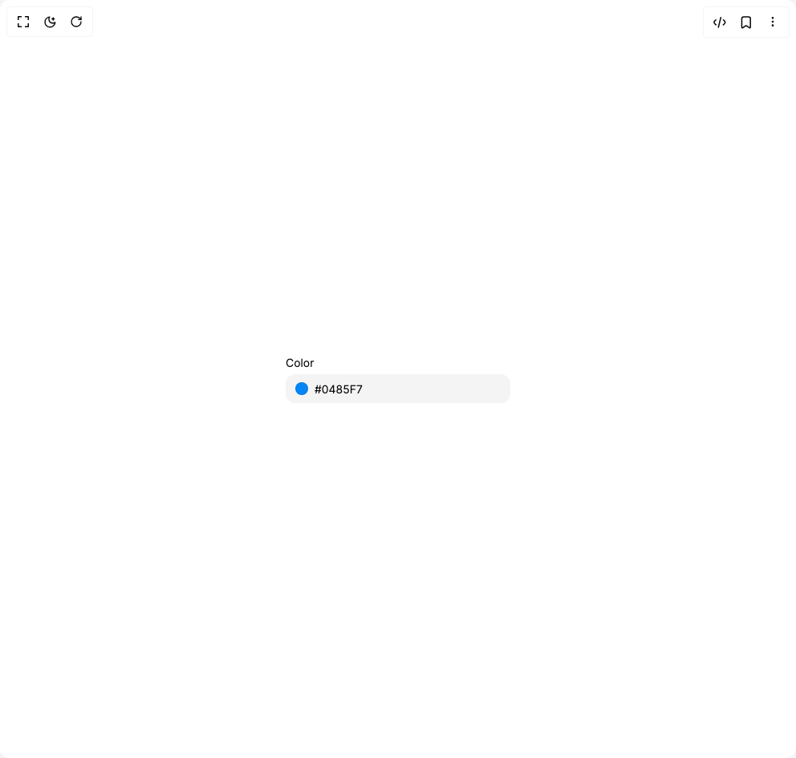

# Build Heroui Color Field in BuilderStudio

> Build this component in our Agentic IDE: [BuilderStudio](https://builderstudio.dev).
>
> Join the BuilderStudio community on [Discord](https://discord.gg/QdWeSGCqfe) and [Reddit](https://reddit.com/r/builderstudio).



## Component

- Author group: `hero_ui`
- Component: `heroui-color-field`
- Variant: `default`
- Rendered HTML snapshot: [`rendered.html`](rendered.html)

## BuilderStudio prompt

You are implementing a React component based on a component reference.

## Component identity

- Author: hero_ui
- Component slug: heroui-color-field
- Demo slug: default
- Title: heroui-color-field
- Description: 

## Goal

Recreate this component in a React + TypeScript + Tailwind CSS project. Preserve the visual layout, spacing, colors, border radius, shadows, interaction behavior, animation behavior, responsive behavior, and dark mode behavior shown in the rendered demo.

## Implementation requirements

- Use React and TypeScript.
- Use Tailwind CSS classes whenever possible.
- Keep the component self-contained unless the source files require helper components.
- If the source uses CSS variables, custom CSS, animations, or keyframes, include them.
- If the source uses external packages, list and use the required packages.
- Preserve accessibility attributes, button semantics, links, keyboard behavior, and ARIA attributes when visible in the source.
- Do not replace the component with a simplified placeholder.
- Return complete production-ready code.

## Dependencies

No reference metadata available.

## Rendered DOM snapshot

This is the rendered demo HTML extracted from the live preview. Use it to verify structure, class names, visible content, and layout.

```html
<div id="root"><div class="flex min-h-screen w-full items-center justify-center overflow-hidden bg-background p-8"><style>
      [data-slot="color-field"] {
        display: flex;
        flex-direction: column;
        gap: 4px;
        color: hsl(var(--foreground, 240 10% 96%));
      }
      [data-slot="color-field"][data-full-width="true"] { width: 100%; }
      [data-slot="color-field"][data-disabled="true"] { opacity: .5; }
      [data-slot="label"] {
        display: block;
        color: hsl(var(--foreground, 240 10% 96%));
        font-size: 14px;
        line-height: 20px;
        cursor: default;
      }
      [data-slot="label"][data-required="true"]::after {
        content: " *";
        color: rgb(244 63 94);
      }
      [data-slot="description"] {
        display: block;
        color: hsl(var(--muted-foreground, 240 5% 64%));
        font-size: 12px;
        line-height: 16px;
      }
      [data-slot="field-error"] {
        display: block;
        color: rgb(248 113 113);
        font-size: 12px;
        line-height: 16px;
        padding-inline: 4px;
      }
      [data-slot="color-input-group"] {
        display: flex;
        align-items: center;
        width: 100%;
        min-height: 36px;
        border-radius: 12px;
        background: hsl(var(--surface-input, 240 6% 10%));
        color: hsl(var(--foreground, 240 10% 96%));
        transition: background-color 150ms ease, box-shadow 150ms ease, outline-color 150ms ease;
      }
      [data-slot="color-input-group"][data-variant="secondary"] {
        background: hsl(var(--surface-secondary, 240 5% 14%));
      }
      [data-slot="color-field"][data-invalid="true"] [data-slot="color-input-group"] {
        box-shadow: 0 0 0 1px rgb(244 63 94 / .85);
      }
      [data-slot="color-field"]:focus-within [data-slot="color-input-group"] {
        box-shadow: 0 0 0 2px rgb(139 92 246 / .55);
      }
      [data-slot="color-field"][data-disabled="true"] [data-slot="color-input-group"] {
        cursor: not-allowed;
      }
      [data-slot="color-input-group-input"] {
        display: flex;
        min-width: 0;
        flex: 1 1 auto;
        height: 36px;
        border: 0;
        background: transparent;
        color: inherit;
        padding: 8px 12px;
        font-size: 14px;
        line-height: 20px;
        outline: none;
      }
      [data-slot="color-input-group-prefix"] {
        display: flex;
        align-items: center;
        margin-inline-start: 12px;
        color: hsl(var(--muted-foreground, 240 5% 64%));
      }
      [data-slot="color-input-group-prefix"] + [data-slot="color-input-group-input"] {
        padding-inline-start: 8px;
      }
      [data-slot="color-input-group-suffix"] {
        display: flex;
        align-items: center;
        margin-inline-end: 12px;
        color: hsl(var(--muted-foreground, 240 5% 64%));
      }
      [data-slot="color-swatch"] {
        display: block;
        forced-color-adjust: none;
        background: var(--color-swatch-current, transparent);
        box-shadow: inset 0 0 0 1px rgb(0 0 0 / .1);
      }
      [data-slot="color-swatch"][data-shape="circle"] { border-radius: 9999px; }
      [data-slot="color-swatch"][data-shape="square"] { border-radius: 6px; }
      [data-slot="color-swatch"][data-size="xs"] { width: 16px; height: 16px; }
      [data-slot="color-swatch"][data-size="sm"] { width: 20px; height: 20px; }
      [data-slot="color-swatch"][data-size="md"] { width: 28px; height: 28px; }
      [data-slot="color-swatch"][data-size="lg"] { width: 36px; height: 36px; }
      [data-slot="color-swatch"][data-size="xl"] { width: 44px; height: 44px; }
      [data-slot="surface"] {
        background: hsl(var(--surface-input, 240 6% 10%));
        color: hsl(var(--foreground, 240 10% 96%));
      }
      [data-slot="button"] {
        min-height: 32px;
        border-radius: 10px;
        padding: 6px 12px;
        font-size: 14px;
        line-height: 20px;
        transition: background-color 150ms ease, opacity 150ms ease, transform 150ms ease;
      }
      [data-slot="button"][data-variant="tertiary"] {
        background: hsl(var(--surface-input, 240 6% 10%));
        color: hsl(var(--foreground, 240 10% 96%));
      }
      [data-slot="button"][data-variant="primary"] {
        background: rgb(124 58 237);
        color: white;
      }
      [data-slot="button"]:not(:disabled):hover {
        background: hsl(var(--surface-secondary, 240 5% 18%));
      }
      [data-slot="button"]:not(:disabled):active { transform: scale(.97); }
      [data-slot="button"]:disabled { opacity: .5; cursor: not-allowed; }
      .light [data-slot="color-field"] {
        --foreground: 240 10% 4%;
        --muted-foreground: 240 4% 46%;
        --surface-input: 240 5% 96%;
        --surface-secondary: 240 5% 91%;
      }
      .dark [data-slot="color-field"],
      .dark [data-slot="surface"] {
        --foreground: 240 10% 96%;
        --muted-foreground: 240 5% 64%;
        --surface-input: 240 6% 10%;
        --surface-secondary: 240 5% 14%;
      }
      .light [data-slot="surface"] {
        --foreground: 240 10% 4%;
        --muted-foreground: 240 4% 46%;
        --surface-input: 240 5% 96%;
        --surface-secondary: 240 5% 91%;
      }
    </style><div class="color-field w-[280px]" data-slot="color-field"><label class="label" data-slot="label" for="_r_0_">Color</label><div role="presentation" class="color-input-group color-input-group--primary" data-slot="color-input-group" data-variant="primary"><div class="color-input-group__prefix" data-slot="color-input-group-prefix"><div aria-label="rgba(4, 134, 247, 1)" aria-roledescription="color swatch" class="color-swatch color-swatch--circle color-swatch--xs" data-shape="circle" data-size="xs" data-slot="color-swatch" role="img" style="--color-swatch-current: rgba(4, 134, 247, 1);"></div></div><input autocomplete="off" autocorrect="off" class="color-input-group__input" data-slot="color-input-group-input" id="_r_0_" inputmode="text" spellcheck="false" type="text" value="#0485F7" name="color"></div></div></div></div>
```

## Reference source files

No reference source files were available.
