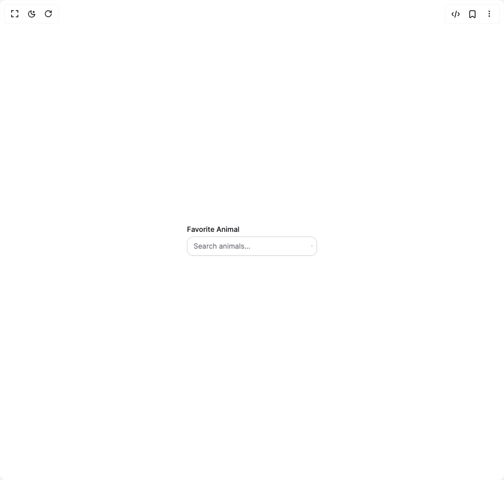

# Build Heroui Combo Box in BuilderStudio

> Build this component in our Agentic IDE: [BuilderStudio](https://builderstudio.dev).
>
> Join the BuilderStudio community on [Discord](https://discord.gg/QdWeSGCqfe) and [Reddit](https://reddit.com/r/builderstudio).



## Component

- Author group: `hero_ui`
- Component: `heroui-combo-box`
- Variant: `custom-indicator`
- Rendered HTML snapshot: [`rendered.html`](rendered.html)

## BuilderStudio prompt

You are implementing a React component based on a component reference.

## Component identity

- Author: hero_ui
- Component slug: heroui-combo-box
- Demo slug: custom-indicator
- Title: heroui-combo-box
- Description: 

## Goal

Recreate this component in a React + TypeScript + Tailwind CSS project. Preserve the visual layout, spacing, colors, border radius, shadows, interaction behavior, animation behavior, responsive behavior, and dark mode behavior shown in the rendered demo.

## Implementation requirements

- Use React and TypeScript.
- Use Tailwind CSS classes whenever possible.
- Keep the component self-contained unless the source files require helper components.
- If the source uses CSS variables, custom CSS, animations, or keyframes, include them.
- If the source uses external packages, list and use the required packages.
- Preserve accessibility attributes, button semantics, links, keyboard behavior, and ARIA attributes when visible in the source.
- Do not replace the component with a simplified placeholder.
- Return complete production-ready code.

## Dependencies

No reference metadata available.

## Rendered DOM snapshot

This is the rendered demo HTML extracted from the live preview. Use it to verify structure, class names, visible content, and layout.

```html
<div id="root"><div class="flex min-h-screen w-full items-center justify-center overflow-hidden bg-background p-8"><div class="combo-box w-[256px]" data-slot="combo-box"><style>
:root {
  --combo-background: #fff;
  --combo-foreground: #18181b;
  --combo-muted: #71717a;
  --combo-border: #d4d4d8;
  --combo-border-hover: #a1a1aa;
  --combo-field: #fff;
  --combo-field-hover: #fafafa;
  --combo-field-focus: #fff;
  --combo-placeholder: #71717a;
  --combo-default: #f4f4f5;
  --combo-default-hover: #e4e4e7;
  --combo-default-foreground: #3f3f46;
  --combo-overlay: #fff;
  --combo-surface: #fafafa;
  --combo-surface-foreground: #18181b;
  --combo-danger: #dc2626;
  --combo-focus: #2563eb;
  --combo-shadow-field: 0 1px 2px rgba(0,0,0,.04);
  --combo-shadow-overlay: 0 16px 40px rgba(0,0,0,.16), 0 2px 8px rgba(0,0,0,.08);
}
.dark {
  --combo-background: #09090b;
  --combo-foreground: #fafafa;
  --combo-muted: #a1a1aa;
  --combo-border: #3f3f46;
  --combo-border-hover: #52525b;
  --combo-field: #18181b;
  --combo-field-hover: #27272a;
  --combo-field-focus: #18181b;
  --combo-placeholder: #a1a1aa;
  --combo-default: #27272a;
  --combo-default-hover: #3f3f46;
  --combo-default-foreground: #e4e4e7;
  --combo-overlay: #18181b;
  --combo-surface: #18181b;
  --combo-surface-foreground: #fafafa;
  --combo-danger: #f87171;
  --combo-focus: #60a5fa;
  --combo-shadow-overlay: 0 18px 44px rgba(0,0,0,.55), 0 2px 8px rgba(0,0,0,.32);
}
.combo-box { position: relative; display: flex; flex-direction: column; gap: .25rem; color: var(--combo-foreground); overflow: visible; }
.combo-box--full-width { width: 100%; }
.combo-box [data-slot="label"] { width: fit-content; font-size: .875rem; line-height: 1.25rem; font-weight: 500; color: var(--combo-foreground); }
.combo-box [data-slot="description"] { padding-inline: .25rem; font-size: .875rem; line-height: 1.25rem; color: var(--combo-muted); }
.combo-box[data-invalid="true"] [data-slot="description"], .combo-box[aria-invalid="true"] [data-slot="description"] { display: none; }
.combo-box__input-group { position: relative; isolation: isolate; display: inline-flex; align-items: center; }
.combo-box__input-group--full-width { width: 100%; }
.input {
  width: 100%;
  min-width: 0;
  flex: 1 1 0%;
  border-radius: 12px;
  border: 1px solid var(--combo-border);
  background: var(--combo-field);
  color: var(--combo-foreground);
  box-shadow: var(--combo-shadow-field);
  outline: none;
  padding: .5rem .75rem;
  padding-inline-end: 1.75rem;
  font-size: .875rem;
  line-height: 1.25rem;
  transition: background-color 150ms ease, border-color 150ms ease, box-shadow 150ms ease;
}
.input::placeholder { color: var(--combo-placeholder); opacity: 1; }
.input:hover:not(:focus) { border-color: var(--combo-border-hover); background: var(--combo-field-hover); }
.input:focus, .input[data-focused="true"] { border-color: var(--combo-focus); background: var(--combo-field-focus); box-shadow: 0 0 0 3px color-mix(in srgb, var(--combo-focus) 22%, transparent); }
.input[data-invalid="true"] { border-color: var(--combo-danger); box-shadow: 0 0 0 3px color-mix(in srgb, var(--combo-danger) 18%, transparent); }
.input:disabled, .input[data-disabled="true"], .input[aria-disabled="true"] { cursor: not-allowed; opacity: .5; }
.input--secondary { box-shadow: none; background: var(--combo-default); }
.input--secondary:hover:not(:focus) { background: var(--combo-default-hover); }
.input--full-width { width: 100%; }
.combo-box__trigger {
  position: absolute;
  inset-inline-end: 0;
  top: 50%;
  display: flex;
  height: 100%;
  flex-shrink: 0;
  transform: translateY(-50%);
  cursor: pointer;
  align-items: center;
  justify-content: center;
  border: 0;
  background: transparent;
  color: var(--combo-placeholder);
  padding: 0 .5rem 0 0;
  outline: none;
  transition: color 150ms ease, opacity 150ms ease;
}
.combo-box__trigger:hover { color: var(--combo-foreground); }
.combo-box__trigger:focus-visible { border-radius: .25rem; box-shadow: 0 0 0 2px var(--combo-focus), 0 0 0 4px var(--combo-background); }
.combo-box__trigger[data-pressed="true"] { opacity: .7; }
.combo-box__trigger:disabled, .combo-box__trigger[data-disabled="true"], .combo-box__trigger[aria-disabled="true"] { cursor: not-allowed; opacity: .5; }
.combo-box__trigger [data-slot="combo-box-trigger-default-icon"] { width: 1rem; height: 1rem; transition: transform 150ms ease; }
.combo-box__trigger[data-open="true"] [data-slot="combo-box-trigger-default-icon"] { transform: rotate(180deg); }
.combo-box__popover {
  position: absolute;
  z-index: 50;
  top: calc(100% + .25rem);
  inset-inline-start: 0;
  width: max(100%, 256px);
  min-width: var(--trigger-width, 100%);
  max-height: min(320px, calc(100vh - 2rem));
  overflow-y: auto;
  overscroll-behavior: contain;
  border-radius: min(32px, 1.5rem);
  background: var(--combo-overlay);
  color: var(--combo-foreground);
  box-shadow: var(--combo-shadow-overlay);
  padding: 0;
  font-size: .875rem;
  line-height: 1.25rem;
  transform-origin: top;
  animation: combo-popover-in 150ms ease both;
}
@keyframes combo-popover-in { from { opacity: 0; transform: translateY(-4px) scale(.95); } to { opacity: 1; transform: translateY(0) scale(1); } }
.list-box { position: relative; display: flex; width: 100%; flex-direction: column; gap: .25rem; overflow: clip; padding: .375rem; outline: none; }
.list-box-item {
  position: relative;
  display: flex;
  min-height: 2.25rem;
  width: 100%;
  cursor: pointer;
  align-items: center;
  justify-content: flex-start;
  gap: .75rem;
  border: 0;
  border-radius: 1rem;
  background: transparent;
  color: var(--combo-foreground);
  padding: .375rem 2rem .375rem .625rem;
  text-align: start;
  outline: none;
  transition: transform 250ms cubic-bezier(.16,1,.3,1), box-shadow 150ms ease, background-color 150ms ease;
}
.list-box-item:hover, .list-box-item[data-highlighted="true"] { background: var(--combo-default); }
.list-box-item:active, .list-box-item[data-pressed="true"] { transform: scale(.98); }
.list-box-item:focus-visible, .list-box-item[data-focus-visible="true"] { box-shadow: 0 0 0 2px var(--combo-focus); }
.list-box-item[data-disabled="true"] { cursor: not-allowed; opacity: .5; }
.list-box-item__indicator { position: absolute; inset-inline-end: .5rem; top: 50%; display: flex; width: 1rem; height: 1rem; flex-shrink: 0; transform: translateY(-50%); align-items: center; justify-content: center; color: var(--combo-default-foreground); transition: opacity 250ms ease; opacity: 0; }
.list-box-item__indicator[data-visible="true"] { opacity: 1; }
.list-box-item__indicator [data-slot="list-box-item-indicator--checkmark"] { width: .625rem; height: .625rem; transition: stroke-dashoffset 250ms linear; }
.list-box-section { display: flex; flex-direction: column; align-items: stretch; gap: 0; }
.list-box-header { padding: .375rem .625rem .25rem; font-size: .75rem; line-height: 1rem; font-weight: 500; color: var(--combo-muted); }
.separator { height: 1px; width: 94%; margin: .25rem 3%; border: 0; background: var(--combo-border); }
.field-error { height: 0; overflow: hidden; padding-inline: .25rem; color: var(--combo-danger); font-size: .75rem; line-height: 1rem; opacity: 0; transition: opacity 150ms ease, height 350ms ease; }
.field-error[data-visible="true"] { height: auto; opacity: 1; }
.button { position: relative; display: inline-flex; height: 2.5rem; width: fit-content; align-items: center; justify-content: center; gap: .5rem; border: 0; border-radius: 1.5rem; background: var(--combo-default); color: var(--combo-default-foreground); padding: 0 1rem; font-size: .875rem; font-weight: 500; outline: none; transition: transform 250ms ease, background-color 100ms ease, box-shadow 100ms ease; }
.button:hover { background: var(--combo-default-hover); }
.button:active { transform: scale(.97); }
.button:focus-visible { box-shadow: 0 0 0 2px var(--combo-focus); }
.surface { position: relative; color: var(--combo-surface-foreground); background: var(--combo-surface); }
.combo-avatar { width: 2rem; height: 2rem; overflow: hidden; border-radius: 9999px; background: var(--combo-default); color: var(--combo-default-foreground); display: inline-flex; align-items: center; justify-content: center; font-size: .75rem; font-weight: 500; }
.combo-avatar img { width: 100%; height: 100%; object-fit: cover; }
</style><label data-slot="label">Favorite Animal</label><div class="combo-box__input-group" data-slot="combo-box-input-group"><input aria-autocomplete="list" aria-expanded="false" class="input" data-slot="input" placeholder="Search animals..." role="combobox" value=""><button aria-label="Toggle suggestions" class="combo-box__trigger size-3" data-slot="combo-box-trigger" type="button"><svg fill="currentColor" height="16" viewBox="0 0 16 16" width="16"><path d="M8 1.7a.8.8 0 0 1 .57.24l3.2 3.2a.8.8 0 1 1-1.14 1.12L8 3.63 5.37 6.26a.8.8 0 1 1-1.14-1.13l3.2-3.2A.8.8 0 0 1 8 1.7Zm0 12.6a.8.8 0 0 1-.57-.24l-3.2-3.2a.8.8 0 1 1 1.14-1.12L8 12.37l2.63-2.63a.8.8 0 1 1 1.14 1.13l-3.2 3.2A.8.8 0 0 1 8 14.3Z"></path></svg></button></div><input type="hidden" value=""></div></div></div>
```

## Reference source files

No reference source files were available.
