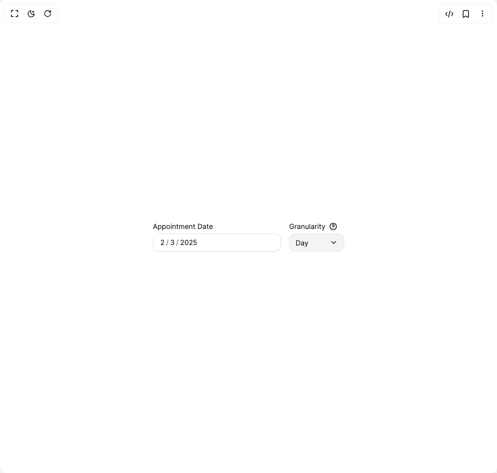

# Build Heroui Date Field in BuilderStudio

> Build this component in our Agentic IDE: [BuilderStudio](https://builderstudio.dev).
>
> Join the BuilderStudio community on [Discord](https://discord.gg/QdWeSGCqfe) and [Reddit](https://reddit.com/r/builderstudio).



## Component

- Author group: `hero_ui`
- Component: `heroui-date-field`
- Variant: `granularity`
- Rendered HTML snapshot: [`rendered.html`](rendered.html)

## BuilderStudio prompt

You are implementing a React component based on a component reference.

## Component identity

- Author: hero_ui
- Component slug: heroui-date-field
- Demo slug: granularity
- Title: heroui-date-field
- Description: 

## Goal

Recreate this component in a React + TypeScript + Tailwind CSS project. Preserve the visual layout, spacing, colors, border radius, shadows, interaction behavior, animation behavior, responsive behavior, and dark mode behavior shown in the rendered demo.

## Implementation requirements

- Use React and TypeScript.
- Use Tailwind CSS classes whenever possible.
- Keep the component self-contained unless the source files require helper components.
- If the source uses CSS variables, custom CSS, animations, or keyframes, include them.
- If the source uses external packages, list and use the required packages.
- Preserve accessibility attributes, button semantics, links, keyboard behavior, and ARIA attributes when visible in the source.
- Do not replace the component with a simplified placeholder.
- Return complete production-ready code.

## Dependencies

No reference metadata available.

## Rendered DOM snapshot

This is the rendered demo HTML extracted from the live preview. Use it to verify structure, class names, visible content, and layout.

```html
<div id="root"><div class="flex min-h-screen w-full items-center justify-center overflow-hidden bg-background p-8"><div class="flex gap-4"><style>
      [data-slot="date-field"] {
        display: flex;
        flex-direction: column;
        gap: 4px;
        color: hsl(var(--foreground, 240 10% 96%));
      }
      [data-slot="date-field"][data-full-width="true"] { width: 100%; }
      [data-slot="date-field"][data-disabled="true"] { opacity: .5; }
      [data-slot="date-field"][data-invalid="true"] [data-slot="description"] { display: none; }
      [data-slot="label"] {
        display: block;
        width: fit-content;
        color: hsl(var(--foreground, 240 10% 96%));
        font-size: 14px;
        line-height: 20px;
        cursor: default;
      }
      [data-slot="label"][data-required="true"]::after {
        content: " *";
        color: rgb(244 63 94);
      }
      [data-slot="description"] {
        display: block;
        color: hsl(var(--muted-foreground, 240 5% 64%));
        font-size: 12px;
        line-height: 16px;
        padding-inline: 4px;
      }
      [data-slot="field-error"] {
        display: block;
        color: rgb(248 113 113);
        font-size: 12px;
        line-height: 16px;
        padding-inline: 4px;
      }
      [data-slot="date-input-group"] {
        display: inline-flex;
        align-items: center;
        height: 36px;
        overflow: visible;
        border-radius: 12px;
        border: 1px solid hsl(var(--border, 240 4% 24%));
        background: hsl(var(--field, 240 6% 10%));
        color: hsl(var(--foreground, 240 10% 96%));
        box-shadow: 0 1px 2px rgb(0 0 0 / .28);
        outline: none;
        transition: background-color 150ms cubic-bezier(.4,0,.2,1), border-color 150ms cubic-bezier(.4,0,.2,1), box-shadow 150ms cubic-bezier(0,0,.2,1);
      }
      [data-slot="date-input-group"][data-full-width="true"] { width: 100%; }
      [data-slot="date-input-group"][data-variant="secondary"] {
        box-shadow: none;
        background: hsl(var(--default, 240 5% 14%));
      }
      [data-slot="date-input-group"]:hover:not(:focus-within) {
        background: hsl(var(--field-hover, 240 5% 13%));
        border-color: hsl(var(--border, 240 4% 30%));
      }
      [data-slot="date-input-group"]:focus-within {
        border-color: rgb(139 92 246 / .65);
        box-shadow: 0 0 0 3px rgb(139 92 246 / .2);
      }
      [data-slot="date-input-group"][data-invalid="true"] {
        border-color: rgb(244 63 94);
        background: hsl(var(--field-focus, 240 5% 12%));
        box-shadow: 0 0 0 1px rgb(244 63 94 / .65);
      }
      [data-slot="date-input-group"][data-disabled="true"] {
        pointer-events: none;
        opacity: .5;
      }
      [data-slot="date-input-group-input"] {
        display: flex;
        flex: 1 1 auto;
        align-items: center;
        gap: 1px;
        min-width: 0;
        height: 100%;
        padding: 8px 12px;
        border: 0;
        background: transparent;
        font-size: 14px;
        line-height: 20px;
        outline: none;
        cursor: text;
      }
      [data-slot="date-input-group"]:has([data-slot="date-input-group-prefix"]) [data-slot="date-input-group-input"] { padding-left: 8px; }
      [data-slot="date-input-group"]:has([data-slot="date-input-group-suffix"]) [data-slot="date-input-group-input"] { padding-right: 8px; }
      [data-slot="date-input-group-segment"] {
        display: inline-block;
        border-radius: 6px;
        padding-inline: 2px;
        white-space: nowrap;
        text-align: end;
        outline: none;
      }
      [data-slot="date-input-group-segment"][data-type="literal"] {
        padding-inline: 0;
        color: hsl(var(--muted-foreground, 240 5% 64%));
      }
      [data-slot="date-input-group-segment"][data-placeholder="true"] {
        color: hsl(var(--field-placeholder, 240 5% 56%));
      }
      [data-slot="date-input-group-segment"]:focus,
      [data-slot="date-input-group-segment"][data-focused="true"] {
        background: oklab(0.62039 -0.0543154 -0.187265 / 0.15);
        color: oklab(0.497363 -0.0375369 -0.132786);
      }
      [data-slot="date-input-group-segment"][data-invalid="true"] {
        color: rgb(248 113 113);
      }
      [data-slot="date-input-group-segment"][data-invalid="true"]:focus {
        background: rgb(244 63 94 / .18);
        color: rgb(254 202 202);
      }
      [data-slot="date-input-group-prefix"] {
        pointer-events: none;
        flex-shrink: 0;
        margin-left: 12px;
        margin-right: 0;
        display: flex;
        align-items: center;
        color: hsl(var(--field-placeholder, 240 5% 56%));
      }
      [data-slot="date-input-group-suffix"] {
        pointer-events: none;
        flex-shrink: 0;
        margin-right: 12px;
        display: flex;
        align-items: center;
        color: hsl(var(--field-placeholder, 240 5% 56%));
      }
      [data-slot="surface"] {
        border-radius: 16px;
        border: 1px solid hsl(var(--border, 240 4% 22%));
        background: hsl(var(--surface, 240 5% 9%));
        box-shadow: 0 10px 30px rgb(0 0 0 / .28);
      }
      [data-slot="button"] {
        display: inline-flex;
        align-items: center;
        justify-content: center;
        height: 36px;
        border-radius: 10px;
        padding-inline: 14px;
        border: 1px solid hsl(var(--border, 240 4% 24%));
        background: hsl(var(--default, 240 5% 14%));
        color: hsl(var(--foreground, 240 10% 96%));
        font-size: 14px;
        line-height: 20px;
        transition: transform 120ms ease, background-color 150ms ease, border-color 150ms ease;
      }
      [data-slot="button"]:hover:not(:disabled) { background: hsl(var(--default-hover, 240 4% 18%)); }
      [data-slot="button"]:active:not(:disabled) { transform: scale(.98); }
      [data-slot="button"]:focus-visible { outline: 2px solid rgb(139 92 246 / .7); outline-offset: 2px; }
      [data-slot="button"]:disabled { opacity: .45; cursor: not-allowed; }
      [data-slot="select"] { position: relative; display: flex; flex-direction: column; gap: 4px; }
      [data-slot="select-trigger"] {
        display: inline-flex;
        align-items: center;
        justify-content: space-between;
        gap: 8px;
        height: 36px;
        border-radius: 12px;
        border: 1px solid hsl(var(--border, 240 4% 24%));
        background: hsl(var(--default, 240 5% 14%));
        color: hsl(var(--foreground, 240 10% 96%));
        padding-inline: 12px;
        font-size: 14px;
        outline: none;
      }
      [data-slot="select-trigger"]:focus-visible { box-shadow: 0 0 0 3px rgb(139 92 246 / .2); border-color: rgb(139 92 246 / .65); }
      [data-slot="select-popover"] {
        position: absolute;
        z-index: 20;
        top: calc(100% + 6px);
        left: 0;
        width: 132px;
        border-radius: 12px;
        border: 1px solid hsl(var(--border, 240 4% 24%));
        background: hsl(var(--popover, 240 6% 10%));
        padding: 4px;
        box-shadow: 0 12px 32px rgb(0 0 0 / .4);
      }
      [data-slot="list-box"] { display: flex; flex-direction: column; gap: 2px; }
      [data-slot="list-box-item"] {
        display: flex;
        align-items: center;
        justify-content: space-between;
        min-height: 32px;
        border-radius: 8px;
        padding-inline: 8px;
        color: hsl(var(--foreground, 240 10% 96%));
        font-size: 14px;
        outline: none;
      }
      [data-slot="list-box-item"][data-focused="true"],
      [data-slot="list-box-item"]:hover { background: hsl(var(--accent, 262 83% 58%) / .16); }
      [data-slot="tooltip"] { position: relative; display: inline-flex; }
      [data-slot="tooltip-content"] {
        position: absolute;
        top: calc(100% + 7px);
        left: 0;
        z-index: 30;
        width: 250px;
        border-radius: 12px;
        border: 1px solid hsl(var(--border, 240 4% 24%));
        background: hsl(var(--popover, 240 6% 10%));
        color: hsl(var(--foreground, 240 10% 96%));
        padding: 10px 12px;
        font-size: 12px;
        line-height: 18px;
        box-shadow: 0 12px 32px rgb(0 0 0 / .38);
      }
      .light [data-slot="date-field"], .light [data-slot="label"] { color: hsl(var(--foreground, 240 10% 4%)); }
      .light [data-slot="description"],
      .light [data-slot="date-input-group-segment"][data-type="literal"],
      .light [data-slot="date-input-group-prefix"],
      .light [data-slot="date-input-group-suffix"] { color: hsl(var(--muted-foreground, 240 4% 46%)); }
      .light [data-slot="date-input-group"] {
        background: hsl(var(--field, 0 0% 100%));
        color: hsl(var(--foreground, 240 10% 4%));
        border-color: hsl(var(--border, 240 6% 90%));
        box-shadow: 0 1px 2px rgb(0 0 0 / .06);
      }
      .light [data-slot="date-input-group"]:hover:not(:focus-within) { background: hsl(var(--field-hover, 240 5% 96%)); }
      .light [data-slot="date-input-group"][data-variant="secondary"],
      .light [data-slot="select-trigger"],
      .light [data-slot="button"] { background: hsl(var(--default, 240 5% 96%)); color: hsl(var(--foreground, 240 10% 4%)); border-color: hsl(var(--border, 240 6% 90%)); }
      .light [data-slot="surface"],
      .light [data-slot="select-popover"],
      .light [data-slot="tooltip-content"] { background: hsl(var(--surface, 0 0% 100%)); color: hsl(var(--foreground, 240 10% 4%)); border-color: hsl(var(--border, 240 6% 90%)); box-shadow: 0 10px 30px rgb(0 0 0 / .08); }
    </style><div class="date-field w-[256px]" data-slot="date-field" role="group"><label data-slot="label">Appointment Date</label><div class="date-input-group date-input-group--primary" data-slot="date-input-group" data-variant="primary"><div aria-label="granularity-date" class="date-input-group__input" data-slot="date-input-group-input" role="presentation"><span aria-label="month" aria-valuetext="2" class="date-input-group__segment" data-slot="date-input-group-segment" data-type="month" role="spinbutton" tabindex="0">2</span><span class="date-input-group__segment" data-slot="date-input-group-segment" data-type="literal">/</span><span aria-label="day" aria-valuetext="3" class="date-input-group__segment" data-slot="date-input-group-segment" data-type="day" role="spinbutton" tabindex="0">3</span><span class="date-input-group__segment" data-slot="date-input-group-segment" data-type="literal">/</span><span aria-label="year" aria-valuetext="2025" class="date-input-group__segment" data-slot="date-input-group-segment" data-type="year" role="spinbutton" tabindex="0">2025</span><input readonly="" type="hidden" value="2025-02-03" name="granularity-date"></div></div></div><div class="flex flex-col gap-1"><div class="flex items-center gap-2"><label data-slot="label">Granularity</label><div data-slot="tooltip"><button class="inline-flex items-center justify-center" type="button" aria-label="Granularity information"><svg aria-hidden="true" class="size-4 text-muted" fill="none" height="16" viewBox="0 0 16 16" width="16"><path d="M8 14.5A6.5 6.5 0 1 0 8 1.5a6.5 6.5 0 0 0 0 13Z" stroke="currentColor" stroke-width="1.5"></path><path d="M6.4 6.2A1.8 1.8 0 1 1 8.2 8c-.7.35-.7.8-.7 1.2M7.5 11.5h.01" stroke="currentColor" stroke-linecap="round" stroke-linejoin="round" stroke-width="1.5"></path></svg></button></div></div><div class="w-[110px]" data-slot="select" placeholder="Select granularity" variant="secondary"><button aria-expanded="false" aria-haspopup="listbox" data-slot="select-trigger" type="button"><span>Day</span><svg aria-hidden="true" class="size-4 text-muted" fill="none" height="16" viewBox="0 0 16 16" width="16"><path d="m4 6 4 4 4-4" stroke="currentColor" stroke-linecap="round" stroke-linejoin="round" stroke-width="1.5"></path></svg></button></div></div></div></div></div>
```

## Reference source files

No reference source files were available.
