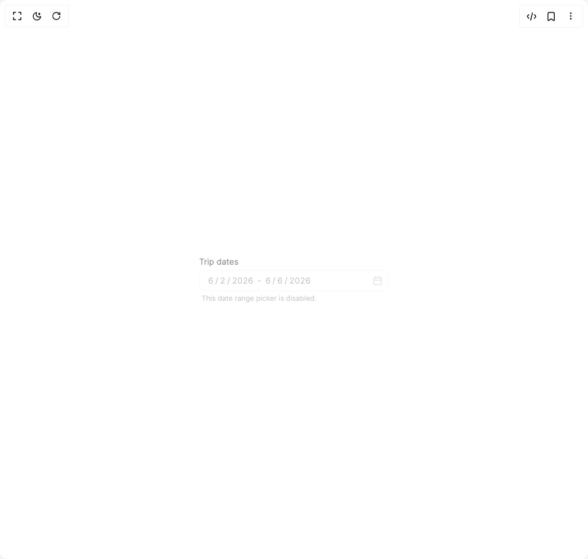

# Build Heroui Date Range Picker in BuilderStudio

> Build this component in our Agentic IDE: [BuilderStudio](https://builderstudio.dev).
>
> Join the BuilderStudio community on [Discord](https://discord.gg/QdWeSGCqfe) and [Reddit](https://reddit.com/r/builderstudio).



## Component

- Author group: `hero_ui`
- Component: `heroui-date-range-picker`
- Variant: `disabled`
- Rendered HTML snapshot: [`rendered.html`](rendered.html)

## BuilderStudio prompt

You are implementing a React component based on a component reference.

## Component identity

- Author: hero_ui
- Component slug: heroui-date-range-picker
- Demo slug: disabled
- Title: heroui-date-range-picker
- Description: 

## Goal

Recreate this component in a React + TypeScript + Tailwind CSS project. Preserve the visual layout, spacing, colors, border radius, shadows, interaction behavior, animation behavior, responsive behavior, and dark mode behavior shown in the rendered demo.

## Implementation requirements

- Use React and TypeScript.
- Use Tailwind CSS classes whenever possible.
- Keep the component self-contained unless the source files require helper components.
- If the source uses CSS variables, custom CSS, animations, or keyframes, include them.
- If the source uses external packages, list and use the required packages.
- Preserve accessibility attributes, button semantics, links, keyboard behavior, and ARIA attributes when visible in the source.
- Do not replace the component with a simplified placeholder.
- Return complete production-ready code.

## Dependencies

No reference metadata available.

## Rendered DOM snapshot

This is the rendered demo HTML extracted from the live preview. Use it to verify structure, class names, visible content, and layout.

```html
<div id="root"><div class="flex min-h-screen w-full items-center justify-center overflow-hidden bg-background p-8"><div data-slot="date-range-picker" class="date-range-picker w-80" data-disabled="true"><style>
      .date-range-picker,.date-range-picker *{box-sizing:border-box}
      .date-range-picker{position:relative;display:inline-flex;flex-direction:column;gap:4px;color:hsl(var(--foreground,240 10% 96%));font-family:Inter,ui-sans-serif,system-ui,sans-serif;overflow:visible}
      .date-range-picker[data-open=true]{z-index:80}
      .date-range-picker.w-80{width:20rem}.date-range-picker.min-w-96{min-width:24rem;width:fit-content}.date-range-picker[data-disabled=true]{opacity:.5}
      .label{display:block;width:fit-content;color:hsl(var(--foreground,240 10% 96%));font-size:14px;line-height:20px;font-weight:400;cursor:default}
      .label[data-required=true]::after{content:" *";color:rgb(244 63 94)}
      .description{display:block;color:hsl(var(--muted-foreground,240 5% 64%));font-size:12px;line-height:16px;padding-inline:4px}
      .field-error{display:block;color:rgb(248 113 113);font-size:12px;line-height:16px;padding-inline:4px}
      .date-input-group{display:inline-flex;align-items:center;width:100%;height:36px;overflow:visible;border-radius:12px;border:1px solid hsl(var(--border,240 4% 24%));background:hsl(var(--field,240 6% 10%));color:hsl(var(--foreground,240 10% 96%));box-shadow:0 1px 2px rgb(0 0 0 / .28);outline:none;transition:background-color 150ms cubic-bezier(.4,0,.2,1),border-color 150ms cubic-bezier(.4,0,.2,1),box-shadow 150ms cubic-bezier(0,0,.2,1)}
      .date-input-group:hover:not(:focus-within){background:hsl(var(--field-hover,240 5% 13%));border-color:hsl(var(--border,240 4% 30%))}
      .date-input-group:focus-within{border-color:rgb(139 92 246 / .65);box-shadow:0 0 0 3px rgb(139 92 246 / .2)}
      .date-input-group[aria-invalid=true]{border-color:rgb(244 63 94);background:hsl(var(--field-focus,240 5% 12%));box-shadow:0 0 0 1px rgb(244 63 94 / .65)}
      .date-input-group[aria-disabled=true]{pointer-events:none;opacity:.5}
      .date-input-group__input{display:flex;flex:1 1 auto;align-items:center;gap:1px;min-width:0;height:100%;padding:8px 8px 8px 12px;border:0;background:transparent;font-size:14px;line-height:20px;white-space:nowrap;unicode-bidi:isolate}
      .date-range-picker__input{display:inline-flex;align-items:center;gap:1px;min-width:0}
      .date-input-group__segment{display:inline-block;min-width:1ch;border-radius:6px;padding:0 2px;color:inherit;text-align:end;outline:none;caret-color:transparent;font-variant-numeric:tabular-nums}
      .date-input-group__segment[data-placeholder=true]{color:hsl(var(--muted-foreground,240 5% 64%))}
      .date-input-group__segment:focus,.date-input-group__segment[data-focused=true]{background:oklab(0.62039 -0.0543154 -0.187265 / .15);color:oklab(0.497363 -0.0375369 -0.132786)}
      .date-input-group__literal,.date-range-picker__separator{color:inherit;white-space:pre}
      .date-input-group__suffix{pointer-events:none;display:flex;align-items:center;flex-shrink:0;margin-right:6px;color:hsl(var(--muted-foreground,240 5% 64%))}
      .date-range-picker__trigger{pointer-events:auto;display:inline-flex;width:24px;height:24px;align-items:center;justify-content:center;border:0;border-radius:8px;background:transparent;color:inherit;padding:0;cursor:pointer;transition:background-color 150ms ease,color 150ms ease}
      .date-range-picker__trigger:hover{background:hsl(var(--default,240 5% 18%));color:hsl(var(--foreground,240 10% 96%))}
      .date-range-picker__trigger:focus-visible{outline:2px solid rgb(139 92 246);outline-offset:2px}
      .date-range-picker__trigger-indicator{display:inline-flex;width:16px;height:16px;align-items:center;justify-content:center}.date-range-picker__trigger-indicator svg{width:16px;height:16px}
      .date-range-picker__popover{position:absolute;top:calc(100% + 6px);left:0;z-index:100;width:100%;min-width:256px;border-radius:14px;border:1px solid hsl(var(--border,240 4% 24%));background:hsl(var(--popover,240 6% 10%));color:hsl(var(--popover-foreground,240 10% 96%));box-shadow:0 12px 28px rgb(0 0 0 / .38),0 2px 8px rgb(0 0 0 / .24);padding:12px}
      .calendar{display:flex;flex-direction:column;gap:12px;width:100%;min-width:232px}
      .calendar__header{display:flex;align-items:center;gap:4px}
      .calendar-year-picker__trigger{display:inline-flex;height:28px;align-items:center;gap:4px;border:0;border-radius:8px;background:transparent;color:inherit;padding:0 8px;font-size:14px;font-weight:500}
      .calendar-year-picker__trigger:hover,.calendar__nav-button:hover{background:hsl(var(--default,240 5% 18%))}
      .calendar-year-picker__trigger-indicator{display:inline-flex;color:hsl(var(--muted-foreground,240 5% 64%))}
      .calendar__nav-button{margin-left:auto;display:inline-flex;width:28px;height:28px;align-items:center;justify-content:center;border:0;border-radius:8px;background:transparent;color:inherit;font-size:20px;line-height:1}.calendar__nav-button + .calendar__nav-button{margin-left:0}
      .calendar__grid{width:100%;border-collapse:separate;border-spacing:0 3px;table-layout:fixed}
      .calendar__header-cell{height:28px;color:hsl(var(--muted-foreground,240 5% 64%));font-size:12px;font-weight:500;text-align:center}
      .calendar__cell{display:inline-flex;width:30px;height:30px;align-items:center;justify-content:center;border:0;border-radius:999px;background:transparent;color:inherit;font-size:13px;line-height:1;cursor:pointer;transition:background-color 120ms ease,color 120ms ease,transform 120ms ease}
      .calendar__cell:hover{background:hsl(var(--default,240 5% 18%))}
      .calendar__cell[data-in-range=true]{border-radius:8px;background:rgb(139 92 246 / .16);color:rgb(196 181 253)}
      .calendar__cell[data-selected=true]{background:rgb(124 58 237);color:white;font-weight:600}
      .calendar__cell[data-outside-month=true]{color:hsl(var(--muted-foreground,240 5% 64%) / .45)}
      .calendar-year-picker__year-grid{position:absolute;inset:48px 12px 12px;display:grid;grid-template-columns:repeat(4,minmax(0,1fr));gap:6px;overflow:auto;border-radius:12px;background:hsl(var(--popover,240 6% 10%));padding:8px}
      .calendar-year-picker__year-cell{height:30px;border:0;border-radius:8px;background:transparent;color:inherit;font-size:13px}.calendar-year-picker__year-cell[data-selected=true]{background:rgb(124 58 237);color:white}
      .button{display:inline-flex;height:36px;align-items:center;justify-content:center;border:0;border-radius:12px;padding:0 14px;font-size:14px;font-weight:500;cursor:pointer;transition:background-color 150ms ease,transform 120ms ease}.button:active{transform:scale(.98)}
      .button--primary{background:rgb(124 58 237);color:white}.button--primary:hover{background:rgb(109 40 217)}.button--secondary{background:hsl(var(--default,240 5% 18%));color:hsl(var(--foreground,240 10% 96%))}.button--secondary:hover{background:hsl(var(--default,240 5% 22%))}
      html:not(.dark) .date-range-picker{color:hsl(var(--foreground,240 10% 3.9%))}
      html:not(.dark) .label{color:hsl(var(--foreground,240 10% 3.9%))}
      html:not(.dark) .date-input-group{background:#fff;border-color:hsl(var(--border,240 5.9% 90%));color:hsl(var(--foreground,240 10% 3.9%));box-shadow:0 1px 2px rgb(0 0 0 / .04)}
      html:not(.dark) .date-input-group:hover:not(:focus-within){background:#fafafa;border-color:hsl(var(--border,240 5.9% 84%))}
      html:not(.dark) .date-range-picker__popover{background:#fff;border-color:hsl(var(--border,240 5.9% 90%));color:hsl(var(--foreground,240 10% 3.9%));box-shadow:0 12px 28px rgb(0 0 0 / .12),0 2px 8px rgb(0 0 0 / .08)}
      html:not(.dark) .date-range-picker__trigger:hover,html:not(.dark) .calendar-year-picker__trigger:hover,html:not(.dark) .calendar__nav-button:hover,html:not(.dark) .calendar__cell:hover,html:not(.dark) .button--secondary{background:#f4f4f5;color:#18181b}
      html:not(.dark) .calendar-year-picker__year-grid{background:#fff}
    </style><span class="label" data-slot="label">Trip dates</span><div aria-disabled="true" class="date-input-group" data-slot="date-input-group" role="group"><div class="date-input-group__input" data-slot="date-input-group-input"><span data-slot="date-range-start-input" class="date-range-picker__input"><span data-slot="date-input-group-segment" class="date-input-group__segment" role="spinbutton" aria-label="month, ">6</span><span class="date-input-group__literal">/</span><span data-slot="date-input-group-segment" class="date-input-group__segment" role="spinbutton" aria-label="day, ">2</span><span class="date-input-group__literal">/</span><span data-slot="date-input-group-segment" class="date-input-group__segment" role="spinbutton" aria-label="year, ">2026</span></span><span data-slot="date-range-picker-range-separator" class="date-range-picker__separator"> - </span><span data-slot="date-range-end-input" class="date-range-picker__input"><span data-slot="date-input-group-segment" class="date-input-group__segment" role="spinbutton" aria-label="month, ">6</span><span class="date-input-group__literal">/</span><span data-slot="date-input-group-segment" class="date-input-group__segment" role="spinbutton" aria-label="day, ">6</span><span class="date-input-group__literal">/</span><span data-slot="date-input-group-segment" class="date-input-group__segment" role="spinbutton" aria-label="year, ">2026</span></span></div><input hidden="" readonly="" value="2026-06-02" name="start"><input hidden="" readonly="" value="2026-06-06" name="end"><div class="date-input-group__suffix" data-slot="date-input-group-suffix"><button aria-expanded="false" aria-haspopup="dialog" aria-label="Calendar" class="date-range-picker__trigger" data-slot="date-range-picker-trigger" disabled="" type="button"><span aria-hidden="true" class="date-range-picker__trigger-indicator" data-slot="date-range-picker-trigger-indicator"><svg aria-hidden="true" fill="none" height="1em" role="presentation" viewBox="0 0 13 14" width="1em" xmlns="http://www.w3.org/2000/svg"><path clip-rule="evenodd" d="M3.75 4.5A.75.75 0 0 1 3 3.75v-.748a1.5 1.5 0 0 0-1.5 1.5v1h10v-1a1.5 1.5 0 0 0-1.5-1.5v.75a.75.75 0 1 1-1.5 0v-.75h-4v.747a.75.75 0 0 1-.75.75ZM8.5 1.501h-4V.75a.75.75 0 0 0-1.5 0v.752a3 3 0 0 0-3 3v6a3 3 0 0 0 3 3h7a3 3 0 0 0 3-3v-6a3 3 0 0 0-3-3v-.75a.75.75 0 0 0-1.5 0v.75Zm-7 5.5v3.5a1.5 1.5 0 0 0 1.5 1.5h7a1.5 1.5 0 0 0 1.5-1.5v-3.5h-10Z" fill="currentColor" fill-rule="evenodd"></path></svg></span></button></div></div><span class="description" data-slot="description">This date range picker is disabled.</span></div></div></div>
```

## Reference source files

No reference source files were available.
