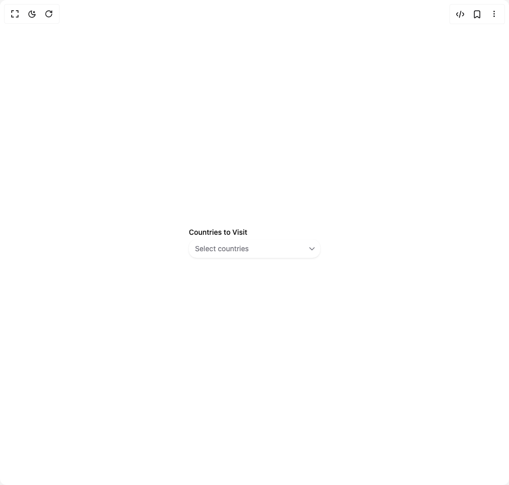

# Build Heroui Select in BuilderStudio

> Build this component in our Agentic IDE: [BuilderStudio](https://builderstudio.dev).
>
> Join the BuilderStudio community on [Discord](https://discord.gg/QdWeSGCqfe) and [Reddit](https://reddit.com/r/builderstudio).



## Component

- Author group: `hero_ui`
- Component: `heroui-select`
- Variant: `multiple`
- Rendered HTML snapshot: [`rendered.html`](rendered.html)

## BuilderStudio prompt

You are implementing a React component based on a component reference.

## Component identity

- Author: hero_ui
- Component slug: heroui-select
- Demo slug: multiple
- Title: heroui-select
- Description: 

## Goal

Recreate this component in a React + TypeScript + Tailwind CSS project. Preserve the visual layout, spacing, colors, border radius, shadows, interaction behavior, animation behavior, responsive behavior, and dark mode behavior shown in the rendered demo.

## Implementation requirements

- Use React and TypeScript.
- Use Tailwind CSS classes whenever possible.
- Keep the component self-contained unless the source files require helper components.
- If the source uses CSS variables, custom CSS, animations, or keyframes, include them.
- If the source uses external packages, list and use the required packages.
- Preserve accessibility attributes, button semantics, links, keyboard behavior, and ARIA attributes when visible in the source.
- Do not replace the component with a simplified placeholder.
- Return complete production-ready code.

## Dependencies

No reference metadata available.

## Rendered DOM snapshot

This is the rendered demo HTML extracted from the live preview. Use it to verify structure, class names, visible content, and layout.

```html
<div id="root"><div class="w-screen min-h-screen flex justify-center items-center"><div class="w-screen min-h-screen flex justify-center items-center"><div class="flex min-h-[320px] w-full items-center justify-center p-8"><template></template><div data-slot="select" class="select select--primary w-[256px]" data-rac=""><span class="label" id="react-aria2564934513-«r3»" data-slot="label">Countries to Visit</span><button id="react-aria2564934513-«r2»" data-slot="select-trigger" class="select__trigger" data-rac="" type="button" tabindex="0" data-react-aria-pressable="true" aria-labelledby="react-aria2564934513-«r7» react-aria2564934513-«r3»" aria-haspopup="listbox" aria-expanded="false"><span id="react-aria2564934513-«r7»" data-slot="select-value" class="select__value" data-rac="" data-placeholder="true">Select countries</span><svg aria-hidden="true" aria-label="Chevron down icon" fill="none" height="16" role="presentation" viewBox="0 0 16 16" width="16" xmlns="http://www.w3.org/2000/svg" class="select__indicator" data-slot="select-default-indicator"><path clip-rule="evenodd" d="M2.97 5.47a.75.75 0 0 1 1.06 0L8 9.44l3.97-3.97a.75.75 0 1 1 1.06 1.06l-4.5 4.5a.75.75 0 0 1-1.06 0l-4.5-4.5a.75.75 0 0 1 0-1.06" fill="currentColor" fill-rule="evenodd"></path></svg></button><div aria-hidden="true" data-react-aria-prevent-focus="true" data-a11y-ignore="aria-hidden-focus" data-testid="hidden-select-container" style="border: 0px; clip: rect(0px, 0px, 0px, 0px); clip-path: inset(50%); height: 1px; margin: -1px; overflow: hidden; padding: 0px; position: fixed; width: 1px; white-space: nowrap; top: 0px; left: 0px;"><label><select multiple="" tabindex="-1" title=""><option value="" label="&nbsp;">&nbsp;</option><option value="argentina">Argentina</option><option value="venezuela">Venezuela</option><option value="japan">Japan</option><option value="france">France</option><option value="italy">Italy</option><option value="spain">Spain</option><option value="thailand">Thailand</option><option value="new-zealand">New Zealand</option><option value="iceland">Iceland</option></select></label></div></div></div></div></div></div>
```

## Reference source files

No reference source files were available.
