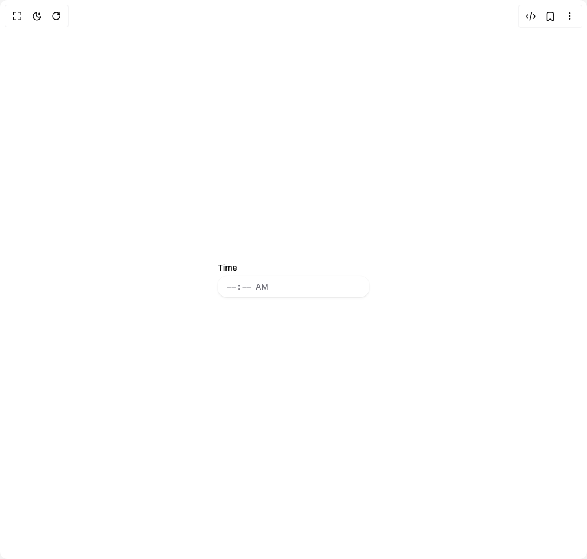

# Build Heroui Time Field in BuilderStudio

> Build this component in our Agentic IDE: [BuilderStudio](https://builderstudio.dev).
>
> Join the BuilderStudio community on [Discord](https://discord.gg/QdWeSGCqfe) and [Reddit](https://reddit.com/r/builderstudio).



## Component

- Author group: `hero_ui`
- Component: `heroui-time-field`
- Variant: `default`
- Rendered HTML snapshot: [`rendered.html`](rendered.html)

## BuilderStudio prompt

You are implementing a React component based on a component reference.

## Component identity

- Author: hero_ui
- Component slug: heroui-time-field
- Demo slug: default
- Title: heroui-time-field
- Description: 

## Goal

Recreate this component in a React + TypeScript + Tailwind CSS project. Preserve the visual layout, spacing, colors, border radius, shadows, interaction behavior, animation behavior, responsive behavior, and dark mode behavior shown in the rendered demo.

## Implementation requirements

- Use React and TypeScript.
- Use Tailwind CSS classes whenever possible.
- Keep the component self-contained unless the source files require helper components.
- If the source uses CSS variables, custom CSS, animations, or keyframes, include them.
- If the source uses external packages, list and use the required packages.
- Preserve accessibility attributes, button semantics, links, keyboard behavior, and ARIA attributes when visible in the source.
- Do not replace the component with a simplified placeholder.
- Return complete production-ready code.

## Dependencies

No reference metadata available.

## Rendered DOM snapshot

This is the rendered demo HTML extracted from the live preview. Use it to verify structure, class names, visible content, and layout.

```html
<div id="root"><div class="w-screen min-h-screen flex justify-center items-center"><div class="w-screen min-h-screen flex justify-center items-center"><div class="flex min-h-[320px] w-full items-center justify-center p-8"><div data-slot="time-field" class="time-field w-[256px]" data-rac=""><span class="label" id="react-aria2916535759-«r1»" data-slot="label">Time</span><div id="react-aria2916535759-«r0»" aria-labelledby="react-aria2916535759-«r1»" role="group" data-react-aria-pressable="true" class="date-input-group date-input-group--primary" data-slot="date-input-group" data-rac="" style="unicode-bidi: isolate;"><div id="react-aria2916535759-«r0»" aria-labelledby="react-aria2916535759-«r1»" role="group" data-react-aria-pressable="true" class="date-input-group__input" data-slot="date-input-group-input" data-rac="" style="unicode-bidi: isolate;"><span data-slot="date-input-group-segment" aria-hidden="true" class="date-input-group__segment" data-rac="" data-type="literal">⁦</span><span data-slot="date-input-group-segment" role="spinbutton" aria-valuetext="Empty" aria-valuemin="1" aria-valuemax="12" id="react-aria2916535759-«r7»" aria-label="hour, " aria-labelledby="react-aria2916535759-«r7» react-aria2916535759-«r1»" data-placeholder="true" contenteditable="true" spellcheck="false" autocorrect="off" enterkeyhint="next" inputmode="numeric" tabindex="0" class="date-input-group__segment" data-rac="" data-type="hour" style="caret-color: transparent;">––</span><span data-slot="date-input-group-segment" aria-hidden="true" class="date-input-group__segment" data-rac="" data-type="literal">:</span><span data-slot="date-input-group-segment" role="spinbutton" aria-valuetext="Empty" aria-valuemin="0" aria-valuemax="59" id="react-aria2916535759-«rb»" aria-label="minute, " aria-labelledby="react-aria2916535759-«rb» react-aria2916535759-«r1»" data-placeholder="true" contenteditable="true" spellcheck="false" autocorrect="off" enterkeyhint="next" inputmode="numeric" tabindex="0" class="date-input-group__segment" data-rac="" data-type="minute" style="caret-color: transparent;">––</span><span data-slot="date-input-group-segment" aria-hidden="true" class="date-input-group__segment" data-rac="" data-type="literal">⁩</span><span data-slot="date-input-group-segment" aria-hidden="true" class="date-input-group__segment" data-rac="" data-type="literal"> </span><span data-slot="date-input-group-segment" role="spinbutton" aria-valuetext="Empty" aria-valuemin="0" aria-valuemax="1" id="react-aria2916535759-«rh»" aria-label="AM/PM, " aria-labelledby="react-aria2916535759-«rh» react-aria2916535759-«r1»" data-placeholder="true" contenteditable="true" spellcheck="false" autocorrect="off" enterkeyhint="next" tabindex="0" class="date-input-group__segment" data-rac="" data-type="dayPeriod" style="caret-color: transparent;">AM</span></div><input hidden="" class="" data-rac="" type="text" value="" name="time" title=""></div></div></div></div></div></div>
```

## Reference source files

No reference source files were available.
