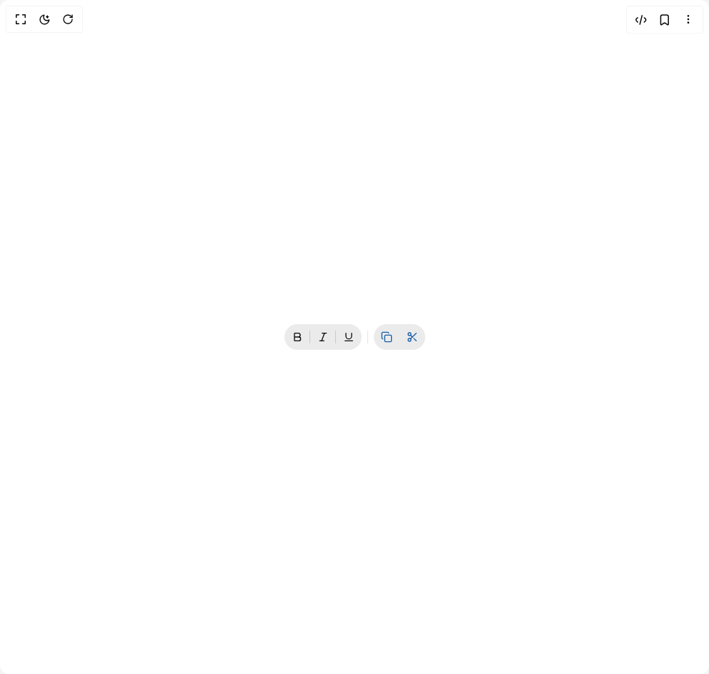

# Build Heroui Toolbar in BuilderStudio

> Build this component in our Agentic IDE: [BuilderStudio](https://builderstudio.dev).
>
> Join the BuilderStudio community on [Discord](https://discord.gg/QdWeSGCqfe) and [Reddit](https://reddit.com/r/builderstudio).



## Component

- Author group: `hero_ui`
- Component: `heroui-toolbar`
- Variant: `default`
- Rendered HTML snapshot: [`rendered.html`](rendered.html)

## BuilderStudio prompt

You are implementing a React component based on a component reference.

## Component identity

- Author: hero_ui
- Component slug: heroui-toolbar
- Demo slug: default
- Title: heroui-toolbar
- Description: 

## Goal

Recreate this component in a React + TypeScript + Tailwind CSS project. Preserve the visual layout, spacing, colors, border radius, shadows, interaction behavior, animation behavior, responsive behavior, and dark mode behavior shown in the rendered demo.

## Implementation requirements

- Use React and TypeScript.
- Use Tailwind CSS classes whenever possible.
- Keep the component self-contained unless the source files require helper components.
- If the source uses CSS variables, custom CSS, animations, or keyframes, include them.
- If the source uses external packages, list and use the required packages.
- Preserve accessibility attributes, button semantics, links, keyboard behavior, and ARIA attributes when visible in the source.
- Do not replace the component with a simplified placeholder.
- Return complete production-ready code.

## Dependencies

No reference metadata available.

## Rendered DOM snapshot

This is the rendered demo HTML extracted from the live preview. Use it to verify structure, class names, visible content, and layout.

```html
<div id="root"><div class="w-screen min-h-screen flex justify-center items-center"><div class="w-screen min-h-screen flex justify-center items-center"><div data-slot="toolbar" class="toolbar toolbar--horizontal" data-rac="" aria-label="Text formatting" role="toolbar" aria-orientation="horizontal" data-orientation="horizontal"><div data-slot="toggle-button-group" class="toggle-button-group toggle-button-group--horizontal" data-rac="" aria-label="Text style" role="group" aria-orientation="horizontal" data-orientation="horizontal"><button data-slot="toggle-button" class="toggle-button toggle-button--icon-only toggle-button--md toggle-button--default" data-rac="" type="button" tabindex="0" data-react-aria-pressable="true" aria-label="Bold" aria-pressed="false"><svg xmlns="http://www.w3.org/2000/svg" width="24" height="24" viewBox="0 0 24 24" fill="none" stroke="currentColor" stroke-width="2" stroke-linecap="round" stroke-linejoin="round" class="lucide lucide-bold size-4" aria-hidden="true"><path d="M6 12h9a4 4 0 0 1 0 8H7a1 1 0 0 1-1-1V5a1 1 0 0 1 1-1h7a4 4 0 0 1 0 8"></path></svg></button><button data-slot="toggle-button" class="toggle-button toggle-button--icon-only toggle-button--md toggle-button--default" data-rac="" type="button" tabindex="0" data-react-aria-pressable="true" aria-label="Italic" aria-pressed="false"><span aria-hidden="true" class="toggle-button-group__separator" data-slot="toggle-button-group-separator"></span><svg xmlns="http://www.w3.org/2000/svg" width="24" height="24" viewBox="0 0 24 24" fill="none" stroke="currentColor" stroke-width="2" stroke-linecap="round" stroke-linejoin="round" class="lucide lucide-italic size-4" aria-hidden="true"><line x1="19" x2="10" y1="4" y2="4"></line><line x1="14" x2="5" y1="20" y2="20"></line><line x1="15" x2="9" y1="4" y2="20"></line></svg></button><button data-slot="toggle-button" class="toggle-button toggle-button--icon-only toggle-button--md toggle-button--default" data-rac="" type="button" tabindex="0" data-react-aria-pressable="true" aria-label="Underline" aria-pressed="false"><span aria-hidden="true" class="toggle-button-group__separator" data-slot="toggle-button-group-separator"></span><svg xmlns="http://www.w3.org/2000/svg" width="24" height="24" viewBox="0 0 24 24" fill="none" stroke="currentColor" stroke-width="2" stroke-linecap="round" stroke-linejoin="round" class="lucide lucide-underline size-4" aria-hidden="true"><path d="M6 4v6a6 6 0 0 0 12 0V4"></path><line x1="4" x2="20" y1="20" y2="20"></line></svg></button></div><div data-orientation="vertical" data-slot="separator" role="separator" aria-orientation="vertical" class="separator separator--vertical separator--default"></div><div class="button-group button-group--horizontal" data-slot="button-group" data-rac="" role="group"><button data-slot="button" class="button button--icon-only button--md button--secondary" data-rac="" type="button" tabindex="0" data-react-aria-pressable="true" aria-label="Copy" id="react-aria1762216800-«r0»"><svg xmlns="http://www.w3.org/2000/svg" width="24" height="24" viewBox="0 0 24 24" fill="none" stroke="currentColor" stroke-width="2" stroke-linecap="round" stroke-linejoin="round" class="lucide lucide-copy size-4" aria-hidden="true"><rect width="14" height="14" x="8" y="8" rx="2" ry="2"></rect><path d="M4 16c-1.1 0-2-.9-2-2V4c0-1.1.9-2 2-2h10c1.1 0 2 .9 2 2"></path></svg></button><span aria-hidden="true" class="button-group__separator" data-slot="button-group-separator"></span><button data-slot="button" class="button button--icon-only button--md button--secondary" data-rac="" type="button" tabindex="0" data-react-aria-pressable="true" aria-label="Cut" id="react-aria1762216800-«r2»"><svg xmlns="http://www.w3.org/2000/svg" width="24" height="24" viewBox="0 0 24 24" fill="none" stroke="currentColor" stroke-width="2" stroke-linecap="round" stroke-linejoin="round" class="lucide lucide-scissors size-4" aria-hidden="true"><circle cx="6" cy="6" r="3"></circle><path d="M8.12 8.12 12 12"></path><path d="M20 4 8.12 15.88"></path><circle cx="6" cy="18" r="3"></circle><path d="M14.8 14.8 20 20"></path></svg></button></div></div></div></div></div>
```

## Reference source files

No reference source files were available.
