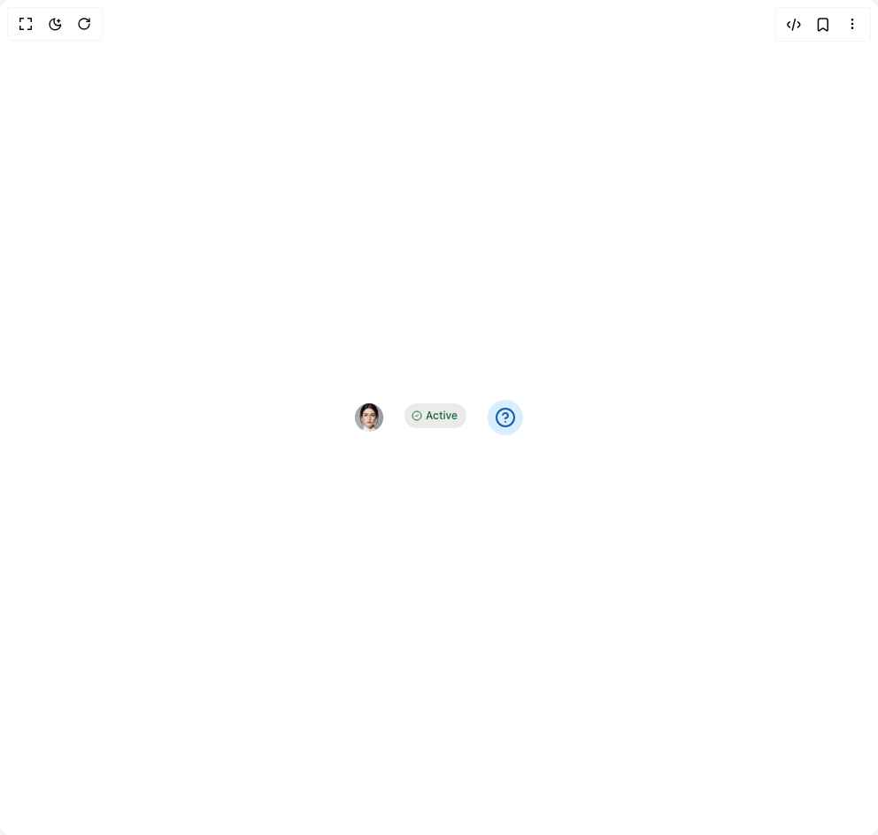

# Build Heroui Tooltip in BuilderStudio

> Build this component in our Agentic IDE: [BuilderStudio](https://builderstudio.dev).
>
> Join the BuilderStudio community on [Discord](https://discord.gg/QdWeSGCqfe) and [Reddit](https://reddit.com/r/builderstudio).



## Component

- Author group: `hero_ui`
- Component: `heroui-tooltip`
- Variant: `custom-trigger`
- Rendered HTML snapshot: [`rendered.html`](rendered.html)

## BuilderStudio prompt

You are implementing a React component based on a component reference.

## Component identity

- Author: hero_ui
- Component slug: heroui-tooltip
- Demo slug: custom-trigger
- Title: heroui-tooltip
- Description: 

## Goal

Recreate this component in a React + TypeScript + Tailwind CSS project. Preserve the visual layout, spacing, colors, border radius, shadows, interaction behavior, animation behavior, responsive behavior, and dark mode behavior shown in the rendered demo.

## Implementation requirements

- Use React and TypeScript.
- Use Tailwind CSS classes whenever possible.
- Keep the component self-contained unless the source files require helper components.
- If the source uses CSS variables, custom CSS, animations, or keyframes, include them.
- If the source uses external packages, list and use the required packages.
- Preserve accessibility attributes, button semantics, links, keyboard behavior, and ARIA attributes when visible in the source.
- Do not replace the component with a simplified placeholder.
- Return complete production-ready code.

## Dependencies

No reference metadata available.

## Rendered DOM snapshot

This is the rendered demo HTML extracted from the live preview. Use it to verify structure, class names, visible content, and layout.

```html
<div id="root"><div class="w-screen min-h-screen flex justify-center items-center"><div class="w-screen min-h-screen flex justify-center items-center"><div class="flex items-center justify-center gap-6 p-12"><div class="tooltip__trigger" data-slot="tooltip-trigger" role="button" tabindex="0" aria-label="User avatar"><span class="avatar avatar--sm"></span></div><div class="tooltip__trigger" data-slot="tooltip-trigger" role="button" tabindex="0" aria-label="Status chip"><span class="chip chip--success chip--secondary" data-slot="chip"><svg xmlns="http://www.w3.org/2000/svg" width="12" height="24" viewBox="0 0 24 24" fill="none" stroke="currentColor" stroke-width="2" stroke-linecap="round" stroke-linejoin="round" class="lucide lucide-circle-check" aria-hidden="true"><circle cx="12" cy="12" r="10"></circle><path d="m9 12 2 2 4-4"></path></svg><span class="chip__label" data-slot="chip-label">Active</span></span></div><div class="tooltip__trigger" data-slot="tooltip-trigger" role="button" tabindex="0" aria-label="Info icon"><div class="rounded-full bg-accent-soft p-2"><svg xmlns="http://www.w3.org/2000/svg" width="24" height="24" viewBox="0 0 24 24" fill="none" stroke="currentColor" stroke-width="2" stroke-linecap="round" stroke-linejoin="round" class="lucide lucide-circle-help text-accent-soft-foreground" aria-hidden="true"><circle cx="12" cy="12" r="10"></circle><path d="M9.09 9a3 3 0 0 1 5.83 1c0 2-3 3-3 3"></path><path d="M12 17h.01"></path></svg></div></div></div></div></div></div>
```

## Reference source files

No reference source files were available.
