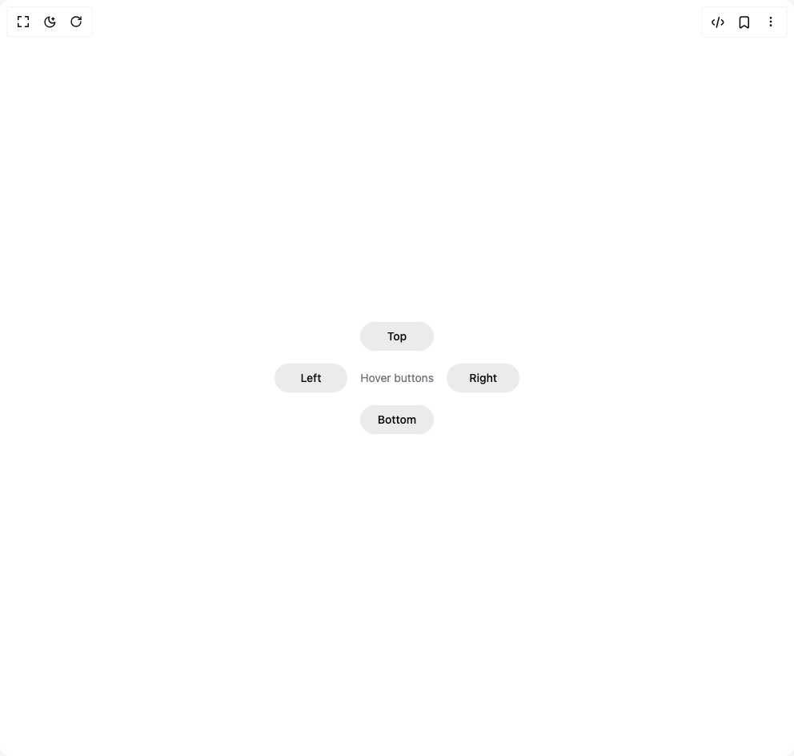

# Build Heroui Tooltip in BuilderStudio

> Build this component in our Agentic IDE: [BuilderStudio](https://builderstudio.dev).
>
> Join the BuilderStudio community on [Discord](https://discord.gg/QdWeSGCqfe) and [Reddit](https://reddit.com/r/builderstudio).



## Component

- Author group: `hero_ui`
- Component: `heroui-tooltip`
- Variant: `placement`
- Rendered HTML snapshot: [`rendered.html`](rendered.html)

## BuilderStudio prompt

You are implementing a React component based on a component reference.

## Component identity

- Author: hero_ui
- Component slug: heroui-tooltip
- Demo slug: placement
- Title: heroui-tooltip
- Description: 

## Goal

Recreate this component in a React + TypeScript + Tailwind CSS project. Preserve the visual layout, spacing, colors, border radius, shadows, interaction behavior, animation behavior, responsive behavior, and dark mode behavior shown in the rendered demo.

## Implementation requirements

- Use React and TypeScript.
- Use Tailwind CSS classes whenever possible.
- Keep the component self-contained unless the source files require helper components.
- If the source uses CSS variables, custom CSS, animations, or keyframes, include them.
- If the source uses external packages, list and use the required packages.
- Preserve accessibility attributes, button semantics, links, keyboard behavior, and ARIA attributes when visible in the source.
- Do not replace the component with a simplified placeholder.
- Return complete production-ready code.

## Dependencies

No reference metadata available.

## Rendered DOM snapshot

This is the rendered demo HTML extracted from the live preview. Use it to verify structure, class names, visible content, and layout.

```html
<div id="root"><div class="w-screen min-h-screen flex justify-center items-center"><div class="w-screen min-h-screen flex justify-center items-center"><div class="grid grid-cols-3 gap-4 p-12"><div></div><button data-slot="button" class="button button--md button--tertiary w-full" data-rac="" type="button" tabindex="0" data-react-aria-pressable="true" id="react-aria4492992703-«r1»">Top</button><div></div><button data-slot="button" class="button button--md button--tertiary w-full" data-rac="" type="button" tabindex="0" data-react-aria-pressable="true" id="react-aria4492992703-«r4»">Left</button><div class="flex items-center justify-center"><span class="text-sm text-muted">Hover buttons</span></div><button data-slot="button" class="button button--md button--tertiary w-full" data-rac="" type="button" tabindex="0" data-react-aria-pressable="true" id="react-aria4492992703-«r7»">Right</button><div></div><button data-slot="button" class="button button--md button--tertiary w-full" data-rac="" type="button" tabindex="0" data-react-aria-pressable="true" id="react-aria4492992703-«ra»">Bottom</button><div></div></div></div></div></div>
```

## Reference source files

No reference source files were available.
