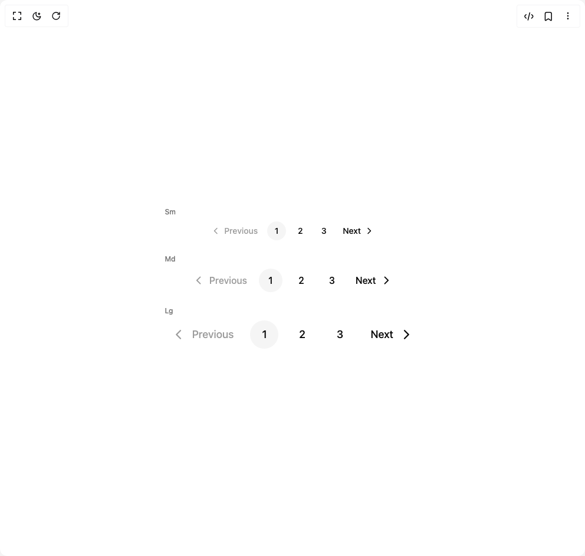

# Build The Pagination in BuilderStudio

> Build this component in our Agentic IDE: [BuilderStudio](https://builderstudio.dev).
>
> Join the BuilderStudio community on [Discord](https://discord.gg/QdWeSGCqfe) and [Reddit](https://reddit.com/r/builderstudio).



## Component

- Author group: `hero_ui`
- Component: `the-pagination`
- Variant: `sizes`
- Rendered HTML snapshot: [`rendered.html`](rendered.html)

## BuilderStudio prompt

You are implementing a React component based on a component reference.

## Component identity

- Author: hero_ui
- Component slug: the-pagination
- Demo slug: sizes
- Title: the-pagination
- Description: 

## Goal

Recreate this component in a React + TypeScript + Tailwind CSS project. Preserve the visual layout, spacing, colors, border radius, shadows, interaction behavior, animation behavior, responsive behavior, and dark mode behavior shown in the rendered demo.

## Implementation requirements

- Use React and TypeScript.
- Use Tailwind CSS classes whenever possible.
- Keep the component self-contained unless the source files require helper components.
- If the source uses CSS variables, custom CSS, animations, or keyframes, include them.
- If the source uses external packages, list and use the required packages.
- Preserve accessibility attributes, button semantics, links, keyboard behavior, and ARIA attributes when visible in the source.
- Do not replace the component with a simplified placeholder.
- Return complete production-ready code.

## Dependencies

No reference metadata available.

## Rendered DOM snapshot

This is the rendered demo HTML extracted from the live preview. Use it to verify structure, class names, visible content, and layout.

```html
<div id="root"><div class="w-screen min-h-screen flex justify-center items-center"><div class="w-screen min-h-screen flex justify-center items-center"><div class="flex flex-col gap-6"><div class="flex flex-col gap-2"><span class="text-xs font-medium text-muted capitalize">sm</span><nav aria-label="pagination" data-slot="pagination" role="navigation" class="pagination pagination--sm justify-center"><ul class="pagination__content" data-slot="pagination-content"><li class="pagination__item" data-slot="pagination-item"><button data-slot="pagination-previous" class="pagination__link pagination__link--nav" data-rac="" type="button" disabled="" data-react-aria-pressable="true" id="react-aria1405570793-«r0»" data-disabled="true"><span aria-hidden="true" data-slot="pagination-previous-icon"><svg aria-hidden="true" aria-label="Chevron left icon" fill="none" height="16" role="presentation" viewBox="0 0 16 16" width="16" xmlns="http://www.w3.org/2000/svg"><path clip-rule="evenodd" d="M10.53 2.97a.75.75 0 0 1 0 1.06L6.56 8l3.97 3.97a.75.75 0 1 1-1.06 1.06l-4.5-4.5a.75.75 0 0 1 0-1.06l4.5-4.5a.75.75 0 0 1 1.06 0" fill="currentColor" fill-rule="evenodd"></path></svg></span><span>Previous</span></button></li><li class="pagination__item" data-slot="pagination-item"><button data-active="true" data-slot="pagination-link" class="pagination__link" data-rac="" type="button" tabindex="0" data-react-aria-pressable="true" aria-current="page" id="react-aria1405570793-«r2»">1</button></li><li class="pagination__item" data-slot="pagination-item"><button data-slot="pagination-link" class="pagination__link" data-rac="" type="button" tabindex="0" data-react-aria-pressable="true" id="react-aria1405570793-«r4»">2</button></li><li class="pagination__item" data-slot="pagination-item"><button data-slot="pagination-link" class="pagination__link" data-rac="" type="button" tabindex="0" data-react-aria-pressable="true" id="react-aria1405570793-«r6»">3</button></li><li class="pagination__item" data-slot="pagination-item"><button data-slot="pagination-next" class="pagination__link pagination__link--nav" data-rac="" type="button" tabindex="0" data-react-aria-pressable="true" id="react-aria1405570793-«r8»"><span>Next</span><span aria-hidden="true" data-slot="pagination-next-icon"><svg aria-hidden="true" aria-label="Chevron right icon" fill="none" height="16" role="presentation" viewBox="0 0 16 16" width="16" xmlns="http://www.w3.org/2000/svg"><path clip-rule="evenodd" d="M5.47 2.97a.75.75 0 0 1 1.06 0l4.5 4.5a.75.75 0 0 1 0 1.06l-4.5 4.5a.75.75 0 1 1-1.06-1.06L9.44 8 5.47 4.03a.75.75 0 0 1 0-1.06Z" fill="currentColor" fill-rule="evenodd"></path></svg></span></button></li></ul></nav></div><div class="flex flex-col gap-2"><span class="text-xs font-medium text-muted capitalize">md</span><nav aria-label="pagination" data-slot="pagination" role="navigation" class="pagination pagination--md justify-center"><ul class="pagination__content" data-slot="pagination-content"><li class="pagination__item" data-slot="pagination-item"><button data-slot="pagination-previous" class="pagination__link pagination__link--nav" data-rac="" type="button" disabled="" data-react-aria-pressable="true" id="react-aria1405570793-«ra»" data-disabled="true"><span aria-hidden="true" data-slot="pagination-previous-icon"><svg aria-hidden="true" aria-label="Chevron left icon" fill="none" height="16" role="presentation" viewBox="0 0 16 16" width="16" xmlns="http://www.w3.org/2000/svg"><path clip-rule="evenodd" d="M10.53 2.97a.75.75 0 0 1 0 1.06L6.56 8l3.97 3.97a.75.75 0 1 1-1.06 1.06l-4.5-4.5a.75.75 0 0 1 0-1.06l4.5-4.5a.75.75 0 0 1 1.06 0" fill="currentColor" fill-rule="evenodd"></path></svg></span><span>Previous</span></button></li><li class="pagination__item" data-slot="pagination-item"><button data-active="true" data-slot="pagination-link" class="pagination__link" data-rac="" type="button" tabindex="0" data-react-aria-pressable="true" aria-current="page" id="react-aria1405570793-«rc»">1</button></li><li class="pagination__item" data-slot="pagination-item"><button data-slot="pagination-link" class="pagination__link" data-rac="" type="button" tabindex="0" data-react-aria-pressable="true" id="react-aria1405570793-«re»">2</button></li><li class="pagination__item" data-slot="pagination-item"><button data-slot="pagination-link" class="pagination__link" data-rac="" type="button" tabindex="0" data-react-aria-pressable="true" id="react-aria1405570793-«rg»">3</button></li><li class="pagination__item" data-slot="pagination-item"><button data-slot="pagination-next" class="pagination__link pagination__link--nav" data-rac="" type="button" tabindex="0" data-react-aria-pressable="true" id="react-aria1405570793-«ri»"><span>Next</span><span aria-hidden="true" data-slot="pagination-next-icon"><svg aria-hidden="true" aria-label="Chevron right icon" fill="none" height="16" role="presentation" viewBox="0 0 16 16" width="16" xmlns="http://www.w3.org/2000/svg"><path clip-rule="evenodd" d="M5.47 2.97a.75.75 0 0 1 1.06 0l4.5 4.5a.75.75 0 0 1 0 1.06l-4.5 4.5a.75.75 0 1 1-1.06-1.06L9.44 8 5.47 4.03a.75.75 0 0 1 0-1.06Z" fill="currentColor" fill-rule="evenodd"></path></svg></span></button></li></ul></nav></div><div class="flex flex-col gap-2"><span class="text-xs font-medium text-muted capitalize">lg</span><nav aria-label="pagination" data-slot="pagination" role="navigation" class="pagination pagination--lg justify-center"><ul class="pagination__content" data-slot="pagination-content"><li class="pagination__item" data-slot="pagination-item"><button data-slot="pagination-previous" class="pagination__link pagination__link--nav" data-rac="" type="button" disabled="" data-react-aria-pressable="true" id="react-aria1405570793-«rk»" data-disabled="true"><span aria-hidden="true" data-slot="pagination-previous-icon"><svg aria-hidden="true" aria-label="Chevron left icon" fill="none" height="16" role="presentation" viewBox="0 0 16 16" width="16" xmlns="http://www.w3.org/2000/svg"><path clip-rule="evenodd" d="M10.53 2.97a.75.75 0 0 1 0 1.06L6.56 8l3.97 3.97a.75.75 0 1 1-1.06 1.06l-4.5-4.5a.75.75 0 0 1 0-1.06l4.5-4.5a.75.75 0 0 1 1.06 0" fill="currentColor" fill-rule="evenodd"></path></svg></span><span>Previous</span></button></li><li class="pagination__item" data-slot="pagination-item"><button data-active="true" data-slot="pagination-link" class="pagination__link" data-rac="" type="button" tabindex="0" data-react-aria-pressable="true" aria-current="page" id="react-aria1405570793-«rm»">1</button></li><li class="pagination__item" data-slot="pagination-item"><button data-slot="pagination-link" class="pagination__link" data-rac="" type="button" tabindex="0" data-react-aria-pressable="true" id="react-aria1405570793-«ro»">2</button></li><li class="pagination__item" data-slot="pagination-item"><button data-slot="pagination-link" class="pagination__link" data-rac="" type="button" tabindex="0" data-react-aria-pressable="true" id="react-aria1405570793-«rq»">3</button></li><li class="pagination__item" data-slot="pagination-item"><button data-slot="pagination-next" class="pagination__link pagination__link--nav" data-rac="" type="button" tabindex="0" data-react-aria-pressable="true" id="react-aria1405570793-«rs»"><span>Next</span><span aria-hidden="true" data-slot="pagination-next-icon"><svg aria-hidden="true" aria-label="Chevron right icon" fill="none" height="16" role="presentation" viewBox="0 0 16 16" width="16" xmlns="http://www.w3.org/2000/svg"><path clip-rule="evenodd" d="M5.47 2.97a.75.75 0 0 1 1.06 0l4.5 4.5a.75.75 0 0 1 0 1.06l-4.5 4.5a.75.75 0 1 1-1.06-1.06L9.44 8 5.47 4.03a.75.75 0 0 1 0-1.06Z" fill="currentColor" fill-rule="evenodd"></path></svg></span></button></li></ul></nav></div></div></div></div></div>
```

## Reference source files

No reference source files were available.
