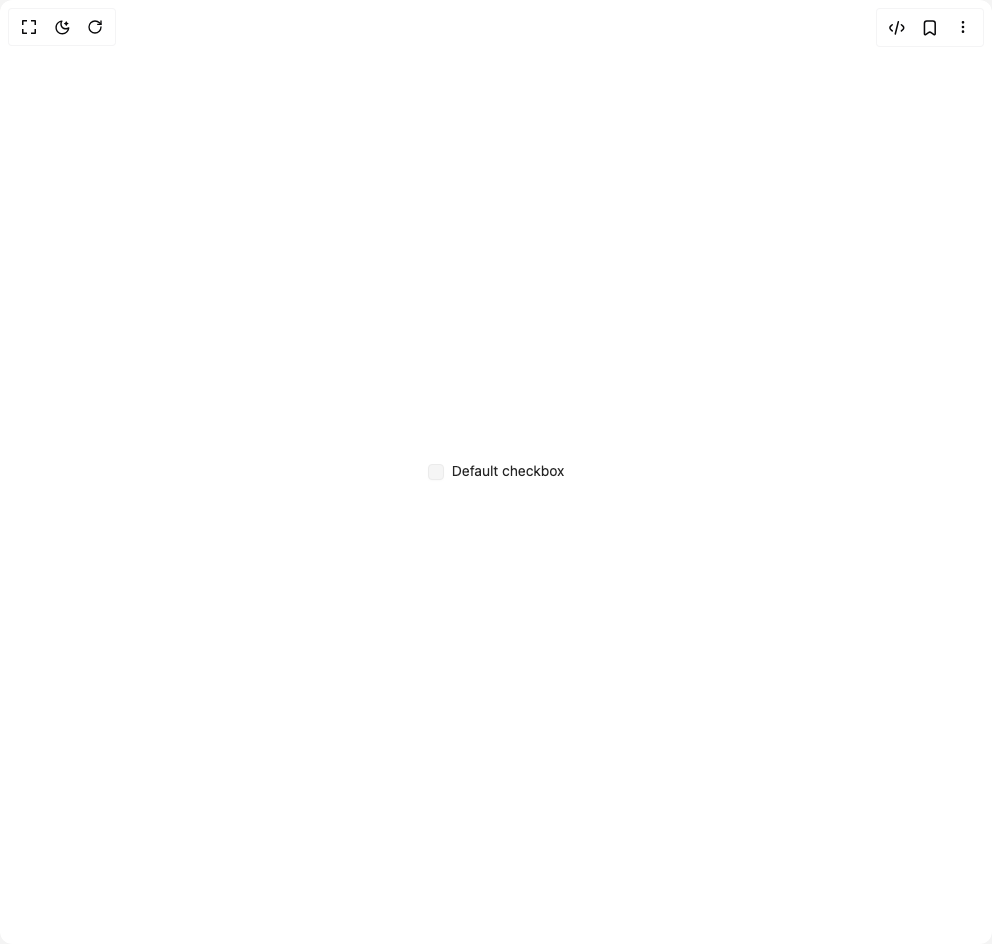

# Build Checkbox in BuilderStudio

> Build this component in our Agentic IDE: [BuilderStudio](https://builderstudio.dev).
>
> Join the BuilderStudio community on [Discord](https://discord.gg/QdWeSGCqfe) and [Reddit](https://reddit.com/r/builderstudio).



## Component

- Author group: `hextaui`
- Component: `checkbox`
- Variant: `default`
- Rendered HTML snapshot: [`rendered.html`](rendered.html)

## BuilderStudio prompt

You are implementing a React component based on a component reference.

## Component identity

- Author: hextaui
- Component slug: checkbox
- Demo slug: default
- Title: checkbox
- Description: 

## Goal

Recreate this component in a React + TypeScript + Tailwind CSS project. Preserve the visual layout, spacing, colors, border radius, shadows, interaction behavior, animation behavior, responsive behavior, and dark mode behavior shown in the rendered demo.

## Implementation requirements

- Use React and TypeScript.
- Use Tailwind CSS classes whenever possible.
- Keep the component self-contained unless the source files require helper components.
- If the source uses CSS variables, custom CSS, animations, or keyframes, include them.
- If the source uses external packages, list and use the required packages.
- Preserve accessibility attributes, button semantics, links, keyboard behavior, and ARIA attributes when visible in the source.
- Do not replace the component with a simplified placeholder.
- Return complete production-ready code.

## Dependencies

No reference metadata available.

## Rendered DOM snapshot

This is the rendered demo HTML extracted from the live preview. Use it to verify structure, class names, visible content, and layout.

```html
<div id="root"><div class="w-screen min-h-screen flex justify-center items-center"><div class="w-screen min-h-screen flex justify-center items-center"><div class="flex flex-col gap-1"><div class="flex items-start gap-2"><button type="button" role="checkbox" aria-checked="false" data-state="unchecked" value="on" id="«r0»" class="peer shrink-0 rounded-sm border border-border focus-visible:outline-none focus-visible:ring-1 focus-visible:ring-ring disabled:cursor-not-allowed disabled:opacity-50 data-[state=checked]:bg-primary data-[state=checked]:text-primary-foreground data-[state=checked]:border-primary data-[state=indeterminate]:bg-primary data-[state=indeterminate]:text-primary-foreground data-[state=indeterminate]:border-primary bg-accent text-foreground focus-visible:ring-offset-background focus-visible:ring-offset-2 transition-colors shadow-sm/2 h-4 w-4 font-medium"></button><div class="grid gap-1.5 leading-none"><label for="«r0»" class="text-sm leading-none peer-disabled:cursor-not-allowed peer-disabled:opacity-70 cursor-pointer">Default checkbox</label></div></div></div></div></div></div>
```

## Reference source files

No reference source files were available.
