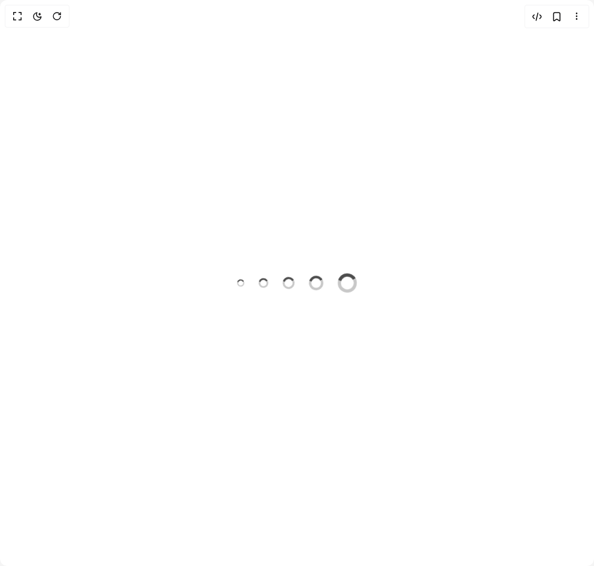

# Build Loader in BuilderStudio

> Build this component in our Agentic IDE: [BuilderStudio](https://builderstudio.dev).
>
> Join the BuilderStudio community on [Discord](https://discord.gg/QdWeSGCqfe) and [Reddit](https://reddit.com/r/builderstudio).



## Component

- Author group: `hextaui`
- Component: `loader`
- Variant: `default`
- Rendered HTML snapshot: [`rendered.html`](rendered.html)

## BuilderStudio prompt

You are implementing a React component based on a component reference.

## Component identity

- Author: hextaui
- Component slug: loader
- Demo slug: default
- Title: loader
- Description: 

## Goal

Recreate this component in a React + TypeScript + Tailwind CSS project. Preserve the visual layout, spacing, colors, border radius, shadows, interaction behavior, animation behavior, responsive behavior, and dark mode behavior shown in the rendered demo.

## Implementation requirements

- Use React and TypeScript.
- Use Tailwind CSS classes whenever possible.
- Keep the component self-contained unless the source files require helper components.
- If the source uses CSS variables, custom CSS, animations, or keyframes, include them.
- If the source uses external packages, list and use the required packages.
- Preserve accessibility attributes, button semantics, links, keyboard behavior, and ARIA attributes when visible in the source.
- Do not replace the component with a simplified placeholder.
- Return complete production-ready code.

## Dependencies

No reference metadata available.

## Rendered DOM snapshot

This is the rendered demo HTML extracted from the live preview. Use it to verify structure, class names, visible content, and layout.

```html
<div id="root"><div class="w-screen min-h-screen flex justify-center items-center"><div class="w-screen min-h-screen flex justify-center items-center"><div class="flex items-center gap-6 flex-wrap"><svg class="inline-block h-3 w-3 text-foreground animate-spin" xmlns="http://www.w3.org/2000/svg" fill="none" viewBox="0 0 24 24" role="status" aria-label="Loading"><circle class="opacity-25" cx="12" cy="12" r="10" stroke="currentColor" stroke-width="4"></circle> <path class="opacity-75" fill="currentColor" d="M4 12a8 8 0 018-8V0C5.373 0 0 5.373 0 12h4zm2 5.291A7.962 7.962 0 014 12H0c0 3.042 1.135 5.824 3 7.938l3-2.647z"></path></svg><svg class="inline-block h-4 w-4 text-foreground animate-spin" xmlns="http://www.w3.org/2000/svg" fill="none" viewBox="0 0 24 24" role="status" aria-label="Loading"><circle class="opacity-25" cx="12" cy="12" r="10" stroke="currentColor" stroke-width="4"></circle> <path class="opacity-75" fill="currentColor" d="M4 12a8 8 0 018-8V0C5.373 0 0 5.373 0 12h4zm2 5.291A7.962 7.962 0 014 12H0c0 3.042 1.135 5.824 3 7.938l3-2.647z"></path></svg><svg class="inline-block h-5 w-5 text-foreground animate-spin" xmlns="http://www.w3.org/2000/svg" fill="none" viewBox="0 0 24 24" role="status" aria-label="Loading"><circle class="opacity-25" cx="12" cy="12" r="10" stroke="currentColor" stroke-width="4"></circle> <path class="opacity-75" fill="currentColor" d="M4 12a8 8 0 018-8V0C5.373 0 0 5.373 0 12h4zm2 5.291A7.962 7.962 0 014 12H0c0 3.042 1.135 5.824 3 7.938l3-2.647z"></path></svg><svg class="inline-block h-6 w-6 text-foreground animate-spin" xmlns="http://www.w3.org/2000/svg" fill="none" viewBox="0 0 24 24" role="status" aria-label="Loading"><circle class="opacity-25" cx="12" cy="12" r="10" stroke="currentColor" stroke-width="4"></circle> <path class="opacity-75" fill="currentColor" d="M4 12a8 8 0 018-8V0C5.373 0 0 5.373 0 12h4zm2 5.291A7.962 7.962 0 014 12H0c0 3.042 1.135 5.824 3 7.938l3-2.647z"></path></svg><svg class="inline-block h-8 w-8 text-foreground animate-spin" xmlns="http://www.w3.org/2000/svg" fill="none" viewBox="0 0 24 24" role="status" aria-label="Loading"><circle class="opacity-25" cx="12" cy="12" r="10" stroke="currentColor" stroke-width="4"></circle> <path class="opacity-75" fill="currentColor" d="M4 12a8 8 0 018-8V0C5.373 0 0 5.373 0 12h4zm2 5.291A7.962 7.962 0 014 12H0c0 3.042 1.135 5.824 3 7.938l3-2.647z"></path></svg></div></div></div></div>
```

## Reference source files

No reference source files were available.
