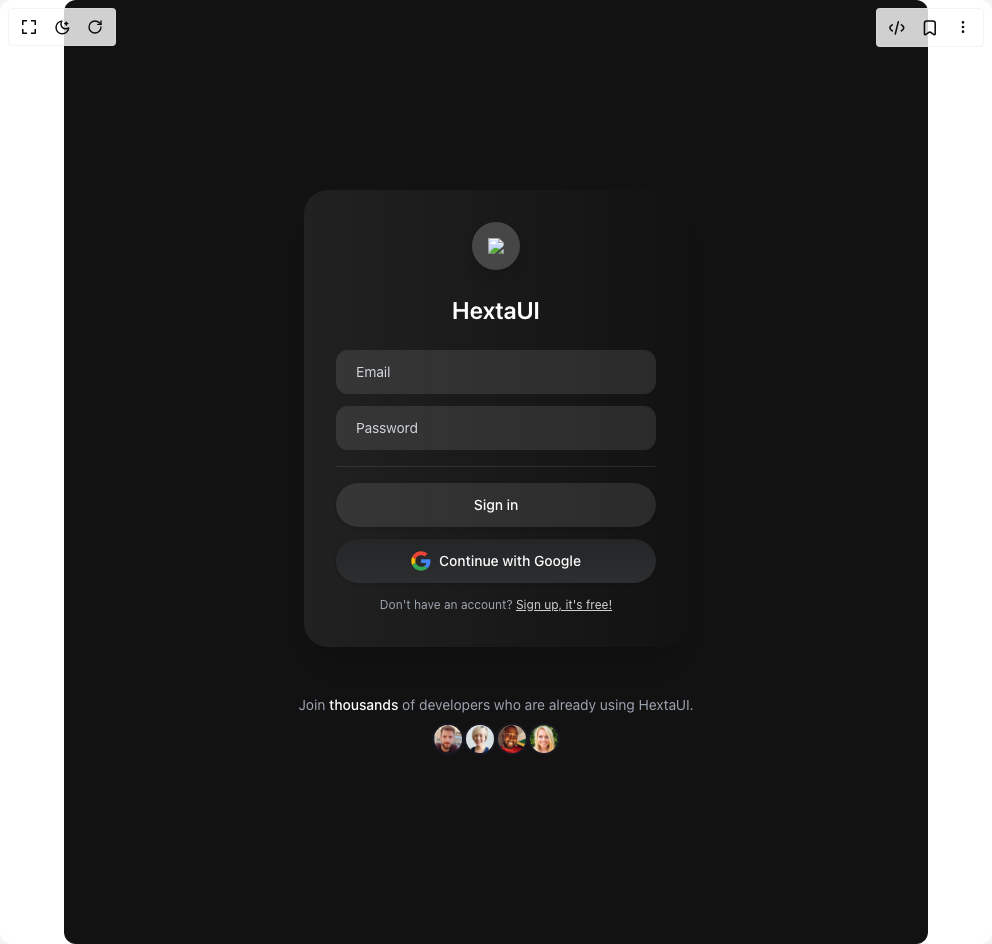

# Build Modern Stunning Sign In in BuilderStudio

> Build this component in our Agentic IDE: [BuilderStudio](https://builderstudio.dev).
>
> Join the BuilderStudio community on [Discord](https://discord.gg/QdWeSGCqfe) and [Reddit](https://reddit.com/r/builderstudio).



## Component

- Author group: `hextaui`
- Component: `modern-stunning-sign-in`
- Variant: `default`
- Rendered HTML snapshot: [`rendered.html`](rendered.html)

## BuilderStudio prompt

You are implementing a React component based on a component reference.

## Component identity

- Author: hextaui
- Component slug: modern-stunning-sign-in
- Demo slug: default
- Title: modern-stunning-sign-in
- Description: 

## Goal

Recreate this component in a React + TypeScript + Tailwind CSS project. Preserve the visual layout, spacing, colors, border radius, shadows, interaction behavior, animation behavior, responsive behavior, and dark mode behavior shown in the rendered demo.

## Implementation requirements

- Use React and TypeScript.
- Use Tailwind CSS classes whenever possible.
- Keep the component self-contained unless the source files require helper components.
- If the source uses CSS variables, custom CSS, animations, or keyframes, include them.
- If the source uses external packages, list and use the required packages.
- Preserve accessibility attributes, button semantics, links, keyboard behavior, and ARIA attributes when visible in the source.
- Do not replace the component with a simplified placeholder.
- Return complete production-ready code.

## Dependencies

No reference metadata available.

## Rendered DOM snapshot

This is the rendered demo HTML extracted from the live preview. Use it to verify structure, class names, visible content, and layout.

```html
<div id="root"><div class="relative flex items-center justify-center h-screen w-full m-auto p-16 bg-background text-foreground"><div class="absolute lab-bg inset-0 size-full"><div class="absolute inset-0 bg-[radial-gradient(#00000021_1px,transparent_1px)] dark:bg-[radial-gradient(#ffffff22_1px,transparent_1px)]"></div></div><div class="flex w-full justify-center relative"><div class="min-h-screen flex flex-col items-center justify-center bg-[#121212] relative overflow-hidden w-full rounded-xl"><div class="relative z-10 w-full max-w-sm rounded-3xl bg-gradient-to-r from-[#ffffff10] to-[#121212] backdrop-blur-sm  shadow-2xl p-8 flex flex-col items-center"><div class="flex items-center justify-center w-12 h-12 rounded-full bg-white/20 mb-6 shadow-lg"></div><h2 class="text-2xl font-semibold text-white mb-6 text-center">HextaUI</h2><div class="flex flex-col w-full gap-4"><div class="w-full flex flex-col gap-3"><input placeholder="Email" class="w-full px-5 py-3 rounded-xl  bg-white/10 text-white placeholder-gray-300 text-sm focus:outline-none focus:ring-2 focus:ring-gray-400" type="email" value=""><input placeholder="Password" class="w-full px-5 py-3 rounded-xl  bg-white/10 text-white placeholder-gray-300 text-sm focus:outline-none focus:ring-2 focus:ring-gray-400" type="password" value=""></div><hr class="opacity-10"><div><button class="w-full bg-white/10 text-white font-medium px-5 py-3 rounded-full shadow hover:bg-white/20 transition mb-3  text-sm">Sign in</button><button class="w-full flex items-center justify-center gap-2 bg-gradient-to-b from-[#232526] to-[#2d2e30] rounded-full px-5 py-3 font-medium text-white shadow hover:brightness-110 transition mb-2 text-sm">Continue with Google</button><div class="w-full text-center mt-2"><span class="text-xs text-gray-400">Don't have an account? <a href="#" class="underline text-white/80 hover:text-white">Sign up, it's free!</a></span></div></div></div></div><div class="relative z-10 mt-12 flex flex-col items-center text-center"><p class="text-gray-400 text-sm mb-2">Join <span class="font-medium text-white">thousands</span> of developers who are already using HextaUI.</p><div class="flex"></div></div></div></div></div></div>
```

## Reference source files

No reference source files were available.
