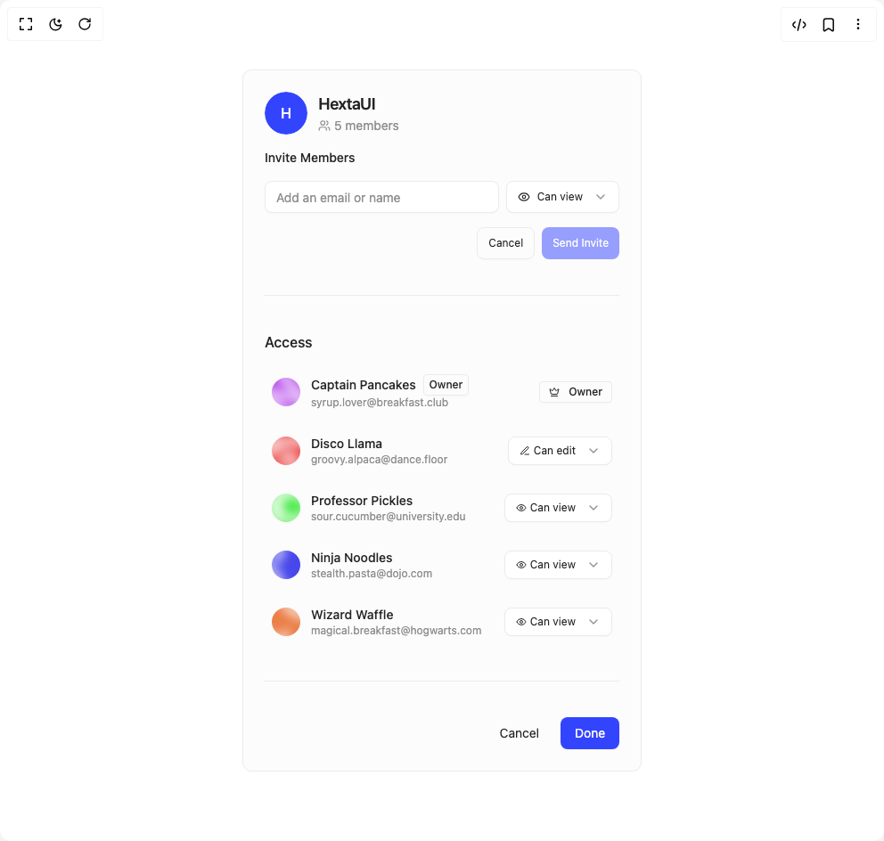

# Build Team Invite in BuilderStudio

> Build this component in our Agentic IDE: [BuilderStudio](https://builderstudio.dev).
>
> Join the BuilderStudio community on [Discord](https://discord.gg/QdWeSGCqfe) and [Reddit](https://reddit.com/r/builderstudio).



## Component

- Author group: `hextaui`
- Component: `team-invite`
- Variant: `default`
- Rendered HTML snapshot: [`rendered.html`](rendered.html)

## BuilderStudio prompt

You are implementing a React component based on a component reference.

## Component identity

- Author: hextaui
- Component slug: team-invite
- Demo slug: default
- Title: team-invite
- Description: 

## Goal

Recreate this component in a React + TypeScript + Tailwind CSS project. Preserve the visual layout, spacing, colors, border radius, shadows, interaction behavior, animation behavior, responsive behavior, and dark mode behavior shown in the rendered demo.

## Implementation requirements

- Use React and TypeScript.
- Use Tailwind CSS classes whenever possible.
- Keep the component self-contained unless the source files require helper components.
- If the source uses CSS variables, custom CSS, animations, or keyframes, include them.
- If the source uses external packages, list and use the required packages.
- Preserve accessibility attributes, button semantics, links, keyboard behavior, and ARIA attributes when visible in the source.
- Do not replace the component with a simplified placeholder.
- Return complete production-ready code.

## Dependencies

No reference metadata available.

## Rendered DOM snapshot

This is the rendered demo HTML extracted from the live preview. Use it to verify structure, class names, visible content, and layout.

```html
<div id="root"><div class="w-screen min-h-screen flex justify-center items-center"><div class="w-screen min-h-screen flex justify-center items-center"><div class="flex flex-col items-center justify-center max-w-lg w-full p-8"><div class="relative rounded-card bg-card text-card-foreground transition-all duration-300 ease-out overflow-hidden border border-border p-6 w-full max-w-9xl"><div class="flex flex-col space-y-2 pb-4"><div class="flex items-center gap-3"><div class="flex-shrink-0"><span class="relative flex shrink-0 overflow-hidden rounded-full shadow-sm/2 bg-background h-12 w-12"><span class="flex h-full w-full items-center justify-center rounded-full font-medium bg-primary text-primary-foreground">H</span></span></div><div class="flex-1 min-w-0"><h3 class="tracking-tight text-foreground text-lg font-semibold truncate">HextaUI</h3><p class="text-sm text-muted-foreground flex items-center gap-1"><svg xmlns="http://www.w3.org/2000/svg" width="14" height="14" viewBox="0 0 24 24" fill="none" stroke="currentColor" stroke-width="2" stroke-linecap="round" stroke-linejoin="round" class="lucide lucide-users" aria-hidden="true"><path d="M16 21v-2a4 4 0 0 0-4-4H6a4 4 0 0 0-4 4v2"></path><circle cx="9" cy="7" r="4"></circle><path d="M22 21v-2a4 4 0 0 0-3-3.87"></path><path d="M16 3.13a4 4 0 0 1 0 7.75"></path></svg>5 members</p></div></div></div><div class="space-y-4 flex flex-col gap-6"><div class="flex flex-col gap-4"><div class="flex items-center justify-between"><label class="peer-disabled:cursor-not-allowed peer-disabled:opacity-70 text-foreground text-sm font-medium">Invite Members</label></div><div class="flex gap-2"><div class="flex-1"><div class="relative w-full"><input class="flex w-full rounded-ele border bg-input text-sm ring-offset-background file:border-0 file:bg-transparent file:text-sm file:font-medium placeholder:text-muted-foreground focus-visible:outline-none focus-visible:ring-2 focus-visible:ring-ring focus-visible:ring-offset-2 disabled:cursor-not-allowed disabled:opacity-50 transition-all shadow-sm/2 border-border px-3 py-2 h-9" placeholder="Add an email or name" type="email" value=""></div></div><div><button type="button" role="combobox" aria-controls="radix-«r0»" aria-expanded="false" aria-autocomplete="none" dir="ltr" data-state="closed" class="group flex w-full items-center justify-between rounded-ele transition-all placeholder:text-muted-foreground focus:outline-none focus:ring-2 focus:ring-ring focus:ring-offset-2 disabled:cursor-not-allowed disabled:opacity-50 [&amp;&gt;span]:line-clamp-1 border border-border bg-input hover:bg-accent hover:text-accent-foreground shadow-sm/2 p-3 gap-3 h-9 text-xs"><div class="flex items-center gap-2 flex-1 min-w-0"><span class="truncate"><span style="pointer-events: none;"><div class="flex items-center gap-2"><svg xmlns="http://www.w3.org/2000/svg" width="14" height="14" viewBox="0 0 24 24" fill="none" stroke="currentColor" stroke-width="2" stroke-linecap="round" stroke-linejoin="round" class="lucide lucide-eye" aria-hidden="true"><path d="M2.062 12.348a1 1 0 0 1 0-.696 10.75 10.75 0 0 1 19.876 0 1 1 0 0 1 0 .696 10.75 10.75 0 0 1-19.876 0"></path><circle cx="12" cy="12" r="3"></circle></svg><span>Can view</span></div></span></span></div> <svg xmlns="http://www.w3.org/2000/svg" width="16" height="16" viewBox="0 0 24 24" fill="none" stroke="currentColor" stroke-width="2" stroke-linecap="round" stroke-linejoin="round" class="lucide lucide-chevron-down opacity-50 shrink-0 transition-transform duration-200 group-data-[state=open]:rotate-180" aria-hidden="true"><path d="m6 9 6 6 6-6"></path></svg></button></div></div><div class="flex gap-2 w-fit justify-end ml-auto"><button class="inline-flex items-center justify-center gap-2 whitespace-nowrap rounded-ele transition-all focus-visible:outline-none focus-visible:ring-2 focus-visible:ring-offset-2 disabled:pointer-events-none disabled:opacity-50 [&amp;_svg]:pointer-events-none [&amp;_svg]:size-4 [&amp;_svg]:shrink-0 border border-border text-foreground hover:bg-accent hover:text-accent-foreground focus-visible:ring-ring shadow-sm/2 px-3 text-xs flex-1 h-9">Cancel</button><button class="inline-flex items-center justify-center gap-2 whitespace-nowrap rounded-ele transition-all focus-visible:outline-none focus-visible:ring-2 focus-visible:ring-offset-2 disabled:pointer-events-none disabled:opacity-50 [&amp;_svg]:pointer-events-none [&amp;_svg]:size-4 [&amp;_svg]:shrink-0 bg-primary text-primary-foreground hover:bg-primary/90 focus-visible:ring-ring shadow-sm/2 px-3 text-xs flex-1 h-9" disabled="">Send Invite</button></div></div><div data-orientation="horizontal" role="none" class="shrink-0 bg-border w-full h-[1px]"></div><div class="flex flex-col gap-4"><label class="peer-disabled:cursor-not-allowed peer-disabled:opacity-70 text-foreground text-base font-medium">Access</label><div class="flex flex-col gap-3"><div class="flex items-center gap-3 p-2 rounded-ele hover:bg-accent transition-colors" style="opacity: 1; transform: none;"><span class="relative flex shrink-0 overflow-hidden rounded-full shadow-sm/2 bg-background h-8 w-8"></span><div class="flex-1 min-w-0"><div class="flex items-center gap-2"><p class="text-sm font-medium truncate">Captain Pancakes</p><span class="flex items-center justify-center gap-1.5 rounded-[calc(var(--radius)-4px)] border font-medium transition-colors focus-visible:outline-none focus-visible:ring-2 focus-visible:ring-offset-2 disabled:pointer-events-none disabled:opacity-50 border-border text-foreground hover:bg-accent hover:text-accent-foreground focus-visible:ring-ring shadow-sm/2 h-6 text-xs px-1.5 py-0.5">Owner</span></div><p class="text-xs text-muted-foreground truncate">syrup.lover@breakfast.club</p></div><div class="flex items-center gap-2"><span class="flex items-center justify-center gap-1.5 rounded-[calc(var(--radius)-4px)] border font-medium transition-colors focus-visible:outline-none focus-visible:ring-2 focus-visible:ring-offset-2 disabled:pointer-events-none disabled:opacity-50 border-border text-foreground hover:bg-accent hover:text-accent-foreground focus-visible:ring-ring shadow-sm/2 h-6 px-2.5 text-xs"><svg xmlns="http://www.w3.org/2000/svg" width="12" height="12" viewBox="0 0 24 24" fill="none" stroke="currentColor" stroke-width="2" stroke-linecap="round" stroke-linejoin="round" class="lucide lucide-crown mr-1" aria-hidden="true"><path d="M11.562 3.266a.5.5 0 0 1 .876 0L15.39 8.87a1 1 0 0 0 1.516.294L21.183 5.5a.5.5 0 0 1 .798.519l-2.834 10.246a1 1 0 0 1-.956.734H5.81a1 1 0 0 1-.957-.734L2.02 6.02a.5.5 0 0 1 .798-.519l4.276 3.664a1 1 0 0 0 1.516-.294z"></path><path d="M5 21h14"></path></svg>Owner</span></div></div><div class="flex items-center gap-3 p-2 rounded-ele hover:bg-accent transition-colors" style="opacity: 1; transform: none;"><span class="relative flex shrink-0 overflow-hidden rounded-full shadow-sm/2 bg-background h-8 w-8"></span><div class="flex-1 min-w-0"><div class="flex items-center gap-2"><p class="text-sm font-medium truncate">Disco Llama</p></div><p class="text-xs text-muted-foreground truncate">groovy.alpaca@dance.floor</p></div><div class="flex items-center gap-2"><button type="button" role="combobox" aria-controls="radix-«r3»" aria-expanded="false" aria-autocomplete="none" dir="ltr" data-state="closed" class="group flex w-full items-center justify-between rounded-ele transition-all placeholder:text-muted-foreground focus:outline-none focus:ring-2 focus:ring-ring focus:ring-offset-2 disabled:cursor-not-allowed disabled:opacity-50 [&amp;&gt;span]:line-clamp-1 border border-border bg-input hover:bg-accent hover:text-accent-foreground shadow-sm/2 p-3 gap-3 h-8 text-xs"><div class="flex items-center gap-2 flex-1 min-w-0"><span class="truncate"><div class="flex items-center gap-1"><svg xmlns="http://www.w3.org/2000/svg" width="12" height="12" viewBox="0 0 24 24" fill="none" stroke="currentColor" stroke-width="2" stroke-linecap="round" stroke-linejoin="round" class="lucide lucide-pen-line" aria-hidden="true"><path d="M12 20h9"></path><path d="M16.376 3.622a1 1 0 0 1 3.002 3.002L7.368 18.635a2 2 0 0 1-.855.506l-2.872.838a.5.5 0 0 1-.62-.62l.838-2.872a2 2 0 0 1 .506-.854z"></path></svg><span class="truncate">Can edit</span></div></span></div> <svg xmlns="http://www.w3.org/2000/svg" width="16" height="16" viewBox="0 0 24 24" fill="none" stroke="currentColor" stroke-width="2" stroke-linecap="round" stroke-linejoin="round" class="lucide lucide-chevron-down opacity-50 shrink-0 transition-transform duration-200 group-data-[state=open]:rotate-180" aria-hidden="true"><path d="m6 9 6 6 6-6"></path></svg></button></div></div><div class="flex items-center gap-3 p-2 rounded-ele hover:bg-accent transition-colors" style="opacity: 1; transform: none;"><span class="relative flex shrink-0 overflow-hidden rounded-full shadow-sm/2 bg-background h-8 w-8"></span><div class="flex-1 min-w-0"><div class="flex items-center gap-2"><p class="text-sm font-medium truncate">Professor Pickles</p></div><p class="text-xs text-muted-foreground truncate">sour.cucumber@university.edu</p></div><div class="flex items-center gap-2"><button type="button" role="combobox" aria-controls="radix-«r5»" aria-expanded="false" aria-autocomplete="none" dir="ltr" data-state="closed" class="group flex w-full items-center justify-between rounded-ele transition-all placeholder:text-muted-foreground focus:outline-none focus:ring-2 focus:ring-ring focus:ring-offset-2 disabled:cursor-not-allowed disabled:opacity-50 [&amp;&gt;span]:line-clamp-1 border border-border bg-input hover:bg-accent hover:text-accent-foreground shadow-sm/2 p-3 gap-3 h-8 text-xs"><div class="flex items-center gap-2 flex-1 min-w-0"><span class="truncate"><div class="flex items-center gap-1"><svg xmlns="http://www.w3.org/2000/svg" width="12" height="12" viewBox="0 0 24 24" fill="none" stroke="currentColor" stroke-width="2" stroke-linecap="round" stroke-linejoin="round" class="lucide lucide-eye" aria-hidden="true"><path d="M2.062 12.348a1 1 0 0 1 0-.696 10.75 10.75 0 0 1 19.876 0 1 1 0 0 1 0 .696 10.75 10.75 0 0 1-19.876 0"></path><circle cx="12" cy="12" r="3"></circle></svg><span class="truncate">Can view</span></div></span></div> <svg xmlns="http://www.w3.org/2000/svg" width="16" height="16" viewBox="0 0 24 24" fill="none" stroke="currentColor" stroke-width="2" stroke-linecap="round" stroke-linejoin="round" class="lucide lucide-chevron-down opacity-50 shrink-0 transition-transform duration-200 group-data-[state=open]:rotate-180" aria-hidden="true"><path d="m6 9 6 6 6-6"></path></svg></button></div></div><div class="flex items-center gap-3 p-2 rounded-ele hover:bg-accent transition-colors" style="opacity: 1; transform: none;"><span class="relative flex shrink-0 overflow-hidden rounded-full shadow-sm/2 bg-background h-8 w-8"></span><div class="flex-1 min-w-0"><div class="flex items-center gap-2"><p class="text-sm font-medium truncate">Ninja Noodles</p></div><p class="text-xs text-muted-foreground truncate">stealth.pasta@dojo.com</p></div><div class="flex items-center gap-2"><button type="button" role="combobox" aria-controls="radix-«r7»" aria-expanded="false" aria-autocomplete="none" dir="ltr" data-state="closed" class="group flex w-full items-center justify-between rounded-ele transition-all placeholder:text-muted-foreground focus:outline-none focus:ring-2 focus:ring-ring focus:ring-offset-2 disabled:cursor-not-allowed disabled:opacity-50 [&amp;&gt;span]:line-clamp-1 border border-border bg-input hover:bg-accent hover:text-accent-foreground shadow-sm/2 p-3 gap-3 h-8 text-xs"><div class="flex items-center gap-2 flex-1 min-w-0"><span class="truncate"><div class="flex items-center gap-1"><svg xmlns="http://www.w3.org/2000/svg" width="12" height="12" viewBox="0 0 24 24" fill="none" stroke="currentColor" stroke-width="2" stroke-linecap="round" stroke-linejoin="round" class="lucide lucide-eye" aria-hidden="true"><path d="M2.062 12.348a1 1 0 0 1 0-.696 10.75 10.75 0 0 1 19.876 0 1 1 0 0 1 0 .696 10.75 10.75 0 0 1-19.876 0"></path><circle cx="12" cy="12" r="3"></circle></svg><span class="truncate">Can view</span></div></span></div> <svg xmlns="http://www.w3.org/2000/svg" width="16" height="16" viewBox="0 0 24 24" fill="none" stroke="currentColor" stroke-width="2" stroke-linecap="round" stroke-linejoin="round" class="lucide lucide-chevron-down opacity-50 shrink-0 transition-transform duration-200 group-data-[state=open]:rotate-180" aria-hidden="true"><path d="m6 9 6 6 6-6"></path></svg></button></div></div><div class="flex items-center gap-3 p-2 rounded-ele hover:bg-accent transition-colors" style="opacity: 1; transform: none;"><span class="relative flex shrink-0 overflow-hidden rounded-full shadow-sm/2 bg-background h-8 w-8"></span><div class="flex-1 min-w-0"><div class="flex items-center gap-2"><p class="text-sm font-medium truncate">Wizard Waffle</p></div><p class="text-xs text-muted-foreground truncate">magical.breakfast@hogwarts.com</p></div><div class="flex items-center gap-2"><button type="button" role="combobox" aria-controls="radix-«r9»" aria-expanded="false" aria-autocomplete="none" dir="ltr" data-state="closed" class="group flex w-full items-center justify-between rounded-ele transition-all placeholder:text-muted-foreground focus:outline-none focus:ring-2 focus:ring-ring focus:ring-offset-2 disabled:cursor-not-allowed disabled:opacity-50 [&amp;&gt;span]:line-clamp-1 border border-border bg-input hover:bg-accent hover:text-accent-foreground shadow-sm/2 p-3 gap-3 h-8 text-xs"><div class="flex items-center gap-2 flex-1 min-w-0"><span class="truncate"><div class="flex items-center gap-1"><svg xmlns="http://www.w3.org/2000/svg" width="12" height="12" viewBox="0 0 24 24" fill="none" stroke="currentColor" stroke-width="2" stroke-linecap="round" stroke-linejoin="round" class="lucide lucide-eye" aria-hidden="true"><path d="M2.062 12.348a1 1 0 0 1 0-.696 10.75 10.75 0 0 1 19.876 0 1 1 0 0 1 0 .696 10.75 10.75 0 0 1-19.876 0"></path><circle cx="12" cy="12" r="3"></circle></svg><span class="truncate">Can view</span></div></span></div> <svg xmlns="http://www.w3.org/2000/svg" width="16" height="16" viewBox="0 0 24 24" fill="none" stroke="currentColor" stroke-width="2" stroke-linecap="round" stroke-linejoin="round" class="lucide lucide-chevron-down opacity-50 shrink-0 transition-transform duration-200 group-data-[state=open]:rotate-180" aria-hidden="true"><path d="m6 9 6 6 6-6"></path></svg></button></div></div></div></div><div data-orientation="horizontal" role="none" class="shrink-0 bg-border w-full h-[1px]"></div><div class="flex justify-end gap-2"><button class="inline-flex items-center justify-center gap-2 whitespace-nowrap rounded-ele text-sm transition-all focus-visible:outline-none focus-visible:ring-2 focus-visible:ring-offset-2 disabled:pointer-events-none disabled:opacity-50 [&amp;_svg]:pointer-events-none [&amp;_svg]:size-4 [&amp;_svg]:shrink-0 text-foreground hover:bg-accent hover:text-accent-foreground focus-visible:ring-ring h-9 px-4 py-2">Cancel</button><button class="inline-flex items-center justify-center gap-2 whitespace-nowrap rounded-ele text-sm transition-all focus-visible:outline-none focus-visible:ring-2 focus-visible:ring-offset-2 disabled:pointer-events-none disabled:opacity-50 [&amp;_svg]:pointer-events-none [&amp;_svg]:size-4 [&amp;_svg]:shrink-0 bg-primary text-primary-foreground hover:bg-primary/90 focus-visible:ring-ring shadow-sm/2 h-9 px-4 py-2">Done</button></div></div></div></div></div></div></div>
```

## Reference source files

No reference source files were available.
