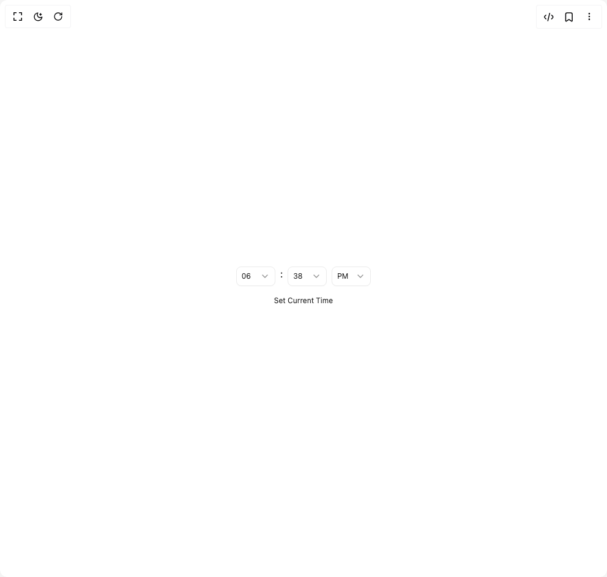

# Build Time Picker in BuilderStudio

> Build this component in our Agentic IDE: [BuilderStudio](https://builderstudio.dev).
>
> Join the BuilderStudio community on [Discord](https://discord.gg/QdWeSGCqfe) and [Reddit](https://reddit.com/r/builderstudio).



## Component

- Author group: `hextaui`
- Component: `time-picker`
- Variant: `default`
- Rendered HTML snapshot: [`rendered.html`](rendered.html)

## BuilderStudio prompt

You are implementing a React component based on a component reference.

## Component identity

- Author: hextaui
- Component slug: time-picker
- Demo slug: default
- Title: time-picker
- Description: 

## Goal

Recreate this component in a React + TypeScript + Tailwind CSS project. Preserve the visual layout, spacing, colors, border radius, shadows, interaction behavior, animation behavior, responsive behavior, and dark mode behavior shown in the rendered demo.

## Implementation requirements

- Use React and TypeScript.
- Use Tailwind CSS classes whenever possible.
- Keep the component self-contained unless the source files require helper components.
- If the source uses CSS variables, custom CSS, animations, or keyframes, include them.
- If the source uses external packages, list and use the required packages.
- Preserve accessibility attributes, button semantics, links, keyboard behavior, and ARIA attributes when visible in the source.
- Do not replace the component with a simplified placeholder.
- Return complete production-ready code.

## Dependencies

No reference metadata available.

## Rendered DOM snapshot

This is the rendered demo HTML extracted from the live preview. Use it to verify structure, class names, visible content, and layout.

```html
<div id="root"><div class="w-screen min-h-screen flex justify-center items-center"><div class="w-screen min-h-screen flex justify-center items-center"><div class="flex w-full flex-col items-center gap-2"><div class="flex w-full items-left gap-2 justify-center"><div class="w-16"><button type="button" role="combobox" aria-controls="radix-«r0»" aria-expanded="false" aria-autocomplete="none" dir="ltr" data-state="closed" class="group flex w-full items-center justify-between rounded-ele transition-all placeholder:text-muted-foreground focus:outline-none focus:ring-2 focus:ring-ring focus:ring-offset-2 disabled:cursor-not-allowed disabled:opacity-50 [&amp;&gt;span]:line-clamp-1 border border-border bg-input hover:bg-accent hover:text-accent-foreground shadow-sm/2 h-8 p-2 text-xs gap-2"><div class="flex items-center gap-2 flex-1 min-w-0"><span class="truncate"><span style="pointer-events: none;">06</span></span></div> <svg xmlns="http://www.w3.org/2000/svg" width="16" height="16" viewBox="0 0 24 24" fill="none" stroke="currentColor" stroke-width="2" stroke-linecap="round" stroke-linejoin="round" class="lucide lucide-chevron-down opacity-50 shrink-0 transition-transform duration-200 group-data-[state=open]:rotate-180" aria-hidden="true"><path d="m6 9 6 6 6-6"></path></svg></button></div><span>:</span><div class="w-16"><button type="button" role="combobox" aria-controls="radix-«r1»" aria-expanded="false" aria-autocomplete="none" dir="ltr" data-state="closed" class="group flex w-full items-center justify-between rounded-ele transition-all placeholder:text-muted-foreground focus:outline-none focus:ring-2 focus:ring-ring focus:ring-offset-2 disabled:cursor-not-allowed disabled:opacity-50 [&amp;&gt;span]:line-clamp-1 border border-border bg-input hover:bg-accent hover:text-accent-foreground shadow-sm/2 h-8 p-2 text-xs gap-2"><div class="flex items-center gap-2 flex-1 min-w-0"><span class="truncate"><span style="pointer-events: none;">38</span></span></div> <svg xmlns="http://www.w3.org/2000/svg" width="16" height="16" viewBox="0 0 24 24" fill="none" stroke="currentColor" stroke-width="2" stroke-linecap="round" stroke-linejoin="round" class="lucide lucide-chevron-down opacity-50 shrink-0 transition-transform duration-200 group-data-[state=open]:rotate-180" aria-hidden="true"><path d="m6 9 6 6 6-6"></path></svg></button></div><div class="w-16"><button type="button" role="combobox" aria-controls="radix-«r2»" aria-expanded="false" aria-autocomplete="none" dir="ltr" data-state="closed" class="group flex w-full items-center justify-between rounded-ele transition-all placeholder:text-muted-foreground focus:outline-none focus:ring-2 focus:ring-ring focus:ring-offset-2 disabled:cursor-not-allowed disabled:opacity-50 [&amp;&gt;span]:line-clamp-1 border border-border bg-input hover:bg-accent hover:text-accent-foreground shadow-sm/2 h-8 p-2 text-xs gap-2"><div class="flex items-center gap-2 flex-1 min-w-0"><span class="truncate"><span style="pointer-events: none;">PM</span></span></div> <svg xmlns="http://www.w3.org/2000/svg" width="16" height="16" viewBox="0 0 24 24" fill="none" stroke="currentColor" stroke-width="2" stroke-linecap="round" stroke-linejoin="round" class="lucide lucide-chevron-down opacity-50 shrink-0 transition-transform duration-200 group-data-[state=open]:rotate-180" aria-hidden="true"><path d="m6 9 6 6 6-6"></path></svg></button></div></div><button class="inline-flex items-center justify-center gap-2 whitespace-nowrap rounded-ele transition-all focus-visible:outline-none focus-visible:ring-2 focus-visible:ring-offset-2 disabled:pointer-events-none disabled:opacity-50 [&amp;_svg]:pointer-events-none [&amp;_svg]:size-4 [&amp;_svg]:shrink-0 text-foreground hover:bg-accent hover:text-accent-foreground focus-visible:ring-ring h-8 px-3 text-xs">Set Current Time</button></div></div></div></div>
```

## Reference source files

No reference source files were available.
