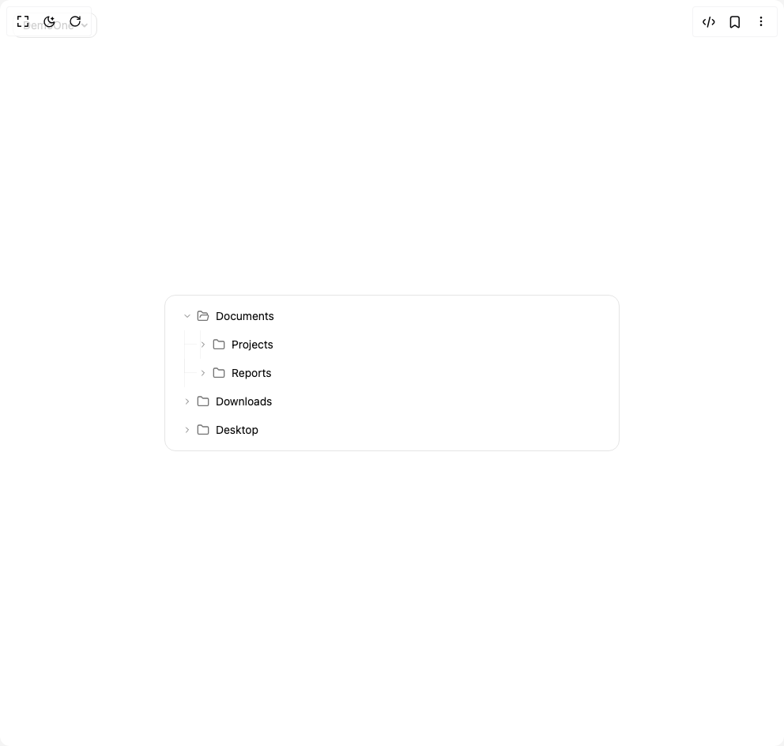

# Build Tree View in BuilderStudio

> Build this component in our Agentic IDE: [BuilderStudio](https://builderstudio.dev).
>
> Join the BuilderStudio community on [Discord](https://discord.gg/QdWeSGCqfe) and [Reddit](https://reddit.com/r/builderstudio).



## Component

- Author group: `hextaui`
- Component: `tree-view`
- Variant: `default`
- Rendered HTML snapshot: [`rendered.html`](rendered.html)

## BuilderStudio prompt

You are implementing a React component based on a component reference.

## Component identity

- Author: hextaui
- Component slug: tree-view
- Demo slug: default
- Title: tree-view
- Description: 

## Goal

Recreate this component in a React + TypeScript + Tailwind CSS project. Preserve the visual layout, spacing, colors, border radius, shadows, interaction behavior, animation behavior, responsive behavior, and dark mode behavior shown in the rendered demo.

## Implementation requirements

- Use React and TypeScript.
- Use Tailwind CSS classes whenever possible.
- Keep the component self-contained unless the source files require helper components.
- If the source uses CSS variables, custom CSS, animations, or keyframes, include them.
- If the source uses external packages, list and use the required packages.
- Preserve accessibility attributes, button semantics, links, keyboard behavior, and ARIA attributes when visible in the source.
- Do not replace the component with a simplified placeholder.
- Return complete production-ready code.

## Dependencies

No reference metadata available.

## Rendered DOM snapshot

This is the rendered demo HTML extracted from the live preview. Use it to verify structure, class names, visible content, and layout.

```html
<div id="root"><div class="fixed top-4 left-4 z-10"><select class="appearance-none h-8 max-w-[200px] text-sm leading-tight rounded-lg pl-3 pr-7 py-0 border bg-background focus:outline-none focus:ring-0"><option value="named_DemoOne_DemoOne">DemoOne</option></select><div class="absolute top-1/2 transform -translate-y-1/2 right-2 pointer-events-none"><svg class="w-4 h-4 fill-current" viewBox="0 0 20 20"><path d="M5.516 7.548c.436-.446 1.043-.48 1.576 0L10 10.405l2.908-2.857c.533-.48 1.14-.446 1.576 0 .436.445.408 1.197 0 1.615l-3.734 3.705c-.533.534-1.39.534-1.923 0l-3.734-3.705c-.408-.418-.436-1.17 0-1.615z"></path></svg></div></div><div class="w-screen min-h-screen flex justify-center items-center"><div class="max-w-xl mx-auto w-full"><div class="w-full bg-background border border-border rounded-xl" style="opacity: 1; transform: none;"><div class="p-2"><div class="select-none"><div class="flex items-center py-2 px-3 cursor-pointer transition-all duration-200 relative group rounded-md mx-1 hover:bg-accent/50 hover:border-accent-foreground/10" tabindex="0" style="padding-left: 8px;"><div class="flex items-center justify-center w-4 h-4 mr-1" style="transform: rotate(90deg);"><svg xmlns="http://www.w3.org/2000/svg" width="24" height="24" viewBox="0 0 24 24" fill="none" stroke="currentColor" stroke-width="2" stroke-linecap="round" stroke-linejoin="round" class="lucide lucide-chevron-right h-3 w-3 text-muted-foreground" aria-hidden="true"><path d="m9 18 6-6-6-6"></path></svg></div><div class="flex items-center justify-center w-4 h-4 mr-2 text-muted-foreground"><svg xmlns="http://www.w3.org/2000/svg" width="24" height="24" viewBox="0 0 24 24" fill="none" stroke="currentColor" stroke-width="2" stroke-linecap="round" stroke-linejoin="round" class="lucide lucide-folder-open h-4 w-4" aria-hidden="true"><path d="m6 14 1.5-2.9A2 2 0 0 1 9.24 10H20a2 2 0 0 1 1.94 2.5l-1.54 6a2 2 0 0 1-1.95 1.5H4a2 2 0 0 1-2-2V5a2 2 0 0 1 2-2h3.9a2 2 0 0 1 1.69.9l.81 1.2a2 2 0 0 0 1.67.9H18a2 2 0 0 1 2 2v2"></path></svg></div><span class="text-sm font truncate flex-1">Documents</span></div><div class="overflow-hidden" style="height: auto; opacity: 1;"><div style="transform: none;"><div class="select-none"><div class="flex items-center py-2 px-3 cursor-pointer transition-all duration-200 relative group rounded-md mx-1 hover:bg-accent/50 hover:border-accent-foreground/10" tabindex="0" style="padding-left: 28px;"><div class="absolute left-0 top-0 bottom-0 pointer-events-none"><div class="absolute top-0 bottom-0 border-l border-border/40" style="left: 12px; display: block;"></div><div class="absolute top-0 bottom-0 border-l border-border/40" style="left: 32px; display: block;"></div><div class="absolute top-1/2 border-t border-border/40" style="left: 12px; width: 16px; transform: translateY(-1px);"></div></div><div class="flex items-center justify-center w-4 h-4 mr-1" style="transform: none;"><svg xmlns="http://www.w3.org/2000/svg" width="24" height="24" viewBox="0 0 24 24" fill="none" stroke="currentColor" stroke-width="2" stroke-linecap="round" stroke-linejoin="round" class="lucide lucide-chevron-right h-3 w-3 text-muted-foreground" aria-hidden="true"><path d="m9 18 6-6-6-6"></path></svg></div><div class="flex items-center justify-center w-4 h-4 mr-2 text-muted-foreground"><svg xmlns="http://www.w3.org/2000/svg" width="24" height="24" viewBox="0 0 24 24" fill="none" stroke="currentColor" stroke-width="2" stroke-linecap="round" stroke-linejoin="round" class="lucide lucide-folder h-4 w-4" aria-hidden="true"><path d="M20 20a2 2 0 0 0 2-2V8a2 2 0 0 0-2-2h-7.9a2 2 0 0 1-1.69-.9L9.6 3.9A2 2 0 0 0 7.93 3H4a2 2 0 0 0-2 2v13a2 2 0 0 0 2 2Z"></path></svg></div><span class="text-sm font truncate flex-1">Projects</span></div></div><div class="select-none"><div class="flex items-center py-2 px-3 cursor-pointer transition-all duration-200 relative group rounded-md mx-1 hover:bg-accent/50 hover:border-accent-foreground/10" tabindex="0" style="padding-left: 28px;"><div class="absolute left-0 top-0 bottom-0 pointer-events-none"><div class="absolute top-0 bottom-0 border-l border-border/40" style="left: 12px; display: block;"></div><div class="absolute top-0 bottom-0 border-l border-border/40" style="left: 32px; display: none;"></div><div class="absolute top-1/2 border-t border-border/40" style="left: 12px; width: 16px; transform: translateY(-1px);"></div><div class="absolute top-0 border-l border-border/40" style="left: 12px; height: 50%;"></div></div><div class="flex items-center justify-center w-4 h-4 mr-1" style="transform: none;"><svg xmlns="http://www.w3.org/2000/svg" width="24" height="24" viewBox="0 0 24 24" fill="none" stroke="currentColor" stroke-width="2" stroke-linecap="round" stroke-linejoin="round" class="lucide lucide-chevron-right h-3 w-3 text-muted-foreground" aria-hidden="true"><path d="m9 18 6-6-6-6"></path></svg></div><div class="flex items-center justify-center w-4 h-4 mr-2 text-muted-foreground"><svg xmlns="http://www.w3.org/2000/svg" width="24" height="24" viewBox="0 0 24 24" fill="none" stroke="currentColor" stroke-width="2" stroke-linecap="round" stroke-linejoin="round" class="lucide lucide-folder h-4 w-4" aria-hidden="true"><path d="M20 20a2 2 0 0 0 2-2V8a2 2 0 0 0-2-2h-7.9a2 2 0 0 1-1.69-.9L9.6 3.9A2 2 0 0 0 7.93 3H4a2 2 0 0 0-2 2v13a2 2 0 0 0 2 2Z"></path></svg></div><span class="text-sm font truncate flex-1">Reports</span></div></div></div></div></div><div class="select-none"><div class="flex items-center py-2 px-3 cursor-pointer transition-all duration-200 relative group rounded-md mx-1 hover:bg-accent/50 hover:border-accent-foreground/10" tabindex="0" style="padding-left: 8px;"><div class="flex items-center justify-center w-4 h-4 mr-1" style="transform: none;"><svg xmlns="http://www.w3.org/2000/svg" width="24" height="24" viewBox="0 0 24 24" fill="none" stroke="currentColor" stroke-width="2" stroke-linecap="round" stroke-linejoin="round" class="lucide lucide-chevron-right h-3 w-3 text-muted-foreground" aria-hidden="true"><path d="m9 18 6-6-6-6"></path></svg></div><div class="flex items-center justify-center w-4 h-4 mr-2 text-muted-foreground"><svg xmlns="http://www.w3.org/2000/svg" width="24" height="24" viewBox="0 0 24 24" fill="none" stroke="currentColor" stroke-width="2" stroke-linecap="round" stroke-linejoin="round" class="lucide lucide-folder h-4 w-4" aria-hidden="true"><path d="M20 20a2 2 0 0 0 2-2V8a2 2 0 0 0-2-2h-7.9a2 2 0 0 1-1.69-.9L9.6 3.9A2 2 0 0 0 7.93 3H4a2 2 0 0 0-2 2v13a2 2 0 0 0 2 2Z"></path></svg></div><span class="text-sm font truncate flex-1">Downloads</span></div></div><div class="select-none"><div class="flex items-center py-2 px-3 cursor-pointer transition-all duration-200 relative group rounded-md mx-1 hover:bg-accent/50 hover:border-accent-foreground/10" tabindex="0" style="padding-left: 8px;"><div class="flex items-center justify-center w-4 h-4 mr-1" style="transform: none;"><svg xmlns="http://www.w3.org/2000/svg" width="24" height="24" viewBox="0 0 24 24" fill="none" stroke="currentColor" stroke-width="2" stroke-linecap="round" stroke-linejoin="round" class="lucide lucide-chevron-right h-3 w-3 text-muted-foreground" aria-hidden="true"><path d="m9 18 6-6-6-6"></path></svg></div><div class="flex items-center justify-center w-4 h-4 mr-2 text-muted-foreground"><svg xmlns="http://www.w3.org/2000/svg" width="24" height="24" viewBox="0 0 24 24" fill="none" stroke="currentColor" stroke-width="2" stroke-linecap="round" stroke-linejoin="round" class="lucide lucide-folder h-4 w-4" aria-hidden="true"><path d="M20 20a2 2 0 0 0 2-2V8a2 2 0 0 0-2-2h-7.9a2 2 0 0 1-1.69-.9L9.6 3.9A2 2 0 0 0 7.93 3H4a2 2 0 0 0-2 2v13a2 2 0 0 0 2 2Z"></path></svg></div><span class="text-sm font truncate flex-1">Desktop</span></div></div></div></div></div></div></div>
```

## Reference source files

No reference source files were available.
