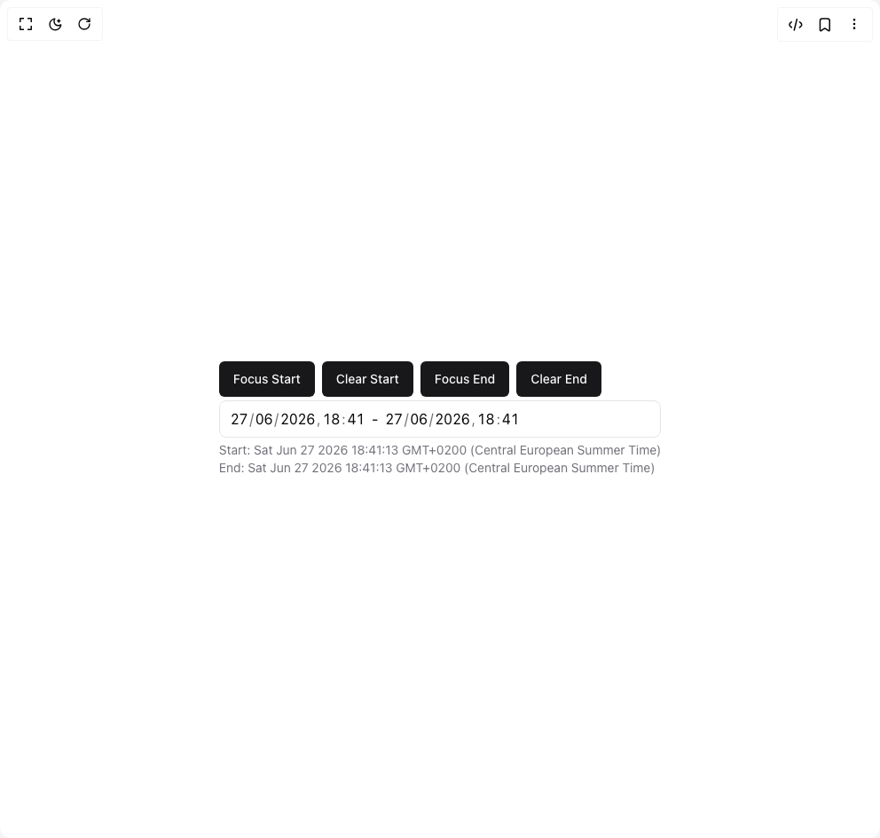

# Build Date Time Input in BuilderStudio

> Build this component in our Agentic IDE: [BuilderStudio](https://builderstudio.dev).
>
> Join the BuilderStudio community on [Discord](https://discord.gg/QdWeSGCqfe) and [Reddit](https://reddit.com/r/builderstudio).



## Component

- Author group: `hihahihahoho`
- Component: `date-time-input`
- Variant: `default`
- Rendered HTML snapshot: [`rendered.html`](rendered.html)

## BuilderStudio prompt

You are implementing a React component based on a component reference.

## Component identity

- Author: hihahihahoho
- Component slug: date-time-input
- Demo slug: default
- Title: date-time-input
- Description: 

## Goal

Recreate this component in a React + TypeScript + Tailwind CSS project. Preserve the visual layout, spacing, colors, border radius, shadows, interaction behavior, animation behavior, responsive behavior, and dark mode behavior shown in the rendered demo.

## Implementation requirements

- Use React and TypeScript.
- Use Tailwind CSS classes whenever possible.
- Keep the component self-contained unless the source files require helper components.
- If the source uses CSS variables, custom CSS, animations, or keyframes, include them.
- If the source uses external packages, list and use the required packages.
- Preserve accessibility attributes, button semantics, links, keyboard behavior, and ARIA attributes when visible in the source.
- Do not replace the component with a simplified placeholder.
- Return complete production-ready code.

## Dependencies

No reference metadata available.

## Rendered DOM snapshot

This is the rendered demo HTML extracted from the live preview. Use it to verify structure, class names, visible content, and layout.

```html
<div id="root"><div class="relative flex items-center justify-center h-screen w-full m-auto p-16 bg-background text-foreground"><div class="absolute lab-bg inset-0 size-full"><div class="absolute inset-0 bg-[radial-gradient(#00000021_1px,transparent_1px)] dark:bg-[radial-gradient(#ffffff22_1px,transparent_1px)]"></div></div><div class="flex w-full justify-center relative"><div class="flex flex-col space-y-1"><div class="flex flex-wrap gap-2"><button class="inline-flex items-center justify-center whitespace-nowrap rounded-md text-sm font-medium ring-offset-background transition-colors focus-visible:outline-none focus-visible:ring-2 focus-visible:ring-ring focus-visible:ring-offset-2 disabled:pointer-events-none disabled:opacity-50 bg-primary text-primary-foreground hover:bg-primary/90 h-10 px-4 py-2">Focus Start</button><button class="inline-flex items-center justify-center whitespace-nowrap rounded-md text-sm font-medium ring-offset-background transition-colors focus-visible:outline-none focus-visible:ring-2 focus-visible:ring-ring focus-visible:ring-offset-2 disabled:pointer-events-none disabled:opacity-50 bg-primary text-primary-foreground hover:bg-primary/90 h-10 px-4 py-2">Clear Start</button><button class="inline-flex items-center justify-center whitespace-nowrap rounded-md text-sm font-medium ring-offset-background transition-colors focus-visible:outline-none focus-visible:ring-2 focus-visible:ring-ring focus-visible:ring-offset-2 disabled:pointer-events-none disabled:opacity-50 bg-primary text-primary-foreground hover:bg-primary/90 h-10 px-4 py-2">Focus End</button><button class="inline-flex items-center justify-center whitespace-nowrap rounded-md text-sm font-medium ring-offset-background transition-colors focus-visible:outline-none focus-visible:ring-2 focus-visible:ring-ring focus-visible:ring-offset-2 disabled:pointer-events-none disabled:opacity-50 bg-primary text-primary-foreground hover:bg-primary/90 h-10 px-4 py-2">Clear End</button></div><div class="py-2 px-3 rounded-lg border w-full"><div tabindex="-1"><div class="flex gap-2 items-center"><div class="flex gap-[1px] mx-[-1px] select-none" aria-label="Date/Time Input"><div><div role="spinbutton" class="relative caret-transparent select-none tabular-nums px-[1px] outline-none rounded-md cursor-text text-center text-foreground hover:bg-accent" id="«r0»-day" aria-label="Day" contenteditable="true" inputmode="numeric" spellcheck="false" autocorrect="off" tabindex="0">27</div></div><span aria-hidden="true" class="text-muted-foreground">/</span><div><div role="spinbutton" class="relative caret-transparent select-none tabular-nums px-[1px] outline-none rounded-md cursor-text text-center text-foreground hover:bg-accent" id="«r0»-month" aria-label="Month" contenteditable="true" inputmode="numeric" spellcheck="false" autocorrect="off" tabindex="0">06</div></div><span aria-hidden="true" class="text-muted-foreground">/</span><div><div role="spinbutton" class="relative caret-transparent select-none tabular-nums px-[1px] outline-none rounded-md cursor-text text-center text-foreground hover:bg-accent" id="«r0»-year" aria-label="Year" contenteditable="true" inputmode="numeric" spellcheck="false" autocorrect="off" tabindex="0">2026</div></div><span aria-hidden="true" class="text-muted-foreground">,</span><div><div role="spinbutton" class="relative caret-transparent select-none tabular-nums px-[1px] outline-none rounded-md cursor-text text-center text-foreground hover:bg-accent" id="«r0»-hour" aria-label="Hour" contenteditable="true" inputmode="numeric" spellcheck="false" autocorrect="off" tabindex="0">18</div></div><span aria-hidden="true" class="text-muted-foreground">:</span><div><div role="spinbutton" class="relative caret-transparent select-none tabular-nums px-[1px] outline-none rounded-md cursor-text text-center text-foreground hover:bg-accent" id="«r0»-minute" aria-label="Minute" contenteditable="true" inputmode="numeric" spellcheck="false" autocorrect="off" tabindex="0">41</div></div></div>-<div class="flex gap-[1px] mx-[-1px] select-none" aria-label="Date/Time Input"><div><div role="spinbutton" class="relative caret-transparent select-none tabular-nums px-[1px] outline-none rounded-md cursor-text text-center text-foreground hover:bg-accent" id="«r1»-day" aria-label="Day" contenteditable="true" inputmode="numeric" spellcheck="false" autocorrect="off" tabindex="0">27</div></div><span aria-hidden="true" class="text-muted-foreground">/</span><div><div role="spinbutton" class="relative caret-transparent select-none tabular-nums px-[1px] outline-none rounded-md cursor-text text-center text-foreground hover:bg-accent" id="«r1»-month" aria-label="Month" contenteditable="true" inputmode="numeric" spellcheck="false" autocorrect="off" tabindex="0">06</div></div><span aria-hidden="true" class="text-muted-foreground">/</span><div><div role="spinbutton" class="relative caret-transparent select-none tabular-nums px-[1px] outline-none rounded-md cursor-text text-center text-foreground hover:bg-accent" id="«r1»-year" aria-label="Year" contenteditable="true" inputmode="numeric" spellcheck="false" autocorrect="off" tabindex="0">2026</div></div><span aria-hidden="true" class="text-muted-foreground">,</span><div><div role="spinbutton" class="relative caret-transparent select-none tabular-nums px-[1px] outline-none rounded-md cursor-text text-center text-foreground hover:bg-accent" id="«r1»-hour" aria-label="Hour" contenteditable="true" inputmode="numeric" spellcheck="false" autocorrect="off" tabindex="0">18</div></div><span aria-hidden="true" class="text-muted-foreground">:</span><div><div role="spinbutton" class="relative caret-transparent select-none tabular-nums px-[1px] outline-none rounded-md cursor-text text-center text-foreground hover:bg-accent" id="«r1»-minute" aria-label="Minute" contenteditable="true" inputmode="numeric" spellcheck="false" autocorrect="off" tabindex="0">41</div></div></div></div></div></div><div class="text-muted-foreground text-sm">Start: Sat Jun 27 2026 18:41:13 GMT+0200 (Central European Summer Time) <br>End: Sat Jun 27 2026 18:41:13 GMT+0200 (Central European Summer Time)</div></div></div></div></div>
```

## Reference source files

No reference source files were available.
