# Iamsatish4564 Components

18 components are available in this author group.

> Build any component in [BuilderStudio](https://builderstudio.dev), then share improvements with the community on [Discord](https://discord.gg/QdWeSGCqfe) or [Reddit](https://reddit.com/r/builderstudio).

| Preview | Component | Variant |
| --- | --- | --- |
| [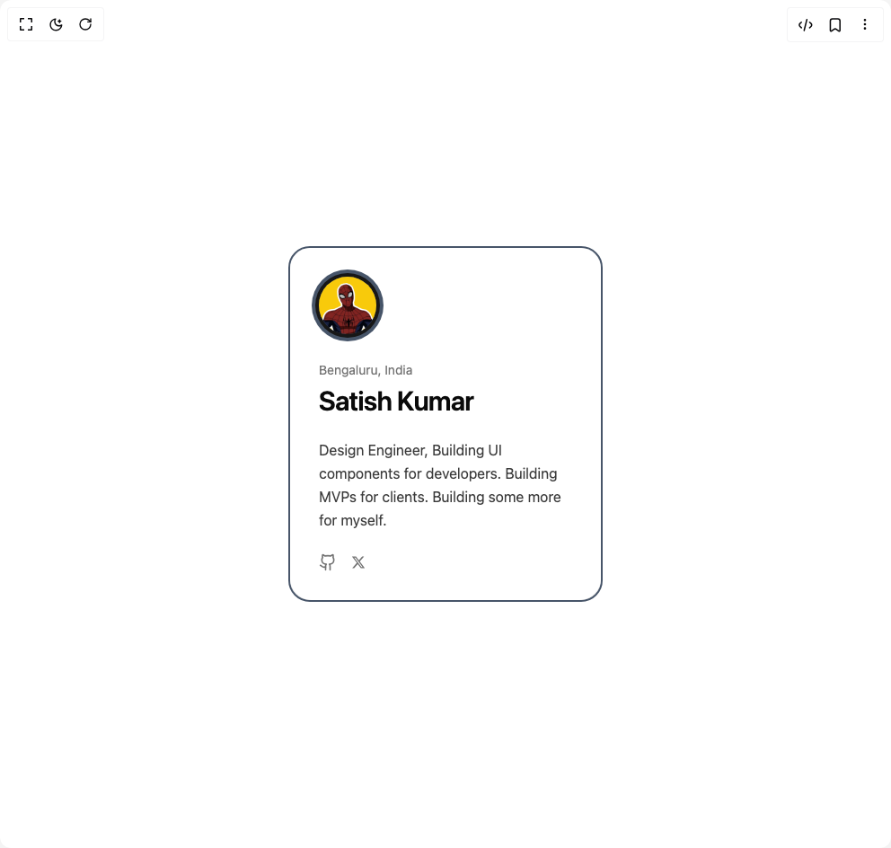](animated-profile-card/blue-profile-card/README.md) | [Animated Profile Card](animated-profile-card/blue-profile-card/README.md) | `blue-profile-card` |
|  | [Animated Profile Card](animated-profile-card/default/README.md) | `default` |
| [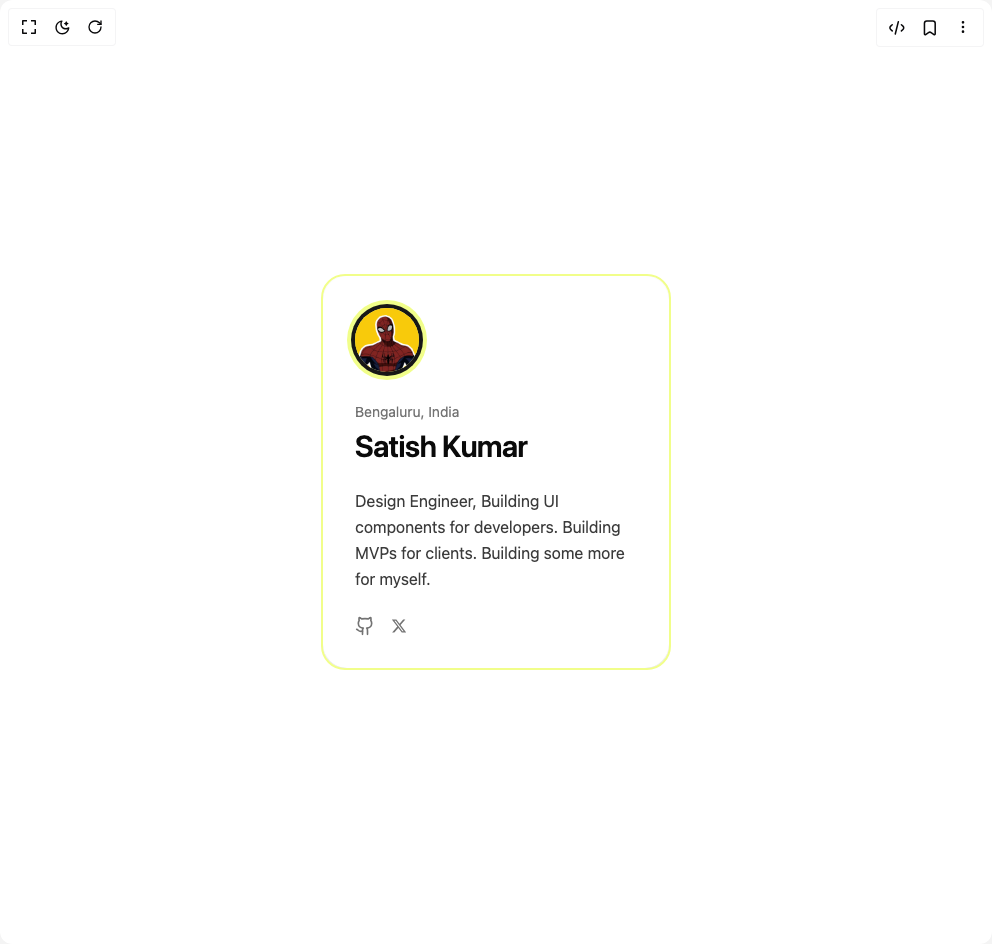](animated-profile-card/yellow-profile-card/README.md) | [Animated Profile Card](animated-profile-card/yellow-profile-card/README.md) | `yellow-profile-card` |
|  | [Curtain Button](curtain-button/default/README.md) | `default` |
|  | [Eclipse Button](eclipse-button/default/README.md) | `default` |
|  | [Eclipse Button](eclipse-button/loading-state/README.md) | `loading-state` |
| [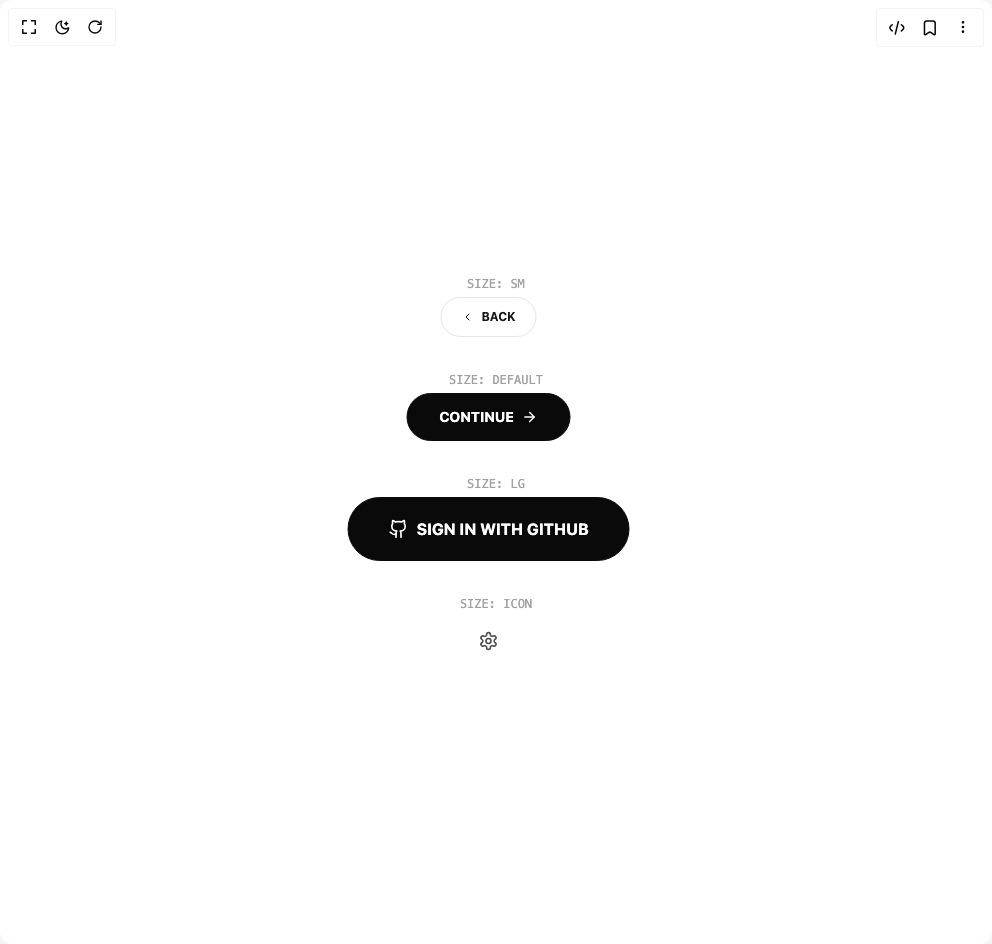](eclipse-button/sizes/README.md) | [Eclipse Button](eclipse-button/sizes/README.md) | `sizes` |
| [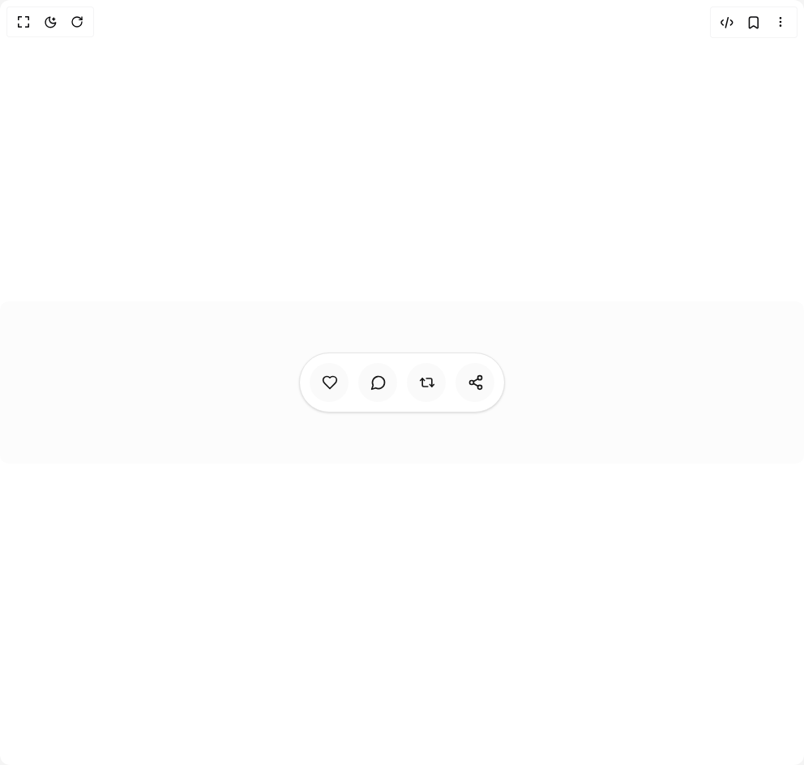](micro-expander/default/README.md) | [Micro Expander](micro-expander/default/README.md) | `default` |
|  | [Micro Expander](micro-expander/micro-expander/README.md) | `micro-expander` |
| [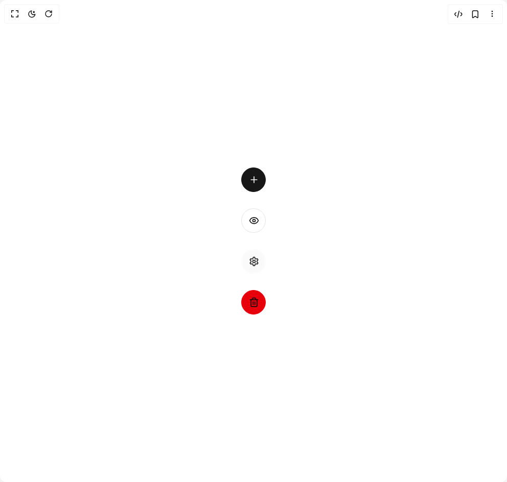](micro-expander/visual-variants/README.md) | [Micro Expander](micro-expander/visual-variants/README.md) | `visual-variants` |
| [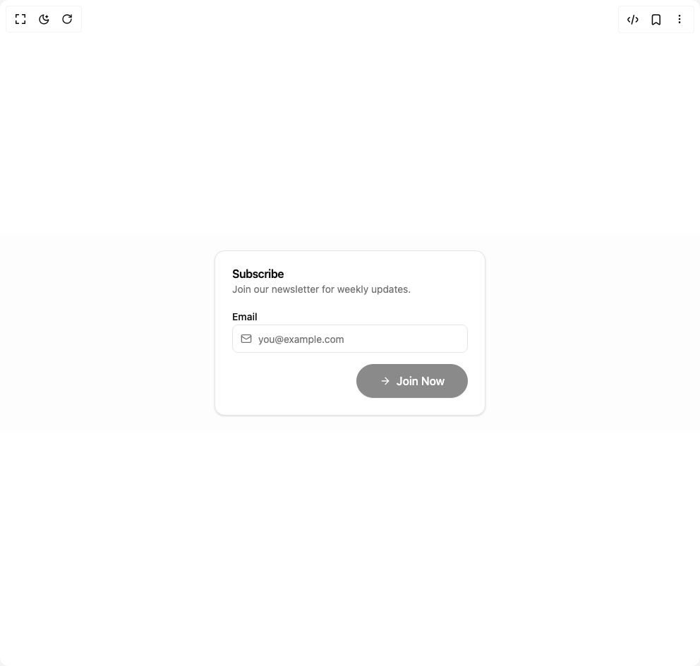](morph-button/async-form-submission/README.md) | [Morph Button](morph-button/async-form-submission/README.md) | `async-form-submission` |
| [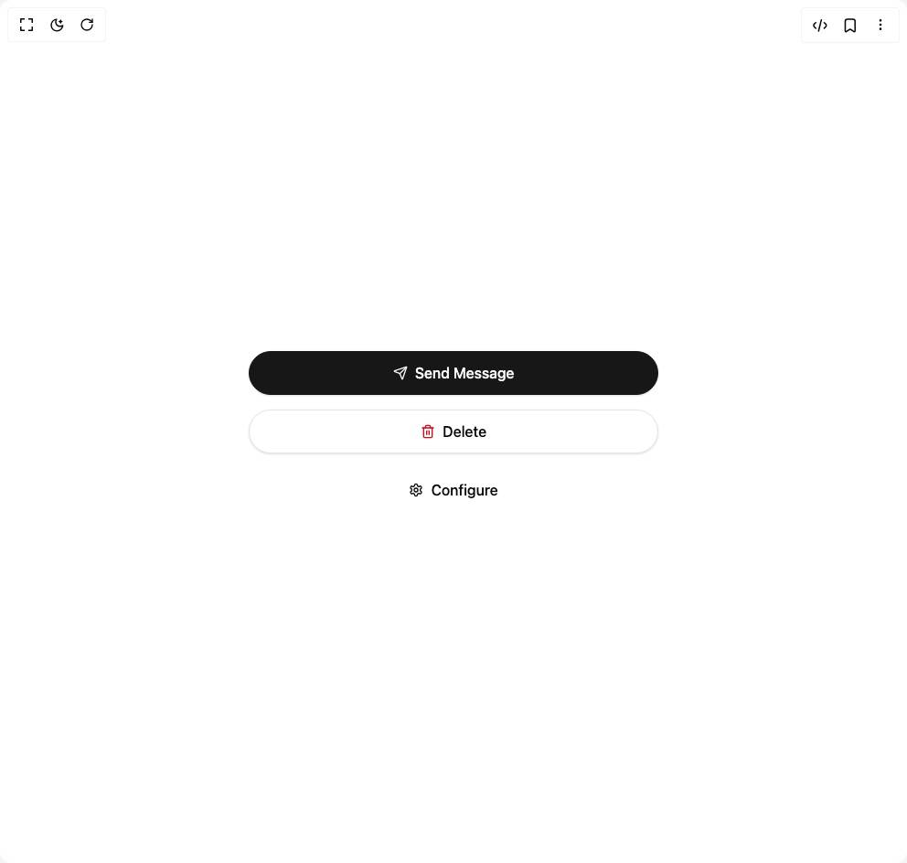](morph-button/default/README.md) | [Morph Button](morph-button/default/README.md) | `default` |
| [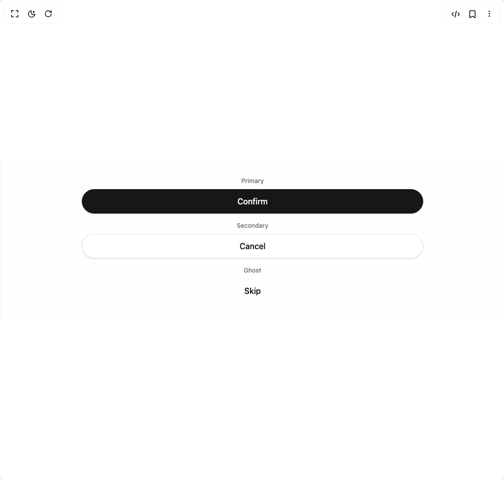](morph-button/variants/README.md) | [Morph Button](morph-button/variants/README.md) | `variants` |
| [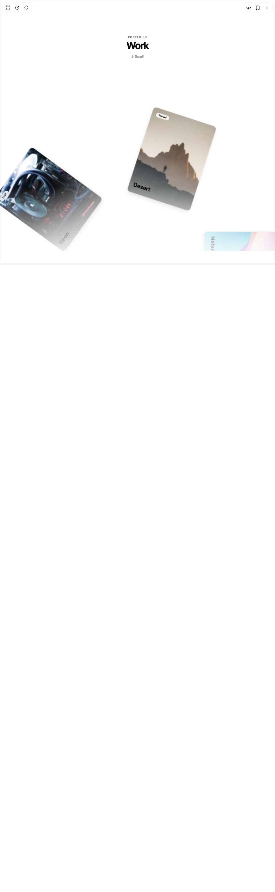](portfolio-and-image-gallery/default/README.md) | [Portfolio And Image Gallery](portfolio-and-image-gallery/default/README.md) | `default` |
| [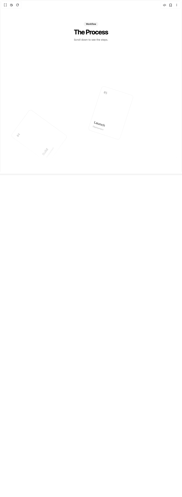](portfolio-and-image-gallery/image-gallery/README.md) | [Portfolio And Image Gallery](portfolio-and-image-gallery/image-gallery/README.md) | `image-gallery` |
|  | [Prime Button](prime-button/custom-text/README.md) | `custom-text` |
| [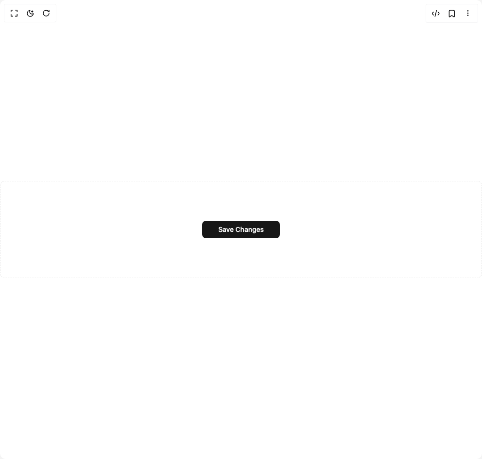](prime-button/default/README.md) | [Prime Button](prime-button/default/README.md) | `default` |
|  | [Prime Button](prime-button/variant-sizes/README.md) | `variant-sizes` |
