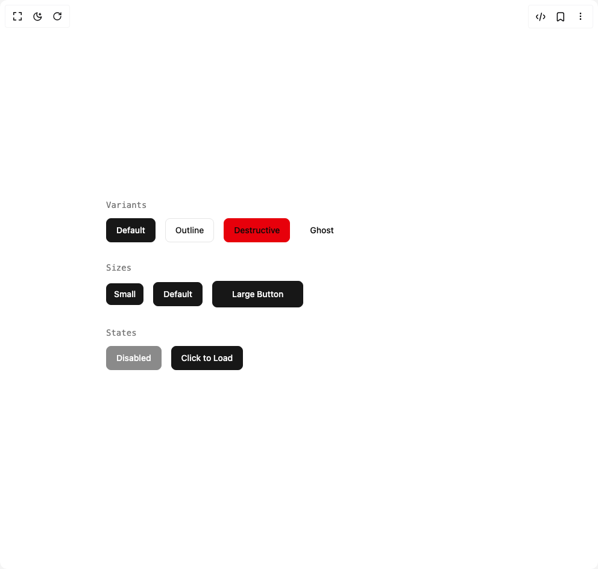

# Build Curtain Button in BuilderStudio

> Build this component in our Agentic IDE: [BuilderStudio](https://builderstudio.dev).
>
> Join the BuilderStudio community on [Discord](https://discord.gg/QdWeSGCqfe) and [Reddit](https://reddit.com/r/builderstudio).



## Component

- Author group: `iamsatish4564`
- Component: `curtain-button`
- Variant: `default`
- Rendered HTML snapshot: [`rendered.html`](rendered.html)

## BuilderStudio prompt

You are implementing a React component based on a component reference.

## Component identity

- Author: iamsatish4564
- Component slug: curtain-button
- Demo slug: default
- Title: curtain-button
- Description: 

## Goal

Recreate this component in a React + TypeScript + Tailwind CSS project. Preserve the visual layout, spacing, colors, border radius, shadows, interaction behavior, animation behavior, responsive behavior, and dark mode behavior shown in the rendered demo.

## Implementation requirements

- Use React and TypeScript.
- Use Tailwind CSS classes whenever possible.
- Keep the component self-contained unless the source files require helper components.
- If the source uses CSS variables, custom CSS, animations, or keyframes, include them.
- If the source uses external packages, list and use the required packages.
- Preserve accessibility attributes, button semantics, links, keyboard behavior, and ARIA attributes when visible in the source.
- Do not replace the component with a simplified placeholder.
- Return complete production-ready code.

## Dependencies

No reference metadata available.

## Rendered DOM snapshot

This is the rendered demo HTML extracted from the live preview. Use it to verify structure, class names, visible content, and layout.

```html
<div id="root"><div class="w-screen min-h-screen flex justify-center items-center"><div class="w-screen min-h-screen flex justify-center items-center"><div class="flex flex-col gap-8 w-full max-w-2xl mx-auto p-4"><div class="space-y-3"><h4 class="text-sm font-medium text-muted-foreground font-mono">Variants</h4><div class="flex flex-wrap gap-4"><button class="relative overflow-hidden rounded-md font-medium ring-offset-background transition-colors inline-flex items-center justify-center whitespace-nowrap text-sm focus-visible:outline-none focus-visible:ring-2 focus-visible:ring-ring focus-visible:ring-offset-2 bg-primary border border-primary text-primary-foreground h-10 px-4 py-2" tabindex="0"><div class="absolute inset-0 z-0 bg-primary-foreground" style="transform: translateY(100%);"></div><div class="relative z-10 flex h-5 flex-col items-center justify-start overflow-hidden" style="opacity: 1; transform: none;"><span class="invisible whitespace-nowrap opacity-0">Default</span><div class="absolute left-0 right-0 top-0 flex flex-col text-center" style="transform: none;"><span class="flex h-5 items-center justify-center whitespace-nowrap text-primary-foreground">Default</span><span class="flex h-5 items-center justify-center whitespace-nowrap text-primary" aria-hidden="true">Default</span></div></div></button><button class="relative overflow-hidden rounded-md font-medium ring-offset-background transition-colors inline-flex items-center justify-center whitespace-nowrap text-sm focus-visible:outline-none focus-visible:ring-2 focus-visible:ring-ring focus-visible:ring-offset-2 bg-background border border-input text-primary hover:border-primary h-10 px-4 py-2" tabindex="0"><div class="absolute inset-0 z-0 bg-primary" style="transform: translateY(100%);"></div><div class="relative z-10 flex h-5 flex-col items-center justify-start overflow-hidden" style="opacity: 1; transform: none;"><span class="invisible whitespace-nowrap opacity-0">Outline</span><div class="absolute left-0 right-0 top-0 flex flex-col text-center" style="transform: none;"><span class="flex h-5 items-center justify-center whitespace-nowrap text-primary">Outline</span><span class="flex h-5 items-center justify-center whitespace-nowrap text-primary-foreground" aria-hidden="true">Outline</span></div></div></button><button class="relative overflow-hidden rounded-md font-medium ring-offset-background transition-colors inline-flex items-center justify-center whitespace-nowrap text-sm focus-visible:outline-none focus-visible:ring-2 focus-visible:ring-ring focus-visible:ring-offset-2 bg-destructive border border-destructive text-destructive-foreground h-10 px-4 py-2" tabindex="0"><div class="absolute inset-0 z-0 bg-destructive-foreground" style="transform: translateY(100%);"></div><div class="relative z-10 flex h-5 flex-col items-center justify-start overflow-hidden" style="opacity: 1; transform: none;"><span class="invisible whitespace-nowrap opacity-0">Destructive</span><div class="absolute left-0 right-0 top-0 flex flex-col text-center" style="transform: none;"><span class="flex h-5 items-center justify-center whitespace-nowrap text-destructive-foreground">Destructive</span><span class="flex h-5 items-center justify-center whitespace-nowrap text-destructive" aria-hidden="true">Destructive</span></div></div></button><button class="relative overflow-hidden rounded-md font-medium ring-offset-background transition-colors inline-flex items-center justify-center whitespace-nowrap text-sm focus-visible:outline-none focus-visible:ring-2 focus-visible:ring-ring focus-visible:ring-offset-2 bg-transparent border border-transparent text-foreground h-10 px-4 py-2" tabindex="0"><div class="absolute inset-0 z-0 bg-accent" style="transform: translateY(100%);"></div><div class="relative z-10 flex h-5 flex-col items-center justify-start overflow-hidden" style="opacity: 1; transform: none;"><span class="invisible whitespace-nowrap opacity-0">Ghost</span><div class="absolute left-0 right-0 top-0 flex flex-col text-center" style="transform: none;"><span class="flex h-5 items-center justify-center whitespace-nowrap text-foreground">Ghost</span><span class="flex h-5 items-center justify-center whitespace-nowrap text-accent-foreground" aria-hidden="true">Ghost</span></div></div></button></div></div><div class="space-y-3"><h4 class="text-sm font-medium text-muted-foreground font-mono">Sizes</h4><div class="flex flex-wrap items-center gap-4"><button class="relative overflow-hidden font-medium ring-offset-background transition-colors inline-flex items-center justify-center whitespace-nowrap text-sm focus-visible:outline-none focus-visible:ring-2 focus-visible:ring-ring focus-visible:ring-offset-2 bg-primary border border-primary text-primary-foreground h-9 rounded-md px-3" tabindex="0"><div class="absolute inset-0 z-0 bg-primary-foreground" style="transform: translateY(100%);"></div><div class="relative z-10 flex h-5 flex-col items-center justify-start overflow-hidden" style="opacity: 1; transform: none;"><span class="invisible whitespace-nowrap opacity-0">Small</span><div class="absolute left-0 right-0 top-0 flex flex-col text-center" style="transform: none;"><span class="flex h-5 items-center justify-center whitespace-nowrap text-primary-foreground">Small</span><span class="flex h-5 items-center justify-center whitespace-nowrap text-primary" aria-hidden="true">Small</span></div></div></button><button class="relative overflow-hidden rounded-md font-medium ring-offset-background transition-colors inline-flex items-center justify-center whitespace-nowrap text-sm focus-visible:outline-none focus-visible:ring-2 focus-visible:ring-ring focus-visible:ring-offset-2 bg-primary border border-primary text-primary-foreground h-10 px-4 py-2" tabindex="0"><div class="absolute inset-0 z-0 bg-primary-foreground" style="transform: translateY(100%);"></div><div class="relative z-10 flex h-5 flex-col items-center justify-start overflow-hidden" style="opacity: 1; transform: none;"><span class="invisible whitespace-nowrap opacity-0">Default</span><div class="absolute left-0 right-0 top-0 flex flex-col text-center" style="transform: none;"><span class="flex h-5 items-center justify-center whitespace-nowrap text-primary-foreground">Default</span><span class="flex h-5 items-center justify-center whitespace-nowrap text-primary" aria-hidden="true">Default</span></div></div></button><button class="relative overflow-hidden font-medium ring-offset-background transition-colors inline-flex items-center justify-center whitespace-nowrap text-sm focus-visible:outline-none focus-visible:ring-2 focus-visible:ring-ring focus-visible:ring-offset-2 bg-primary border border-primary text-primary-foreground h-11 rounded-md px-8" tabindex="0"><div class="absolute inset-0 z-0 bg-primary-foreground" style="transform: translateY(100%);"></div><div class="relative z-10 flex h-5 flex-col items-center justify-start overflow-hidden" style="opacity: 1; transform: none;"><span class="invisible whitespace-nowrap opacity-0">Large Button</span><div class="absolute left-0 right-0 top-0 flex flex-col text-center" style="transform: none;"><span class="flex h-5 items-center justify-center whitespace-nowrap text-primary-foreground">Large Button</span><span class="flex h-5 items-center justify-center whitespace-nowrap text-primary" aria-hidden="true">Large Button</span></div></div></button></div></div><div class="space-y-3"><h4 class="text-sm font-medium text-muted-foreground font-mono">States</h4><div class="flex flex-wrap gap-4"><button class="relative overflow-hidden rounded-md font-medium ring-offset-background transition-colors inline-flex items-center justify-center whitespace-nowrap text-sm focus-visible:outline-none focus-visible:ring-2 focus-visible:ring-ring focus-visible:ring-offset-2 pointer-events-none opacity-50 bg-primary border border-primary text-primary-foreground h-10 px-4 py-2" disabled=""><div class="absolute inset-0 z-0 bg-primary-foreground" style="transform: translateY(100%);"></div><div class="relative z-10 flex h-5 flex-col items-center justify-start overflow-hidden" style="opacity: 1; transform: none;"><span class="invisible whitespace-nowrap opacity-0">Disabled</span><div class="absolute left-0 right-0 top-0 flex flex-col text-center" style="transform: none;"><span class="flex h-5 items-center justify-center whitespace-nowrap text-primary-foreground">Disabled</span><span class="flex h-5 items-center justify-center whitespace-nowrap text-primary" aria-hidden="true">Disabled</span></div></div></button><button class="relative overflow-hidden rounded-md font-medium ring-offset-background transition-colors inline-flex items-center justify-center whitespace-nowrap text-sm focus-visible:outline-none focus-visible:ring-2 focus-visible:ring-ring focus-visible:ring-offset-2 bg-primary border border-primary text-primary-foreground h-10 px-4 py-2" tabindex="0"><div class="absolute inset-0 z-0 bg-primary-foreground" style="transform: translateY(100%);"></div><div class="relative z-10 flex h-5 flex-col items-center justify-start overflow-hidden" style="opacity: 1; transform: none;"><span class="invisible whitespace-nowrap opacity-0">Click to Load</span><div class="absolute left-0 right-0 top-0 flex flex-col text-center" style="transform: none;"><span class="flex h-5 items-center justify-center whitespace-nowrap text-primary-foreground">Click to Load</span><span class="flex h-5 items-center justify-center whitespace-nowrap text-primary" aria-hidden="true">Click to Load</span></div></div></button></div></div></div></div></div></div>
```

## Reference source files

No reference source files were available.
