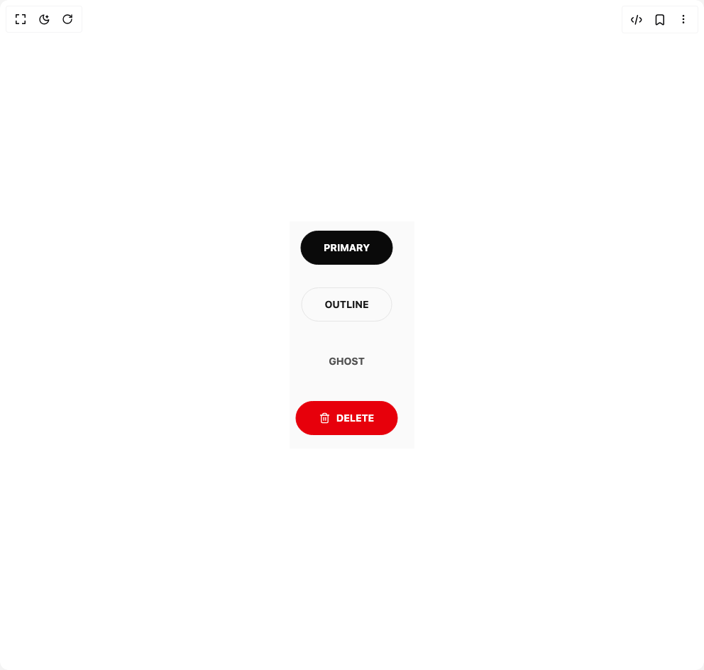

# Build Eclipse Button in BuilderStudio

> Build this component in our Agentic IDE: [BuilderStudio](https://builderstudio.dev).
>
> Join the BuilderStudio community on [Discord](https://discord.gg/QdWeSGCqfe) and [Reddit](https://reddit.com/r/builderstudio).



## Component

- Author group: `iamsatish4564`
- Component: `eclipse-button`
- Variant: `default`
- Rendered HTML snapshot: [`rendered.html`](rendered.html)

## BuilderStudio prompt

You are implementing a React component based on a component reference.

## Component identity

- Author: iamsatish4564
- Component slug: eclipse-button
- Demo slug: default
- Title: eclipse-button
- Description: 

## Goal

Recreate this component in a React + TypeScript + Tailwind CSS project. Preserve the visual layout, spacing, colors, border radius, shadows, interaction behavior, animation behavior, responsive behavior, and dark mode behavior shown in the rendered demo.

## Implementation requirements

- Use React and TypeScript.
- Use Tailwind CSS classes whenever possible.
- Keep the component self-contained unless the source files require helper components.
- If the source uses CSS variables, custom CSS, animations, or keyframes, include them.
- If the source uses external packages, list and use the required packages.
- Preserve accessibility attributes, button semantics, links, keyboard behavior, and ARIA attributes when visible in the source.
- Do not replace the component with a simplified placeholder.
- Return complete production-ready code.

## Dependencies

No reference metadata available.

## Rendered DOM snapshot

This is the rendered demo HTML extracted from the live preview. Use it to verify structure, class names, visible content, and layout.

```html
<div id="root"><div class="w-screen min-h-screen flex justify-center items-center"><div class="w-screen min-h-screen flex justify-center items-center"><div class="p-4 min-h-[200px] flex items-center justify-center bg-neutral-50 dark:bg-neutral-900"><div class="grid w-full grid-cols-1 gap-8 @md:grid-cols-2 @lg:grid-cols-4 place-items-center"><button class="relative isolate overflow-hidden rounded-full border font-bold uppercase tracking-widest inline-flex items-center justify-center bg-neutral-950 text-white border-neutral-950 h-12 px-8 text-sm focus-visible:outline-none focus-visible:ring-2 focus-visible:ring-neutral-950 focus-visible:ring-offset-2" type="button" tabindex="0" style="transform: translateX(-7.5px) translateY(-3px);"><svg class="absolute hidden"><filter id="noiseFilter"><feTurbulence type="fractalNoise" baseFrequency="0.8" numOctaves="3" stitchTiles="stitch"></feTurbulence><feColorMatrix type="matrix" values="1 0 0 0 0  0 1 0 0 0  0 0 1 0 0  0 0 0 15 -2"></feColorMatrix><feComposite operator="in" in2="SourceGraphic" result="monoNoise"></feComposite><feBlend in="SourceGraphic" in2="monoNoise" mode="screen"></feBlend></filter></svg><span class="relative z-10 pointer-events-none"><span class="flex items-center justify-center" style="letter-spacing: 0px; transform: none;"><span>Primary</span></span></span><div class="absolute inset-0 z-20 flex items-center justify-center pointer-events-none select-none bg-white text-neutral-950 h-12 px-8 text-sm" aria-hidden="true" style="clip-path: circle(0px at 50% 50%);"><div class="absolute inset-0 opacity-20 mix-blend-overlay pointer-events-none" style="filter: url(&quot;#noiseFilter&quot;);"></div><span class="flex items-center justify-center" style="letter-spacing: 0px; transform: none;"><span>Primary</span></span></div></button><button class="relative isolate overflow-hidden rounded-full border font-bold uppercase tracking-widest inline-flex items-center justify-center bg-transparent text-neutral-900 border-neutral-200 h-12 px-8 text-sm focus-visible:outline-none focus-visible:ring-2 focus-visible:ring-neutral-950 focus-visible:ring-offset-2" type="button" tabindex="0" style="transform: translateX(-7.5px) translateY(-3px);"><svg class="absolute hidden"><filter id="noiseFilter"><feTurbulence type="fractalNoise" baseFrequency="0.8" numOctaves="3" stitchTiles="stitch"></feTurbulence><feColorMatrix type="matrix" values="1 0 0 0 0  0 1 0 0 0  0 0 1 0 0  0 0 0 15 -2"></feColorMatrix><feComposite operator="in" in2="SourceGraphic" result="monoNoise"></feComposite><feBlend in="SourceGraphic" in2="monoNoise" mode="screen"></feBlend></filter></svg><span class="relative z-10 pointer-events-none"><span class="flex items-center justify-center" style="letter-spacing: 0px; transform: none;"><span>Outline</span></span></span><div class="absolute inset-0 z-20 flex items-center justify-center pointer-events-none select-none bg-neutral-900 text-white h-12 px-8 text-sm" aria-hidden="true" style="clip-path: circle(0px at 50% 50%);"><div class="absolute inset-0 opacity-20 mix-blend-overlay pointer-events-none" style="filter: url(&quot;#noiseFilter&quot;);"></div><span class="flex items-center justify-center" style="letter-spacing: 0px; transform: none;"><span>Outline</span></span></div></button><button class="relative isolate overflow-hidden rounded-full border font-bold uppercase tracking-widest inline-flex items-center justify-center bg-transparent text-neutral-600 border-transparent h-12 px-8 text-sm focus-visible:outline-none focus-visible:ring-2 focus-visible:ring-neutral-950 focus-visible:ring-offset-2" type="button" tabindex="0" style="transform: translateX(-7.5px) translateY(-3px);"><svg class="absolute hidden"><filter id="noiseFilter"><feTurbulence type="fractalNoise" baseFrequency="0.8" numOctaves="3" stitchTiles="stitch"></feTurbulence><feColorMatrix type="matrix" values="1 0 0 0 0  0 1 0 0 0  0 0 1 0 0  0 0 0 15 -2"></feColorMatrix><feComposite operator="in" in2="SourceGraphic" result="monoNoise"></feComposite><feBlend in="SourceGraphic" in2="monoNoise" mode="screen"></feBlend></filter></svg><span class="relative z-10 pointer-events-none"><span class="flex items-center justify-center" style="letter-spacing: 0px; transform: none;"><span>Ghost</span></span></span><div class="absolute inset-0 z-20 flex items-center justify-center pointer-events-none select-none bg-neutral-100 text-neutral-900 h-12 px-8 text-sm" aria-hidden="true" style="clip-path: circle(0px at 50% 50%);"><div class="absolute inset-0 opacity-20 mix-blend-overlay pointer-events-none" style="filter: url(&quot;#noiseFilter&quot;);"></div><span class="flex items-center justify-center" style="letter-spacing: 0px; transform: none;"><span>Ghost</span></span></div></button><button class="relative isolate overflow-hidden rounded-full border font-bold uppercase tracking-widest inline-flex items-center justify-center bg-red-600 text-white border-red-600 h-12 px-8 text-sm focus-visible:outline-none focus-visible:ring-2 focus-visible:ring-neutral-950 focus-visible:ring-offset-2" type="button" tabindex="0" style="transform: translateX(-7.5px) translateY(-3px);"><svg class="absolute hidden"><filter id="noiseFilter"><feTurbulence type="fractalNoise" baseFrequency="0.8" numOctaves="3" stitchTiles="stitch"></feTurbulence><feColorMatrix type="matrix" values="1 0 0 0 0  0 1 0 0 0  0 0 1 0 0  0 0 0 15 -2"></feColorMatrix><feComposite operator="in" in2="SourceGraphic" result="monoNoise"></feComposite><feBlend in="SourceGraphic" in2="monoNoise" mode="screen"></feBlend></filter></svg><span class="relative z-10 pointer-events-none"><span class="flex items-center justify-center gap-2" style="letter-spacing: 0px; transform: none;"><span class="flex items-center justify-center"><svg xmlns="http://www.w3.org/2000/svg" width="24" height="24" viewBox="0 0 24 24" fill="none" stroke="currentColor" stroke-width="2" stroke-linecap="round" stroke-linejoin="round" class="lucide lucide-trash2 lucide-trash-2 w-4 h-4" aria-hidden="true"><path d="M3 6h18"></path><path d="M19 6v14c0 1-1 2-2 2H7c-1 0-2-1-2-2V6"></path><path d="M8 6V4c0-1 1-2 2-2h4c1 0 2 1 2 2v2"></path><line x1="10" x2="10" y1="11" y2="17"></line><line x1="14" x2="14" y1="11" y2="17"></line></svg></span><span>Delete</span></span></span><div class="absolute inset-0 z-20 flex items-center justify-center pointer-events-none select-none bg-white text-red-600 h-12 px-8 text-sm" aria-hidden="true" style="clip-path: circle(0px at 50% 50%);"><div class="absolute inset-0 opacity-20 mix-blend-overlay pointer-events-none" style="filter: url(&quot;#noiseFilter&quot;);"></div><span class="flex items-center justify-center gap-2" style="letter-spacing: 0px; transform: none;"><span class="flex items-center justify-center"><svg xmlns="http://www.w3.org/2000/svg" width="24" height="24" viewBox="0 0 24 24" fill="none" stroke="currentColor" stroke-width="2" stroke-linecap="round" stroke-linejoin="round" class="lucide lucide-trash2 lucide-trash-2 w-4 h-4" aria-hidden="true"><path d="M3 6h18"></path><path d="M19 6v14c0 1-1 2-2 2H7c-1 0-2-1-2-2V6"></path><path d="M8 6V4c0-1 1-2 2-2h4c1 0 2 1 2 2v2"></path><line x1="10" x2="10" y1="11" y2="17"></line><line x1="14" x2="14" y1="11" y2="17"></line></svg></span><span>Delete</span></span></div></button></div></div></div></div></div>
```

## Reference source files

No reference source files were available.
