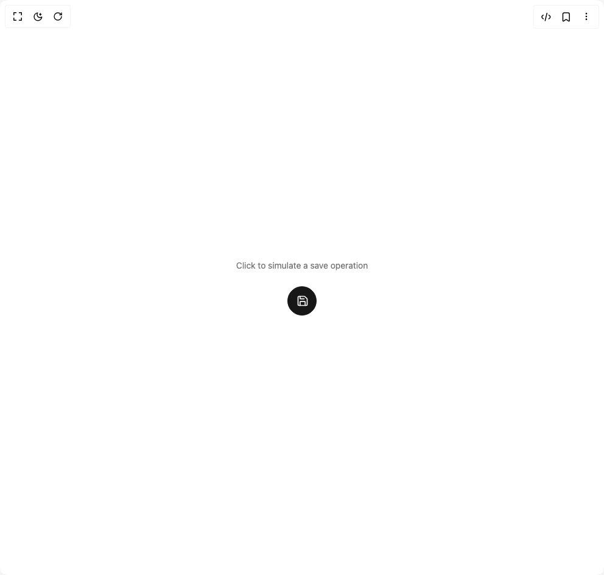

# Build Micro Expander in BuilderStudio

> Build this component in our Agentic IDE: [BuilderStudio](https://builderstudio.dev).
>
> Join the BuilderStudio community on [Discord](https://discord.gg/QdWeSGCqfe) and [Reddit](https://reddit.com/r/builderstudio).



## Component

- Author group: `iamsatish4564`
- Component: `micro-expander`
- Variant: `micro-expander`
- Rendered HTML snapshot: [`rendered.html`](rendered.html)

## BuilderStudio prompt

You are implementing a React component based on a component reference.

## Component identity

- Author: iamsatish4564
- Component slug: micro-expander
- Demo slug: micro-expander
- Title: micro-expander
- Description: 

## Goal

Recreate this component in a React + TypeScript + Tailwind CSS project. Preserve the visual layout, spacing, colors, border radius, shadows, interaction behavior, animation behavior, responsive behavior, and dark mode behavior shown in the rendered demo.

## Implementation requirements

- Use React and TypeScript.
- Use Tailwind CSS classes whenever possible.
- Keep the component self-contained unless the source files require helper components.
- If the source uses CSS variables, custom CSS, animations, or keyframes, include them.
- If the source uses external packages, list and use the required packages.
- Preserve accessibility attributes, button semantics, links, keyboard behavior, and ARIA attributes when visible in the source.
- Do not replace the component with a simplified placeholder.
- Return complete production-ready code.

## Dependencies

No reference metadata available.

## Rendered DOM snapshot

This is the rendered demo HTML extracted from the live preview. Use it to verify structure, class names, visible content, and layout.

```html
<div id="root"><div class="w-screen min-h-screen flex justify-center items-center"><div class="w-screen min-h-screen flex justify-center items-center"><div class="w-full min-h-[200px] flex flex-col items-center justify-center gap-4"><div class="text-sm text-muted-foreground mb-2">Click to simulate a save operation</div><button class="relative flex h-12 items-center overflow-hidden rounded-full whitespace-nowrap font-medium text-sm uppercase tracking-wide focus-visible:outline-none focus-visible:ring-2 focus-visible:ring-ring focus-visible:ring-offset-2 bg-primary text-primary-foreground border border-primary" aria-label="Save Changes" style="width: 48px;"><div class="grid h-12 w-12 place-items-center shrink-0 z-10"><div style="opacity: 1; transform: none;"><svg xmlns="http://www.w3.org/2000/svg" width="24" height="24" viewBox="0 0 24 24" fill="none" stroke="currentColor" stroke-width="2" stroke-linecap="round" stroke-linejoin="round" class="lucide lucide-save w-5 h-5" aria-hidden="true"><path d="M15.2 3a2 2 0 0 1 1.4.6l3.8 3.8a2 2 0 0 1 .6 1.4V19a2 2 0 0 1-2 2H5a2 2 0 0 1-2-2V5a2 2 0 0 1 2-2z"></path><path d="M17 21v-7a1 1 0 0 0-1-1H8a1 1 0 0 0-1 1v7"></path><path d="M7 3v4a1 1 0 0 0 1 1h7"></path></svg></div></div><div class="pr-6 pl-1" style="opacity: 0; transform: translateX(-10px);">Save Changes</div></button></div></div></div></div>
```

## Reference source files

No reference source files were available.
