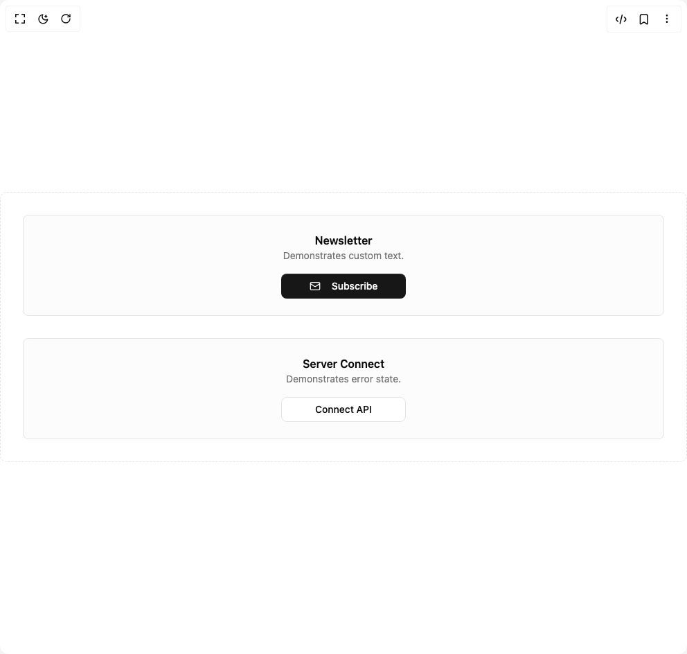

# Build Prime Button in BuilderStudio

> Build this component in our Agentic IDE: [BuilderStudio](https://builderstudio.dev).
>
> Join the BuilderStudio community on [Discord](https://discord.gg/QdWeSGCqfe) and [Reddit](https://reddit.com/r/builderstudio).



## Component

- Author group: `iamsatish4564`
- Component: `prime-button`
- Variant: `custom-text`
- Rendered HTML snapshot: [`rendered.html`](rendered.html)

## BuilderStudio prompt

You are implementing a React component based on a component reference.

## Component identity

- Author: iamsatish4564
- Component slug: prime-button
- Demo slug: custom-text
- Title: prime-button
- Description: 

## Goal

Recreate this component in a React + TypeScript + Tailwind CSS project. Preserve the visual layout, spacing, colors, border radius, shadows, interaction behavior, animation behavior, responsive behavior, and dark mode behavior shown in the rendered demo.

## Implementation requirements

- Use React and TypeScript.
- Use Tailwind CSS classes whenever possible.
- Keep the component self-contained unless the source files require helper components.
- If the source uses CSS variables, custom CSS, animations, or keyframes, include them.
- If the source uses external packages, list and use the required packages.
- Preserve accessibility attributes, button semantics, links, keyboard behavior, and ARIA attributes when visible in the source.
- Do not replace the component with a simplified placeholder.
- Return complete production-ready code.

## Dependencies

No reference metadata available.

## Rendered DOM snapshot

This is the rendered demo HTML extracted from the live preview. Use it to verify structure, class names, visible content, and layout.

```html
<div id="root"><div class="w-screen min-h-screen flex justify-center items-center"><div class="w-screen min-h-screen flex justify-center items-center"><div class="grid w-full grid-cols-1 gap-8 rounded-lg border border-dashed bg-background p-8 @md:grid-cols-2"><div class="flex flex-col items-center justify-center gap-4 rounded-md border bg-muted/30 p-6"><div class="text-center"><h3 class="font-semibold">Newsletter</h3><p class="text-sm text-muted-foreground">Demonstrates custom text.</p></div><button class="relative inline-flex items-center justify-center rounded-md text-sm font-medium transition-colors focus-visible:outline-none focus-visible:ring-2 focus-visible:ring-ring focus-visible:ring-offset-2 disabled:pointer-events-none disabled:opacity-50 select-none overflow-hidden bg-primary text-primary-foreground hover:bg-primary/90 h-9 px-4 py-2 w-full max-w-[180px] shadow-[inset_0_1px_0_0_rgba(255,255,255,0.1)]" tabindex="0"><span class="flex items-center gap-2" style="opacity: 1; filter: blur(0px); transform: none;"><svg xmlns="http://www.w3.org/2000/svg" width="24" height="24" viewBox="0 0 24 24" fill="none" stroke="currentColor" stroke-width="2" stroke-linecap="round" stroke-linejoin="round" class="lucide lucide-mail mr-2 h-4 w-4" aria-hidden="true"><rect width="20" height="16" x="2" y="4" rx="2"></rect><path d="m22 7-8.97 5.7a1.94 1.94 0 0 1-2.06 0L2 7"></path></svg>Subscribe</span></button></div><div class="flex flex-col items-center justify-center gap-4 rounded-md border bg-muted/30 p-6"><div class="text-center"><h3 class="font-semibold">Server Connect</h3><p class="text-sm text-muted-foreground">Demonstrates error state.</p></div><button class="relative inline-flex items-center justify-center rounded-md text-sm font-medium transition-colors focus-visible:outline-none focus-visible:ring-2 focus-visible:ring-ring focus-visible:ring-offset-2 disabled:pointer-events-none disabled:opacity-50 select-none overflow-hidden border border-input bg-background hover:bg-accent hover:text-accent-foreground h-9 px-4 py-2 w-full max-w-[180px] shadow-[inset_0_1px_0_0_rgba(255,255,255,0.1)]" tabindex="0"><span class="flex items-center gap-2" style="opacity: 1; filter: blur(0px); transform: none;">Connect API</span></button></div></div></div></div></div>
```

## Reference source files

No reference source files were available.
