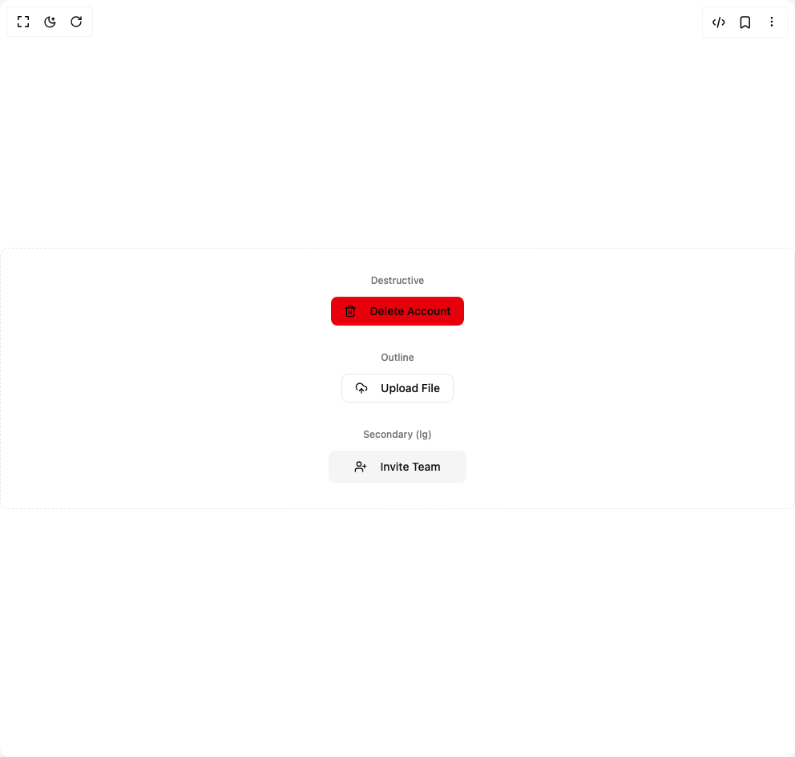

# Build Prime Button in BuilderStudio

> Build this component in our Agentic IDE: [BuilderStudio](https://builderstudio.dev).
>
> Join the BuilderStudio community on [Discord](https://discord.gg/QdWeSGCqfe) and [Reddit](https://reddit.com/r/builderstudio).



## Component

- Author group: `iamsatish4564`
- Component: `prime-button`
- Variant: `variant-sizes`
- Rendered HTML snapshot: [`rendered.html`](rendered.html)

## BuilderStudio prompt

You are implementing a React component based on a component reference.

## Component identity

- Author: iamsatish4564
- Component slug: prime-button
- Demo slug: variant-sizes
- Title: prime-button
- Description: 

## Goal

Recreate this component in a React + TypeScript + Tailwind CSS project. Preserve the visual layout, spacing, colors, border radius, shadows, interaction behavior, animation behavior, responsive behavior, and dark mode behavior shown in the rendered demo.

## Implementation requirements

- Use React and TypeScript.
- Use Tailwind CSS classes whenever possible.
- Keep the component self-contained unless the source files require helper components.
- If the source uses CSS variables, custom CSS, animations, or keyframes, include them.
- If the source uses external packages, list and use the required packages.
- Preserve accessibility attributes, button semantics, links, keyboard behavior, and ARIA attributes when visible in the source.
- Do not replace the component with a simplified placeholder.
- Return complete production-ready code.

## Dependencies

No reference metadata available.

## Rendered DOM snapshot

This is the rendered demo HTML extracted from the live preview. Use it to verify structure, class names, visible content, and layout.

```html
<div id="root"><div class="w-screen min-h-screen flex justify-center items-center"><div class="w-screen min-h-screen flex justify-center items-center"><div class="grid w-full grid-cols-1 gap-8 rounded-lg border border-dashed bg-background p-8 @md:grid-cols-3"><div class="flex flex-col items-center gap-3"><span class="text-xs font-medium text-muted-foreground">Destructive</span><button class="relative inline-flex items-center justify-center rounded-md text-sm font-medium transition-colors focus-visible:outline-none focus-visible:ring-2 focus-visible:ring-ring focus-visible:ring-offset-2 disabled:pointer-events-none disabled:opacity-50 select-none overflow-hidden bg-destructive text-destructive-foreground hover:bg-destructive/90 h-9 px-4 py-2 shadow-[inset_0_1px_0_0_rgba(255,255,255,0.1)]" tabindex="0"><span class="flex items-center gap-2" style="opacity: 1; filter: blur(0px); transform: none;"><svg xmlns="http://www.w3.org/2000/svg" width="24" height="24" viewBox="0 0 24 24" fill="none" stroke="currentColor" stroke-width="2" stroke-linecap="round" stroke-linejoin="round" class="lucide lucide-trash2 lucide-trash-2 mr-2 h-4 w-4" aria-hidden="true"><path d="M3 6h18"></path><path d="M19 6v14c0 1-1 2-2 2H7c-1 0-2-1-2-2V6"></path><path d="M8 6V4c0-1 1-2 2-2h4c1 0 2 1 2 2v2"></path><line x1="10" x2="10" y1="11" y2="17"></line><line x1="14" x2="14" y1="11" y2="17"></line></svg>Delete Account</span></button></div><div class="flex flex-col items-center gap-3"><span class="text-xs font-medium text-muted-foreground">Outline</span><button class="relative inline-flex items-center justify-center rounded-md text-sm font-medium transition-colors focus-visible:outline-none focus-visible:ring-2 focus-visible:ring-ring focus-visible:ring-offset-2 disabled:pointer-events-none disabled:opacity-50 select-none overflow-hidden border border-input bg-background hover:bg-accent hover:text-accent-foreground h-9 px-4 py-2 shadow-[inset_0_1px_0_0_rgba(255,255,255,0.1)]" tabindex="0"><span class="flex items-center gap-2" style="opacity: 1; filter: blur(0px); transform: none;"><svg xmlns="http://www.w3.org/2000/svg" width="24" height="24" viewBox="0 0 24 24" fill="none" stroke="currentColor" stroke-width="2" stroke-linecap="round" stroke-linejoin="round" class="lucide lucide-cloud-upload mr-2 h-4 w-4" aria-hidden="true"><path d="M12 13v8"></path><path d="M4 14.899A7 7 0 1 1 15.71 8h1.79a4.5 4.5 0 0 1 2.5 8.242"></path><path d="m8 17 4-4 4 4"></path></svg>Upload File</span></button></div><div class="flex flex-col items-center gap-3"><span class="text-xs font-medium text-muted-foreground">Secondary (lg)</span><button class="relative inline-flex items-center justify-center text-sm font-medium transition-colors focus-visible:outline-none focus-visible:ring-2 focus-visible:ring-ring focus-visible:ring-offset-2 disabled:pointer-events-none disabled:opacity-50 select-none overflow-hidden bg-secondary text-secondary-foreground hover:bg-secondary/80 h-10 rounded-md px-8 shadow-[inset_0_1px_0_0_rgba(255,255,255,0.1)]" tabindex="0"><span class="flex items-center gap-2" style="opacity: 1; filter: blur(0px); transform: none;"><svg xmlns="http://www.w3.org/2000/svg" width="24" height="24" viewBox="0 0 24 24" fill="none" stroke="currentColor" stroke-width="2" stroke-linecap="round" stroke-linejoin="round" class="lucide lucide-user-plus mr-2 h-4 w-4" aria-hidden="true"><path d="M16 21v-2a4 4 0 0 0-4-4H6a4 4 0 0 0-4 4v2"></path><circle cx="9" cy="7" r="4"></circle><line x1="19" x2="19" y1="8" y2="14"></line><line x1="22" x2="16" y1="11" y2="11"></line></svg>Invite Team</span></button></div></div></div></div></div>
```

## Reference source files

No reference source files were available.
