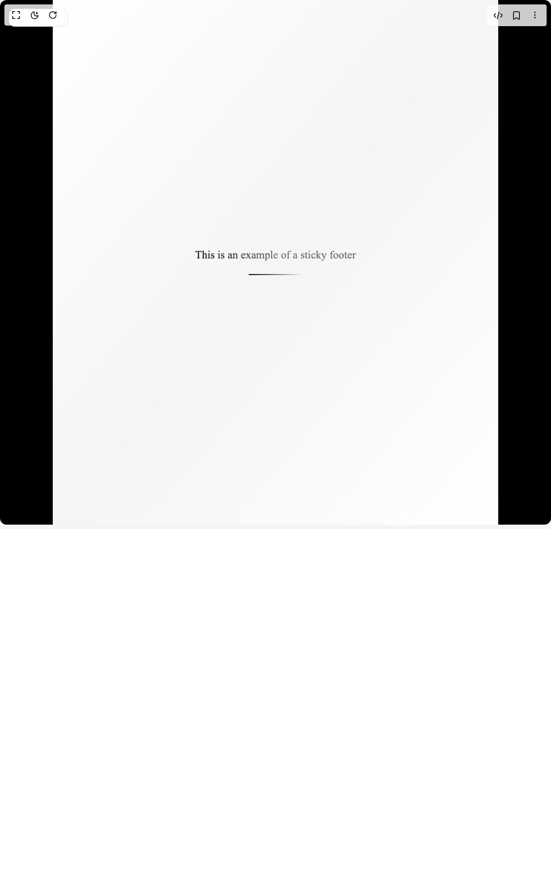
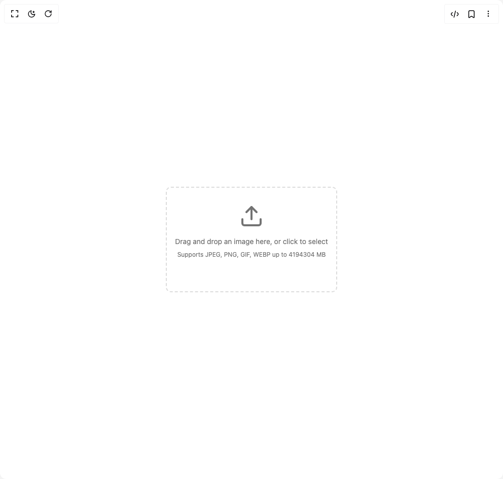
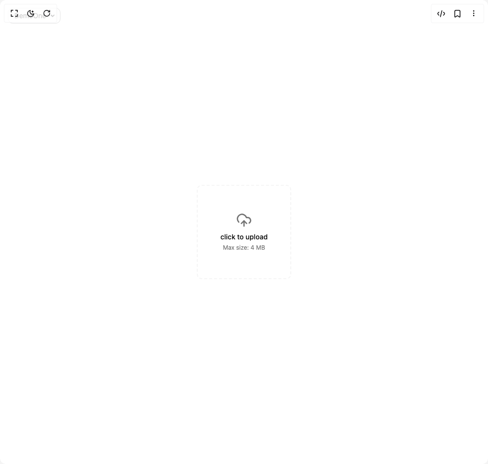
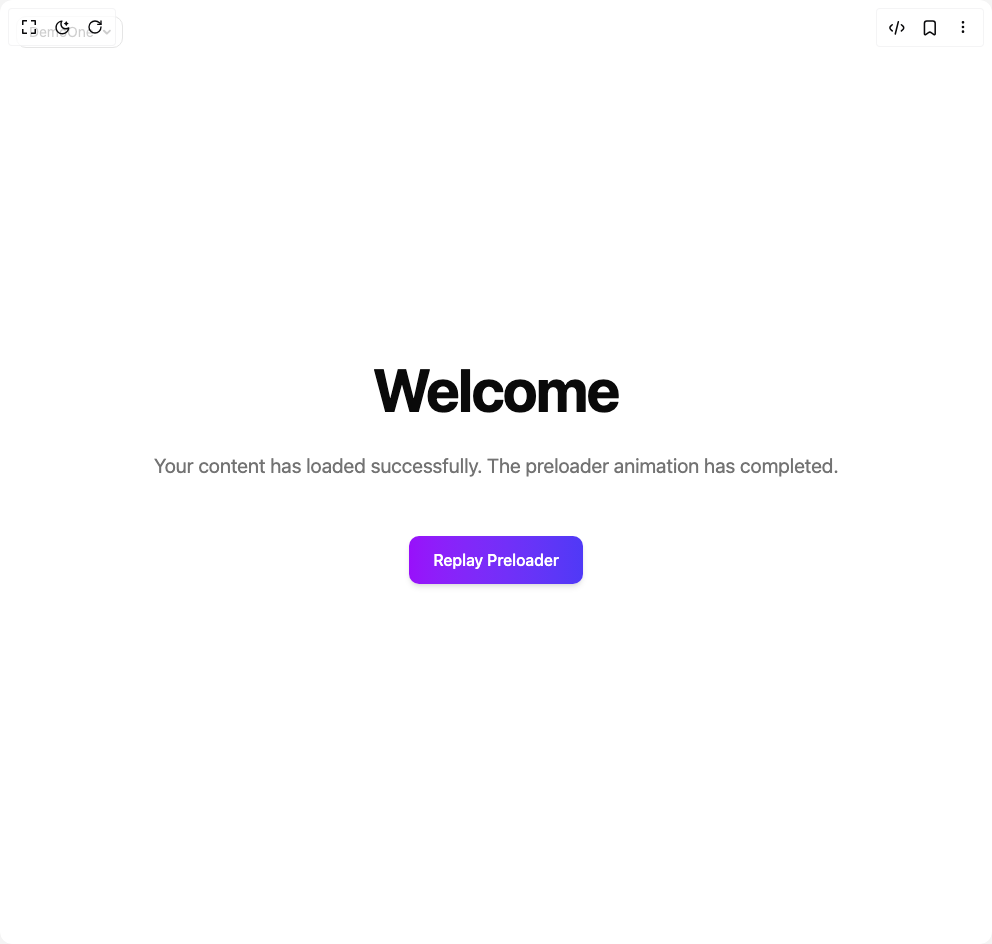
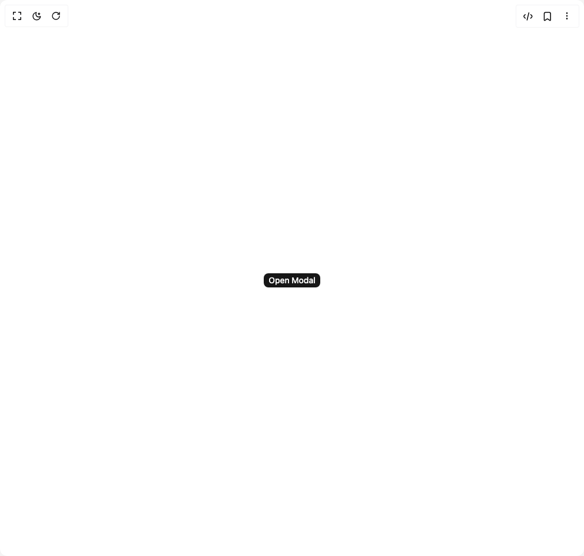

# Info Mdshakeeb Components

5 components are available in this author group.

> Build any component in [BuilderStudio](https://builderstudio.dev), then share improvements with the community on [Discord](https://discord.gg/QdWeSGCqfe) or [Reddit](https://reddit.com/r/builderstudio).

| Preview | Component | Variant |
| --- | --- | --- |
|  | [Footer](footer/default/README.md) | `default` |
|  | [Image Cropper](image-cropper/default/README.md) | `default` |
|  | [Image Uploader](image-uploader/default/README.md) | `default` |
|  | [Preloader](preloader/default/README.md) | `default` |
|  | [Responsive Modal](responsive-modal/default/README.md) | `default` |
