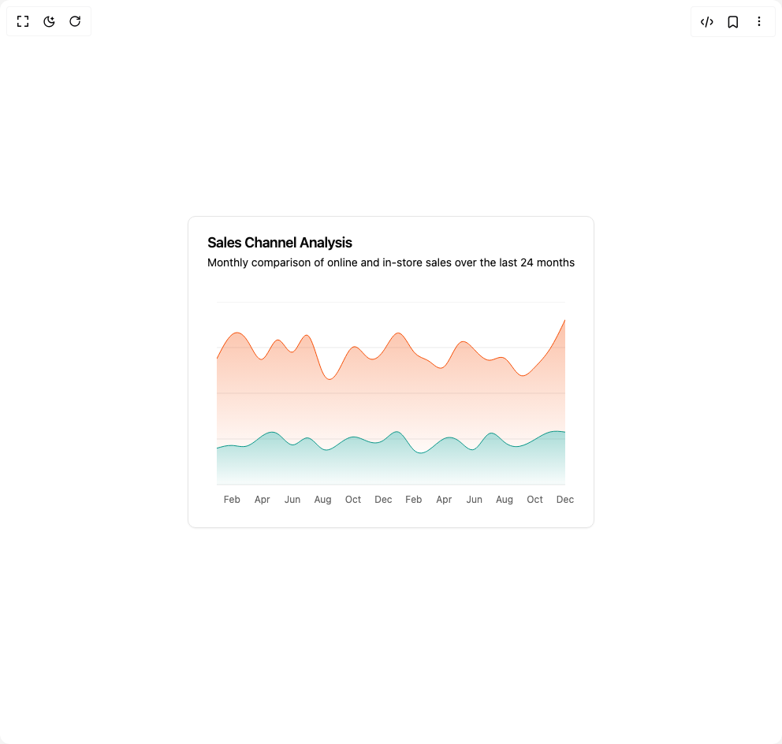

# Build Area Chart in BuilderStudio

> Build this component in our Agentic IDE: [BuilderStudio](https://builderstudio.dev).
>
> Join the BuilderStudio community on [Discord](https://discord.gg/QdWeSGCqfe) and [Reddit](https://reddit.com/r/builderstudio).



## Component

- Author group: `intentui`
- Component: `area-chart`
- Variant: `default`
- Rendered HTML snapshot: [`rendered.html`](rendered.html)

## BuilderStudio prompt

You are implementing a React component based on a component reference.

## Component identity

- Author: intentui
- Component slug: area-chart
- Demo slug: default
- Title: area-chart
- Description: 

## Goal

Recreate this component in a React + TypeScript + Tailwind CSS project. Preserve the visual layout, spacing, colors, border radius, shadows, interaction behavior, animation behavior, responsive behavior, and dark mode behavior shown in the rendered demo.

## Implementation requirements

- Use React and TypeScript.
- Use Tailwind CSS classes whenever possible.
- Keep the component self-contained unless the source files require helper components.
- If the source uses CSS variables, custom CSS, animations, or keyframes, include them.
- If the source uses external packages, list and use the required packages.
- Preserve accessibility attributes, button semantics, links, keyboard behavior, and ARIA attributes when visible in the source.
- Do not replace the component with a simplified placeholder.
- Return complete production-ready code.

## Dependencies

No reference metadata available.

## Rendered DOM snapshot

This is the rendered demo HTML extracted from the live preview. Use it to verify structure, class names, visible content, and layout.

```html
<div id="root"><div class="w-screen min-h-screen flex justify-center items-center"><div class="w-screen min-h-screen flex justify-center items-center"><div data-slot="card" class="group/card flex flex-col gap-(--card-spacing) rounded-lg border bg-bg py-(--card-spacing) text-fg shadow-xs [--card-spacing:--spacing(6)] has-[table]:overflow-hidden has-[table]:not-has-data-[slot=card-footer]:pb-0 **:data-[slot=table-header]:bg-muted/50 has-[table]:**:data-[slot=card-footer]:border-t **:[table]:overflow-hidden"><div data-slot="card-header" class="grid auto-rows-min grid-rows-[auto_auto] gap-1.5 px-(--card-spacing) has-data-[slot=card-action]:grid-cols-[1fr_auto] items-center pb-4"><div data-slot="card-title" class="font-semibold text-lg leading-none tracking-tight">Sales Channel Analysis</div><div data-slot="card-description" class="row-start-2 text-pretty text-muted-fg text-sm">Monthly comparison of online and in-store sales over the last 24 months</div></div><div data-slot="card-content" class="px-(--card-spacing) has-[table]:border-t"><div data-chart="chart-«r0»" class="flex aspect-video justify-center text-xs [&amp;_.recharts-cartesian-axis-tick_text]:fill-muted-fg [&amp;_.recharts-cartesian-grid_line[stroke='#ccc']]:stroke-border/80 [&amp;_.recharts-curve.recharts-tooltip-cursor]:stroke-border [&amp;_.recharts-dot[stroke='#fff']]:stroke-transparent [&amp;_.recharts-layer]:outline-hidden [&amp;_.recharts-polar-grid_[stroke='#ccc']]:stroke-border [&amp;_.recharts-radial-bar-background-sector]:fill-muted [&amp;_.recharts-rectangle.recharts-tooltip-cursor]:fill-muted [&amp;_.recharts-reference-line_[stroke='#ccc']]:stroke-border [&amp;_.recharts-sector[stroke='#fff']]:stroke-transparent [&amp;_.recharts-sector]:outline-hidden [&amp;_.recharts-surface]:outline-hidden max-h-[300px] w-full"><style>
 [data-chart=chart-«r0»] {
  --color-online: var(--chart-1);
  --color-inStore: var(--chart-2);
}


.dark [data-chart=chart-«r0»] {
  --color-online: var(--chart-1);
  --color-inStore: var(--chart-2);
}
</style><div class="recharts-responsive-container" style="width: 100%; height: 100%; min-width: 0px;"><div class="recharts-wrapper" style="position: relative; cursor: default; width: 100%; height: 100%; max-height: 262px; max-width: 466px;"><svg tabindex="0" role="application" class="recharts-surface" width="466" height="262" viewBox="0 0 466 262" style="width: 100%; height: 100%;"><title></title><desc></desc><defs><clipPath id="recharts1-clip"><rect x="12" y="0" height="232" width="442"></rect></clipPath></defs><g class="recharts-cartesian-grid"><g class="recharts-cartesian-grid-horizontal"><line stroke="#ccc" fill="none" x="12" y="0" width="442" height="232" x1="12" y1="232" x2="454" y2="232"></line><line stroke="#ccc" fill="none" x="12" y="0" width="442" height="232" x1="12" y1="174" x2="454" y2="174"></line><line stroke="#ccc" fill="none" x="12" y="0" width="442" height="232" x1="12" y1="116" x2="454" y2="116"></line><line stroke="#ccc" fill="none" x="12" y="0" width="442" height="232" x1="12" y1="58" x2="454" y2="58"></line><line stroke="#ccc" fill="none" x="12" y="0" width="442" height="232" x1="12" y1="0" x2="454" y2="0"></line></g></g><g class="recharts-layer recharts-cartesian-axis recharts-xAxis xAxis"><g class="recharts-cartesian-axis-ticks"><g class="recharts-layer recharts-cartesian-axis-tick"><text orientation="bottom" width="442" height="30" stroke="none" x="31.217391304347853" y="246" class="recharts-text recharts-cartesian-axis-tick-value" text-anchor="middle" fill="#666"><tspan x="31.217391304347853" dy="0.71em">Feb</tspan></text></g><g class="recharts-layer recharts-cartesian-axis-tick"><text orientation="bottom" width="442" height="30" stroke="none" x="69.6521739130435" y="246" class="recharts-text recharts-cartesian-axis-tick-value" text-anchor="middle" fill="#666"><tspan x="69.6521739130435" dy="0.71em">Apr</tspan></text></g><g class="recharts-layer recharts-cartesian-axis-tick"><text orientation="bottom" width="442" height="30" stroke="none" x="108.08695652173915" y="246" class="recharts-text recharts-cartesian-axis-tick-value" text-anchor="middle" fill="#666"><tspan x="108.08695652173915" dy="0.71em">Jun</tspan></text></g><g class="recharts-layer recharts-cartesian-axis-tick"><text orientation="bottom" width="442" height="30" stroke="none" x="146.5217391304348" y="246" class="recharts-text recharts-cartesian-axis-tick-value" text-anchor="middle" fill="#666"><tspan x="146.5217391304348" dy="0.71em">Aug</tspan></text></g><g class="recharts-layer recharts-cartesian-axis-tick"><text orientation="bottom" width="442" height="30" stroke="none" x="184.95652173913044" y="246" class="recharts-text recharts-cartesian-axis-tick-value" text-anchor="middle" fill="#666"><tspan x="184.95652173913044" dy="0.71em">Oct</tspan></text></g><g class="recharts-layer recharts-cartesian-axis-tick"><text orientation="bottom" width="442" height="30" stroke="none" x="223.3913043478261" y="246" class="recharts-text recharts-cartesian-axis-tick-value" text-anchor="middle" fill="#666"><tspan x="223.3913043478261" dy="0.71em">Dec</tspan></text></g><g class="recharts-layer recharts-cartesian-axis-tick"><text orientation="bottom" width="442" height="30" stroke="none" x="261.82608695652175" y="246" class="recharts-text recharts-cartesian-axis-tick-value" text-anchor="middle" fill="#666"><tspan x="261.82608695652175" dy="0.71em">Feb</tspan></text></g><g class="recharts-layer recharts-cartesian-axis-tick"><text orientation="bottom" width="442" height="30" stroke="none" x="300.2608695652174" y="246" class="recharts-text recharts-cartesian-axis-tick-value" text-anchor="middle" fill="#666"><tspan x="300.2608695652174" dy="0.71em">Apr</tspan></text></g><g class="recharts-layer recharts-cartesian-axis-tick"><text orientation="bottom" width="442" height="30" stroke="none" x="338.695652173913" y="246" class="recharts-text recharts-cartesian-axis-tick-value" text-anchor="middle" fill="#666"><tspan x="338.695652173913" dy="0.71em">Jun</tspan></text></g><g class="recharts-layer recharts-cartesian-axis-tick"><text orientation="bottom" width="442" height="30" stroke="none" x="377.13043478260875" y="246" class="recharts-text recharts-cartesian-axis-tick-value" text-anchor="middle" fill="#666"><tspan x="377.13043478260875" dy="0.71em">Aug</tspan></text></g><g class="recharts-layer recharts-cartesian-axis-tick"><text orientation="bottom" width="442" height="30" stroke="none" x="415.5652173913044" y="246" class="recharts-text recharts-cartesian-axis-tick-value" text-anchor="middle" fill="#666"><tspan x="415.5652173913044" dy="0.71em">Oct</tspan></text></g><g class="recharts-layer recharts-cartesian-axis-tick"><text orientation="bottom" width="442" height="30" stroke="none" x="454" y="246" class="recharts-text recharts-cartesian-axis-tick-value" text-anchor="middle" fill="#666"><tspan x="454" dy="0.71em">Dec</tspan></text></g></g></g><defs><linearGradient id="fillOnline" x1="0" y1="0" x2="0" y2="1"><stop offset="5%" stop-color="var(--color-online)" stop-opacity="0.8"></stop><stop offset="95%" stop-color="var(--color-online)" stop-opacity="0.1"></stop></linearGradient><linearGradient id="fillInStore" x1="0" y1="0" x2="0" y2="1"><stop offset="5%" stop-color="var(--color-inStore)" stop-opacity="0.8"></stop><stop offset="95%" stop-color="var(--color-inStore)" stop-opacity="0.1"></stop></linearGradient></defs><g class="recharts-layer recharts-area"><g class="recharts-layer"><defs><clipPath id="animationClipPath-recharts-area-2"><rect x="12.000000000000028" y="0" width="442" height="233"></rect></clipPath></defs><g class="recharts-layer" clip-path="url(#animationClipPath-recharts-area-2)"><g class="recharts-layer"><path fill="url(#fillInStore)" fill-opacity="0.4" width="442" height="232" stroke="none" class="recharts-curve recharts-area-area" d="M12,185.716C18.406,183.816,24.812,181.916,31.217,182.178C37.623,182.44,44.029,184.865,50.435,182.874C56.841,180.883,63.246,174.476,69.652,170.085C76.058,165.694,82.464,163.318,88.87,167.214C95.275,171.11,101.681,181.277,108.087,181.511C114.493,181.745,120.899,172.045,127.304,172.579C133.71,173.113,140.116,183.879,146.522,186.992C152.928,190.105,159.333,185.564,165.739,180.96C172.145,176.356,178.551,171.688,184.957,171.361C191.362,171.034,197.768,175.046,204.174,177.277C210.58,179.508,216.986,179.957,223.391,175.74C229.797,171.523,236.203,162.64,242.609,165.213C249.014,167.786,255.42,181.817,261.826,187.949C268.232,194.081,274.638,192.315,281.043,187.92C287.449,183.525,293.855,176.5,300.261,173.594C306.667,170.688,313.072,171.902,319.478,176.755C325.884,181.608,332.29,190.1,338.696,187.137C345.101,184.174,351.507,169.757,357.913,167.011C364.319,164.265,370.725,173.191,377.13,178.234C383.536,183.277,389.942,184.435,396.348,183.222C402.754,182.009,409.159,178.423,415.565,174.58C421.971,170.737,428.377,166.638,434.783,165.039C441.188,163.44,447.594,164.341,454,165.242L454,232C447.594,232,441.188,232,434.783,232C428.377,232,421.971,232,415.565,232C409.159,232,402.754,232,396.348,232C389.942,232,383.536,232,377.13,232C370.725,232,364.319,232,357.913,232C351.507,232,345.101,232,338.696,232C332.29,232,325.884,232,319.478,232C313.072,232,306.667,232,300.261,232C293.855,232,287.449,232,281.043,232C274.638,232,268.232,232,261.826,232C255.42,232,249.014,232,242.609,232C236.203,232,229.797,232,223.391,232C216.986,232,210.58,232,204.174,232C197.768,232,191.362,232,184.957,232C178.551,232,172.145,232,165.739,232C159.333,232,152.928,232,146.522,232C140.116,232,133.71,232,127.304,232C120.899,232,114.493,232,108.087,232C101.681,232,95.275,232,88.87,232C82.464,232,76.058,232,69.652,232C63.246,232,56.841,232,50.435,232C44.029,232,37.623,232,31.217,232C24.812,232,18.406,232,12,232Z"></path><path fill="none" fill-opacity="0.4" stroke="var(--color-inStore)" width="442" height="232" class="recharts-curve recharts-area-curve" d="M12,185.716C18.406,183.816,24.812,181.916,31.217,182.178C37.623,182.44,44.029,184.865,50.435,182.874C56.841,180.883,63.246,174.476,69.652,170.085C76.058,165.694,82.464,163.318,88.87,167.214C95.275,171.11,101.681,181.277,108.087,181.511C114.493,181.745,120.899,172.045,127.304,172.579C133.71,173.113,140.116,183.879,146.522,186.992C152.928,190.105,159.333,185.564,165.739,180.96C172.145,176.356,178.551,171.688,184.957,171.361C191.362,171.034,197.768,175.046,204.174,177.277C210.58,179.508,216.986,179.957,223.391,175.74C229.797,171.523,236.203,162.64,242.609,165.213C249.014,167.786,255.42,181.817,261.826,187.949C268.232,194.081,274.638,192.315,281.043,187.92C287.449,183.525,293.855,176.5,300.261,173.594C306.667,170.688,313.072,171.902,319.478,176.755C325.884,181.608,332.29,190.1,338.696,187.137C345.101,184.174,351.507,169.757,357.913,167.011C364.319,164.265,370.725,173.191,377.13,178.234C383.536,183.277,389.942,184.435,396.348,183.222C402.754,182.009,409.159,178.423,415.565,174.58C421.971,170.737,428.377,166.638,434.783,165.039C441.188,163.44,447.594,164.341,454,165.242"></path></g></g></g></g><g class="recharts-layer recharts-area"><g class="recharts-layer"><defs><clipPath id="animationClipPath-recharts-area-3"><rect x="12.000000000000028" y="0" width="442" height="188"></rect></clipPath></defs><g class="recharts-layer" clip-path="url(#animationClipPath-recharts-area-3)"><g class="recharts-layer"><path fill="url(#fillOnline)" fill-opacity="0.4" width="442" height="232" stroke="none" class="recharts-curve recharts-area-area" d="M12,72.239C18.406,59.47,24.812,46.701,31.217,41.586C37.623,36.471,44.029,39.011,50.435,48.662C56.841,58.313,63.246,75.074,69.652,72.848C76.058,70.622,82.464,49.41,88.87,48.227C95.275,47.044,101.681,65.892,108.087,63.829C114.493,61.766,120.899,38.792,127.304,42.572C133.71,46.352,140.116,76.886,146.522,90.103C152.928,103.32,159.333,99.221,165.739,88.334C172.145,77.447,178.551,59.772,184.957,57.188C191.362,54.604,197.768,67.112,204.174,71.311C210.58,75.51,216.986,71.402,223.391,62.234C229.797,53.066,236.203,38.84,242.609,39.469C249.014,40.098,255.42,55.582,261.826,63.307C268.232,71.032,274.638,70.998,281.043,75.168C287.449,79.338,293.855,87.712,300.261,82.476C306.667,77.24,313.072,58.394,319.478,52.519C325.884,46.644,332.29,53.741,338.696,60.581C345.101,67.421,351.507,74.005,357.913,74.095C364.319,74.185,370.725,67.78,377.13,71.572C383.536,75.364,389.942,89.354,396.348,92.916C402.754,96.478,409.159,89.612,415.565,82.882C421.971,76.152,428.377,69.558,434.783,59.537C441.188,49.516,447.594,36.068,454,22.62L454,165.242C447.594,164.341,441.188,163.44,434.783,165.039C428.377,166.638,421.971,170.737,415.565,174.58C409.159,178.423,402.754,182.009,396.348,183.222C389.942,184.435,383.536,183.277,377.13,178.234C370.725,173.191,364.319,164.265,357.913,167.011C351.507,169.757,345.101,184.174,338.696,187.137C332.29,190.1,325.884,181.608,319.478,176.755C313.072,171.902,306.667,170.688,300.261,173.594C293.855,176.5,287.449,183.525,281.043,187.92C274.638,192.315,268.232,194.081,261.826,187.949C255.42,181.817,249.014,167.786,242.609,165.213C236.203,162.64,229.797,171.523,223.391,175.74C216.986,179.957,210.58,179.508,204.174,177.277C197.768,175.046,191.362,171.034,184.957,171.361C178.551,171.688,172.145,176.356,165.739,180.96C159.333,185.564,152.928,190.105,146.522,186.992C140.116,183.879,133.71,173.113,127.304,172.579C120.899,172.045,114.493,181.745,108.087,181.511C101.681,181.277,95.275,171.11,88.87,167.214C82.464,163.318,76.058,165.694,69.652,170.085C63.246,174.476,56.841,180.883,50.435,182.874C44.029,184.865,37.623,182.44,31.217,182.178C24.812,181.916,18.406,183.816,12,185.716Z"></path><path fill="none" fill-opacity="0.4" stroke="var(--color-online)" width="442" height="232" class="recharts-curve recharts-area-curve" d="M12,72.239C18.406,59.47,24.812,46.701,31.217,41.586C37.623,36.471,44.029,39.011,50.435,48.662C56.841,58.313,63.246,75.074,69.652,72.848C76.058,70.622,82.464,49.41,88.87,48.227C95.275,47.044,101.681,65.892,108.087,63.829C114.493,61.766,120.899,38.792,127.304,42.572C133.71,46.352,140.116,76.886,146.522,90.103C152.928,103.32,159.333,99.221,165.739,88.334C172.145,77.447,178.551,59.772,184.957,57.188C191.362,54.604,197.768,67.112,204.174,71.311C210.58,75.51,216.986,71.402,223.391,62.234C229.797,53.066,236.203,38.84,242.609,39.469C249.014,40.098,255.42,55.582,261.826,63.307C268.232,71.032,274.638,70.998,281.043,75.168C287.449,79.338,293.855,87.712,300.261,82.476C306.667,77.24,313.072,58.394,319.478,52.519C325.884,46.644,332.29,53.741,338.696,60.581C345.101,67.421,351.507,74.005,357.913,74.095C364.319,74.185,370.725,67.78,377.13,71.572C383.536,75.364,389.942,89.354,396.348,92.916C402.754,96.478,409.159,89.612,415.565,82.882C421.971,76.152,428.377,69.558,434.783,59.537C441.188,49.516,447.594,36.068,454,22.62"></path></g></g></g></g></svg><div tabindex="-1" class="recharts-tooltip-wrapper" style="visibility: hidden; pointer-events: none; position: absolute; top: 0px; left: 0px;"></div></div></div></div></div></div></div></div></div>
```

## Reference source files

No reference source files were available.
