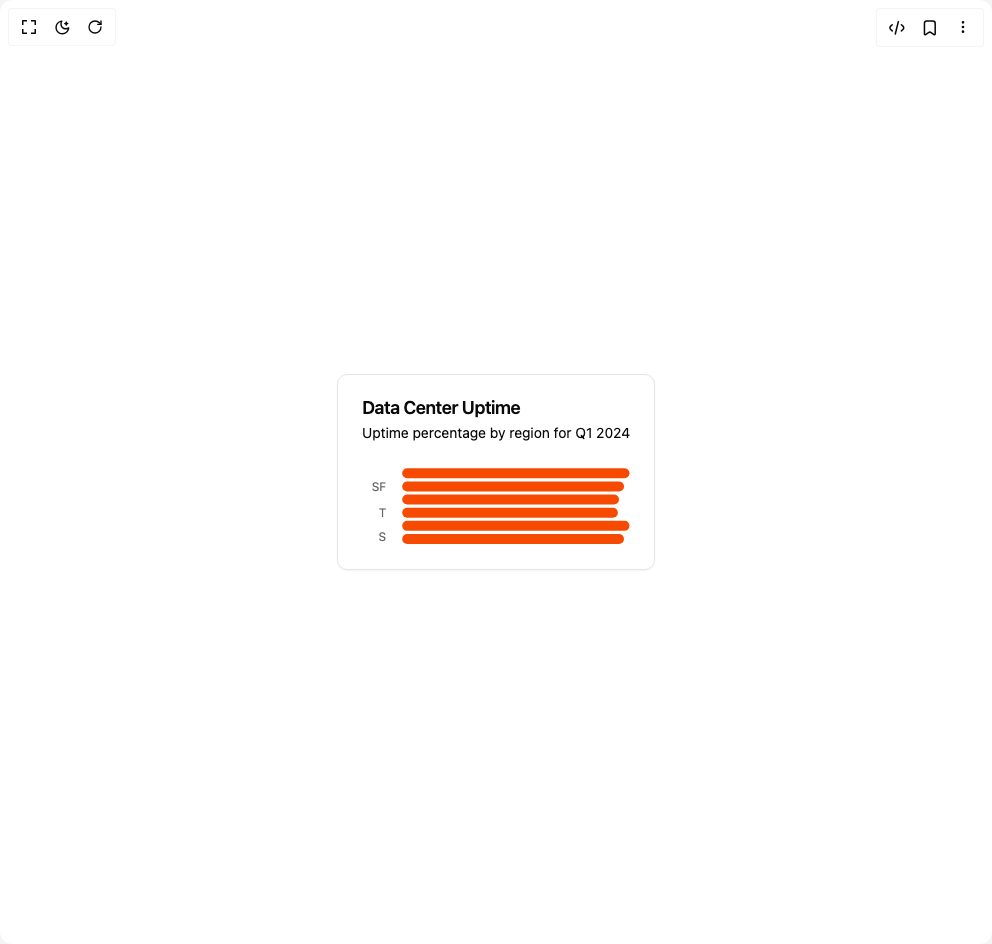

# Build Bar Chart in BuilderStudio

> Build this component in our Agentic IDE: [BuilderStudio](https://builderstudio.dev).
>
> Join the BuilderStudio community on [Discord](https://discord.gg/QdWeSGCqfe) and [Reddit](https://reddit.com/r/builderstudio).



## Component

- Author group: `intentui`
- Component: `bar-chart`
- Variant: `horizontal`
- Rendered HTML snapshot: [`rendered.html`](rendered.html)

## BuilderStudio prompt

You are implementing a React component based on a component reference.

## Component identity

- Author: intentui
- Component slug: bar-chart
- Demo slug: horizontal
- Title: bar-chart
- Description: 

## Goal

Recreate this component in a React + TypeScript + Tailwind CSS project. Preserve the visual layout, spacing, colors, border radius, shadows, interaction behavior, animation behavior, responsive behavior, and dark mode behavior shown in the rendered demo.

## Implementation requirements

- Use React and TypeScript.
- Use Tailwind CSS classes whenever possible.
- Keep the component self-contained unless the source files require helper components.
- If the source uses CSS variables, custom CSS, animations, or keyframes, include them.
- If the source uses external packages, list and use the required packages.
- Preserve accessibility attributes, button semantics, links, keyboard behavior, and ARIA attributes when visible in the source.
- Do not replace the component with a simplified placeholder.
- Return complete production-ready code.

## Dependencies

No reference metadata available.

## Rendered DOM snapshot

This is the rendered demo HTML extracted from the live preview. Use it to verify structure, class names, visible content, and layout.

```html
<div id="root"><div class="w-screen min-h-screen flex justify-center items-center"><div class="w-screen min-h-screen flex justify-center items-center"><div data-slot="card" class="group/card flex flex-col gap-(--card-spacing) rounded-lg border bg-bg py-(--card-spacing) text-fg shadow-xs [--card-spacing:--spacing(6)] has-[table]:overflow-hidden has-[table]:not-has-data-[slot=card-footer]:pb-0 **:data-[slot=table-header]:bg-muted/50 has-[table]:**:data-[slot=card-footer]:border-t **:[table]:overflow-hidden"><div data-slot="card-header" class="grid auto-rows-min grid-rows-[auto_auto] items-start gap-1.5 px-(--card-spacing) has-data-[slot=card-action]:grid-cols-[1fr_auto]"><div data-slot="card-title" class="font-semibold text-lg leading-none tracking-tight">Data Center Uptime</div><div data-slot="card-description" class="row-start-2 text-pretty text-muted-fg text-sm">Uptime percentage by region for Q1 2024</div></div><div data-slot="card-content" class="px-(--card-spacing) has-[table]:border-t"><div data-chart="chart-«r0»" class="flex justify-center text-xs [&amp;_.recharts-cartesian-axis-tick_text]:fill-muted-fg [&amp;_.recharts-cartesian-grid_line[stroke='#ccc']]:stroke-border/80 [&amp;_.recharts-curve.recharts-tooltip-cursor]:stroke-border [&amp;_.recharts-dot[stroke='#fff']]:stroke-transparent [&amp;_.recharts-layer]:outline-hidden [&amp;_.recharts-polar-grid_[stroke='#ccc']]:stroke-border [&amp;_.recharts-radial-bar-background-sector]:fill-muted [&amp;_.recharts-rectangle.recharts-tooltip-cursor]:fill-muted [&amp;_.recharts-reference-line_[stroke='#ccc']]:stroke-border [&amp;_.recharts-sector[stroke='#fff']]:stroke-transparent [&amp;_.recharts-sector]:outline-hidden [&amp;_.recharts-surface]:outline-hidden aspect-[20/12] sm:aspect-[17/5]"><style>
 [data-chart=chart-«r0»] {
  --color-uptime: var(--chart-1);
}


.dark [data-chart=chart-«r0»] {
  --color-uptime: var(--chart-1);
}
</style><div class="recharts-responsive-container" style="width: 100%; height: 100%; min-width: 0px;"><div class="recharts-wrapper" style="position: relative; cursor: default; width: 100%; height: 100%; max-height: 79px; max-width: 268px;"><svg tabindex="0" role="application" class="recharts-surface" width="268" height="79" viewBox="0 0 268 79" style="width: 100%; height: 100%;"><title></title><desc></desc><defs><clipPath id="recharts1-clip"><rect x="40" y="0" height="79" width="228"></rect></clipPath></defs><g class="recharts-layer recharts-cartesian-axis recharts-yAxis yAxis"><g class="recharts-cartesian-axis-ticks"><g class="recharts-layer recharts-cartesian-axis-tick"><text orientation="left" width="60" height="79" stroke="none" x="24" y="19.75" class="recharts-text recharts-cartesian-axis-tick-value" text-anchor="end" fill="#666"><tspan x="24" dy="0.355em">SF</tspan></text></g><g class="recharts-layer recharts-cartesian-axis-tick"><text orientation="left" width="60" height="79" stroke="none" x="24" y="46.083333333333336" class="recharts-text recharts-cartesian-axis-tick-value" text-anchor="end" fill="#666"><tspan x="24" dy="0.355em">T</tspan></text></g><g class="recharts-layer recharts-cartesian-axis-tick"><text orientation="left" width="60" height="79" stroke="none" x="24" y="70" class="recharts-text recharts-cartesian-axis-tick-value" text-anchor="end" fill="#666"><tspan x="24" dy="0.355em">S</tspan></text></g></g></g><g class="recharts-layer recharts-bar"><g class="recharts-layer recharts-bar-rectangles"><g class="recharts-layer"><g class="recharts-layer recharts-bar-rectangle"><path x="40" y="1.3166666666666667" width="227.77200000000005" height="10" radius="5" fill="var(--color-uptime)" class="recharts-rectangle" d="M 40,6.316666666666666
            A 5,5,0,0,1,45,1.3166666666666667
            L 262.77200000000005,1.3166666666666667
            A 5,5,0,0,1,267.77200000000005,6.316666666666666
            L 267.77200000000005,6.316666666666666
            A 5,5,0,0,1,262.77200000000005,11.316666666666666
            L 45,11.316666666666666
            A 5,5,0,0,1,40,6.316666666666666 Z"></path></g><g class="recharts-layer recharts-bar-rectangle"><path x="40" y="14.483333333333333" width="222.3" height="10" radius="5" fill="var(--color-uptime)" class="recharts-rectangle" d="M 40,19.483333333333334
            A 5,5,0,0,1,45,14.483333333333333
            L 257.3,14.483333333333333
            A 5,5,0,0,1,262.3,19.483333333333334
            L 262.3,19.483333333333334
            A 5,5,0,0,1,257.3,24.483333333333334
            L 45,24.483333333333334
            A 5,5,0,0,1,40,19.483333333333334 Z"></path></g><g class="recharts-layer recharts-bar-rectangle"><path x="40" y="27.65" width="217.284" height="10" radius="5" fill="var(--color-uptime)" class="recharts-rectangle" d="M 40,32.65
            A 5,5,0,0,1,45,27.65
            L 252.284,27.65
            A 5,5,0,0,1,257.284,32.65
            L 257.284,32.65
            A 5,5,0,0,1,252.284,37.65
            L 45,37.65
            A 5,5,0,0,1,40,32.65 Z"></path></g><g class="recharts-layer recharts-bar-rectangle"><path x="40" y="40.81666666666667" width="216.144" height="10" radius="5" fill="var(--color-uptime)" class="recharts-rectangle" d="M 40,45.81666666666667
            A 5,5,0,0,1,45,40.81666666666667
            L 251.144,40.81666666666667
            A 5,5,0,0,1,256.144,45.81666666666667
            L 256.144,45.81666666666667
            A 5,5,0,0,1,251.144,50.81666666666667
            L 45,50.81666666666667
            A 5,5,0,0,1,40,45.81666666666667 Z"></path></g><g class="recharts-layer recharts-bar-rectangle"><path x="40" y="53.983333333333334" width="227.77200000000005" height="10" radius="5" fill="var(--color-uptime)" class="recharts-rectangle" d="M 40,58.983333333333334
            A 5,5,0,0,1,45,53.983333333333334
            L 262.77200000000005,53.983333333333334
            A 5,5,0,0,1,267.77200000000005,58.983333333333334
            L 267.77200000000005,58.983333333333334
            A 5,5,0,0,1,262.77200000000005,63.983333333333334
            L 45,63.983333333333334
            A 5,5,0,0,1,40,58.983333333333334 Z"></path></g><g class="recharts-layer recharts-bar-rectangle"><path x="40" y="67.14999999999999" width="222.3" height="10" radius="5" fill="var(--color-uptime)" class="recharts-rectangle" d="M 40,72.14999999999999
            A 5,5,0,0,1,45,67.14999999999999
            L 257.3,67.14999999999999
            A 5,5,0,0,1,262.3,72.14999999999999
            L 262.3,72.14999999999999
            A 5,5,0,0,1,257.3,77.14999999999999
            L 45,77.14999999999999
            A 5,5,0,0,1,40,72.14999999999999 Z"></path></g></g></g><g class="recharts-layer"></g></g></svg><div tabindex="-1" class="recharts-tooltip-wrapper" style="visibility: hidden; pointer-events: none; position: absolute; top: 0px; left: 0px;"></div></div></div></div></div></div></div></div></div>
```

## Reference source files

No reference source files were available.
