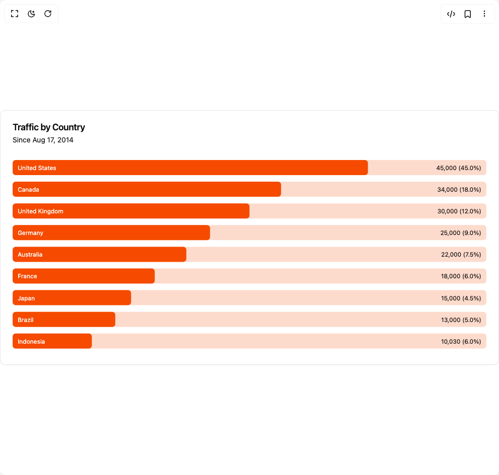

# Build Bar Chart in BuilderStudio

> Build this component in our Agentic IDE: [BuilderStudio](https://builderstudio.dev).
>
> Join the BuilderStudio community on [Discord](https://discord.gg/QdWeSGCqfe) and [Reddit](https://reddit.com/r/builderstudio).



## Component

- Author group: `intentui`
- Component: `bar-chart`
- Variant: `inset-label`
- Rendered HTML snapshot: [`rendered.html`](rendered.html)

## BuilderStudio prompt

You are implementing a React component based on a component reference.

## Component identity

- Author: intentui
- Component slug: bar-chart
- Demo slug: inset-label
- Title: bar-chart
- Description: 

## Goal

Recreate this component in a React + TypeScript + Tailwind CSS project. Preserve the visual layout, spacing, colors, border radius, shadows, interaction behavior, animation behavior, responsive behavior, and dark mode behavior shown in the rendered demo.

## Implementation requirements

- Use React and TypeScript.
- Use Tailwind CSS classes whenever possible.
- Keep the component self-contained unless the source files require helper components.
- If the source uses CSS variables, custom CSS, animations, or keyframes, include them.
- If the source uses external packages, list and use the required packages.
- Preserve accessibility attributes, button semantics, links, keyboard behavior, and ARIA attributes when visible in the source.
- Do not replace the component with a simplified placeholder.
- Return complete production-ready code.

## Dependencies

No reference metadata available.

## Rendered DOM snapshot

This is the rendered demo HTML extracted from the live preview. Use it to verify structure, class names, visible content, and layout.

```html
<div id="root"><div class="w-screen min-h-screen flex justify-center items-center"><div class="w-screen min-h-screen flex justify-center items-center"><div data-slot="card" class="group/card flex flex-col gap-(--card-spacing) rounded-lg border bg-bg py-(--card-spacing) text-fg shadow-xs [--card-spacing:--spacing(6)] has-[table]:overflow-hidden has-[table]:not-has-data-[slot=card-footer]:pb-0 **:data-[slot=table-header]:bg-muted/50 has-[table]:**:data-[slot=card-footer]:border-t **:[table]:overflow-hidden h-full w-full"><div data-slot="card-header" class="grid auto-rows-min grid-rows-[auto_auto] items-start gap-1.5 px-(--card-spacing) has-data-[slot=card-action]:grid-cols-[1fr_auto]"><div data-slot="card-title" class="font-semibold text-lg leading-none tracking-tight">Traffic by Country</div><div data-slot="card-description" class="row-start-2 text-pretty text-muted-fg text-sm">Since Aug 17, 2014</div></div><div data-slot="card-content" class="px-(--card-spacing) has-[table]:border-t"><div data-chart="chart-«r0»" class="flex justify-center text-xs [&amp;_.recharts-cartesian-axis-tick_text]:fill-muted-fg [&amp;_.recharts-cartesian-grid_line[stroke='#ccc']]:stroke-border/80 [&amp;_.recharts-curve.recharts-tooltip-cursor]:stroke-border [&amp;_.recharts-dot[stroke='#fff']]:stroke-transparent [&amp;_.recharts-layer]:outline-hidden [&amp;_.recharts-polar-grid_[stroke='#ccc']]:stroke-border [&amp;_.recharts-radial-bar-background-sector]:fill-muted [&amp;_.recharts-rectangle.recharts-tooltip-cursor]:fill-muted [&amp;_.recharts-reference-line_[stroke='#ccc']]:stroke-border [&amp;_.recharts-sector[stroke='#fff']]:stroke-transparent [&amp;_.recharts-sector]:outline-hidden [&amp;_.recharts-surface]:outline-hidden aspect-[15/15] sm:aspect-[17/7]"><style>
 [data-chart=chart-«r0»] {
  --color-count: var(--chart-1);
}


.dark [data-chart=chart-«r0»] {
  --color-count: var(--chart-1);
}
</style><div class="recharts-responsive-container" style="width: 100%; height: 100%; min-width: 0px;"><div class="recharts-wrapper" style="position: relative; cursor: default; width: 100%; height: 100%; max-height: 388px; max-width: 942px;"><svg tabindex="0" role="application" class="recharts-surface" width="942" height="388" viewBox="0 0 942 388" style="width: 100%; height: 100%;"><title></title><desc></desc><defs><clipPath id="recharts1-clip"><rect x="0" y="0" height="388" width="942"></rect></clipPath></defs><g class="recharts-layer recharts-bar"><g class="recharts-layer recharts-bar-rectangles"><path x="0" y="6" width="942" height="30" radius="6" fill="var(--chart-1)" opacity="0.2" class="recharts-rectangle recharts-bar-background-rectangle" d="M 0,12
            A 6,6,0,0,1,6,6
            L 936,6
            A 6,6,0,0,1,942,12
            L 942,30
            A 6,6,0,0,1,936,36
            L 6,36
            A 6,6,0,0,1,0,30 Z"></path><path x="0" y="49.111111111111114" width="942" height="30" radius="6" fill="var(--chart-1)" opacity="0.2" class="recharts-rectangle recharts-bar-background-rectangle" d="M 0,55.111111111111114
            A 6,6,0,0,1,6,49.111111111111114
            L 936,49.111111111111114
            A 6,6,0,0,1,942,55.111111111111114
            L 942,73.11111111111111
            A 6,6,0,0,1,936,79.11111111111111
            L 6,79.11111111111111
            A 6,6,0,0,1,0,73.11111111111111 Z"></path><path x="0" y="92.22222222222223" width="942" height="30" radius="6" fill="var(--chart-1)" opacity="0.2" class="recharts-rectangle recharts-bar-background-rectangle" d="M 0,98.22222222222223
            A 6,6,0,0,1,6,92.22222222222223
            L 936,92.22222222222223
            A 6,6,0,0,1,942,98.22222222222223
            L 942,116.22222222222223
            A 6,6,0,0,1,936,122.22222222222223
            L 6,122.22222222222223
            A 6,6,0,0,1,0,116.22222222222223 Z"></path><path x="0" y="135.33333333333334" width="942" height="30" radius="6" fill="var(--chart-1)" opacity="0.2" class="recharts-rectangle recharts-bar-background-rectangle" d="M 0,141.33333333333334
            A 6,6,0,0,1,6,135.33333333333334
            L 936,135.33333333333334
            A 6,6,0,0,1,942,141.33333333333334
            L 942,159.33333333333334
            A 6,6,0,0,1,936,165.33333333333334
            L 6,165.33333333333334
            A 6,6,0,0,1,0,159.33333333333334 Z"></path><path x="0" y="178.44444444444446" width="942" height="30" radius="6" fill="var(--chart-1)" opacity="0.2" class="recharts-rectangle recharts-bar-background-rectangle" d="M 0,184.44444444444446
            A 6,6,0,0,1,6,178.44444444444446
            L 936,178.44444444444446
            A 6,6,0,0,1,942,184.44444444444446
            L 942,202.44444444444446
            A 6,6,0,0,1,936,208.44444444444446
            L 6,208.44444444444446
            A 6,6,0,0,1,0,202.44444444444446 Z"></path><path x="0" y="221.55555555555557" width="942" height="30" radius="6" fill="var(--chart-1)" opacity="0.2" class="recharts-rectangle recharts-bar-background-rectangle" d="M 0,227.55555555555557
            A 6,6,0,0,1,6,221.55555555555557
            L 936,221.55555555555557
            A 6,6,0,0,1,942,227.55555555555557
            L 942,245.55555555555557
            A 6,6,0,0,1,936,251.55555555555557
            L 6,251.55555555555557
            A 6,6,0,0,1,0,245.55555555555557 Z"></path><path x="0" y="264.6666666666667" width="942" height="30" radius="6" fill="var(--chart-1)" opacity="0.2" class="recharts-rectangle recharts-bar-background-rectangle" d="M 0,270.6666666666667
            A 6,6,0,0,1,6,264.6666666666667
            L 936,264.6666666666667
            A 6,6,0,0,1,942,270.6666666666667
            L 942,288.6666666666667
            A 6,6,0,0,1,936,294.6666666666667
            L 6,294.6666666666667
            A 6,6,0,0,1,0,288.6666666666667 Z"></path><path x="0" y="307.7777777777778" width="942" height="30" radius="6" fill="var(--chart-1)" opacity="0.2" class="recharts-rectangle recharts-bar-background-rectangle" d="M 0,313.7777777777778
            A 6,6,0,0,1,6,307.7777777777778
            L 936,307.7777777777778
            A 6,6,0,0,1,942,313.7777777777778
            L 942,331.7777777777778
            A 6,6,0,0,1,936,337.7777777777778
            L 6,337.7777777777778
            A 6,6,0,0,1,0,331.7777777777778 Z"></path><path x="0" y="350.8888888888889" width="942" height="30" radius="6" fill="var(--chart-1)" opacity="0.2" class="recharts-rectangle recharts-bar-background-rectangle" d="M 0,356.8888888888889
            A 6,6,0,0,1,6,350.8888888888889
            L 936,350.8888888888889
            A 6,6,0,0,1,942,356.8888888888889
            L 942,374.8888888888889
            A 6,6,0,0,1,936,380.8888888888889
            L 6,380.8888888888889
            A 6,6,0,0,1,0,374.8888888888889 Z"></path><g class="recharts-layer"><g class="recharts-layer recharts-bar-rectangle"><path x="0" y="6" width="706.5" height="30" radius="6" fill="var(--color-count)" class="recharts-rectangle" d="M 0,12
            A 6,6,0,0,1,6,6
            L 700.5,6
            A 6,6,0,0,1,706.5,12
            L 706.5,30
            A 6,6,0,0,1,700.5,36
            L 6,36
            A 6,6,0,0,1,0,30 Z"></path><text x="10" y="26" fill="white">United States</text><text x="932" y="26" text-anchor="end" fill="var(--fg)">45,000 (45.0%)</text></g><g class="recharts-layer recharts-bar-rectangle"><path x="0" y="49.111111111111114" width="533.8" height="30" radius="6" fill="var(--color-count)" class="recharts-rectangle" d="M 0,55.111111111111114
            A 6,6,0,0,1,6,49.111111111111114
            L 527.8,49.111111111111114
            A 6,6,0,0,1,533.8,55.111111111111114
            L 533.8,73.11111111111111
            A 6,6,0,0,1,527.8,79.11111111111111
            L 6,79.11111111111111
            A 6,6,0,0,1,0,73.11111111111111 Z"></path><text x="10" y="69.11111111111111" fill="white">Canada</text><text x="932" y="69.11111111111111" text-anchor="end" fill="var(--fg)">34,000 (18.0%)</text></g><g class="recharts-layer recharts-bar-rectangle"><path x="0" y="92.22222222222223" width="471" height="30" radius="6" fill="var(--color-count)" class="recharts-rectangle" d="M 0,98.22222222222223
            A 6,6,0,0,1,6,92.22222222222223
            L 465,92.22222222222223
            A 6,6,0,0,1,471,98.22222222222223
            L 471,116.22222222222223
            A 6,6,0,0,1,465,122.22222222222223
            L 6,122.22222222222223
            A 6,6,0,0,1,0,116.22222222222223 Z"></path><text x="10" y="112.22222222222223" fill="white">United Kingdom</text><text x="932" y="112.22222222222223" text-anchor="end" fill="var(--fg)">30,000 (12.0%)</text></g><g class="recharts-layer recharts-bar-rectangle"><path x="0" y="135.33333333333334" width="392.5" height="30" radius="6" fill="var(--color-count)" class="recharts-rectangle" d="M 0,141.33333333333334
            A 6,6,0,0,1,6,135.33333333333334
            L 386.5,135.33333333333334
            A 6,6,0,0,1,392.5,141.33333333333334
            L 392.5,159.33333333333334
            A 6,6,0,0,1,386.5,165.33333333333334
            L 6,165.33333333333334
            A 6,6,0,0,1,0,159.33333333333334 Z"></path><text x="10" y="155.33333333333334" fill="white">Germany</text><text x="932" y="155.33333333333334" text-anchor="end" fill="var(--fg)">25,000 (9.0%)</text></g><g class="recharts-layer recharts-bar-rectangle"><path x="0" y="178.44444444444446" width="345.4" height="30" radius="6" fill="var(--color-count)" class="recharts-rectangle" d="M 0,184.44444444444446
            A 6,6,0,0,1,6,178.44444444444446
            L 339.4,178.44444444444446
            A 6,6,0,0,1,345.4,184.44444444444446
            L 345.4,202.44444444444446
            A 6,6,0,0,1,339.4,208.44444444444446
            L 6,208.44444444444446
            A 6,6,0,0,1,0,202.44444444444446 Z"></path><text x="10" y="198.44444444444446" fill="white">Australia</text><text x="932" y="198.44444444444446" text-anchor="end" fill="var(--fg)">22,000 (7.5%)</text></g><g class="recharts-layer recharts-bar-rectangle"><path x="0" y="221.55555555555557" width="282.59999999999997" height="30" radius="6" fill="var(--color-count)" class="recharts-rectangle" d="M 0,227.55555555555557
            A 6,6,0,0,1,6,221.55555555555557
            L 276.59999999999997,221.55555555555557
            A 6,6,0,0,1,282.59999999999997,227.55555555555557
            L 282.59999999999997,245.55555555555557
            A 6,6,0,0,1,276.59999999999997,251.55555555555557
            L 6,251.55555555555557
            A 6,6,0,0,1,0,245.55555555555557 Z"></path><text x="10" y="241.55555555555557" fill="white">France</text><text x="932" y="241.55555555555557" text-anchor="end" fill="var(--fg)">18,000 (6.0%)</text></g><g class="recharts-layer recharts-bar-rectangle"><path x="0" y="264.6666666666667" width="235.5" height="30" radius="6" fill="var(--color-count)" class="recharts-rectangle" d="M 0,270.6666666666667
            A 6,6,0,0,1,6,264.6666666666667
            L 229.5,264.6666666666667
            A 6,6,0,0,1,235.5,270.6666666666667
            L 235.5,288.6666666666667
            A 6,6,0,0,1,229.5,294.6666666666667
            L 6,294.6666666666667
            A 6,6,0,0,1,0,288.6666666666667 Z"></path><text x="10" y="284.6666666666667" fill="white">Japan</text><text x="932" y="284.6666666666667" text-anchor="end" fill="var(--fg)">15,000 (4.5%)</text></g><g class="recharts-layer recharts-bar-rectangle"><path x="0" y="307.7777777777778" width="204.1" height="30" radius="6" fill="var(--color-count)" class="recharts-rectangle" d="M 0,313.7777777777778
            A 6,6,0,0,1,6,307.7777777777778
            L 198.1,307.7777777777778
            A 6,6,0,0,1,204.1,313.7777777777778
            L 204.1,331.7777777777778
            A 6,6,0,0,1,198.1,337.7777777777778
            L 6,337.7777777777778
            A 6,6,0,0,1,0,331.7777777777778 Z"></path><text x="10" y="327.7777777777778" fill="white">Brazil</text><text x="932" y="327.7777777777778" text-anchor="end" fill="var(--fg)">13,000 (5.0%)</text></g><g class="recharts-layer recharts-bar-rectangle"><path x="0" y="350.8888888888889" width="157.471" height="30" radius="6" fill="var(--color-count)" class="recharts-rectangle" d="M 0,356.8888888888889
            A 6,6,0,0,1,6,350.8888888888889
            L 151.471,350.8888888888889
            A 6,6,0,0,1,157.471,356.8888888888889
            L 157.471,374.8888888888889
            A 6,6,0,0,1,151.471,380.8888888888889
            L 6,380.8888888888889
            A 6,6,0,0,1,0,374.8888888888889 Z"></path><text x="10" y="370.8888888888889" fill="white">Indonesia</text><text x="932" y="370.8888888888889" text-anchor="end" fill="var(--fg)">10,030 (6.0%)</text></g></g></g><g class="recharts-layer"></g></g></svg><div tabindex="-1" class="recharts-tooltip-wrapper" style="visibility: hidden; pointer-events: none; position: absolute; top: 0px; left: 0px;"></div></div></div></div></div></div></div></div></div>
```

## Reference source files

No reference source files were available.
