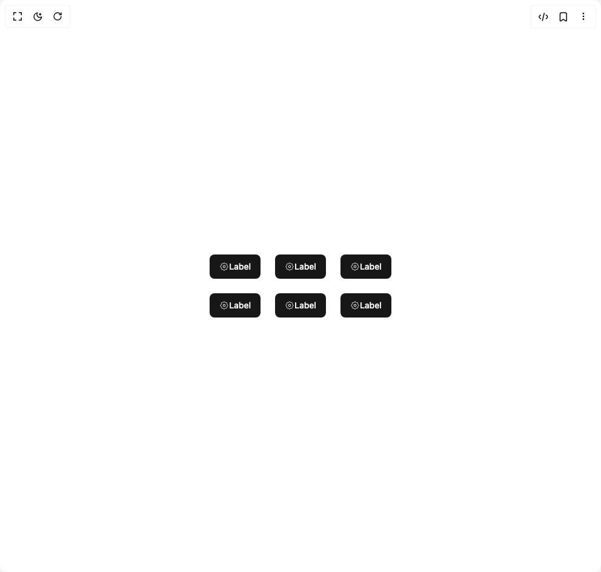

# Build Button7 in BuilderStudio

> Build this component in our Agentic IDE: [BuilderStudio](https://builderstudio.dev).
>
> Join the BuilderStudio community on [Discord](https://discord.gg/QdWeSGCqfe) and [Reddit](https://reddit.com/r/builderstudio).



## Component

- Author group: `intentui`
- Component: `button7`
- Variant: `intent-button`
- Rendered HTML snapshot: [`rendered.html`](rendered.html)

## BuilderStudio prompt

You are implementing a React component based on a component reference.

## Component identity

- Author: intentui
- Component slug: button7
- Demo slug: intent-button
- Title: button7
- Description: 

## Goal

Recreate this component in a React + TypeScript + Tailwind CSS project. Preserve the visual layout, spacing, colors, border radius, shadows, interaction behavior, animation behavior, responsive behavior, and dark mode behavior shown in the rendered demo.

## Implementation requirements

- Use React and TypeScript.
- Use Tailwind CSS classes whenever possible.
- Keep the component self-contained unless the source files require helper components.
- If the source uses CSS variables, custom CSS, animations, or keyframes, include them.
- If the source uses external packages, list and use the required packages.
- Preserve accessibility attributes, button semantics, links, keyboard behavior, and ARIA attributes when visible in the source.
- Do not replace the component with a simplified placeholder.
- Return complete production-ready code.

## Dependencies

No reference metadata available.

## Rendered DOM snapshot

This is the rendered demo HTML extracted from the live preview. Use it to verify structure, class names, visible content, and layout.

```html
<div id="root"><div class="w-screen min-h-screen flex justify-center items-center"><div class="w-screen min-h-screen flex justify-center items-center"><div class="mx-auto flex max-w-xs flex-wrap items-start justify-center gap-6"><button class="inline-flex items-center justify-center whitespace-nowrap rounded-md text-sm font-medium ring-offset-background transition-colors focus-visible:outline-none focus-visible:ring-2 focus-visible:ring-ring focus-visible:ring-offset-2 disabled:pointer-events-none disabled:opacity-50 bg-primary text-primary-foreground hover:bg-primary/90 h-10 px-4 py-2" intent="primary"><svg xmlns="http://www.w3.org/2000/svg" width="16" height="16" fill="none" viewBox="0 0 24 24" class="intentui-icons size-4" data-slot="icon" aria-hidden="true"><path stroke="currentColor" stroke-linejoin="round" stroke-width="1.5" d="m8.552 5.37-1.793-.414a1 1 0 0 0-.932.267l-.604.604a1 1 0 0 0-.267.932l.414 1.793a1 1 0 0 1-.42 1.056l-1.755 1.17a1 1 0 0 0-.445.832v.78a1 1 0 0 0 .445.832l1.755 1.17a1 1 0 0 1 .42 1.056l-.414 1.793a1 1 0 0 0 .267.932l.604.604a1 1 0 0 0 .932.267l1.793-.414a1 1 0 0 1 1.056.42l1.17 1.755a1 1 0 0 0 .832.445h.78a1 1 0 0 0 .832-.445l1.17-1.755a1 1 0 0 1 1.056-.42l1.793.414a1 1 0 0 0 .932-.267l.604-.604a1 1 0 0 0 .267-.932l-.414-1.793a1 1 0 0 1 .42-1.056l1.755-1.17a1 1 0 0 0 .445-.832v-.78a1 1 0 0 0-.445-.832l-1.755-1.17a1 1 0 0 1-.42-1.056l.414-1.793a1 1 0 0 0-.267-.932l-.604-.604a1 1 0 0 0-.932-.267l-1.793.414a1 1 0 0 1-1.056-.42l-1.17-1.755a1 1 0 0 0-.832-.445h-.78a1 1 0 0 0-.832.445L9.608 4.95a1 1 0 0 1-1.056.42Z"></path><path stroke="currentColor" stroke-linejoin="round" stroke-width="1.5" d="M14.75 12a2.75 2.75 0 1 1-5.5 0 2.75 2.75 0 0 1 5.5 0Z"></path></svg> Label</button><button class="inline-flex items-center justify-center whitespace-nowrap rounded-md text-sm font-medium ring-offset-background transition-colors focus-visible:outline-none focus-visible:ring-2 focus-visible:ring-ring focus-visible:ring-offset-2 disabled:pointer-events-none disabled:opacity-50 bg-primary text-primary-foreground hover:bg-primary/90 h-10 px-4 py-2" intent="secondary"><svg xmlns="http://www.w3.org/2000/svg" width="16" height="16" fill="none" viewBox="0 0 24 24" class="intentui-icons size-4" data-slot="icon" aria-hidden="true"><path stroke="currentColor" stroke-linejoin="round" stroke-width="1.5" d="m8.552 5.37-1.793-.414a1 1 0 0 0-.932.267l-.604.604a1 1 0 0 0-.267.932l.414 1.793a1 1 0 0 1-.42 1.056l-1.755 1.17a1 1 0 0 0-.445.832v.78a1 1 0 0 0 .445.832l1.755 1.17a1 1 0 0 1 .42 1.056l-.414 1.793a1 1 0 0 0 .267.932l.604.604a1 1 0 0 0 .932.267l1.793-.414a1 1 0 0 1 1.056.42l1.17 1.755a1 1 0 0 0 .832.445h.78a1 1 0 0 0 .832-.445l1.17-1.755a1 1 0 0 1 1.056-.42l1.793.414a1 1 0 0 0 .932-.267l.604-.604a1 1 0 0 0 .267-.932l-.414-1.793a1 1 0 0 1 .42-1.056l1.755-1.17a1 1 0 0 0 .445-.832v-.78a1 1 0 0 0-.445-.832l-1.755-1.17a1 1 0 0 1-.42-1.056l.414-1.793a1 1 0 0 0-.267-.932l-.604-.604a1 1 0 0 0-.932-.267l-1.793.414a1 1 0 0 1-1.056-.42l-1.17-1.755a1 1 0 0 0-.832-.445h-.78a1 1 0 0 0-.832.445L9.608 4.95a1 1 0 0 1-1.056.42Z"></path><path stroke="currentColor" stroke-linejoin="round" stroke-width="1.5" d="M14.75 12a2.75 2.75 0 1 1-5.5 0 2.75 2.75 0 0 1 5.5 0Z"></path></svg> Label</button><button class="inline-flex items-center justify-center whitespace-nowrap rounded-md text-sm font-medium ring-offset-background transition-colors focus-visible:outline-none focus-visible:ring-2 focus-visible:ring-ring focus-visible:ring-offset-2 disabled:pointer-events-none disabled:opacity-50 bg-primary text-primary-foreground hover:bg-primary/90 h-10 px-4 py-2" intent="warning"><svg xmlns="http://www.w3.org/2000/svg" width="16" height="16" fill="none" viewBox="0 0 24 24" class="intentui-icons size-4" data-slot="icon" aria-hidden="true"><path stroke="currentColor" stroke-linejoin="round" stroke-width="1.5" d="m8.552 5.37-1.793-.414a1 1 0 0 0-.932.267l-.604.604a1 1 0 0 0-.267.932l.414 1.793a1 1 0 0 1-.42 1.056l-1.755 1.17a1 1 0 0 0-.445.832v.78a1 1 0 0 0 .445.832l1.755 1.17a1 1 0 0 1 .42 1.056l-.414 1.793a1 1 0 0 0 .267.932l.604.604a1 1 0 0 0 .932.267l1.793-.414a1 1 0 0 1 1.056.42l1.17 1.755a1 1 0 0 0 .832.445h.78a1 1 0 0 0 .832-.445l1.17-1.755a1 1 0 0 1 1.056-.42l1.793.414a1 1 0 0 0 .932-.267l.604-.604a1 1 0 0 0 .267-.932l-.414-1.793a1 1 0 0 1 .42-1.056l1.755-1.17a1 1 0 0 0 .445-.832v-.78a1 1 0 0 0-.445-.832l-1.755-1.17a1 1 0 0 1-.42-1.056l.414-1.793a1 1 0 0 0-.267-.932l-.604-.604a1 1 0 0 0-.932-.267l-1.793.414a1 1 0 0 1-1.056-.42l-1.17-1.755a1 1 0 0 0-.832-.445h-.78a1 1 0 0 0-.832.445L9.608 4.95a1 1 0 0 1-1.056.42Z"></path><path stroke="currentColor" stroke-linejoin="round" stroke-width="1.5" d="M14.75 12a2.75 2.75 0 1 1-5.5 0 2.75 2.75 0 0 1 5.5 0Z"></path></svg> Label</button><button class="inline-flex items-center justify-center whitespace-nowrap rounded-md text-sm font-medium ring-offset-background transition-colors focus-visible:outline-none focus-visible:ring-2 focus-visible:ring-ring focus-visible:ring-offset-2 disabled:pointer-events-none disabled:opacity-50 bg-primary text-primary-foreground hover:bg-primary/90 h-10 px-4 py-2" intent="danger"><svg xmlns="http://www.w3.org/2000/svg" width="16" height="16" fill="none" viewBox="0 0 24 24" class="intentui-icons size-4" data-slot="icon" aria-hidden="true"><path stroke="currentColor" stroke-linejoin="round" stroke-width="1.5" d="m8.552 5.37-1.793-.414a1 1 0 0 0-.932.267l-.604.604a1 1 0 0 0-.267.932l.414 1.793a1 1 0 0 1-.42 1.056l-1.755 1.17a1 1 0 0 0-.445.832v.78a1 1 0 0 0 .445.832l1.755 1.17a1 1 0 0 1 .42 1.056l-.414 1.793a1 1 0 0 0 .267.932l.604.604a1 1 0 0 0 .932.267l1.793-.414a1 1 0 0 1 1.056.42l1.17 1.755a1 1 0 0 0 .832.445h.78a1 1 0 0 0 .832-.445l1.17-1.755a1 1 0 0 1 1.056-.42l1.793.414a1 1 0 0 0 .932-.267l.604-.604a1 1 0 0 0 .267-.932l-.414-1.793a1 1 0 0 1 .42-1.056l1.755-1.17a1 1 0 0 0 .445-.832v-.78a1 1 0 0 0-.445-.832l-1.755-1.17a1 1 0 0 1-.42-1.056l.414-1.793a1 1 0 0 0-.267-.932l-.604-.604a1 1 0 0 0-.932-.267l-1.793.414a1 1 0 0 1-1.056-.42l-1.17-1.755a1 1 0 0 0-.832-.445h-.78a1 1 0 0 0-.832.445L9.608 4.95a1 1 0 0 1-1.056.42Z"></path><path stroke="currentColor" stroke-linejoin="round" stroke-width="1.5" d="M14.75 12a2.75 2.75 0 1 1-5.5 0 2.75 2.75 0 0 1 5.5 0Z"></path></svg> Label</button><button class="inline-flex items-center justify-center whitespace-nowrap rounded-md text-sm font-medium ring-offset-background transition-colors focus-visible:outline-none focus-visible:ring-2 focus-visible:ring-ring focus-visible:ring-offset-2 disabled:pointer-events-none disabled:opacity-50 bg-primary text-primary-foreground hover:bg-primary/90 h-10 px-4 py-2" intent="outline"><svg xmlns="http://www.w3.org/2000/svg" width="16" height="16" fill="none" viewBox="0 0 24 24" class="intentui-icons size-4" data-slot="icon" aria-hidden="true"><path stroke="currentColor" stroke-linejoin="round" stroke-width="1.5" d="m8.552 5.37-1.793-.414a1 1 0 0 0-.932.267l-.604.604a1 1 0 0 0-.267.932l.414 1.793a1 1 0 0 1-.42 1.056l-1.755 1.17a1 1 0 0 0-.445.832v.78a1 1 0 0 0 .445.832l1.755 1.17a1 1 0 0 1 .42 1.056l-.414 1.793a1 1 0 0 0 .267.932l.604.604a1 1 0 0 0 .932.267l1.793-.414a1 1 0 0 1 1.056.42l1.17 1.755a1 1 0 0 0 .832.445h.78a1 1 0 0 0 .832-.445l1.17-1.755a1 1 0 0 1 1.056-.42l1.793.414a1 1 0 0 0 .932-.267l.604-.604a1 1 0 0 0 .267-.932l-.414-1.793a1 1 0 0 1 .42-1.056l1.755-1.17a1 1 0 0 0 .445-.832v-.78a1 1 0 0 0-.445-.832l-1.755-1.17a1 1 0 0 1-.42-1.056l.414-1.793a1 1 0 0 0-.267-.932l-.604-.604a1 1 0 0 0-.932-.267l-1.793.414a1 1 0 0 1-1.056-.42l-1.17-1.755a1 1 0 0 0-.832-.445h-.78a1 1 0 0 0-.832.445L9.608 4.95a1 1 0 0 1-1.056.42Z"></path><path stroke="currentColor" stroke-linejoin="round" stroke-width="1.5" d="M14.75 12a2.75 2.75 0 1 1-5.5 0 2.75 2.75 0 0 1 5.5 0Z"></path></svg> Label</button><button class="inline-flex items-center justify-center whitespace-nowrap rounded-md text-sm font-medium ring-offset-background transition-colors focus-visible:outline-none focus-visible:ring-2 focus-visible:ring-ring focus-visible:ring-offset-2 disabled:pointer-events-none disabled:opacity-50 bg-primary text-primary-foreground hover:bg-primary/90 h-10 px-4 py-2" intent="plain"><svg xmlns="http://www.w3.org/2000/svg" width="16" height="16" fill="none" viewBox="0 0 24 24" class="intentui-icons size-4" data-slot="icon" aria-hidden="true"><path stroke="currentColor" stroke-linejoin="round" stroke-width="1.5" d="m8.552 5.37-1.793-.414a1 1 0 0 0-.932.267l-.604.604a1 1 0 0 0-.267.932l.414 1.793a1 1 0 0 1-.42 1.056l-1.755 1.17a1 1 0 0 0-.445.832v.78a1 1 0 0 0 .445.832l1.755 1.17a1 1 0 0 1 .42 1.056l-.414 1.793a1 1 0 0 0 .267.932l.604.604a1 1 0 0 0 .932.267l1.793-.414a1 1 0 0 1 1.056.42l1.17 1.755a1 1 0 0 0 .832.445h.78a1 1 0 0 0 .832-.445l1.17-1.755a1 1 0 0 1 1.056-.42l1.793.414a1 1 0 0 0 .932-.267l.604-.604a1 1 0 0 0 .267-.932l-.414-1.793a1 1 0 0 1 .42-1.056l1.755-1.17a1 1 0 0 0 .445-.832v-.78a1 1 0 0 0-.445-.832l-1.755-1.17a1 1 0 0 1-.42-1.056l.414-1.793a1 1 0 0 0-.267-.932l-.604-.604a1 1 0 0 0-.932-.267l-1.793.414a1 1 0 0 1-1.056-.42l-1.17-1.755a1 1 0 0 0-.832-.445h-.78a1 1 0 0 0-.832.445L9.608 4.95a1 1 0 0 1-1.056.42Z"></path><path stroke="currentColor" stroke-linejoin="round" stroke-width="1.5" d="M14.75 12a2.75 2.75 0 1 1-5.5 0 2.75 2.75 0 0 1 5.5 0Z"></path></svg> Label</button></div></div></div></div>
```

## Reference source files

No reference source files were available.
