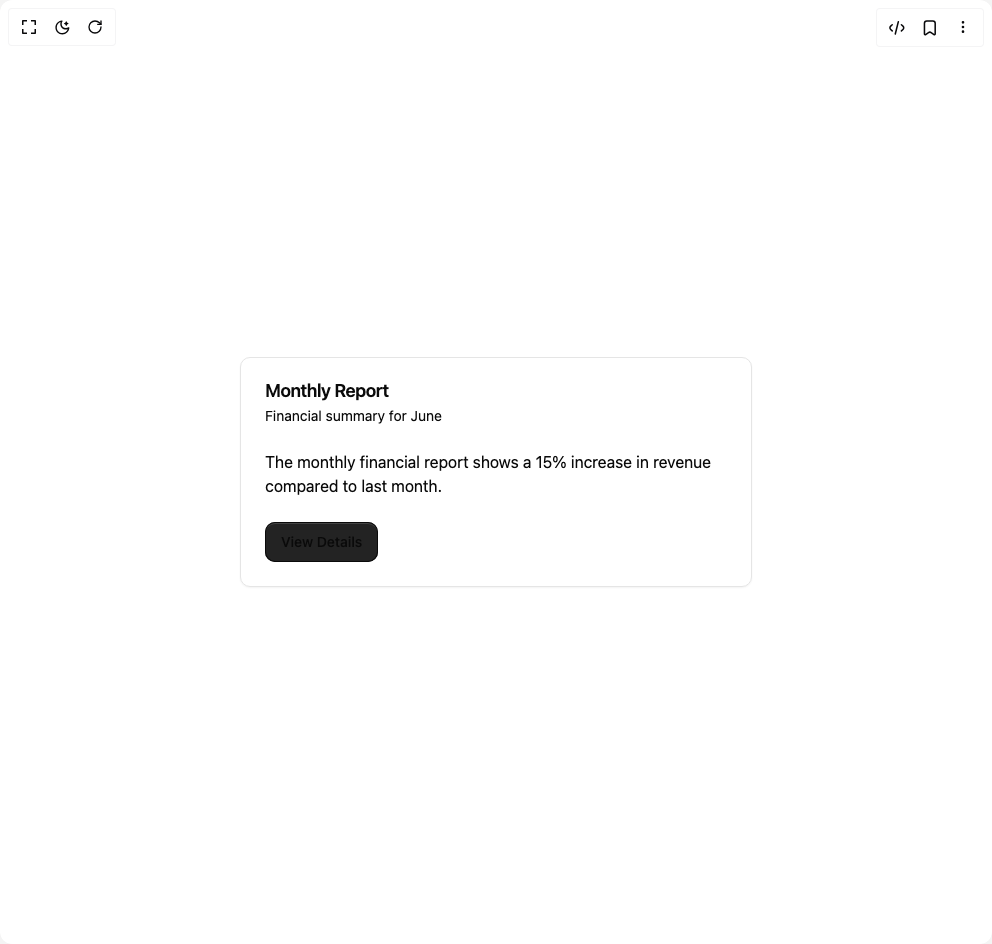

# Build Card in BuilderStudio

> Build this component in our Agentic IDE: [BuilderStudio](https://builderstudio.dev).
>
> Join the BuilderStudio community on [Discord](https://discord.gg/QdWeSGCqfe) and [Reddit](https://reddit.com/r/builderstudio).



## Component

- Author group: `intentui`
- Component: `card`
- Variant: `default`
- Rendered HTML snapshot: [`rendered.html`](rendered.html)

## BuilderStudio prompt

You are implementing a React component based on a component reference.

## Component identity

- Author: intentui
- Component slug: card
- Demo slug: default
- Title: card
- Description: 

## Goal

Recreate this component in a React + TypeScript + Tailwind CSS project. Preserve the visual layout, spacing, colors, border radius, shadows, interaction behavior, animation behavior, responsive behavior, and dark mode behavior shown in the rendered demo.

## Implementation requirements

- Use React and TypeScript.
- Use Tailwind CSS classes whenever possible.
- Keep the component self-contained unless the source files require helper components.
- If the source uses CSS variables, custom CSS, animations, or keyframes, include them.
- If the source uses external packages, list and use the required packages.
- Preserve accessibility attributes, button semantics, links, keyboard behavior, and ARIA attributes when visible in the source.
- Do not replace the component with a simplified placeholder.
- Return complete production-ready code.

## Dependencies

No reference metadata available.

## Rendered DOM snapshot

This is the rendered demo HTML extracted from the live preview. Use it to verify structure, class names, visible content, and layout.

```html
<div id="root"><div class="w-screen min-h-screen flex justify-center items-center"><div class="w-screen min-h-screen flex justify-center items-center"><div data-slot="card" class="group/card flex flex-col gap-(--card-spacing) rounded-lg border bg-bg py-(--card-spacing) text-fg shadow-xs [--card-spacing:--spacing(6)] has-[table]:overflow-hidden has-[table]:not-has-data-[slot=card-footer]:pb-0 **:data-[slot=table-header]:bg-muted/50 has-[table]:**:data-[slot=card-footer]:border-t **:[table]:overflow-hidden max-w-lg"><div data-slot="card-header" class="grid auto-rows-min grid-rows-[auto_auto] items-start gap-1.5 px-(--card-spacing) has-data-[slot=card-action]:grid-cols-[1fr_auto]"><div data-slot="card-title" class="font-semibold text-lg leading-none tracking-tight">Monthly Report</div><div data-slot="card-description" class="row-start-2 text-pretty text-muted-fg text-sm">Financial summary for June</div></div><div data-slot="card-content" class="px-(--card-spacing) has-[table]:border-t">The monthly financial report shows a 15% increase in revenue compared to last month.</div><div data-slot="card-footer" class="flex items-center px-(--card-spacing) group-has-[table]/card:pt-(--card-spacing) [.border-t]:pt-6"><button type="button" tabindex="0" data-react-aria-pressable="true" class="relative isolate inline-flex items-center justify-center gap-x-2 font-medium outline-0 outline-offset-2 hover:no-underline focus-visible:outline-2 inset-ring inset-ring-fg/20 bg-(--btn-bg) pressed:bg-(--btn-overlay) text-(--btn-fg) shadow-[shadow:inset_0_2px_--theme(--color-white/15%)] hover:bg-(--btn-overlay) dark:inset-ring-fg/15 dark:shadow-none forced-colors:outline-[Highlight] forced-colors:[--btn-icon:ButtonText] forced-colors:hover:[--btn-icon:ButtonText] *:data-[slot=icon]:-mx-0.5 *:data-[slot=icon]:my-1 *:data-[slot=icon]:size-4 *:data-[slot=icon]:shrink-0 *:data-[slot=icon]:text-current/60 pressed:*:data-[slot=icon]:text-current *:data-[slot=icon]:transition hover:*:data-[slot=icon]:text-current/90 *:data-[slot=avatar]:-mx-0.5 *:data-[slot=avatar]:my-1 *:data-[slot=avatar]:*:size-4 *:data-[slot=avatar]:size-4 *:data-[slot=avatar]:shrink-0 outline-primary [--btn-bg:var(--color-primary)]/95 [--btn-fg:var(--color-primary-fg)] [--btn-overlay:var(--color-primary)] h-10 px-4 text-base sm:text-sm/6 rounded-lg" data-rac="" id="react-aria6386323792-«r0»">View Details</button></div></div></div></div></div>
```

## Reference source files

No reference source files were available.
