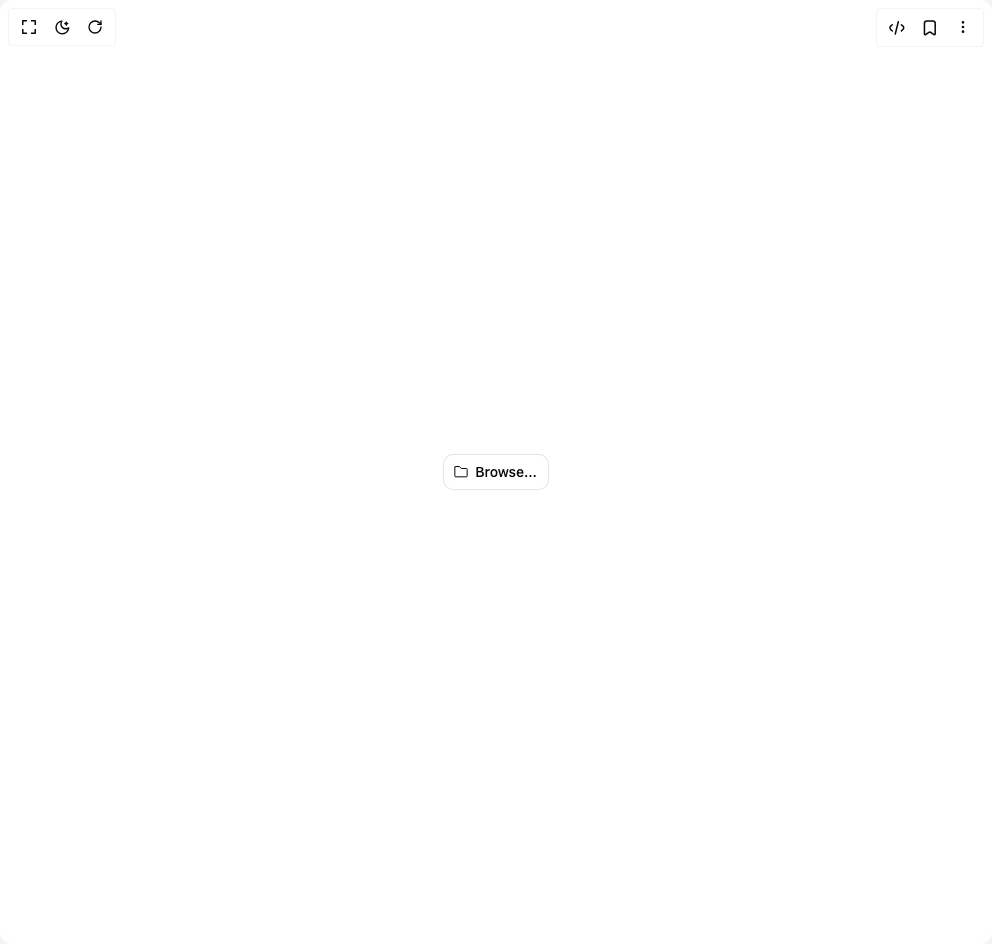

# Build File Trigger 13 in BuilderStudio

> Build this component in our Agentic IDE: [BuilderStudio](https://builderstudio.dev).
>
> Join the BuilderStudio community on [Discord](https://discord.gg/QdWeSGCqfe) and [Reddit](https://reddit.com/r/builderstudio).



## Component

- Author group: `intentui`
- Component: `file-trigger-13`
- Variant: `folder-file-trigger`
- Rendered HTML snapshot: [`rendered.html`](rendered.html)

## BuilderStudio prompt

You are implementing a React component based on a component reference.

## Component identity

- Author: intentui
- Component slug: file-trigger-13
- Demo slug: folder-file-trigger
- Title: file-trigger-13
- Description: 

## Goal

Recreate this component in a React + TypeScript + Tailwind CSS project. Preserve the visual layout, spacing, colors, border radius, shadows, interaction behavior, animation behavior, responsive behavior, and dark mode behavior shown in the rendered demo.

## Implementation requirements

- Use React and TypeScript.
- Use Tailwind CSS classes whenever possible.
- Keep the component self-contained unless the source files require helper components.
- If the source uses CSS variables, custom CSS, animations, or keyframes, include them.
- If the source uses external packages, list and use the required packages.
- Preserve accessibility attributes, button semantics, links, keyboard behavior, and ARIA attributes when visible in the source.
- Do not replace the component with a simplified placeholder.
- Return complete production-ready code.

## Dependencies

No reference metadata available.

## Rendered DOM snapshot

This is the rendered demo HTML extracted from the live preview. Use it to verify structure, class names, visible content, and layout.

```html
<div id="root"><div class="w-screen min-h-screen flex justify-center items-center"><div class="w-screen min-h-screen flex justify-center items-center"><button class="[--btn-icon-active:var(--btn-fg)] bg-(--btn-bg) pressed:bg-(--btn-overlay) text-(--btn-fg) outline-(--btn-outline) ring-(--btn-ring) hover:bg-(--btn-overlay) relative inset-ring isolate inline-flex items-center justify-center font-medium focus:outline-0 focus-visible:outline focus-visible:outline-offset-2 focus-visible:ring-2 focus-visible:ring-offset-3 focus-visible:ring-offset-bg *:data-[slot=icon]:-mx-0.5 *:data-[slot=icon]:my-0 *:data-[slot=icon]:shrink-0 *:data-[slot=icon]:self-center *:data-[slot=icon]:text-(--btn-icon) pressed:*:data-[slot=icon]:text-(--btn-icon-active) focus-visible:*:data-[slot=icon]:text-(--btn-icon-active)/80 hover:*:data-[slot=icon]:text-(--btn-icon-active)/90 sm:*:data-[slot=icon]:my-0 forced-colors:[--btn-icon:ButtonText] forced-colors:hover:[--btn-icon:ButtonText] *:data-[slot=loader]:-mx-0.5 *:data-[slot=loader]:my-0 *:data-[slot=loader]:shrink-0 *:data-[slot=loader]:self-center *:data-[slot=loader]:text-(--btn-icon) sm:*:data-[slot=loader]:my-0 inset-ring-border [--btn-bg:transparent] [--btn-icon:var(--color-muted-fg)] [--btn-outline:var(--color-ring)] [--btn-overlay:var(--color-muted)] [--btn-ring:var(--color-ring)]/20 min-h-9.5 gap-x-2 px-3.5 py-2 sm:min-h-9 sm:px-3 sm:py-1.5 sm:text-sm/6 *:data-[slot=icon]:size-5 sm:*:data-[slot=icon]:size-4 *:data-[slot=loader]:size-5 sm:*:data-[slot=loader]:size-4 rounded-lg" data-rac="" type="button" tabindex="0" data-react-aria-pressable="true" id="react-aria1299085067-«r0»"><svg xmlns="http://www.w3.org/2000/svg" width="16" height="16" fill="none" viewBox="0 0 24 24" data-slot="icon" class="intentui-icons size-4" aria-hidden="true"><path stroke="currentColor" stroke-linecap="round" stroke-linejoin="round" stroke-width="1.5" d="M2.75 4.75v13.5a1 1 0 0 0 1 1h16.5a1 1 0 0 0 1-1V7.75a1 1 0 0 0-1-1h-7.715a1 1 0 0 1-.832-.445l-1.406-2.11a1 1 0 0 0-.832-.445H3.75a1 1 0 0 0-1 1"></path></svg>Browse...</button><input webkitdirectory="" class="react-aria-Input" data-rac="" type="file" style="display: none;"></div></div></div>
```

## Reference source files

No reference source files were available.
