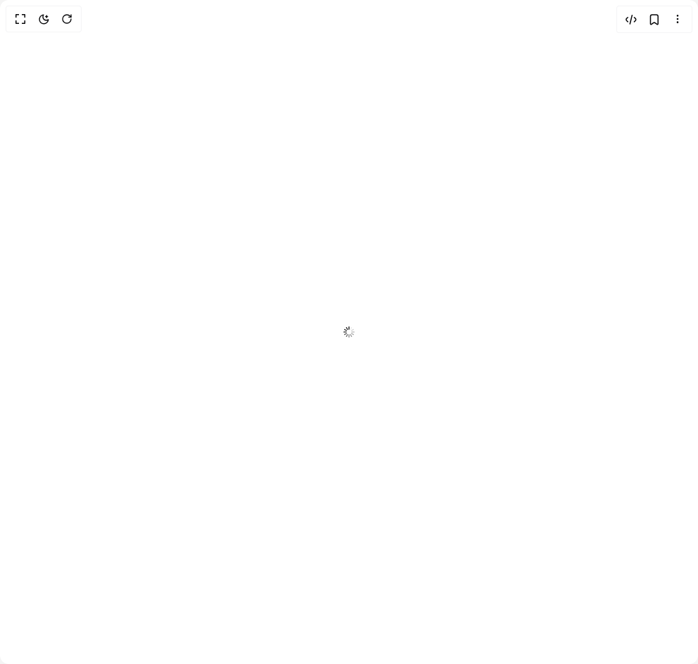

# Build Loader in BuilderStudio

> Build this component in our Agentic IDE: [BuilderStudio](https://builderstudio.dev).
>
> Join the BuilderStudio community on [Discord](https://discord.gg/QdWeSGCqfe) and [Reddit](https://reddit.com/r/builderstudio).



## Component

- Author group: `intentui`
- Component: `loader`
- Variant: `default`
- Rendered HTML snapshot: [`rendered.html`](rendered.html)

## BuilderStudio prompt

You are implementing a React component based on a component reference.

## Component identity

- Author: intentui
- Component slug: loader
- Demo slug: default
- Title: loader
- Description: 

## Goal

Recreate this component in a React + TypeScript + Tailwind CSS project. Preserve the visual layout, spacing, colors, border radius, shadows, interaction behavior, animation behavior, responsive behavior, and dark mode behavior shown in the rendered demo.

## Implementation requirements

- Use React and TypeScript.
- Use Tailwind CSS classes whenever possible.
- Keep the component self-contained unless the source files require helper components.
- If the source uses CSS variables, custom CSS, animations, or keyframes, include them.
- If the source uses external packages, list and use the required packages.
- Preserve accessibility attributes, button semantics, links, keyboard behavior, and ARIA attributes when visible in the source.
- Do not replace the component with a simplified placeholder.
- Return complete production-ready code.

## Dependencies

No reference metadata available.

## Rendered DOM snapshot

This is the rendered demo HTML extracted from the live preview. Use it to verify structure, class names, visible content, and layout.

```html
<div id="root"><div class="w-screen min-h-screen flex justify-center items-center"><div class="w-screen min-h-screen flex justify-center items-center"><div data-slot="loader" class="react-aria-ProgressBar" data-rac="" aria-label="Loading..." id="react-aria1208979212-«r0»" aria-valuemin="0" aria-valuemax="100" role="progressbar"><svg class="relative text-current size-4 stroke-current" data-slot="icon" viewBox="0 0 2400 2400" role="presentation"><g stroke-width="200" stroke-linecap="round" fill="none"><line x1="1200" y1="600" x2="1200" y2="100"></line><line opacity="0.5" x1="1200" y1="2300" x2="1200" y2="1800"></line><line opacity="0.917" x1="900" y1="680.4" x2="650" y2="247.4"></line><line opacity="0.417" x1="1750" y1="2152.6" x2="1500" y2="1719.6"></line><line opacity="0.833" x1="680.4" y1="900" x2="247.4" y2="650"></line><line opacity="0.333" x1="2152.6" y1="1750" x2="1719.6" y2="1500"></line><line opacity="0.75" x1="600" y1="1200" x2="100" y2="1200"></line><line opacity="0.25" x1="2300" y1="1200" x2="1800" y2="1200"></line><line opacity="0.667" x1="680.4" y1="1500" x2="247.4" y2="1750"></line><line opacity="0.167" x1="2152.6" y1="650" x2="1719.6" y2="900"></line><line opacity="0.583" x1="900" y1="1719.6" x2="650" y2="2152.6"></line><line opacity="0.083" x1="1750" y1="247.4" x2="1500" y2="680.4"></line><animateTransform attributeName="transform" attributeType="XML" type="rotate" keyTimes="0;0.08333;0.16667;0.25;0.33333;0.41667;0.5;0.58333;0.66667;0.75;0.83333;0.91667" values="0 1199 1199;30 1199 1199;60 1199 1199;90 1199 1199;120 1199 1199;150 1199 1199;180 1199 1199;210 1199 1199;240 1199 1199;270 1199 1199;300 1199 1199;330 1199 1199" dur="0.83333s" begin="0.08333s" repeatCount="indefinite" calcMode="discrete"></animateTransform></g></svg></div></div></div></div>
```

## Reference source files

No reference source files were available.
