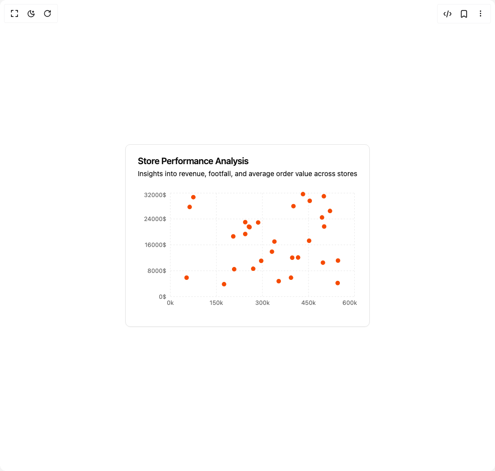

# Build Scatter Chart in BuilderStudio

> Build this component in our Agentic IDE: [BuilderStudio](https://builderstudio.dev).
>
> Join the BuilderStudio community on [Discord](https://discord.gg/QdWeSGCqfe) and [Reddit](https://reddit.com/r/builderstudio).



## Component

- Author group: `intentui`
- Component: `scatter-chart`
- Variant: `default`
- Rendered HTML snapshot: [`rendered.html`](rendered.html)

## BuilderStudio prompt

You are implementing a React component based on a component reference.

## Component identity

- Author: intentui
- Component slug: scatter-chart
- Demo slug: default
- Title: scatter-chart
- Description: 

## Goal

Recreate this component in a React + TypeScript + Tailwind CSS project. Preserve the visual layout, spacing, colors, border radius, shadows, interaction behavior, animation behavior, responsive behavior, and dark mode behavior shown in the rendered demo.

## Implementation requirements

- Use React and TypeScript.
- Use Tailwind CSS classes whenever possible.
- Keep the component self-contained unless the source files require helper components.
- If the source uses CSS variables, custom CSS, animations, or keyframes, include them.
- If the source uses external packages, list and use the required packages.
- Preserve accessibility attributes, button semantics, links, keyboard behavior, and ARIA attributes when visible in the source.
- Do not replace the component with a simplified placeholder.
- Return complete production-ready code.

## Dependencies

No reference metadata available.

## Rendered DOM snapshot

This is the rendered demo HTML extracted from the live preview. Use it to verify structure, class names, visible content, and layout.

```html
<div id="root"><div class="w-screen min-h-screen flex justify-center items-center"><div class="w-screen min-h-screen flex justify-center items-center"><div data-slot="card" class="group/card flex flex-col gap-(--card-spacing) rounded-lg border bg-bg py-(--card-spacing) text-fg shadow-xs [--card-spacing:--spacing(6)] has-[table]:overflow-hidden has-[table]:not-has-data-[slot=card-footer]:pb-0 **:data-[slot=table-header]:bg-muted/50 has-[table]:**:data-[slot=card-footer]:border-t **:[table]:overflow-hidden"><div data-slot="card-header" class="grid auto-rows-min grid-rows-[auto_auto] gap-1.5 px-(--card-spacing) has-data-[slot=card-action]:grid-cols-[1fr_auto] items-center"><div data-slot="card-title" class="font-semibold text-lg leading-none tracking-tight">Store Performance Analysis</div><div data-slot="card-description" class="row-start-2 text-pretty text-muted-fg text-sm">Insights into revenue, footfall, and average order value across stores</div></div><div data-slot="card-content" class="px-(--card-spacing) has-[table]:border-t"><div data-chart="chart-«r0»" class="flex aspect-video justify-center text-xs [&amp;_.recharts-cartesian-axis-tick_text]:fill-muted-fg [&amp;_.recharts-cartesian-grid_line[stroke='#ccc']]:stroke-border/80 [&amp;_.recharts-curve.recharts-tooltip-cursor]:stroke-border [&amp;_.recharts-dot[stroke='#fff']]:stroke-transparent [&amp;_.recharts-layer]:outline-hidden [&amp;_.recharts-polar-grid_[stroke='#ccc']]:stroke-border [&amp;_.recharts-radial-bar-background-sector]:fill-muted [&amp;_.recharts-rectangle.recharts-tooltip-cursor]:fill-muted [&amp;_.recharts-reference-line_[stroke='#ccc']]:stroke-border [&amp;_.recharts-sector[stroke='#fff']]:stroke-transparent [&amp;_.recharts-sector]:outline-hidden [&amp;_.recharts-surface]:outline-hidden max-h-min min-h-32"><style>
 [data-chart=chart-«r0»] {
  --color-performance: var(--chart-1);
}


.dark [data-chart=chart-«r0»] {
  --color-performance: var(--chart-1);
}
</style><div class="recharts-responsive-container" style="width: 100%; height: 100%; min-width: 0px;"><div class="recharts-wrapper" style="position: relative; cursor: default; width: 100%; height: 100%; max-height: 248px; max-width: 440px;"><svg class="recharts-surface" width="440" height="248" viewBox="0 0 440 248" style="width: 100%; height: 100%;"><title></title><desc></desc><defs><clipPath id="recharts1-clip"><rect x="65" y="5" height="208" width="370"></rect></clipPath></defs><g class="recharts-cartesian-grid"><g class="recharts-cartesian-grid-horizontal"><line stroke-dasharray="3 3" stroke="#ccc" fill="none" x="65" y="5" width="370" height="208" x1="65" y1="213" x2="435" y2="213"></line><line stroke-dasharray="3 3" stroke="#ccc" fill="none" x="65" y="5" width="370" height="208" x1="65" y1="161" x2="435" y2="161"></line><line stroke-dasharray="3 3" stroke="#ccc" fill="none" x="65" y="5" width="370" height="208" x1="65" y1="109" x2="435" y2="109"></line><line stroke-dasharray="3 3" stroke="#ccc" fill="none" x="65" y="5" width="370" height="208" x1="65" y1="57" x2="435" y2="57"></line><line stroke-dasharray="3 3" stroke="#ccc" fill="none" x="65" y="5" width="370" height="208" x1="65" y1="5" x2="435" y2="5"></line></g><g class="recharts-cartesian-grid-vertical"><line stroke-dasharray="3 3" stroke="#ccc" fill="none" x="65" y="5" width="370" height="208" x1="65" y1="5" x2="65" y2="213"></line><line stroke-dasharray="3 3" stroke="#ccc" fill="none" x="65" y="5" width="370" height="208" x1="157.5" y1="5" x2="157.5" y2="213"></line><line stroke-dasharray="3 3" stroke="#ccc" fill="none" x="65" y="5" width="370" height="208" x1="250" y1="5" x2="250" y2="213"></line><line stroke-dasharray="3 3" stroke="#ccc" fill="none" x="65" y="5" width="370" height="208" x1="342.5" y1="5" x2="342.5" y2="213"></line><line stroke-dasharray="3 3" stroke="#ccc" fill="none" x="65" y="5" width="370" height="208" x1="435" y1="5" x2="435" y2="213"></line></g></g><g class="recharts-layer recharts-cartesian-axis recharts-xAxis xAxis"><g class="recharts-cartesian-axis-ticks"><g class="recharts-layer recharts-cartesian-axis-tick"><text orientation="bottom" width="370" height="30" name="Footfall" stroke="none" x="65" y="221" class="recharts-text recharts-cartesian-axis-tick-value" text-anchor="middle" fill="#666"><tspan x="65" dy="0.71em">0k</tspan></text></g><g class="recharts-layer recharts-cartesian-axis-tick"><text orientation="bottom" width="370" height="30" name="Footfall" stroke="none" x="157.5" y="221" class="recharts-text recharts-cartesian-axis-tick-value" text-anchor="middle" fill="#666"><tspan x="157.5" dy="0.71em">150k</tspan></text></g><g class="recharts-layer recharts-cartesian-axis-tick"><text orientation="bottom" width="370" height="30" name="Footfall" stroke="none" x="250" y="221" class="recharts-text recharts-cartesian-axis-tick-value" text-anchor="middle" fill="#666"><tspan x="250" dy="0.71em">300k</tspan></text></g><g class="recharts-layer recharts-cartesian-axis-tick"><text orientation="bottom" width="370" height="30" name="Footfall" stroke="none" x="342.5" y="221" class="recharts-text recharts-cartesian-axis-tick-value" text-anchor="middle" fill="#666"><tspan x="342.5" dy="0.71em">450k</tspan></text></g><g class="recharts-layer recharts-cartesian-axis-tick"><text orientation="bottom" width="370" height="30" name="Footfall" stroke="none" x="425.359375" y="221" class="recharts-text recharts-cartesian-axis-tick-value" text-anchor="middle" fill="#666"><tspan x="425.359375" dy="0.71em">600k</tspan></text></g></g></g><g class="recharts-layer recharts-cartesian-axis recharts-yAxis yAxis"><g class="recharts-cartesian-axis-ticks"><g class="recharts-layer recharts-cartesian-axis-tick"><text orientation="left" width="60" height="208" name="Revenue" stroke="none" x="57" y="213" class="recharts-text recharts-cartesian-axis-tick-value" text-anchor="end" fill="#666"><tspan x="57" dy="0.355em">0$</tspan></text></g><g class="recharts-layer recharts-cartesian-axis-tick"><text orientation="left" width="60" height="208" name="Revenue" stroke="none" x="57" y="161" class="recharts-text recharts-cartesian-axis-tick-value" text-anchor="end" fill="#666"><tspan x="57" dy="0.355em">8000$</tspan></text></g><g class="recharts-layer recharts-cartesian-axis-tick"><text orientation="left" width="60" height="208" name="Revenue" stroke="none" x="57" y="109" class="recharts-text recharts-cartesian-axis-tick-value" text-anchor="end" fill="#666"><tspan x="57" dy="0.355em">16000$</tspan></text></g><g class="recharts-layer recharts-cartesian-axis-tick"><text orientation="left" width="60" height="208" name="Revenue" stroke="none" x="57" y="57" class="recharts-text recharts-cartesian-axis-tick-value" text-anchor="end" fill="#666"><tspan x="57" dy="0.355em">24000$</tspan></text></g><g class="recharts-layer recharts-cartesian-axis-tick"><text orientation="left" width="60" height="208" name="Revenue" stroke="none" x="57" y="9" class="recharts-text recharts-cartesian-axis-tick-value" text-anchor="end" fill="#666"><tspan x="57" dy="0.355em">32000$</tspan></text></g></g></g><g class="recharts-layer recharts-scatter"><g class="recharts-layer"><g class="recharts-layer"><g class="recharts-layer recharts-scatter-symbol" role="img"><path fill="var(--chart-1)" width="9.0270333367641" height="9.0270333367641" x="365.1198166649513" y="49.424983331617945" z="15" cx="369.6333333333334" cy="53.9385" class="recharts-symbols" transform="translate(369.6333333333334, 53.9385)" d="M4.514,0A4.514,4.514,0,1,1,-4.514,0A4.514,4.514,0,1,1,4.514,0"></path></g><g class="recharts-layer recharts-scatter-symbol" role="img"><path fill="var(--chart-1)" width="9.0270333367641" height="9.0270333367641" x="381.1531499982846" y="36.37948333161794" z="101" cx="385.6666666666667" cy="40.892999999999994" class="recharts-symbols" transform="translate(385.6666666666667, 40.892999999999994)" d="M4.514,0A4.514,4.514,0,1,1,-4.514,0A4.514,4.514,0,1,1,4.514,0"></path></g><g class="recharts-layer recharts-scatter-symbol" role="img"><path fill="var(--chart-1)" width="9.0270333367641" height="9.0270333367641" x="168.40314999828465" y="183.46148333161796" z="51" cx="172.91666666666669" cy="187.975" class="recharts-symbols" transform="translate(172.91666666666669, 187.975)" d="M4.514,0A4.514,4.514,0,1,1,-4.514,0A4.514,4.514,0,1,1,4.514,0"></path></g><g class="recharts-layer recharts-scatter-symbol" role="img"><path fill="var(--chart-1)" width="9.0270333367641" height="9.0270333367641" x="326.8864833316179" y="2.5664833316179516" z="110" cx="331.4" cy="7.080000000000002" class="recharts-symbols" transform="translate(331.4, 7.080000000000002)" d="M4.514,0A4.514,4.514,0,1,1,-4.514,0A4.514,4.514,0,1,1,4.514,0"></path></g><g class="recharts-layer recharts-scatter-symbol" role="img"><path fill="var(--chart-1)" width="9.0270333367641" height="9.0270333367641" x="366.9698166649513" y="140.15848333161796" z="136" cx="371.48333333333335" cy="144.672" class="recharts-symbols" transform="translate(371.48333333333335, 144.672)" d="M4.514,0A4.514,4.514,0,1,1,-4.514,0A4.514,4.514,0,1,1,4.514,0"></path></g><g class="recharts-layer recharts-scatter-symbol" role="img"><path fill="var(--chart-1)" width="9.0270333367641" height="9.0270333367641" x="302.83648333161796" y="170.41598333161795" z="73" cx="307.35" cy="174.9295" class="recharts-symbols" transform="translate(307.35, 174.9295)" d="M4.514,0A4.514,4.514,0,1,1,-4.514,0A4.514,4.514,0,1,1,4.514,0"></path></g><g class="recharts-layer recharts-scatter-symbol" role="img"><path fill="var(--chart-1)" width="9.0270333367641" height="9.0270333367641" x="368.81981666495125" y="6.823983331617959" z="47" cx="373.3333333333333" cy="11.33750000000001" class="recharts-symbols" transform="translate(373.3333333333333, 11.33750000000001)" d="M4.514,0A4.514,4.514,0,1,1,-4.514,0A4.514,4.514,0,1,1,4.514,0"></path></g><g class="recharts-layer recharts-scatter-symbol" role="img"><path fill="var(--chart-1)" width="9.0270333367641" height="9.0270333367641" x="99.33648333161794" y="28.416983331617953" z="164" cx="103.85" cy="32.9305" class="recharts-symbols" transform="translate(103.85, 32.9305)" d="M4.514,0A4.514,4.514,0,1,1,-4.514,0A4.514,4.514,0,1,1,4.514,0"></path></g><g class="recharts-layer recharts-scatter-symbol" role="img"><path fill="var(--chart-1)" width="9.0270333367641" height="9.0270333367641" x="369.4364833316179" y="67.65748333161794" z="166" cx="373.95" cy="72.17099999999999" class="recharts-symbols" transform="translate(373.95, 72.17099999999999)" d="M4.514,0A4.514,4.514,0,1,1,-4.514,0A4.514,4.514,0,1,1,4.514,0"></path></g><g class="recharts-layer recharts-scatter-symbol" role="img"><path fill="var(--chart-1)" width="9.0270333367641" height="9.0270333367641" x="236.85314999828464" y="59.52598333161794" z="22" cx="241.36666666666667" cy="64.03949999999999" class="recharts-symbols" transform="translate(241.36666666666667, 64.03949999999999)" d="M4.514,0A4.514,4.514,0,1,1,-4.514,0A4.514,4.514,0,1,1,4.514,0"></path></g><g class="recharts-layer recharts-scatter-symbol" role="img"><path fill="var(--chart-1)" width="9.0270333367641" height="9.0270333367641" x="243.0198166649513" y="136.57048333161796" z="140" cx="247.53333333333333" cy="141.084" class="recharts-symbols" transform="translate(247.53333333333333, 141.084)" d="M4.514,0A4.514,4.514,0,1,1,-4.514,0A4.514,4.514,0,1,1,4.514,0"></path></g><g class="recharts-layer recharts-scatter-symbol" role="img"><path fill="var(--chart-1)" width="9.0270333367641" height="9.0270333367641" x="269.5364833316179" y="97.82398333161795" z="57" cx="274.04999999999995" cy="102.3375" class="recharts-symbols" transform="translate(274.04999999999995, 102.3375)" d="M4.514,0A4.514,4.514,0,1,1,-4.514,0A4.514,4.514,0,1,1,4.514,0"></path></g><g class="recharts-layer recharts-scatter-symbol" role="img"><path fill="var(--chart-1)" width="9.0270333367641" height="9.0270333367641" x="188.75314999828464" y="153.37298333161797" z="78" cx="193.26666666666668" cy="157.8865" class="recharts-symbols" transform="translate(193.26666666666668, 157.8865)" d="M4.514,0A4.514,4.514,0,1,1,-4.514,0A4.514,4.514,0,1,1,4.514,0"></path></g><g class="recharts-layer recharts-scatter-symbol" role="img"><path fill="var(--chart-1)" width="9.0270333367641" height="9.0270333367641" x="93.16981666495128" y="170.36398333161793" z="161" cx="97.68333333333334" cy="174.87749999999997" class="recharts-symbols" transform="translate(97.68333333333334, 174.87749999999997)" d="M4.514,0A4.514,4.514,0,1,1,-4.514,0A4.514,4.514,0,1,1,4.514,0"></path></g><g class="recharts-layer recharts-scatter-symbol" role="img"><path fill="var(--chart-1)" width="9.0270333367641" height="9.0270333367641" x="397.186483331618" y="136.02448333161794" z="115" cx="401.70000000000005" cy="140.53799999999998" class="recharts-symbols" transform="translate(401.70000000000005, 140.53799999999998)" d="M4.514,0A4.514,4.514,0,1,1,-4.514,0A4.514,4.514,0,1,1,4.514,0"></path></g><g class="recharts-layer recharts-scatter-symbol" role="img"><path fill="var(--chart-1)" width="9.0270333367641" height="9.0270333367641" x="210.95314999828463" y="82.69848333161795" z="136" cx="215.46666666666667" cy="87.212" class="recharts-symbols" transform="translate(215.46666666666667, 87.212)" d="M4.514,0A4.514,4.514,0,1,1,-4.514,0A4.514,4.514,0,1,1,4.514,0"></path></g><g class="recharts-layer recharts-scatter-symbol" role="img"><path fill="var(--chart-1)" width="9.0270333367641" height="9.0270333367641" x="264.6031499982846" y="118.11698333161794" z="143" cx="269.1166666666667" cy="122.6305" class="recharts-symbols" transform="translate(269.1166666666667, 122.6305)" d="M4.514,0A4.514,4.514,0,1,1,-4.514,0A4.514,4.514,0,1,1,4.514,0"></path></g><g class="recharts-layer recharts-scatter-symbol" role="img"><path fill="var(--chart-1)" width="9.0270333367641" height="9.0270333367641" x="317.0198166649513" y="129.88198333161796" z="68" cx="321.53333333333336" cy="134.3955" class="recharts-symbols" transform="translate(321.53333333333336, 134.3955)" d="M4.514,0A4.514,4.514,0,1,1,-4.514,0A4.514,4.514,0,1,1,4.514,0"></path></g><g class="recharts-layer recharts-scatter-symbol" role="img"><path fill="var(--chart-1)" width="9.0270333367641" height="9.0270333367641" x="226.98648333161796" y="152.41748333161797" z="80" cx="231.5" cy="156.931" class="recharts-symbols" transform="translate(231.5, 156.931)" d="M4.514,0A4.514,4.514,0,1,1,-4.514,0A4.514,4.514,0,1,1,4.514,0"></path></g><g class="recharts-layer recharts-scatter-symbol" role="img"><path fill="var(--chart-1)" width="9.0270333367641" height="9.0270333367641" x="218.35314999828464" y="67.90448333161794" z="15" cx="222.86666666666667" cy="72.41799999999999" class="recharts-symbols" transform="translate(222.86666666666667, 72.41799999999999)" d="M4.514,0A4.514,4.514,0,1,1,-4.514,0A4.514,4.514,0,1,1,4.514,0"></path></g><g class="recharts-layer recharts-scatter-symbol" role="img"><path fill="var(--chart-1)" width="9.0270333367641" height="9.0270333367641" x="339.2198166649513" y="96.22498333161795" z="56" cx="343.73333333333335" cy="100.7385" class="recharts-symbols" transform="translate(343.73333333333335, 100.7385)" d="M4.514,0A4.514,4.514,0,1,1,-4.514,0A4.514,4.514,0,1,1,4.514,0"></path></g><g class="recharts-layer recharts-scatter-symbol" role="img"><path fill="var(--chart-1)" width="9.0270333367641" height="9.0270333367641" x="305.3031499982846" y="130.30448333161797" z="57" cx="309.81666666666666" cy="134.818" class="recharts-symbols" transform="translate(309.81666666666666, 134.818)" d="M4.514,0A4.514,4.514,0,1,1,-4.514,0A4.514,4.514,0,1,1,4.514,0"></path></g><g class="recharts-layer recharts-scatter-symbol" role="img"><path fill="var(--chart-1)" width="9.0270333367641" height="9.0270333367641" x="307.7698166649513" y="26.707483331617944" z="203" cx="312.28333333333336" cy="31.220999999999993" class="recharts-symbols" transform="translate(312.28333333333336, 31.220999999999993)" d="M4.514,0A4.514,4.514,0,1,1,-4.514,0A4.514,4.514,0,1,1,4.514,0"></path></g><g class="recharts-layer recharts-scatter-symbol" role="img"><path fill="var(--chart-1)" width="9.0270333367641" height="9.0270333367641" x="396.56981666495125" y="181.05648333161798" z="86" cx="401.0833333333333" cy="185.57000000000002" class="recharts-symbols" transform="translate(401.0833333333333, 185.57000000000002)" d="M4.514,0A4.514,4.514,0,1,1,-4.514,0A4.514,4.514,0,1,1,4.514,0"></path></g><g class="recharts-layer recharts-scatter-symbol" role="img"><path fill="var(--chart-1)" width="9.0270333367641" height="9.0270333367641" x="219.58648333161796" y="68.84698333161795" z="189" cx="224.1" cy="73.3605" class="recharts-symbols" transform="translate(224.1, 73.3605)" d="M4.514,0A4.514,4.514,0,1,1,-4.514,0A4.514,4.514,0,1,1,4.514,0"></path></g><g class="recharts-layer recharts-scatter-symbol" role="img"><path fill="var(--chart-1)" width="9.0270333367641" height="9.0270333367641" x="186.90314999828462" y="87.43698333161795" z="129" cx="191.41666666666666" cy="91.9505" class="recharts-symbols" transform="translate(191.41666666666666, 91.9505)" d="M4.514,0A4.514,4.514,0,1,1,-4.514,0A4.514,4.514,0,1,1,4.514,0"></path></g><g class="recharts-layer recharts-scatter-symbol" role="img"><path fill="var(--chart-1)" width="9.0270333367641" height="9.0270333367641" x="278.16981666495127" y="177.35148333161797" z="196" cx="282.68333333333334" cy="181.865" class="recharts-symbols" transform="translate(282.68333333333334, 181.865)" d="M4.514,0A4.514,4.514,0,1,1,-4.514,0A4.514,4.514,0,1,1,4.514,0"></path></g><g class="recharts-layer recharts-scatter-symbol" role="img"><path fill="var(--chart-1)" width="9.0270333367641" height="9.0270333367641" x="340.45314999828463" y="15.969483331617962" z="94" cx="344.9666666666667" cy="20.48300000000001" class="recharts-symbols" transform="translate(344.9666666666667, 20.48300000000001)" d="M4.514,0A4.514,4.514,0,1,1,-4.514,0A4.514,4.514,0,1,1,4.514,0"></path></g><g class="recharts-layer recharts-scatter-symbol" role="img"><path fill="var(--chart-1)" width="9.0270333367641" height="9.0270333367641" x="210.95314999828463" y="58.82398333161796" z="95" cx="215.46666666666667" cy="63.33750000000001" class="recharts-symbols" transform="translate(215.46666666666667, 63.33750000000001)" d="M4.514,0A4.514,4.514,0,1,1,-4.514,0A4.514,4.514,0,1,1,4.514,0"></path></g><g class="recharts-layer recharts-scatter-symbol" role="img"><path fill="var(--chart-1)" width="9.0270333367641" height="9.0270333367641" x="106.73648333161795" y="8.650483331617952" z="176" cx="111.25" cy="13.164000000000001" class="recharts-symbols" transform="translate(111.25, 13.164000000000001)" d="M4.514,0A4.514,4.514,0,1,1,-4.514,0A4.514,4.514,0,1,1,4.514,0"></path></g></g></g></g></svg><div tabindex="-1" class="recharts-tooltip-wrapper" style="visibility: hidden; pointer-events: none; position: absolute; top: 0px; left: 0px;"></div></div></div></div></div></div></div></div></div>
```

## Reference source files

No reference source files were available.
