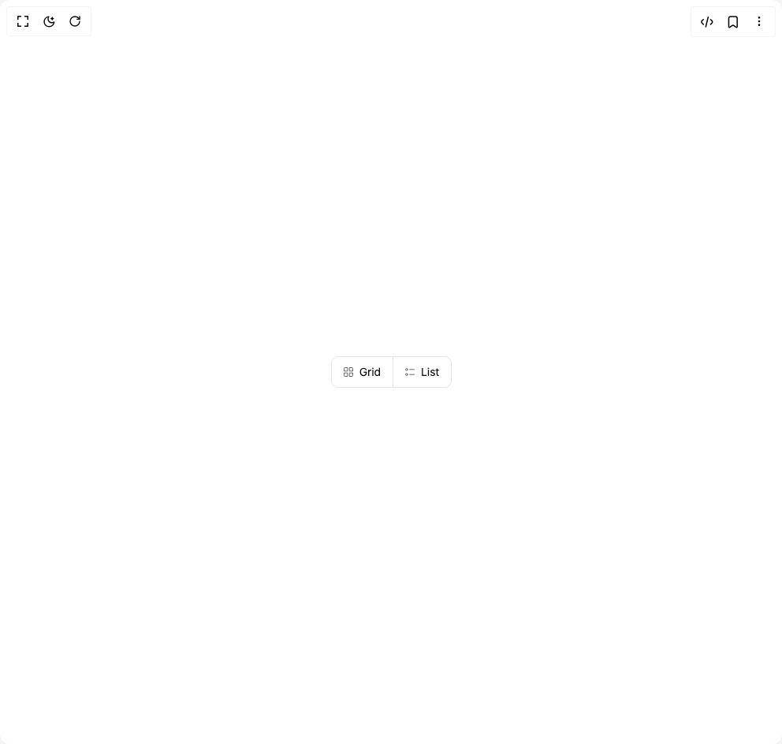

# Build Toggle Group in BuilderStudio

> Build this component in our Agentic IDE: [BuilderStudio](https://builderstudio.dev).
>
> Join the BuilderStudio community on [Discord](https://discord.gg/QdWeSGCqfe) and [Reddit](https://reddit.com/r/builderstudio).



## Component

- Author group: `intentui`
- Component: `toggle-group`
- Variant: `default`
- Rendered HTML snapshot: [`rendered.html`](rendered.html)

## BuilderStudio prompt

You are implementing a React component based on a component reference.

## Component identity

- Author: intentui
- Component slug: toggle-group
- Demo slug: default
- Title: toggle-group
- Description: 

## Goal

Recreate this component in a React + TypeScript + Tailwind CSS project. Preserve the visual layout, spacing, colors, border radius, shadows, interaction behavior, animation behavior, responsive behavior, and dark mode behavior shown in the rendered demo.

## Implementation requirements

- Use React and TypeScript.
- Use Tailwind CSS classes whenever possible.
- Keep the component self-contained unless the source files require helper components.
- If the source uses CSS variables, custom CSS, animations, or keyframes, include them.
- If the source uses external packages, list and use the required packages.
- Preserve accessibility attributes, button semantics, links, keyboard behavior, and ARIA attributes when visible in the source.
- Do not replace the component with a simplified placeholder.
- Return complete production-ready code.

## Dependencies

No reference metadata available.

## Rendered DOM snapshot

This is the rendered demo HTML extracted from the live preview. Use it to verify structure, class names, visible content, and layout.

```html
<div id="root"><div class="w-screen min-h-screen flex justify-center items-center"><div class="w-screen min-h-screen flex justify-center items-center"><div role="radiogroup" aria-orientation="horizontal" class="flex flex-row [-ms-overflow-style:none] [scrollbar-width:none] [&amp;::-webkit-scrollbar]:hidden gap-0 rounded-lg *:[button]:inset-ring-1 *:[button]:rounded-none *:[button]:-mr-px *:[button]:first:rounded-s-[calc(var(--radius-lg)-1px)] *:[button]:last:rounded-e-[calc(var(--radius-lg)-1px)]" data-rac="" data-orientation="horizontal"><button type="button" tabindex="0" data-react-aria-pressable="true" aria-pressed="false" class="inset-ring inset-ring-border cursor-default items-center gap-x-2 outline-hidden sm:text-sm forced-colors:[--button-icon:ButtonText] forced-colors:hover:[--button-icon:ButtonText] *:data-[slot=icon]:-mx-0.5 *:data-[slot=icon]:my-1 *:data-[slot=icon]:size-4 *:data-[slot=icon]:shrink-0 *:data-[slot=icon]:text-current/60 pressed:*:data-[slot=icon]:text-current hover:*:data-[slot=icon]:text-current/90 pressed:border-secondary-fg/10 selected:border-secondary-fg/10 selected:bg-secondary selected:text-secondary-fg hover:border-secondary-fg/10 hover:bg-muted hover:text-secondary-fg inline-flex justify-center h-10 px-4 rounded-lg" data-rac=""><svg xmlns="http://www.w3.org/2000/svg" width="16" height="16" fill="none" viewBox="0 0 24 24" class="intentui-icons size-4" data-slot="icon" aria-hidden="true"><path stroke="currentColor" stroke-linecap="round" stroke-linejoin="round" stroke-width="1.5" d="M3.75 5.35c0-.56 0-.84.109-1.054a1 1 0 0 1 .437-.437c.214-.109.494-.109 1.054-.109h4.9v6.5h-6.5zm10-1.6h4.9c.56 0 .84 0 1.054.109a1 1 0 0 1 .437.437c.109.214.109.494.109 1.054v4.9h-6.5zm-10 10h6.5v6.5h-4.9c-.56 0-.84 0-1.054-.109a1 1 0 0 1-.437-.437c-.109-.214-.109-.494-.109-1.054zm10 0h6.5v4.9c0 .56 0 .84-.109 1.054a1 1 0 0 1-.437.437c-.214.109-.494.109-1.054.109h-4.9z"></path></svg>Grid</button><button type="button" tabindex="0" data-react-aria-pressable="true" aria-pressed="false" class="inset-ring inset-ring-border cursor-default items-center gap-x-2 outline-hidden sm:text-sm forced-colors:[--button-icon:ButtonText] forced-colors:hover:[--button-icon:ButtonText] *:data-[slot=icon]:-mx-0.5 *:data-[slot=icon]:my-1 *:data-[slot=icon]:size-4 *:data-[slot=icon]:shrink-0 *:data-[slot=icon]:text-current/60 pressed:*:data-[slot=icon]:text-current hover:*:data-[slot=icon]:text-current/90 pressed:border-secondary-fg/10 selected:border-secondary-fg/10 selected:bg-secondary selected:text-secondary-fg hover:border-secondary-fg/10 hover:bg-muted hover:text-secondary-fg inline-flex justify-center h-10 px-4 rounded-lg" data-rac=""><svg xmlns="http://www.w3.org/2000/svg" width="16" height="16" fill="none" viewBox="0 0 24 24" class="intentui-icons size-4" data-slot="icon" aria-hidden="true"><path stroke="currentColor" stroke-linecap="round" stroke-linejoin="round" stroke-width="1.5" d="M11.75 16.75h8.5m-8.5-9.5h8.5m-12.5 0a2 2 0 1 1-4 0 2 2 0 0 1 4 0m0 9.5a2 2 0 1 1-4 0 2 2 0 0 1 4 0"></path></svg>List</button></div></div></div></div>
```

## Reference source files

No reference source files were available.
