# Isaiahbjork Components

14 components are available in this author group.

> Build any component in [BuilderStudio](https://builderstudio.dev), then share improvements with the community on [Discord](https://discord.gg/QdWeSGCqfe) or [Reddit](https://reddit.com/r/builderstudio).

| Preview | Component | Variant |
| --- | --- | --- |
| [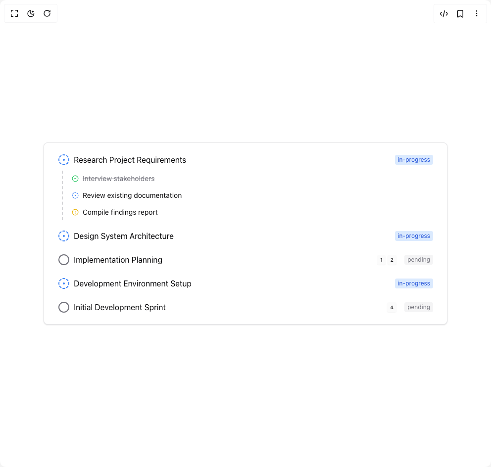](agent-plan/default/README.md) | [Agent Plan](agent-plan/default/README.md) | `default` |
| [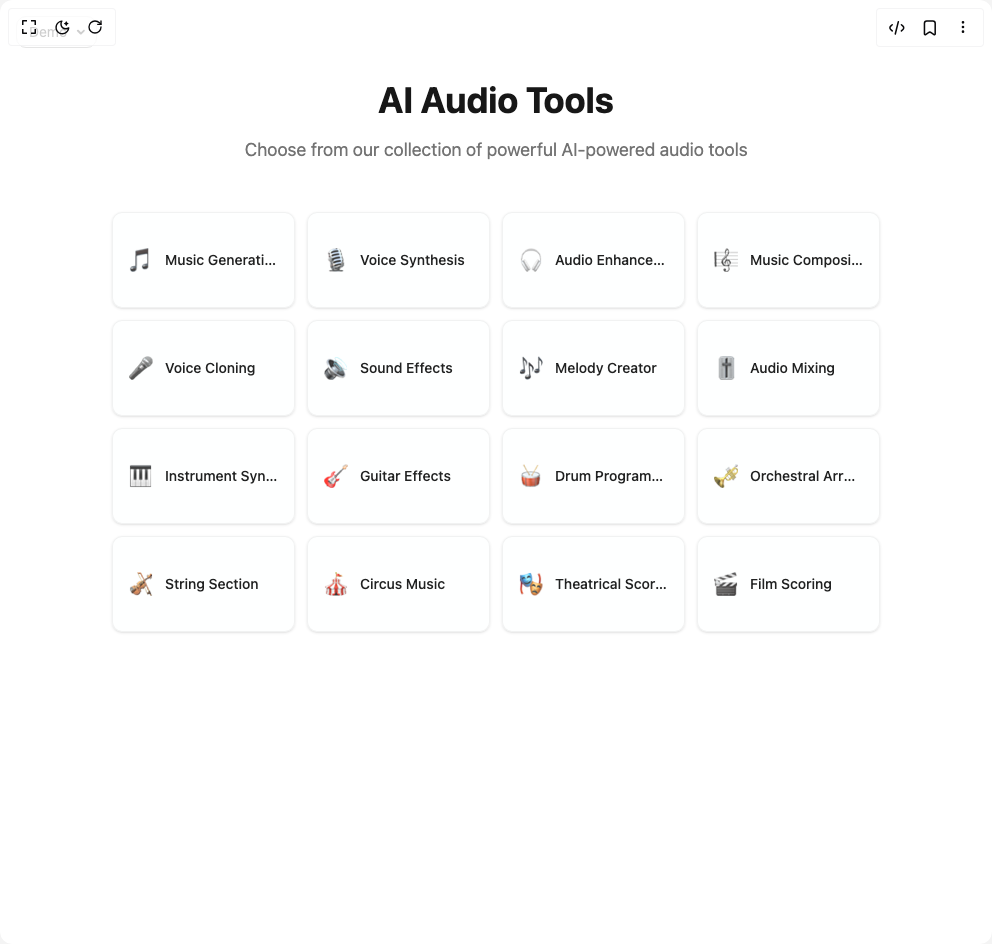](animated-card-options/default/README.md) | [Animated Card Options](animated-card-options/default/README.md) | `default` |
|  | [Animated Dashboard Card](animated-dashboard-card/default/README.md) | `default` |
| [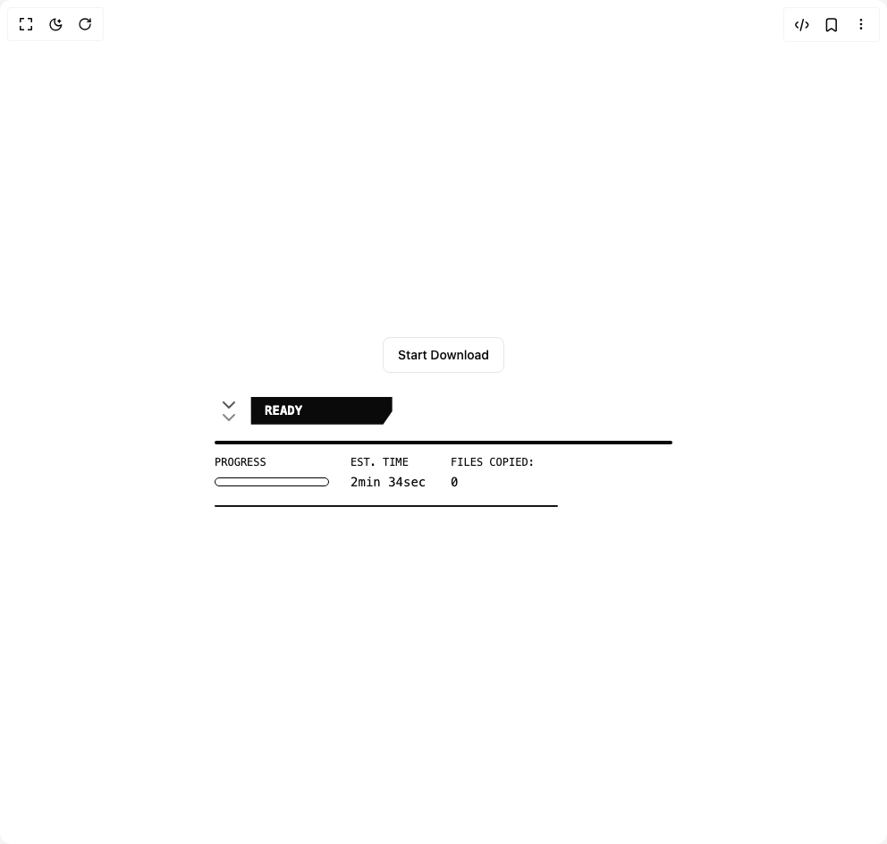](animated-download/default/README.md) | [Animated Download](animated-download/default/README.md) | `default` |
| [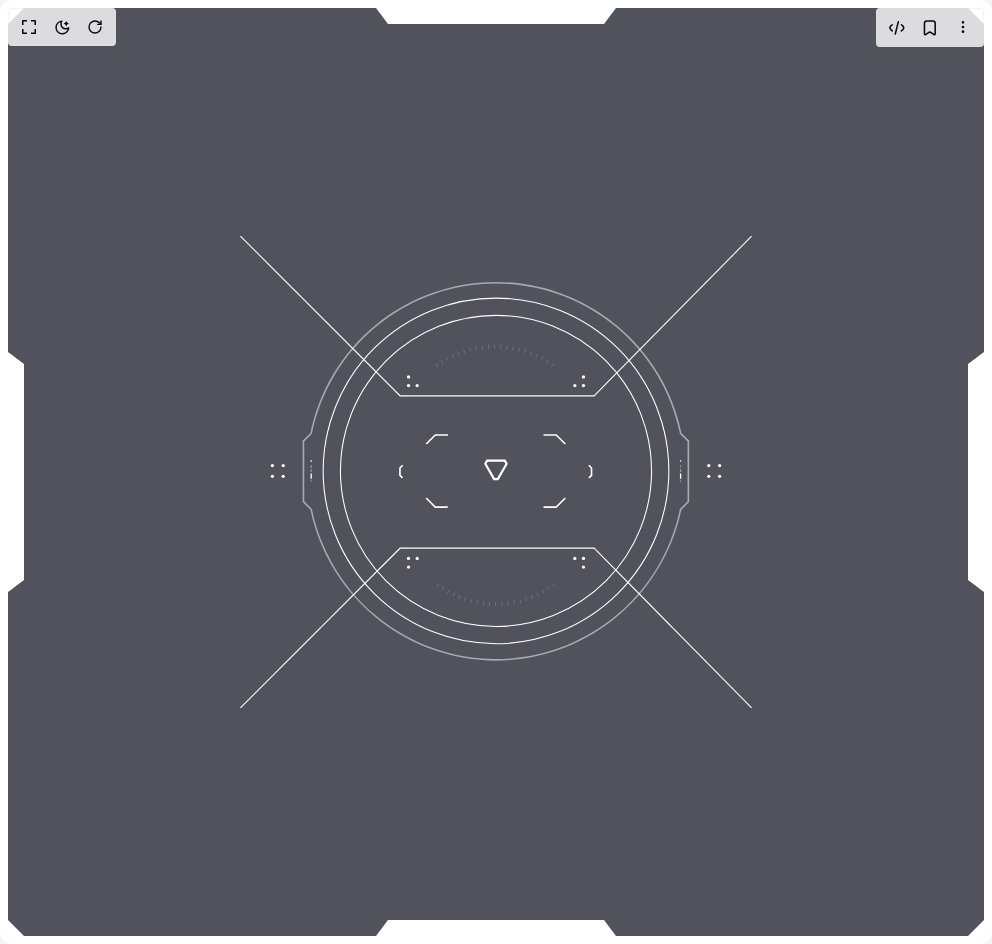](animated-hud-targeting-ui/default/README.md) | [Animated Hud Targeting Ui](animated-hud-targeting-ui/default/README.md) | `default` |
| [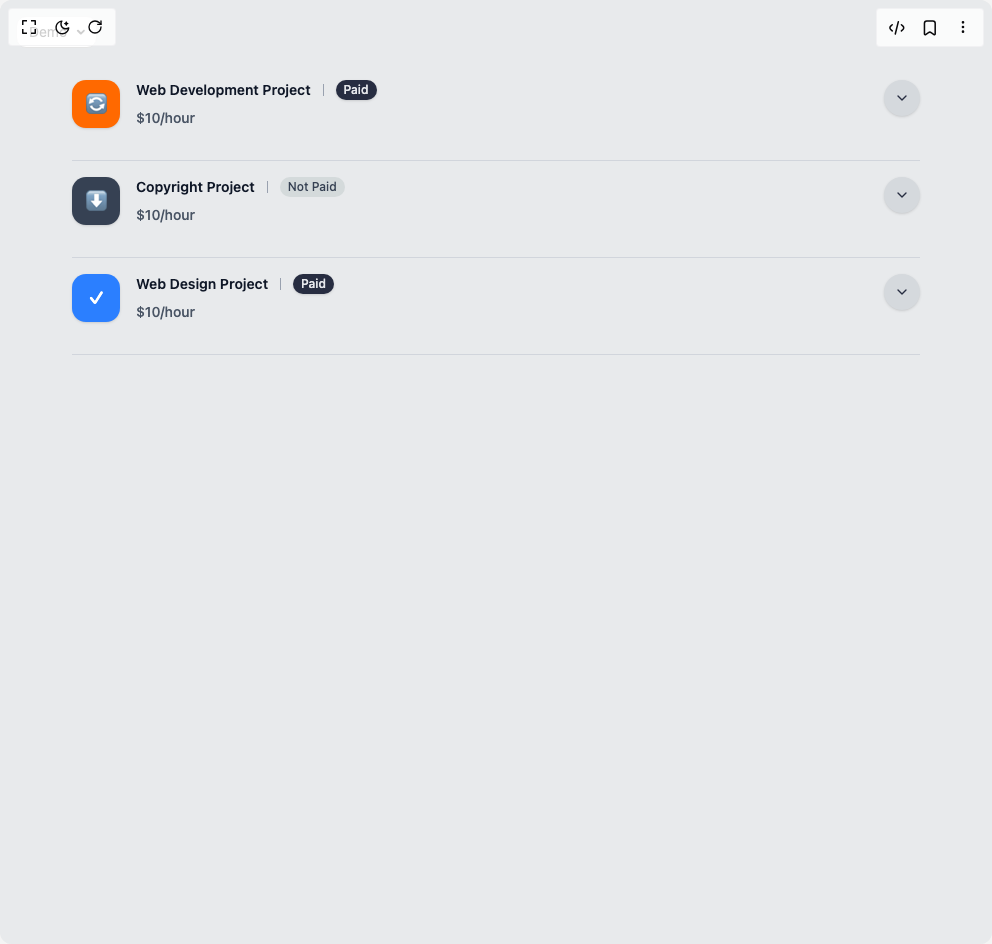](animated-project-cards/default/README.md) | [Animated Project Cards](animated-project-cards/default/README.md) | `default` |
| [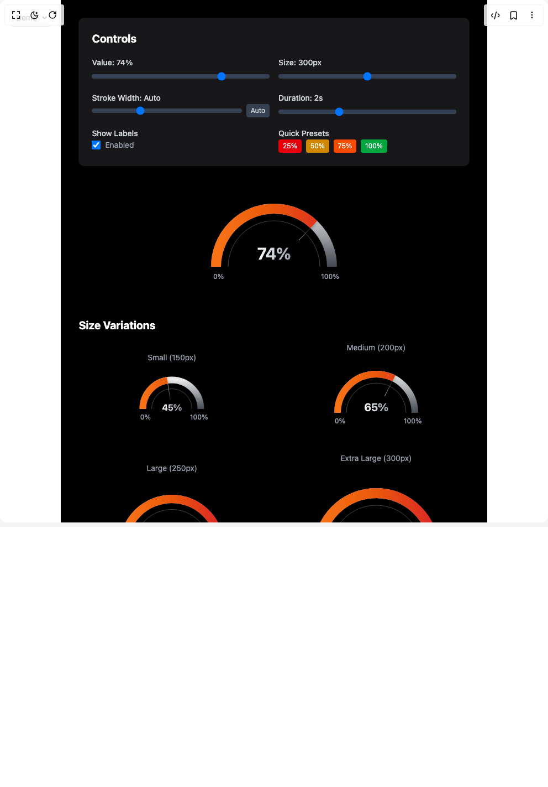](animated-radial-chart/default/README.md) | [Animated Radial Chart](animated-radial-chart/default/README.md) | `default` |
| [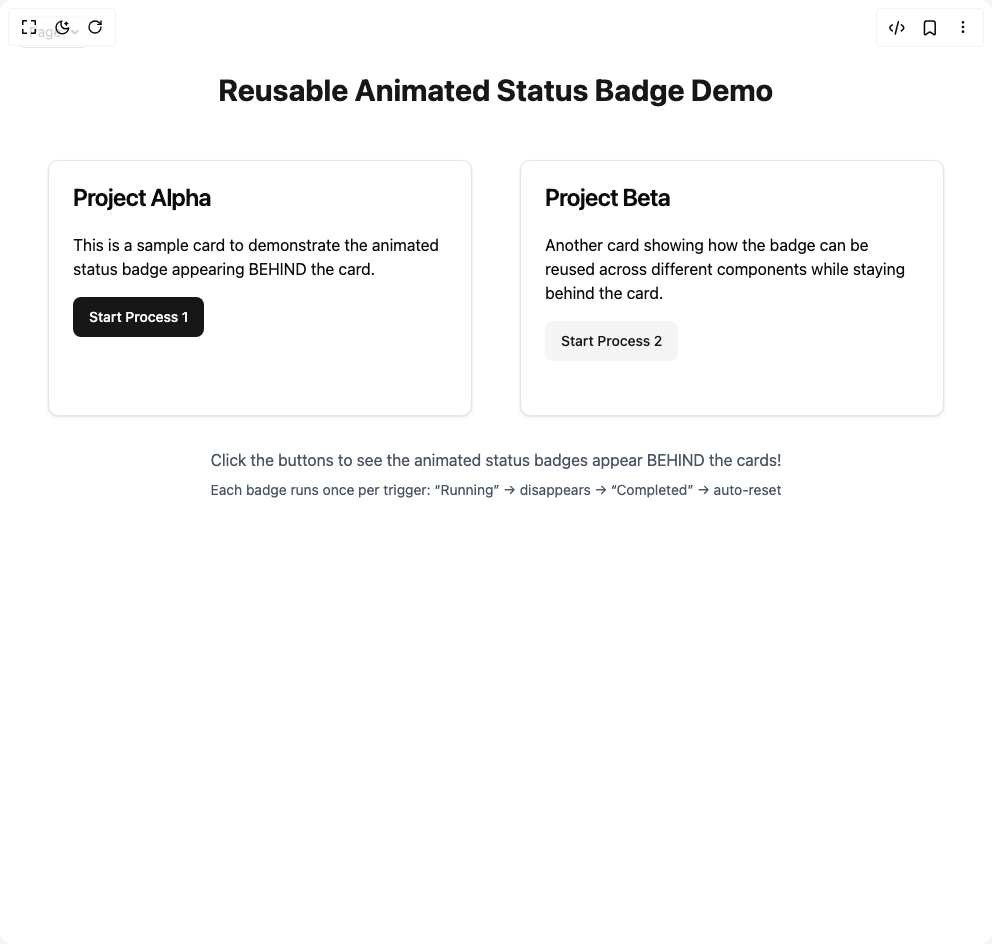](animated-status-badge/default/README.md) | [Animated Status Badge](animated-status-badge/default/README.md) | `default` |
| [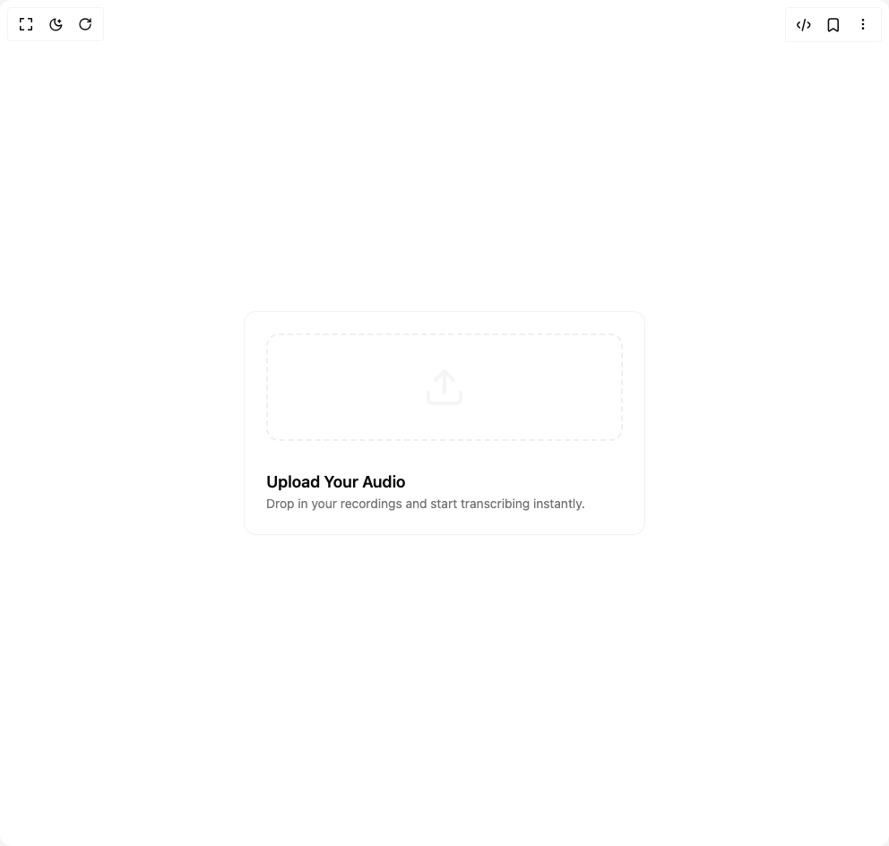](audio-upload-card/default/README.md) | [Audio Upload Card](audio-upload-card/default/README.md) | `default` |
|  | [Card Status List](card-status-list/default/README.md) | `default` |
| [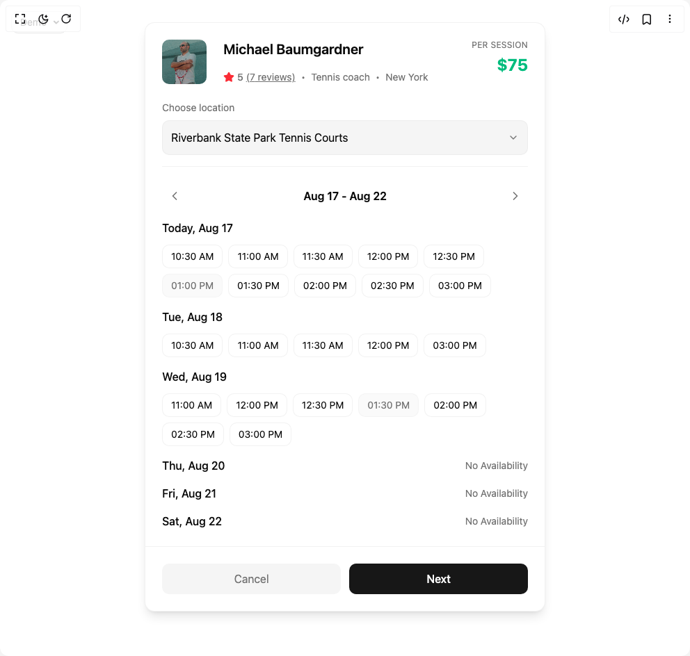](coach-scheduling-card/default/README.md) | [Coach Scheduling Card](coach-scheduling-card/default/README.md) | `default` |
|  | [Contacts Table With Modal](contacts-table-with-modal/default/README.md) | `default` |
| [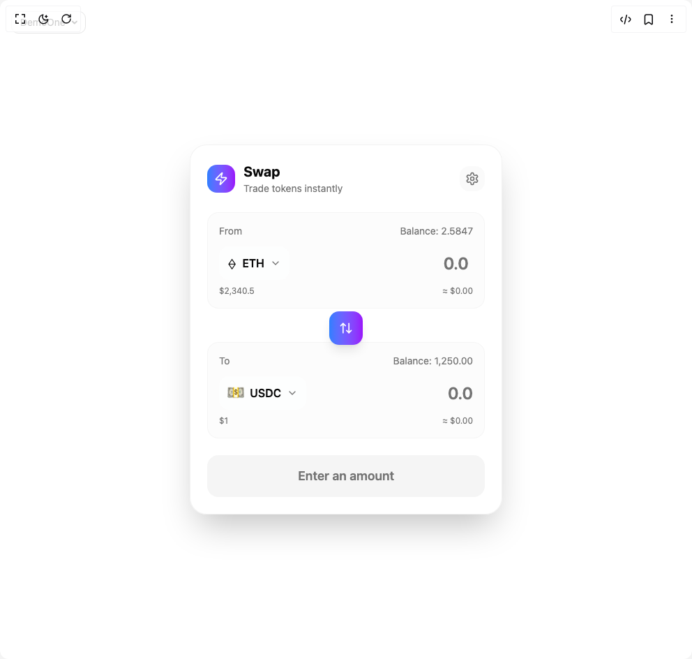](crypto-swap/default/README.md) | [Crypto Swap](crypto-swap/default/README.md) | `default` |
| [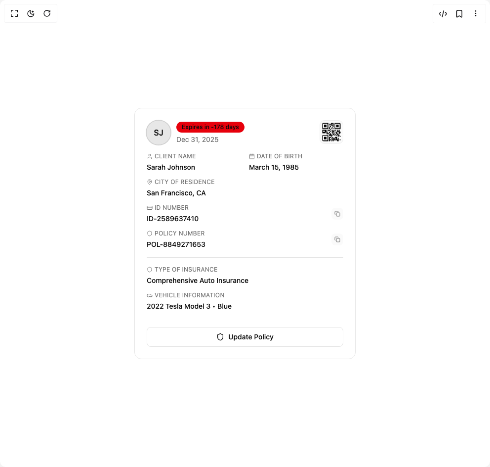](dashboard-card-with-modal/default/README.md) | [Dashboard Card With Modal](dashboard-card-with-modal/default/README.md) | `default` |
